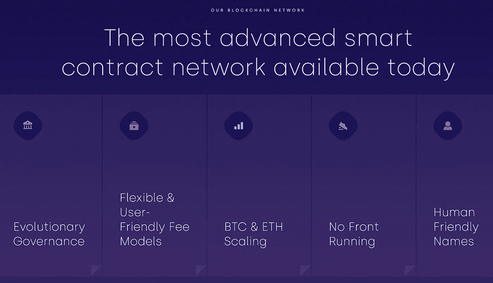

# TLOS 和以太坊虚拟机

> 原文：<https://medium.com/coinmonks/tlos-and-the-ethereum-virtual-machine-ea332f3faa16?source=collection_archive---------3----------------------->

Telos is a blockchain project meant to improve the Ethereum Virtual Machine mechanism that handles transactions. Telos’ token is TLOS.

承认吧…这听起来很酷，不是吗？我的意思是，在任何一个句子中使用“机器”这个词，一个人还能有多少男子气概。今天，我想谈谈这颗冉冉升起的秘密之星， **TLOS** ，以及我为什么喜欢这个项目。

**Telos (TLOS)** 是以太坊网络的扩展替代方案。以太坊网络是最大的区块链开发平台，在所有代币中市值排名第二。在我…