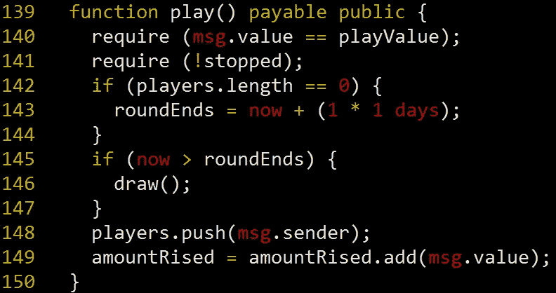
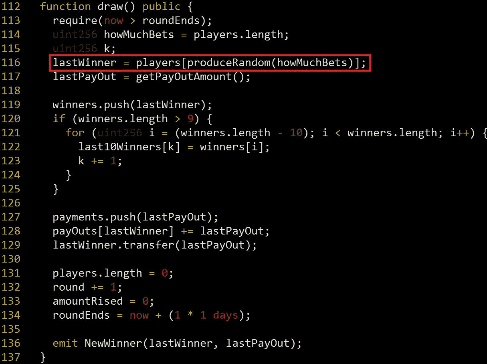
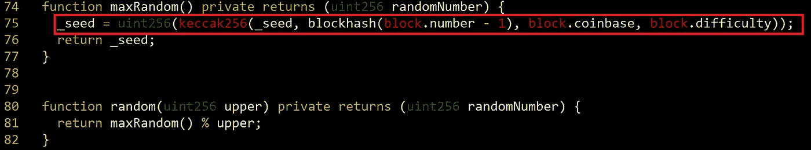
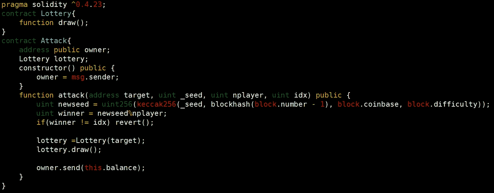

# 成为以太坊赌博游戏的赢家，为所有人，通过打破 PRNG(CVE-2018–12056)

> 原文：<https://medium.com/coinmonks/to-be-a-winner-of-ethereum-gambling-game-all-for-one-by-breaking-prng-1ab011163d40?source=collection_archive---------4----------------------->

# 摘要

我在一个以太坊赌博游戏' [**All For One**](https://all-for-one.club) '的智能合约中发现了一个漏洞。该游戏使用带有 4 个参数的`keccak256()`函数生成随机数，例如私有变量`_seed`、`blockhash(block.number-1)`、`block.coinbase`和`block.difficulty`。它们对任何人都是公开可读的，因此攻击者可以通过预测随机数来获得奖励。

# 细节

Figure 1\. play() function

**众人为一**是一款以太坊赌博游戏。如果你想参与这个游戏，你首先通过`play()`功能在这个合约上下注 0.1 以太(见图 1)。下注智能合约的玩家被推入数组。一段时间后，由`draw()`功能决定谁是赢家。

Figure 2\. draw() function. A winner is decided by a random value.

在`draw()`功能中，一个获胜者由一个随机数决定。图 2 中的红框`produceRandom()`函数生成一个随机数并返回它。随机数是玩家数组的索引。

Figure 3\. maxRandom() function generates a random value using keccak256() function with 4 parameters.

`produceRandom()`函数在第 80 行调用`random()` 函数，所以最后`maxRandom()`函数被调用(见图 3)。在`maxRandom()`函数中，使用带 4 个参数的`keccak256()`函数生成随机数。然而，所有 4 个参数对任何人都是公开可读的。因此，攻击者可以预测随机数，成为赢家。

# 剥削

在我以前的文章中，我已经多次解释了如何利用这些漏洞。如果你想知道利用它的方法，我推荐阅读我的文章，尤其是“[攻击以太坊彩票游戏《1000 Guess》中使用的伪随机数发生器(PRNG)](/@jonghyk.song/attack-on-pseudo-random-number-generator-prng-used-in-1000-guess-an-ethereum-lottery-game-7b76655f953d)”。

Figure 4\. exploit contract

图 4 显示了漏洞利用合同。攻击者为一个站点下注 0.1 以太网，然后可以通过使用漏洞利用合同成为赢家。

# 报告

我向管理员报告了这个问题，他们给它打了补丁。他们将`draw()`函数改为`private`，并使用[或](https://docs.oraclize.it/#ethereum)库生成随机数。

# 结论

在智能协定中生成随机数时，不得使用私有变量以及过去和当前块的变量。