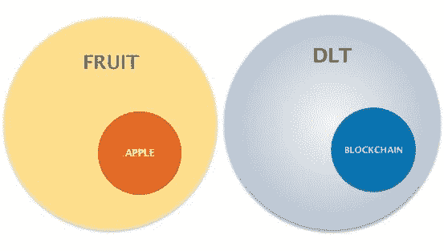

# 去区块链还是不去区块链？

> 原文：<https://medium.com/coinmonks/to-blockchain-or-not-to-blockchain-c12cbd5a8ad7?source=collection_archive---------7----------------------->

最近，一家大型咨询公司给了我一个难以置信的机会，请我对他们正在构建的区块链框架进行反馈。鉴于他们客户的财富 500 强规模，这是一个令人信服但令人生畏的前景。

我不能谈论框架的细节，但让我印象深刻的是使用了短语“区块链”(及其所有含义)，而不是更合适的“分布式账本技术”(DLT)。我问这种假设是否是有意的——也就是说，他们查看了各种 DLT 并决定选择区块链。他们对这个看似简单的问题的反应意味着惊讶而不是准备，这是出乎意料的，但我们继续前进。

随着这些公司采用区块链，潜在的影响是惊人的。但是在思考了那次谈话之后，我开始理解理解*不仅仅是*区块链本身，而是它所属的整个分布式账本技术领域的重要性，作为决策的先驱。获得这种理解是困难的，但在这个大规模涌入的阶段，这是绝对必要的。在我与该公司的谈话中，我觉得应该说得更多，尽管我需要时间来思考——因此我写了这篇博客。这些都不是贬低他们，而是强调一个更广泛的行业问题。

# 什么是分布式账本技术？

在深入讨论之前，我想先退一步，清楚地定义一些术语。如果你已经熟悉分布式账本技术及其各种实现，请随意跳到这篇文章的“*为什么这些差异如此重要*”部分。

分类账(或记录账簿)已经存在很长时间了:

[*image courtesy of Coindesk*](https://www.coindesk.com/information/what-is-a-distributed-ledger/)

从最基本的角度来说，*分布式*分类账被广义地定义为“一个在网络上共享、复制和同步的数据库，该网络分布在多个地点、机构和地理区域。”

分布式账本*技术* (DLT)是一种奇特的说法，“分布在几个站点的数据库”。一个关键的区别是，这个数据库在传播过程中不断地被网络上的每个人“同意”——共识。确切地说，该数据库是如何分布、构造和“商定”的，这决定了它是什么类型的 DLT。

区块链只是分布式账本技术的一种。这意味着其中的数据是由“块链”构成的。每个“数据块”都有经过验证的数据，然后附加到前一个数据块上，形成一个链(因此有了“区块链”这个术语)。该数据链然后被分发给网络中的每个人。所有区块链结构的数据库都是分布式分类账，但并不是所有的分布式分类账都是使用区块链构建的。

[*Source — MangoResearch*](http://www.mangoresearch.co/blockchain-vs-distributed-ledger-technology-dlt/)

然而，除了区块链之外，还有其他类型的分布式账本技术，其能力即使不比区块链强，也是一样的——这取决于其使用的实现和目标。

区块链的混乱如此普遍，以至于由主要金融机构组成的财团 [R3](https://www.r3.com/) 开发的 Corda 不得不[公开宣布](http://www.r3cev.com/blog/2017/2/24/when-is-a-blockchain-not-a-blockchain)他们不是区块链。 [IOTA](https://www.iota.org/) ，另一方面，专门为物联网(IOT)打造的，也不是区块链。

这些技术的操作特点大不相同，使用这些技术的影响也大不相同；随着我们越来越了解这些差异，我们可以更少地依赖区块链作为缺省值，并对选择什么样的 DLT 实现做出更明智的决定。

# DLT 之间有什么区别，为什么它们很重要？

下表提供了一些主要 DLT 之间最显著差异的简要比较:比特币、以太坊、Hyperledger Fabric、IOTA 和 R3。

Compiled by Bill Bilic; abbreviated due to space limitations, and for comparison only.

显然，这里提出的选择是多而复杂的。对于通过智能合约实现自定义逻辑，以太坊是最佳选择，因为它被大量采用；比特币面临着巨大的压力，需要改善其糟糕的表现。IOTA 令人难以置信的性能和免费的方法使其成为物联网(IOT)应用的绝佳选择，但它也可以很容易地应用于许多其他领域，最显著的是边缘计算。与此同时，HyperLedger 和 Corda 对基于信任的大型企业非常有吸引力，在这些企业中，丰富的权限至关重要。

上面的解释并不详尽，只是为了强调这种选择的复杂性是如何成为需要解决的挑战*首先*:只有当我们理解了项目的目的(以及围绕它的技术前景)之后，我们才能成功地选择 DLT——如果确实需要的话。因此，任何将 DLT 视为其业务价值主张一部分的组织都应该退一步，创建或使用一个超越区块链并提供所有分布式账本技术优势的现有框架。

> "诺亚造方舟的时候，天还没有下雨. "—霍华德·拉夫

# 主要考虑事项

所以我们现在知道区块链只是实现分布式账本的一种方法。那么，我们应该如何对待这个选择呢？

首先也是最重要的，对所有 DLT 的高层次理解是至关重要的:技术、颠覆性机会、供应商和竞争。外部顾问是可用的，但要小心，他们可能没有所有的答案。最好的方法是耐心的、有条理的、不带偏见的、有经验的方法，涵盖所有关键问题和业务目标。

作为该过程的一部分，有一些基本准则可以遵循:

## 投资回报率

这是首先要考虑的。分布式分类帐实施是否会改善您的业务价值主张？评估投资回报率时，考虑…

*   信任:这是一个问题吗？为什么？是什么或谁让信任成为你企业的重要组成部分？DLT 和区块链完全消除了对信任的需求，你需要认真地重新评估你的流程，以便提出一个无信任的解决方案。【Matt Lockyer 的这篇文章是一篇关于信任及其在新模式中的影响的非常有见地的文章。
*   **商业优势:**DLT 会给你以前没有的优势吗？
*   运营:如果信任被移除，你的企业如何在这种新模式下运作？
*   **信息架构**:价值/信息/资产在哪里以及如何被创造和交换？

一旦投资回报率得到评估，那么就是时候准确选择哪个 DLT(如果有的话)最符合你的目标，并使你的投资最大化。

一旦选择了 DLT，请考虑:

## 准备就绪

*   您的企业在组织、技术和运营方面准备好了吗？
*   贵公司自身的能力、意愿和变革准备情况如何？
*   是否存在需要考虑的法律法规约束？这会影响投资回报率吗？
*   这项新技术对任何业务合作伙伴和集成意味着什么？

## 风险

您计划如何识别、预测和管理它？在实施和运行基于 DLT 的解决方案时会有许多风险，考虑到这些技术的分散性，这需要一个非常不同的策略来预测和减轻这些风险。

最后，任何故障或错误会如何影响您的业务连续性？由于 DLT 实现中的错误或灾难而进行更改是可能的，但由于所需更改的戏剧性性质(即叉总账)。

# 走向

考虑上述问题后，评估时间、容量和范围，然后对照您的竞争对手进行评估。DLT 实现仍然值得吗？考虑这样一种想法，即可能存在一种更好的技术可以实现你的目标，即使它并不新颖。技术本身并不是创新；是实现。

同样，这篇文章并不意味着是一本手册，而是强调选择正确的分布式账本技术的复杂性和重要性。然而，我可以试着提供一个起点。

网上有丰富的 DLT 和区块链资源，重点是加密货币，但以下内容被社区广泛使用，可能会有所帮助:

*   coin desk——每天更新来自区块链的最新重大新闻，它为初学者提供了一系列资源，还有一些教育和信息页面。
*   [block geeks](https://blockgeeks.com/)——一个寻找更多了解区块链课程的中心。它有大量写得很好的指南。我的最爱。
*   [视觉资本家](http://www.visualcapitalist.com/category/cryptocurrency-2/)——复杂概念的可视化，有一个区块链的部分。
*   [IBM Blockchain](https://www.ibm.com/blockchain/what-is-blockchain.html) —蓝色巨人在 DLT 的资源，虽然偏向 HyperLedger，但它们自己对 DLT 的贡献。

鉴于这项技术的新颖本质，没有多少成功或失败的公开例子，但许多行业的许多公司都在尝试。很可能我们很快就会开始听到这些故事，不管是好是坏——我们必须准备从中吸取教训。

说到实现，区块链(和一般的 DLT)与过去几十年的任何其他“颠覆性”技术没有什么不同。如同任何新奇的事物一样，我们必须警惕被冲昏头脑。这必须通过对我们的业务、其需求以及不同 DLT 所能提供的服务的理解来仔细和深思熟虑地处理。选择并遵循允许您在实施这些新技术时管理风险的框架，着眼于最大化 ROI，这一点至关重要。

因此，不管技术有多新，古老的智慧仍然适用——不要从“什么”或“如何”开始，而要从“为什么”开始！

或者，用学术病理学家罗恩·温斯坦的话说:

> “拿着工具的傻瓜还是傻瓜”。