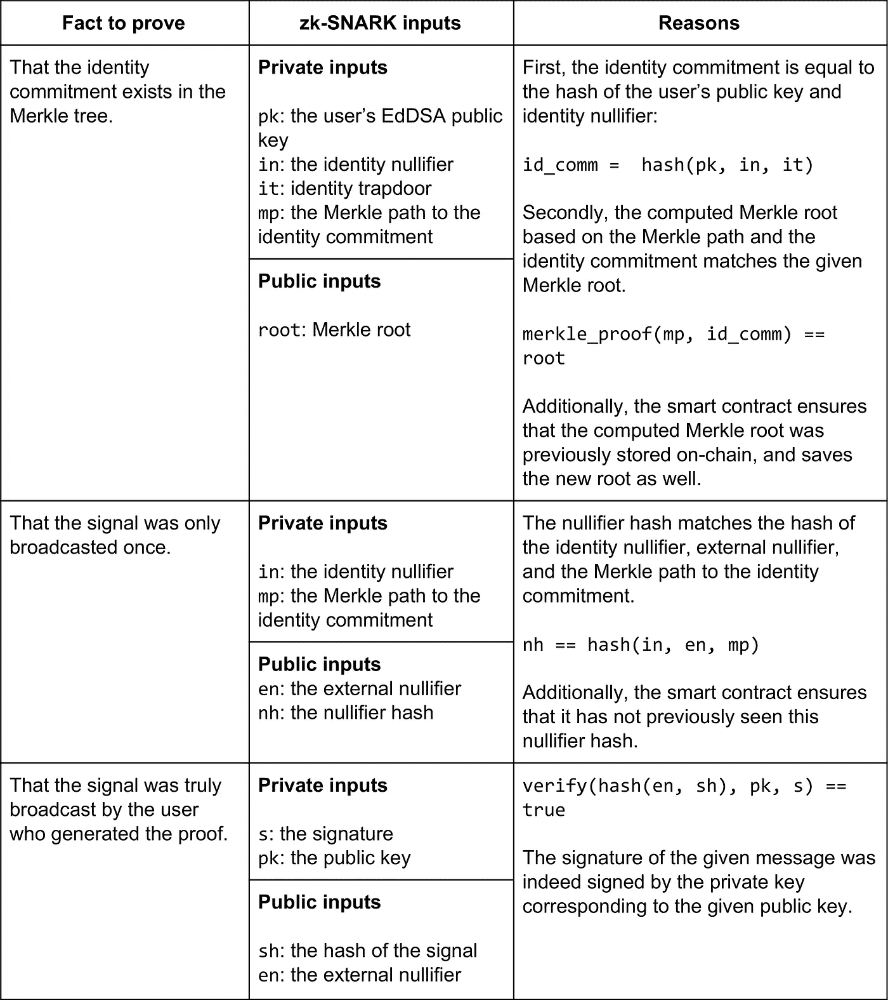
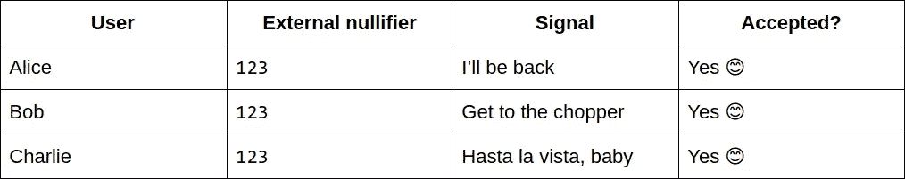
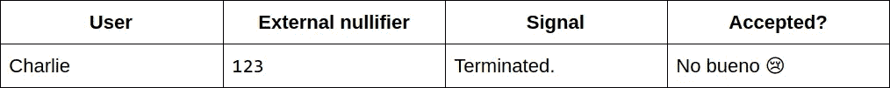
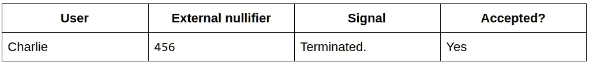
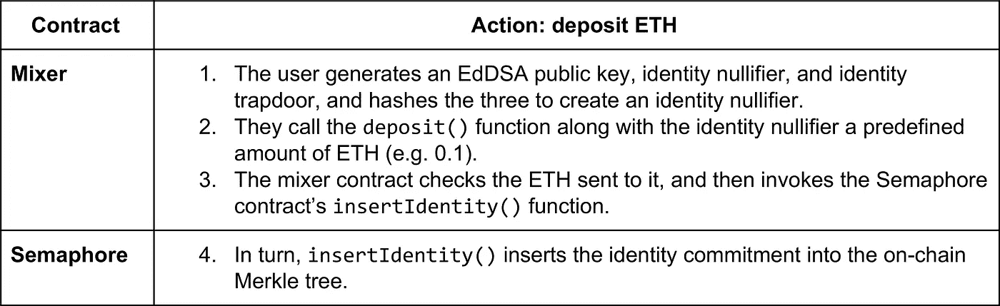
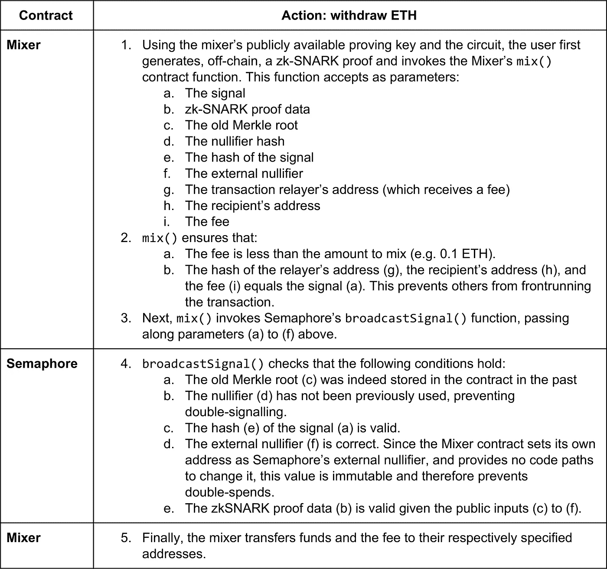
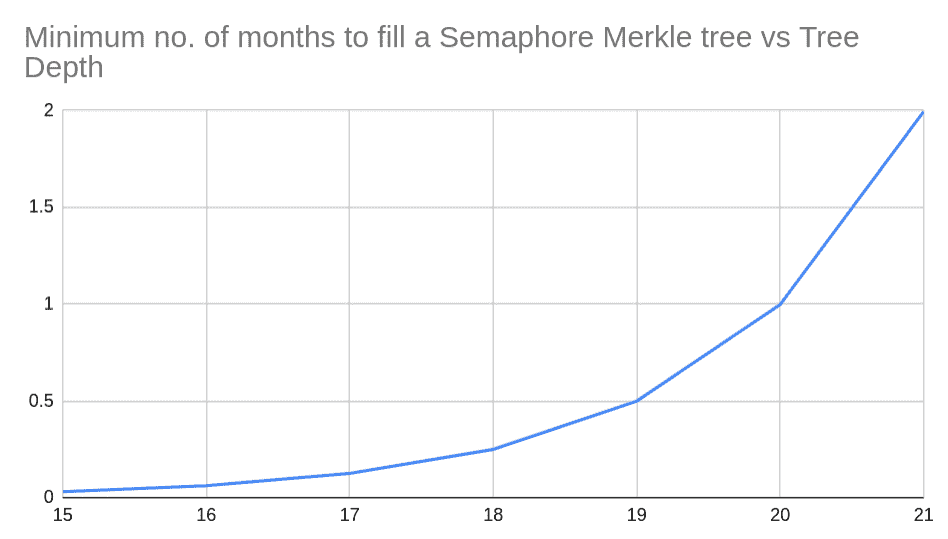

# 对混音器及其他:展示 Semaphore，一个建立在以太坊上的隐私小工具

> 原文：<https://medium.com/coinmonks/to-mixers-and-beyond-presenting-semaphore-a-privacy-gadget-built-on-ethereum-4c8b00857c9b?source=collection_archive---------0----------------------->

Railway semaphore signals. Source: [WikiMedia Commons](https://commons.wikimedia.org/wiki/File:Wsh_signals.jpg)

今年，以太坊经历了一场隐私复兴。在社区杰出成员的鼓励下，研究人员、程序员和 DAO 资助者合作加速隐私解决方案的构思和实现，特别是那些采用零知识证明的解决方案。我们现在正处于一个关键的隐私构建模块从研究中脱颖而出并进入生产的阶段: [**信号量**](https://github.com/kobigurk/semaphore) ，一种匿名信令的手段。

Semaphore 是名为 [MicroMix](https://micromix.app) 的 ETH 和 ERC20 令牌混合器的基础。在不久的将来，它可以用于其他增强隐私的应用程序，如匿名登录、匿名 Dao、匿名投票和新闻。

这篇技术博客文章将解释 Semaphore 和 MicroMix 如何工作，以及 Semaphore 如何使 MicroMix 以非托管的方式为用户提供交易隐私。还将描述它的性能和权衡，最后概述 Semaphore 如何支持其他零知识应用程序，否则这些应用程序是不切实际的。

读者应该了解以太坊智能合约的工作原理和一些基本的密码学知识，但不需要熟悉零知识证明。

# 关于信号量

信号量最初是由 Barry WhiteHat、Harry Roberts 和 Kobi Gurkan 设计的，信号量是一个允许任何以太坊用户认可任意字符串的系统，只显示他们以前被批准这样做，而不是他们的具体身份。准确地说，它让用户:

1.  *在智能合约中注册*他们的身份，然后:
2.  *广播*一个信号——即:
    (i)匿名证明他们的身份在注册身份集中，同时:
    (ii)在契约中公开存储一个任意字符串，当且仅当该字符串对于用户和契约的当前*外部无效符*是唯一的(下面将详细介绍)。这意味着，在同一个外部无效符下，不可能对同一条消息发出双重信号。

Semaphore 由一个智能契约和零知识证明组件组成，它们协同工作。智能契约处理链上的状态、权限和证据验证。零知识组件离线工作，以允许用户生成证明，如果这些证明有效，则允许智能合约更新其状态。

# 信号量如何工作

当用户注册他们的身份时，他们只需向合约发送一个 EdDSA 公钥的散列和两个随机秘密，合约就会将其存储在 Merkle 树中。这种散列被称为*身份承诺*，而随机秘密是*身份作废器*和*身份陷门*。

广播一个信号有点复杂。它有两个部分:(a)匿名证明该组注册用户的成员身份，以及(b)防止通过外部置零器的双重信令。

## 匿名证明成员身份

零知识证明允许用户证明他们已经对一些数据执行了预定义的一组操作，而不暴露部分或全部所述数据。

Semaphore 使用一种零知识证明形式，称为 zk-SNARKs。虽然 zk-SNARKs 的工作方式超出了本文的范围，但读者可以参考其他资料，如 [Christian Lundkvist 的介绍](https://media.consensys.net/introduction-to-zksnarks-with-examples-3283b554fc3b)以了解更多信息。

在 Semaphore 中，用户创建以下内容的证明:

## 防止双重信号

以三个用户为例:Alice、Bob 和 Charlie。它们首先在合约中注册自己的身份，合约中有一个外部置零器`123`，然后广播它们的信号。由于这是他们第一次广播信号，合同接受他们的交易:

过了一段时间，查理试图发出另一个信号，但合约拒绝了他，因为他之前已经向外部置零器`123`发出了信号:

不过，如果把外部的置零者改为`456`，查理现在就可以再次发出一个信号:

这些属性——匿名成员资格证明和双信号防止——使得 Semaphore 适合于它的第一个使用情形——链上混合器。

# 关于 MicroMix

由于以太坊的区块链是公开透明的，因此它的混音器可以帮助用户获得隐私。混音器就像是秘密的圣诞老人礼物交换:从一群人那里收集同等价值的礼物，然后重新分发。不同的是，在一个搅拌机，收件人应该没有办法告诉谁买了礼物摆在首位。

许多搅拌机，如[乙醚搅拌机](https://bitcoinmix.org/eth)，都是*保管*和*集中*。不幸的是，这意味着用户必须信任他们不潜逃与他们的资金，或存储日志这将迪恩尼米斯存款。

*非离心*和*偏心*搅拌机，另一方面，没有这些缺点。他们接受资金存款并在三个关键担保下执行提款:

1.  没人能窃取存款。
2.  没有人可以链接存款和提款地址。
3.  没人能审查或关闭它们。

MicroMix 使用一个可靠性契约(以下称为混合器契约)，它使用一个信号量实例来执行这些保证。当用户存款时，MicroMix 在其信号量合同中注册一个身份，当用户取款时，它会广播一个定制的信号。由于信号量是双信号，它反过来防止了微混合中的双花费。

此外，MicroMix 处理 ETH 和令牌转移，并向指定地址转移费用。这种收费机制使得激励第三方转发交易以代表用户提取资金成为可能。这意味着接收方不需要已经拥有 ETH，存款方也不需要想办法向他们发送交易所需的少量 ETH，这将违背混合器的目的。

# 行动中的微观混合

MicroMix 目前作为原型部署在 Kovan testnet 上，其特点是在 [https://micromix.app](https://micromix.app) 有一个简单的用户界面。用户界面鼓励用户等到 UTC 午夜过后再执行取款，以增加他们的匿名设置。它没有告诉用户匿名集的大小，因为这个数字可能会产生误导；攻击者可以用他们自己的交易填满存款池，创建一个大型匿名组的印象，并欺骗不知情的用户。

MicroMix 支持 ETH 和 ERC20 令牌混合。 [https://micromix.app](https://micromix.app) 的合同和用户界面支持 [Kovan DAI](https://kovan.etherscan.io/token/0xc4375b7de8af5a38a93548eb8453a498222c4ff2) ，用户可以通过在[https://cdp.makerdao.com](https://cdp.makerdao.com/)的 Kovan 网络上创建一个 MakerDAO CDP 来获得。

# MicroMix 如何工作

下表列出了用户存放 ETH 时混合器和信号量契约采取的步骤:

存款的一个例子:

**交易哈希:** `[0x48a382d431185bc82890dd2f1153d66c1b070ed89cccc25fb586afb095567e51](https://kovan.etherscan.io/tx/0x48a382d431185bc82890dd2f1153d66c1b070ed89cccc25fb586afb095567e51)` **身份取消器:**8031d 226 CB 7115017239 bad 18 ECD 4564 df 45 f 9 de 1 eaf8e 593 BDC 7 FD 27 D10 f
**身份陷门:** `e89e6ecdf7d117ae23fd1b046e3a40123f80e4ae75d5f06a86a1c0b5b5797b` **身份承诺:** `0xb79092fd0e907d744bc49ef63c2632f90e5c105a232b43647e168fa6faa27f4ac83c00d9`

如上图所示，混合器契约负责管理资金，信号量契约只负责身份注册。这种关注点的分离在下表中也很明显，该表描述了当用户提取资金时会发生什么:

取款的一个例子:

**交易哈希:** `[0x43e2ca81b7dd4d23fcc8a2191b09ef0a2e7469f23051a8f79052d75b02f8d502](https://kovan.etherscan.io/tx/0x43e2ca81b7dd4d23fcc8a2191b09ef0a2e7469f23051a8f79052d75b02f8d502)` **信号:** `0x5b062792493047ca4a1221d185ba7bc1fc57062126cc325aa24893357b53aa1a` **zk-SNARK 证明数据:** `“a”:[“1077…”,”5651…"], “b”:[[“7028…”,”1337…"],[“1583…”,”1665…"]], “c”:[“1732…”,”7771…"]` **根:** `10809627771503708857700183002420472828948270490531531173285172676430182712980` **作废器哈希:** `9546065020171513013039253193555976067181611145828641232207963883960520778776` **信号哈希:** `266960622224311701018629012248271412276308136479127641500588150958540834508` **外部作废器:** `1182878175203544938066023463435688736234343990113` **收款人地址:** `0x6158E689cae143532864A9502374AB4eE1690681` **费用:** `1000000000000000`魏

# 信号量的其他应用

和混合器一样，其他零知识用例可以使用 Semaphore 作为基础层。这是因为关注点分离的原则。例如，信号量不知道混合器契约传递给它的信号的内容。mixer 契约只处理资金转移，并将零知识信令和双重支出保护的责任委托给 Semaphore。

**用例:**混合器 **外部作废器:**混合器的合同地址
**信号:**接收方地址、中继方地址、费用的散列。
**结果:**只有储户才能提取资金，不可能出现双花。

同样，构建在信号量之上的其他应用程序也遵循同样的原则。具体来说，他们会设置信号量的外部无效符，并以不同的方式发出信号，以实现不同的结果。

例如，服务提供商可以使用 Semaphore 向注重隐私的客户提供匿名登录，这样当客户登录时，提供商只能知道他们是注册客户，而不能知道他们是哪个客户。

**用例:**匿名登录
外部无效符:服务提供者 URL 的散列。
**信号:**一个登录令牌(比如 [PASETO](https://github.com/paragonie/paseto) )的散列和服务提供者的公钥。
**结果:**只有注册用户才能登录，登录用户从此可以使用登录令牌进行身份验证。

在这个假设的构造中，我们假设用户已经向服务提供者注册了他们的 EdDSA 公钥，并且服务是无状态的。当用户匿名广播登录令牌的散列时，服务提供商可以将其保存在他们的数据库中，并允许包含登录令牌的认证请求(例如 API 调用),该登录令牌在散列时与信号匹配..

# 气体使用

一次存款交易花费大约 110 万汽油，一次取款花费大约 77 万汽油。高存放成本主要是由于所有的身份承诺都存储在链上，并且所选择的 Merkle 树深度是 20。由于以太坊主网目前具有 800 万气体的阻塞气体限制，并且假设平均阻塞时间为 15 秒，那么假设每个块包含最大数量的存款交易，则用存款填满信号量将需要至少 1 个月。

感兴趣的读者可以在这里查看用于计算这个[的电子表格](https://docs.google.com/spreadsheets/d/1b8DC9wT6LcRN7nUcF7019S9GOA7pW4yWPVH-fQnsNcg/edit?usp=sharing)。还需要做更多的工作来计算不同树高的天然气成本。

# 信号量和微混合的未来计划

Semaphore 团队寻求与其他基于 zk-SNARK 的混合器和以太坊钱包提供商合作，以在共同的合同、电路和标准上趋同，从而为用户提供尽可能好的匿名公共产品。它还将继续在以太坊上开发其他有用的零知识应用，并支持社区的部署和采用。

感兴趣的读者可以随时加入[旗语协会电报频道](https://t.me/joinchat/B-PQx1U3GtAh--Z4Fwo56A)参与讨论并接收更新，想要了解 MicroMix 具体更新的读者可以加入 [MicroMix 一般讨论](https://t.me/joinchat/A5mVoBRl-b6SD8aoAUVvFw)频道。

> [在您的收件箱中直接获得最佳软件交易](https://coincodecap.com/?utm_source=coinmonks)

