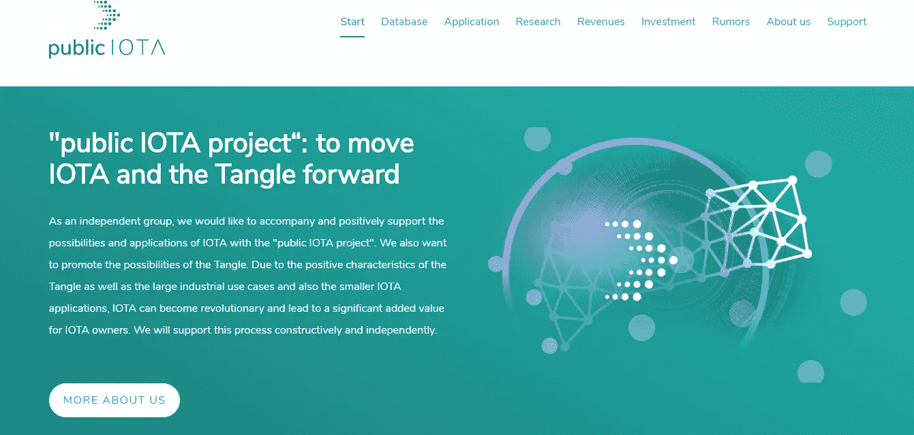
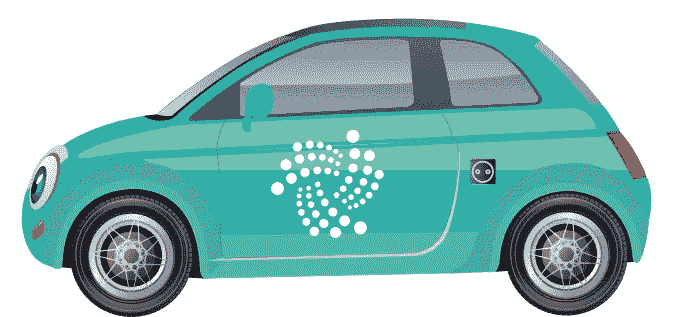
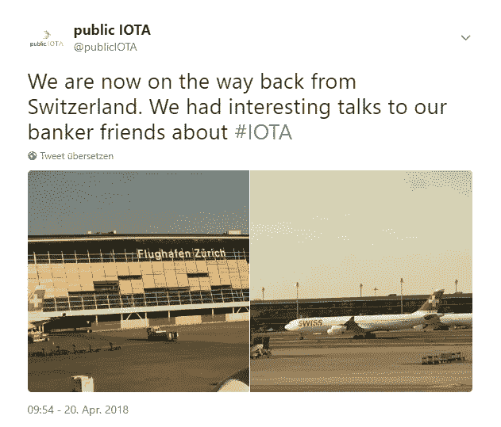

# …向前推进。来自 publicIOTA 项目的报告

> 原文：<https://medium.com/coinmonks/to-move-iota-forward-report-from-the-publiciota-project-e8797510b2fb?source=collection_archive---------6----------------------->

我们的愿景:“真正的 IOTA 革命将会发生，当应用程序能够使行业和投资者受益，当更多的人理解和接受 IOTA，并认识到其在日常生活中的好处。publicIOTA 希望作为一个独立的团体来支持这一进程”

2018 年 5 月是时候了。我们已经推出了我们的[网站](http://publiciota.com)，这是我们工作的对外展示。现在这正好是上线一个月，逐渐被优质内容填充。我们设置了以下类别，我将在下面详细讨论:数据库、应用、研究、收入、投资和谣言。

publicIOTA 项目也作为 [IOTA 生态系统](https://ecosystem.iota.org/projects/public-iota)中的一个项目发布。我们当然为每一个“赞”感到高兴。

**数据库**

在[数据库](http://publiciota.com/database)部分，你会读到很多 IOTA 基金会的手册和官方声明。此外，还有一般的和最新的信息，以及 IOTA 环境中出现的许多项目。该部门数据库在未来应该不仅仅是一个 IOTA 博客:重要的 IOTA 信息可以在这里找到。

这个领域最近的项目是“[wikioti](http://publiciota.com/wikiota)”，一个解释的数据库。通过 Wikiota，我们希望尽可能简单地解释在环境中和处理 iota 时使用的许多术语。这本解释集应该主要针对初学者，但也为高级用户提供一个参考工作。这个数据库的内容是简短的解释和定义。相应的贡献提供了链接，然后导致源和进一步的信息。

而且在与其他 IOTA 支持者和 IOTA 基金会成员的交流中，我们希望确保这里的高质量内容。

**应用**

应用是 IOTA 未来的核心。在未来，你可以在这里找到关于 IOTA 核心领域的信息:移动和汽车，全球贸易和供应链，电子医疗，智能能源。我们已经在为一些[现实世界的应用](/coinmonks/big-data-iota-and-a-great-application-in-machine-tool-engineering-1b6210cf5129)提供支持，并将在未来继续这样做。

正如已经宣布的，我们将很快在我们的网站上有一个小的有趣的 IOTA 在线工具。这将展示 IOTA live 的一些巨大优势。例如，速度、可扩展性和数据传输。在这个工具中，电动汽车“Pubio”将发挥主要作用。我们希望我们能在两周内将这个工具放到网上，并且每个人都能体验 IOTA live 的一些好处。

[**研究**](http://publiciota.com/research)

我们将更深入地讨论提出的某些问题并收集事实。我们想深入了解各自的问题。我们研究的主要目标是记录、发现和解释以及研究和开发推广 IOTA 应用的方法。

我们的第一个研究主题是:“[愿景:10 年后的 IOTA](http://publiciota.com/vision-iota-part2)”。在这里，我们能够从研究和商业领域获得优秀的客座作者。该系列将在未来几周内逐步推出。

但是我们的时事通讯“IOTA 研究员”也可以在网上找到。每月一次，要闻汇总于此。

[**收入**](http://publiciota.com/revenues)

IOTA 不仅是一种加密货币，也是一种可以作为数据载体获得多种应用的缠结。这导致了对 IOTA 所有者有益的更多可能性。我们将在本节的[中介绍一些可能性。未来几年，Qubic 带来的可能性可能会远远高于预期。](http://publiciota.com/revenues)

在这个类别中，我们目前正在致力于 publicIOTA 项目的另一个里程碑。在这里，我们和一家大公司一起工作。更多可能不会在这一点上发表。

**投资**

除了将来的直接 IOTA 投资之外，例如通过银行或其他提供商，将会创造间接参与 IOTA 的机会。例如，这些可以是基金或类似工具。在某些情况下，投资使用 IOTA 的项目当然是可能的。我们将在未来展示这些东西。

为了实现某些目标，我们与银行进行了接触。在这一点上，必须说，可能需要一段时间才能看到第一次成功。

[**谣言**](http://publiciota.com/rumors)

和 IOTA 打交道的人，总会碰到一系列的谣言和神秘特质。在这方面，我们提出了一些。我们将深入参与一些事情，以有助于更加清晰。然而，我们不会助长猜测，而是收集事实。

在谣言领域，我们目前主要处理的是“Qubic”。这项伟大的工程肯定会让我们悬而未决很长时间。

**publicIOTA for you**

我们希望你喜欢我们的项目，它会为你做一些事情，我们可以支持 IOTA，并积极参与塑造它。我们希望在你们的支持下，再过一个月，我们会比今天走得更远。

**请为我们的项目**捐款

请记住，我们是一个独立的小团体，没有财务空间。

如果你喜欢我们的项目，我们很乐意得到支持！捐款将用于资助和实现公共 IOTA 项目。咖啡也可以用来做我们的夜间工作。

IOTA 地址:mehfn 999 hrretcyndawoxzkit 9 svblipvvfpfxj 9 ylrcsdxfvcjpjrmxdzozsv 9 vyowsalrlumkv 9 ecszaigolwqt 9

应该再说一遍。我们**不是 IOTA 基金会**的一部分，也没有任何其他联系，我们是一个独立的项目。你应该在投资前做自己的研究，特别是关于加密货币。