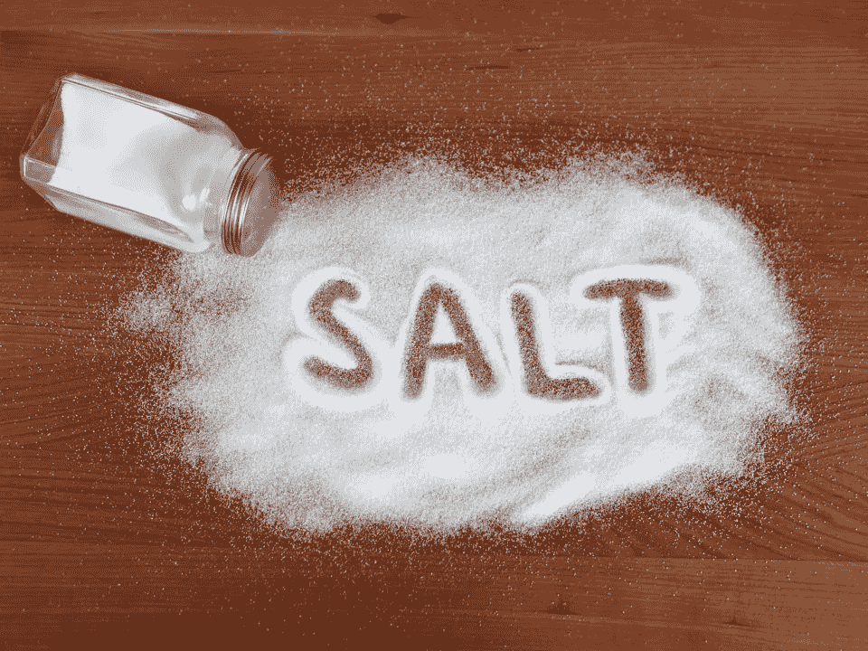

# 撒盐还是不撒盐？—加盐不是保护密码的唯一答案

> 原文：<https://medium.com/coinmonks/to-salt-or-not-to-salt-salting-is-not-the-only-answer-to-securing-passwords-cdab26bd20ad?source=collection_archive---------2----------------------->

最近有消息称，LinkedIn 在 2012 年的黑客攻击中未能对其密码加盐，虽然加盐会增加破解加盐哈希的时间，但如果用户使用“123456”等密码，这只是一个障碍。

为什么？因为 salt 通常与散列密码一起存储**，所以如果用户选择…**