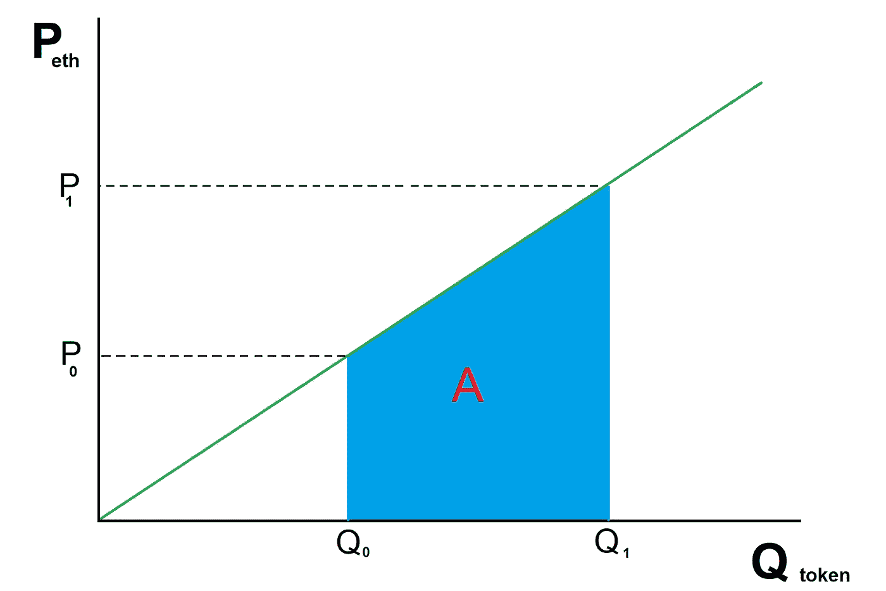
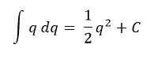
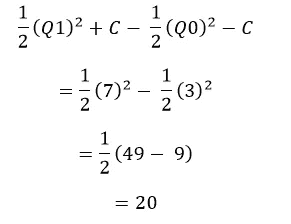
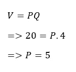

# 令牌绑定曲线解释

> 原文：<https://medium.com/coinmonks/token-bonding-curves-explained-7a9332198e0e?source=collection_archive---------0----------------------->

现在，所有的 ICO 疯狂都在消退，一种新的代币发行形式似乎突然从看似不知道的地方起飞了:连续代币债券曲线。这是一份设计巧妙的合约，它为代币创造了自己的市场，而不依赖于交易所。我已经看到一两个解释，它们没有恰当地充实这个概念，所以在这篇文章中，我将尽可能简单地解释它们是什么。警告:稍后会有一些数学知识，但对你来说，抓住要点并不重要。在那之后，我们将探究其中的含义。

## 定义

债券曲线合约(bonding contract，从现在开始)是一种通过购买和出售功能发行自己的代币的合约。要购买代币，您需要向 buy 函数发送 ether，该函数会计算代币的平均价格，并向您发出正确的金额。sell 函数的工作过程与此相反:首先，您向绑定契约提供获取您想要出售的令牌数量的许可(ERC20.approve())，然后您触发该函数从您那里获取这些令牌。该合同将计算当前的平均销售价格，并将向您发送正确的乙醚量。

## 稀缺

该合同对可用令牌的数量没有硬性限制。相反，有两个限制因素:

1.  世界上乙醚的总量。如果每个代币的价格是 1 eth，那么你买的代币不能超过 1 eth。
2.  价格曲线。这就是契约变得有趣的地方。

## 价格

每个代币的实际价格随着发行的代币数量的增加而增加。例如，一个非常简单的合同版本规定，每个令牌的 eth 价格等于当前存在的令牌数量。更具体地说，出售代币的价格等于当前代币的数量，而购买代币的价格等于购买后将存在的数量。例如，如果存在 10 个代币，那么出售 1 个代币将获得 10 个代币。如果你想买第 11 个代币，你将支付 11 个代币，以此类推。

买入会让你在价格曲线上向上滑动，卖出会让你向下滑动。在上面的例子中，如果有 9 个代币存在，那么我们知道购买另一个代币将花费第 10 个。然而，在合同中出售代币将为我们赢得 9eth。如果我再卖一个代币，我就能得到第八个代币。我可以再卖 3 个，降到 5 个。但如果我买了，价格会再次上涨到 6eth。所以价格会动态调整。

## 连续的

实际上，一个人不会一次只卖一个代币。取而代之的是，他们将分批出售以节省汽油成本。如果现有 10 个代币，我想在合同中卖回 3 个，会发生什么情况？它应该付给我多少钱？从以下 3 个选项中选择最合理的一个:

1.  它应该付给我 10x3=30 eth，因为当前的售价是 10eth
2.  它应该付给我 8x3 =24 eth，因为在给了合约 3 个代币后，价格降到了 8eth。
3.  它应该给我 10+9+8 = 27 eth，因为如果我一次支付 1 个代币，我就会得到这个数。

如果你选择了选项 1，你将面临一个不可持续的局面，因为合同只能支付你已经拥有的 eth。举例来说，假设有人买了 1 个代币，然后另一个人买了 1 个代币，然后第三个人买了代币，最后第四个人买了代币。该契约的长度为 1+2+3+4 = 10。现在 4 个人都把他们的代币转让给你，你想一次把他们全部卖出最高价:4eth。你预计总共有 16 次，但合同上只支付了 10 次。

如果你选择第二个选项，你的工资会很低。例如，如果你一次卖了 1 个，我们知道你会得到 27 个，那么为什么你要因为一次卖完而受到惩罚呢？正确答案当然是选项 3。

## 气体！

solidity 程序员设计 sell 函数的非智能方式是一次遍历 1 个代币，卖出每一个代币，让价格向下调整。那会耗费和你自己做同样多的汽油。所以这个实现是没有意义的。取而代之的是，我们将使用微积分一次性计算出乙醚的正确含量。

buying tokens and calculating price

## 结石

在上图中，eth 的价格曲线是 P=Q。假设存在 Q0 代币，您希望购买 Q1-Q0。你不会支付 P0，因为它太低，你也不会支付 P1，因为它太高。你需要一个中间价格，这个价格和一次买一个代币的效果一样。从基础微积分，我们知道曲线下的面积是你将花费的 eth 的总量，为了计算，我们简单地取 Q0 和 Q1 之间的定积分。或者，我们计算原点和 Q1 之间的定积分，并从中减去原点和 Q0 之间的积分，得到标有红色 A 的面积。价格函数的积分是

Area under the curve

现在用实数吧。假设 Q0 的值是 3(意味着 P0 也是 3)，Q1 的值是 7(意味着 P1 也是 7)。

为了计算 A 的面积，我们代入这些数字:

这意味着你要支付的 eth 总数是 20 eth。但是在我们购买之前，我们想知道每个代币的平均价格。这很简单:

使用微积分，债券合同可以允许买卖任意大量的代币，而无需花费更多的汽油，并且它确保合同总是能够满足其以太义务。

## 含义

现在我们知道了它在概念上是如何工作的，我们将探索使它比传统 ICO 酷得多的绑定契约的一些重大影响:

1.  如果买卖函数遵循相同的曲线，那么乙醚永远不能从合同中退出。它必须保持 100%的完全保留。这意味着项目创建者必须专注于使他们的令牌受欢迎，这使得创建者和用户之间的激励一致。他们不能发起退出骗局。在某些情况下，可能需要在买入和卖出曲线之间建立一个价差。所有这一切意味着，你卖得的乙醚比你买得的要少。以太的差异是创造者的收入。例如，买入价格是 P=Q，但卖出价格是 P=Q。这似乎是项目创建者策划退出骗局的好方法。然而，对生态系统越来越感兴趣仍然意味着更多的收入，因为销售是一个持续的功能。换句话说，流失比一次性销售产生更多的收入。因此，这一功能仍然奖励有长期增长前景的项目，而不是打了就跑的骗局。
2.  正如许多 ico 承诺的那样，债券曲线实际上保证了早期买家能够获利出售，前提是有更多买家到来。它自然会奖励早期采用者，并鼓励口碑营销。
3.  代币购买者拥有即时市场，这意味着他们不必等待项目创建者在所有主要交易所注册。然而，二级交易所仍将有助于生态系统，尤其是在买卖功能存在差异的情况下。代币的价格也始终是 100%透明的。
4.  问责制:Vitalik Buterin 建议设立一个 DAICO，作为根据 DAO 管理 ICO 的一种方式，DAO 设定燃烧率，并赋予社区冻结运营的能力。结合曲线模型确保了受到惊吓的社区可以立即通过出售他们所有的代币来让开发者承担责任，从而将价格降至零。在这一点上，即使买卖之间存在差价，市场对团队来说实际上已经枯竭了。

## 结论

我希望这篇文章足够详细地解释了这个令人兴奋的新令牌模型是如何工作的。如果我有任何不清楚的地方，请让我知道，我会充实它，并根据需要重新发布。

> 加入 Coinmonks [电报频道](https://t.me/coincodecap)和 [Youtube 频道](https://www.youtube.com/c/coinmonks/videos)获取每日[加密新闻](http://coincodecap.com/)

## 另外，阅读

*   [复制交易](/coinmonks/top-10-crypto-copy-trading-platforms-for-beginners-d0c37c7d698c) | [加密税务软件](/coinmonks/crypto-tax-software-ed4b4810e338)
*   [电网交易](https://coincodecap.com/grid-trading) | [加密硬件钱包](/coinmonks/the-best-cryptocurrency-hardware-wallets-of-2020-e28b1c124069)
*   [密码电报信号](http://Top 4 Telegram Channels for Crypto Traders) | [密码交易机器人](/coinmonks/crypto-trading-bot-c2ffce8acb2a)
*   [最佳加密交易所](/coinmonks/crypto-exchange-dd2f9d6f3769) | [印度最佳加密交易所](/coinmonks/bitcoin-exchange-in-india-7f1fe79715c9)
*   [面向开发人员的最佳加密 API](/coinmonks/best-crypto-apis-for-developers-5efe3a597a9f)
*   最佳[密码借贷平台](/coinmonks/top-5-crypto-lending-platforms-in-2020-that-you-need-to-know-a1b675cec3fa)
*   杠杆代币的终极指南
*   [AscendEx Staking](https://coincodecap.com/ascendex-staking)|[Bot Ocean Review](https://coincodecap.com/bot-ocean-review)|[最佳比特币钱包](https://coincodecap.com/bitcoin-wallets-india)
*   [Bitget 回顾](https://coincodecap.com/bitget-review)|[Gemini vs block fi](https://coincodecap.com/gemini-vs-blockfi)|[OKEx 期货交易](https://coincodecap.com/okex-futures-trading)
*   [美国最佳加密交易机器人](https://coincodecap.com/crypto-trading-bots-in-the-us) | [经常性回顾](https://coincodecap.com/changelly-review)
*   [在印度利用加密套利赚取被动收入](https://coincodecap.com/crypto-arbitrage-in-india)
*   [霍比审核](https://coincodecap.com/huobi-review) | [OKEx 保证金交易](https://coincodecap.com/okex-margin-trading) | [期货交易](https://coincodecap.com/futures-trading)
*   [麻雀交换评论](https://coincodecap.com/sparrow-exchange-review) | [纳什交换评论](https://coincodecap.com/nash-exchange-review)