# 代币债券曲线，电影

> 原文：<https://medium.com/coinmonks/token-bonding-curves-the-movie-4f97c8c2b7b6?source=collection_archive---------1----------------------->

## 如何使用单一合约制作指数？

## 简介:结合的力量

[令牌绑定曲线](/coinmonks/token-bonding-curves-explained-7a9332198e0e) (TBCs)于 2018 年首次亮相，并立即开始激励区块链开发人员从创建具有多个外部依赖关系的整体智能合同转向构建自包含自引用的构建模块。TBC 是不依赖外部预言或订单簿的象征性定价合同。相反，它们的定价是由算法控制的。当第一次推出时，我怀疑它们会成为 ico 的一个很好的替代品，因为它们更仔细地调整了买家和开发商的激励，但自那以后，很明显，除了提供自我参考定价，它们还提供了自己的流动性。正如 Uniswap 和 Kyber Network 所展示的那样，带来自身流动性的合同是 T2 DeFi T3 分散交易的基础。在本文中，我们将使用令牌绑定曲线从头构建一个索引。然后，我们将介绍一个真正的分散式令牌交换，它由令牌绑定曲线驱动，在主网上运行，即 [Behodler](/weidaithriftcoin/introducing-weidais-first-burn-dapp-the-behodler-token-swapper-c76f38e5d94c) 。

## 资产流动性

令牌结合曲线是响应于接收到输入令牌而铸造输出令牌的契约。产出与投入的比率(价格)是由内部算法决定的。最简单的体现是一个接受以太并根据线性价格增长方程 P=Q 产生一些令牌 T 的合同。你可以通过发送以太来打印 T，也可以通过将 T 返回合同来获得以太。在这里，乙醚中 T 的价格是由流通中 T 的现存量决定的。假设 T 的总供应量是 12。这意味着，如果我在合约中加入 1 T，我将得到 12t。相反，如果我想铸造第 13 个 T，我必须为合同支付 13 个 Eth。

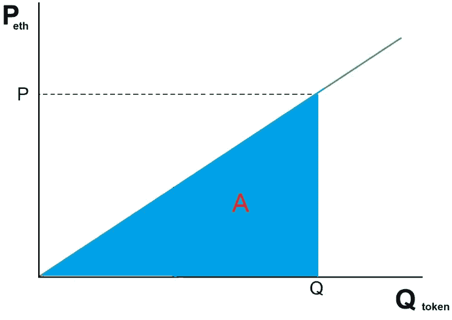

The area A is the total holding of Eth. Q is the quantity of the printed bonding curve token, T.

我们可以用微积分来概括 Eth 和 T 之间的关系。简单地说，对于任何水平的 T，所需 Eth 的量是曲线 P=Q 下的面积。该面积由积分给出，

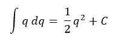

因此，如果我们想生产 10 吨，我们将需要 1/2(10 ) = 50 Eth。

由二次关系可以看出，所需 Eth 的增长速度快于 t 的供给，这就是流动性所需的秘制酱料。看待这种关系的另一种方式是，如果我们在合同中加入 1 个 Eth，合同中已经存在的 Eth 越多，Eth 创造的 T 就越少，因此 T 的价格变化就越小(记住 P=Q)。

例如，假设我们有 2 T。这意味着我们已经输入了 1/2(2 ) = 2 Eth。现在假设我们想看看当我们再输入一个 Eth 时，T 会发生什么。这使总数达到 3 Eth。利用上述积分，我们得到

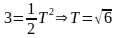

这意味着增加 1 个 Eth 会增加 T 的供应量

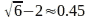

由于 P=Q，这也意味着 T 的价格从 2 到 2.45 Eth 增加了约 0.45。这相当于约 22.5%的价格变动。

现在让我们重复这个实验，但是这次让我们使用先前存在的 T 1000。这意味着合同包含

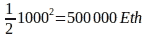

现在我们加上 1 Eth，看看 t 的价格会发生什么变化。

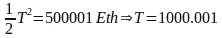

The amount T printed by 1 Eth is now 0.001

你可以看到，1 Eth 产生的 T 量现在只有 0.001。价格也从 1000 瑞士法郎上涨到 1000.001 瑞士法郎，涨幅为 0.00001%

## 简单令牌对交换

我们实际上可以将这个契约视为一个简单的双令牌分散交换(DEX)。随着我们增加更多的 Eth，每增加一个 Eth 的价格滑点就会下降。流动性是一种行话，表示某笔交易对市场价格的影响程度。市场价格越少“注意到”某项交易，市场的流动性就越强。或者换句话说，流动性市场比非流动性市场能吸收更多的交易。这个解决方案似乎还缺少一部分。的确，通过增加更多的乙烯醚，乙烯醚的流动性增加了，但在这个过程中，乙烯醚的价格变得非常高。正如我们将在下面看到的，构建高流动性 DEX 的技巧是不要将本地债券曲线令牌视为任何人“想要”的令牌，而是更多地将其视为一种交易媒介，以促进人们实际想要的令牌之间的交易。那么 T 的实际价格是任意的。

## 通用索引

让我们以两个众所周知的现有令牌 Dai 和 Eth 为例，尝试使用令牌绑定曲线来构建一个分散式交换。第一种方法是部署两个 TBC 契约，一个接受 Dai，另一个接受 Eth。接受 Dai 的打印一个标记 T，接受 Eth 的打印一个标记 r。

为了用 Eth 交换 Dai，我们存放 Eth 并得到一些 R。然后我们必须找到一个可以用 R 交换 T 的交易所，然后将 T 存入 Dai 结合曲线以得到 Dai。哦，等等…我们刚刚把交换 Dai 和 Eth 的问题，替换为交换它们的键曲线标记 T 和 r 的问题。

## 一个是债券，一个是互换，一个是交易，在合同中定价

解决方案是使用一个令牌，让两条键合曲线独立打印。这意味着，如果我存入 1 Eth，我将获得 1 T，如果我存入 1 Dai，我将获得 1 T。现在，如果我想互换，我需要做的就是存入 Eth，获得一些 T，然后存入 T，获得一些 Dai(假设合约有阿呆余额)。

定价呢？

让我们假设 Eth 目前的市场价格是 200 美元。这意味着 1 Eth 应该在任何主动交易中给我 200 Dai。

让我们用 50 Dai 和 50 Eth 来播种我们的 TBC 交换。(为了完整起见，您应该能够使用上面的等式计算出，这样的播种将为每笔存款印刷 10 T，这意味着 T 的总循环供应量将为 20。)

现在有人来了，想用这笔交易和戴一起买 Eth。他们存了 10 戴。这使得 Dai 曲线打印的总 T 为

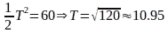

Dai increased from 50 to 60, T increased from 10 to 10.95

这意味着 T 供给增加了 0.95。换句话说，交易者收到 0.95 吨的保证金。因为 T 只是一个中介，一个交换的媒介，他们想拿走他们的 0.95 T，看看他们能得到多少。存入 0.95 吨相当于将供应量减少 0.95 吨至 9.05 吨，因此，如果我们采用 Eth 债券曲线并代入新的代币值，计算出合同中的最终 Eth 余额，我们将得到

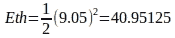

Remember the initial Eth balance was 50

这意味着合约支付了 9.04875 Eth。因此，10 Dai 的用户收到了(9.04875x200=)$1809.75 的 Eth。好交易！交易者看到美元的信号，继续分批存入 10 戴，希望获得无限利润。

他们再存 10 戴会怎么样？

Dai 合同现在总共生产 1000 吨

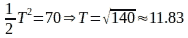

T 供给总量增加了 11.83–10.95 = 0.882。

已经注意到，按照编程，焊接曲线产生的 T 比以前少。

现在让我们看看我们从 0.882 吨中获得了多少 Eth。将 0.882 吨存入 Eth 粘合曲线合约会将供应量从 9.05 吨减少到 8.17 吨。这意味着合约中剩余的 Eth 应该用于

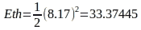

这意味着合约支付给交易者(40.95125–33.37445 =)7.5768 瑞士法郎。

起初，10 个戴产生 9.04 个 Eth。现在 10 戴只出 7.5768 Eth。贸易条件正在改变！事实上，它们的变化正如你所料:你交易的代币越多，它相对于输出代币的价格就越低。

## 重新审视流动性

请注意，在上面的例子中，贸易条件下降的原因之一是因为第二批 Dai 生产较少的 T，然后用于生产较少的 Eth。如果出于某种不可思议的原因，第二套戴产生了与第一次交易完全相同的数量 T，会发生什么？也就是说，我们不必使用 0.882 吨，而是使用 0.95 吨。代入该值，Eth 键合曲线中的 T 供应从 9.05 吨下降到 8.1 吨。这使合约中的总 Eth 下降到

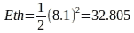

这意味着向用户支付(40.95125–32.805 =)8.14625 Eth。显然更 Eth。戴:在这种情况下，Eth 的隐含价格没有下跌那么多。我们可以说流动性更高了。那么我们怎样才能在 10 天内不掉下来呢？这是一条结合曲线，所以最好的办法就是多存些 Dai。我们知道，随着我们存放更多的 Dai，每个 Dai 单位对 T 产生的影响下降。当然，为了保持贸易条件不变，我们也必须存入更多的 Eth。由于我们在存放更多的 Eth，我们也知道 Eth 的流动性将会上升。将所有这些放在一起，我们就有了完整的画面:一个建立在令牌结合曲线上的分散令牌交换，其中每个令牌都有自己独立的结合曲线，但每个曲线都打印相同的通用令牌，即交换媒介:t。

## 贝霍德勒

这就是 [Behodler](/weidaithriftcoin/introducing-weidais-first-burn-dapp-the-behodler-token-swapper-c76f38e5d94c) 令牌交换的工作方式。代替 T，由所有债券曲线印刷的交换令牌的媒介被称为稀缺性(SCX)。为了增加戴的流动性，你只需用戴购买稀缺性。这相当于获得 Uniswap 交易所合约的流动性令牌。非稀缺性的代币(如和戴)之间的交易在后台使用稀缺性，如上所述。要使用 Behodler，请前往[戴伟 dapp](https://weidaidapp.com/behodler) ，连接您的 Metamask 钱包并点击左侧的“交换代币”菜单选项。你可以通过切换“增加流动性”开关并以你想要的比例提供代币来增加流动性，或者你可以简单地用你选择的代币购买稀缺性。如果你想收回流动性，设置你的输入令牌的稀缺性，然后把它卖回给 Behodler，得到你想要的输出令牌。

## 关于流动性增长的最后一句话:算法 HODL

假设我将 10 个 Dai 和 10 个 Eth 存入像 Behodler 这样的 TBC 交易所，得到 20 个 t，现在我不小心丢失了我的私钥。为了所有的意图和目的，20 T 丢失了，并且交换现在有 10 Dai 和 10 Eth 卡在里面。把戴和 Eth 弄出来的唯一方法是什么？当然是戴或 Eth 更多。因此，如果我带一些 Dai 来购买 Eth，我不仅会得到 Eth，而且我会在一个预先播种了流动性的交易所进行交易(由于我意外丢失了密钥)。

假设除了上面的密钥丢失之外，还有其他人出现并存入另外 10 个 Dai 和 10 个 Eth，并且也丢失了他们的密钥。现在我们与 20 个 Dai 和 20 个 Eth 交换，但没有相应的 t。同样，获得 Eth 或 Dai 的唯一方法是不断存入更多的 Eth 或 Dai。丢失钥匙的错误无意中永久性地增加了交易所的流动性。如果你仔细想想，就会发现另一个奇怪的现象:无论如何，你都不可能耗尽所有的代币。如果你试图买断所有的戴，你必须存款(因为没有 T 存在)。但是现在你有一个充满 Eth 的交易所。如果你把这个 Eth 存款创造的所有现存的 T 都存进去，也不足以赎回所有的 Eth。通过丢失 T，您无意中创建了一个永久的令牌接收器！

Behodler 通过在每次交易中烧掉一小部分稀缺资源来模拟这种关键损失现象。本质上，稀缺性随着常规交易而流失，这意味着 Behodler 随着每次交易而变得越来越大。这也意味着每个代币的流动性都会随着时间的推移而增加。无论在贝霍德勒进行什么交易，都会像流沙一样越来越多。这种黑洞下沉效应是 HODL 进入贝霍德勒的原因。

除了充当另一个 DEX 之外，Behodler 还通过充当 Eth(以及其他令牌)的永久接收器来为以太坊社区提供服务。以太汇是必要的，它通过为矿工的支付提供价格支持来确保以太坊网络的安全。

> [在您的收件箱中直接获得最佳软件交易](https://coincodecap.com/?utm_source=coinmonks)

