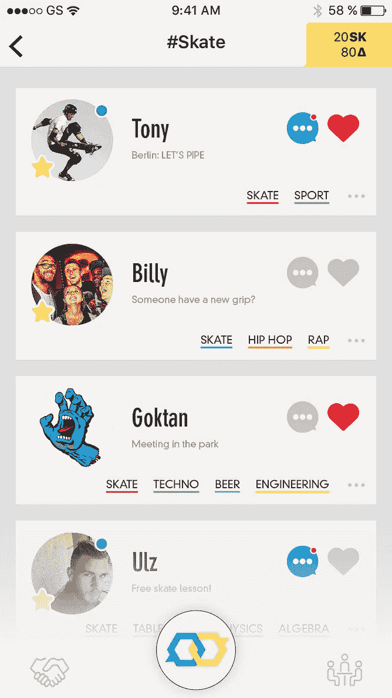
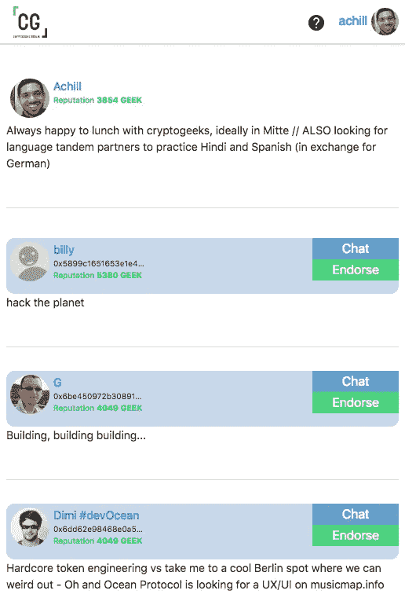
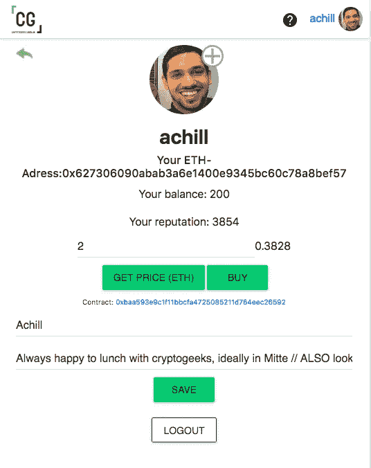

# 象征性管理的社区

> 原文：<https://medium.com/coinmonks/token-curated-communities-1b3ca9a1674b?source=collection_archive---------4----------------------->

早在围绕 TCR 的大肆宣传开始之前，在 [Way](http://www.way.network) 我们已经将令牌管理的注意力网络的想法应用到社会发现的背景中:我们开发了一种机制，帮助过滤和连接彼此不认识但肯定会从互动中受益的个人。**我们称之为代币策划社区**，允许陌生人在现实世界中进行信任和有价值的接触。在这篇文章中，我想解释这个用例中的潜力，并概述 Way 计划如何实现它。

# 日常城市生活中的信息不对称

监管的目的是减少信息不对称:一群人想知道一些不明显的事情:[哪个数据提供商拥有最好的传感器](https://weeve.network/)、[谁是我所在领域最值得信赖的医生](https://medcredits.io/)、[哪些网站是广告的合法合作伙伴？](https://publisher.adchain.com/) —每当我们进行商业交易时，我们都希望找到此类问题的可靠答案，并选择满足当前需求的最佳服务提供商。

但还有更微妙的非货币交易，信息不对称阻碍了交易。当我们在城市中漫步时，我们被陌生人包围着。我们是群居动物，喜欢与直系亲属以外的人联系，但很难决定我们应该把谁带进我们的生活，把我们有限的注意力分配给谁，与谁交朋友。如果你随机接近陌生人并开始和他们交谈，他们会不信任你，因为他们对你是谁以及你的意图一无所知。因此，我们通常根本不与不认识的人交流。

[Image: [Unsplash Public Domain](https://unsplash.com/photos/94ndgX5Qw1k)]

# 现有解决方案

当然，人类社会已经想出了解决这个问题的办法。但它们显然并不完美:

## 基于地点和兴趣的社区

人们去某些物理场所，是为了过滤值得信任、兼容的陌生人，并与他们建立联系:大学校园、音乐俱乐部(这里的过滤是由保镖完成的)、会议、咖啡馆和活动团体，都让我们克服了上述根本的信息不对称。当你碰巧去同一个地方并从事类似的活动时，你可以认识去那里的其他人。但这严重限制了潜在的人脉资源:你将只能结识与你同时进入同一所大学的人。对许多人来说，这还不够。

[Image: [Unsplash Public Domain](https://unsplash.com/photos/6Woj_wozqmA)]

## 社会化媒体

当然，至少对于那些乐于在网上分享虚构身份的人来说，还有社交媒体。脸书和 Instagram 允许人们收集新认识的陌生人的个性信息，并过滤这些新的联系。但这种形式的审查只能发生在第一次接触之后，所以它并不能真正帮助在第一次互动中建立信任。

## 社交发现应用

要在网上结识新朋友，你必须求助于社交发现应用程序来约会和建立关系网。Tinder、shapr 和 Couchsurfing 是突出的例子，但每个类别都有数百个。然而，由于当今互联网的工作方式，这些应用程序都将其用户数据锁定在孤岛中。很有可能，当你在你所在的城市外出时，有另一个人就在附近，他在那些社交发现应用程序中的一个上，并且有兴趣在适当过滤后结识新朋友。但你不太可能在同一个应用程序上注册，并在正确的时间查看它。此外，这些技术几乎没有解决信任问题。仅仅因为某人从他们的个人资料和聊天中看起来是一个很好的人，并不意味着他们实际上很好或者根本不是一个人。这些应用程序只适用于非常特殊的群体(单身人士、旅行者、商业开发人员等)。)他们强烈需要在他们的社区内建立联系，并且愿意经历与一个未被发现的陌生人计划会面的痛苦和危险的过程。

Web 2.0 的集中商业模式不允许更广泛地联系陌生人所需的规模。我们喜欢通过我们的爱好和兴趣结识新朋友，即使这种网络扩展并不是我们会员的主要目的:当你发现自己和一群陌生人在地铁车厢里时，可能不会有你感兴趣的人约会，但也许有人也喜欢健身，并很乐意讨论他们的锻炼计划。这些也许是相当低价值的，但也是相当低成本的遭遇。每天都有数十亿次这样的互动没有实现。

# 新市场

现在，这项技术已经为这个无人问津的市场做好了准备。方法就是创造它。

## 我们的解决方案

我们正在建立一个数据生态系统，每个用户都可以在其中表明自己的实际存在和社区关系，以促进与他人的真实互动。起初，这看起来像一个移动应用程序。但愿有一天，它会成为覆盖全球公共空间的数字基础设施。

Left: A general feed with users nearby who want to share their community affiliations. Middle: Different communities with group size and different amounts of PRSNC token staked. Right: The skate community and its curators (marked with a star).

在我们目前设想的模型中，用户可以指出她希望成为什么样的社区的一部分，也就是说，她喜欢与什么样的人群自发接触。然后，用户可以通过获得所谓的社区管理员的支持，在这些社区内建立信任和声誉。这些策展人受到特定于社区的区块链令牌的激励，以保持社区的有用性、安全性和可信赖性[详情见即将发布的白皮书]。一群开放的代币持有者验证账户并收集关于在什么情况下谁可以被信任的信息，而不是一个中央机构。这些代币持有者不再将所有的金钱奖励留给公司，而是自己收获工作的经济利益。这将激励策展人以比现有平台更好的方式组织信息，并为社会长尾中的社区提供更多协调。

对于如何分配声誉和管理成员资格，社区可能有不同的规则:一些可能是排他性的，并实施 [TCR](/@ilovebagels/token-curated-registries-1-0-61a232f8dac7) 来管理成员资格，所以你要么在社区中，要么在社区外，当你被踢出时，你就会失去股份。其他人可能有一个更具包容性的方法，允许每个人无利益关系地参与，然后使用一个[监管市场](/@simondlr/tokens-2-0-curved-token-bonding-in-curation-markets-1764a2e0bee5)模型以一种有用的方式对成员进行分类。

用户然后可以选择她想要与网络的其他参与者共享什么信息。她可能不愿意向所有其他用户公开她的真实身份和位置，而只愿意向那些共享至少一个社区的用户公开。一旦她了解到附近有一个相关的、可信的身份想要互动，他们就可以在链外继续对话，并逐渐摆脱匿名状态，直到他们在现实世界中面对面。

## 一个真正分散的令牌模型

上述网络的价值主要不在于我们正在建立的技术，而在于其用户提供的丰富信息和管理工作。因此，我们不希望通过 ICO 推出我们的令牌，因为在 ICO 中，网络的整个预计价值都落入了一个中央开发团队的手中。相反，我们使用[债券曲线合同](https://blog.relevant.community/how-to-make-bonding-curves-for-continuous-token-models-3784653f8b17)，并且最初只提取一小部分费用来资助开发。

该令牌将被称为存在(PRSNC ),它将授予其所有者对涉及整个网络的决策的治理和监管权。然后，这个宏令牌也可以用于打开和绑定到子社区，每个子社区在令牌化有丝分裂的精神下都有自己的绑定曲线契约。事实上，我们生活在我们的第一个子社区，密码极客。柏林，及其在 Rinkeby testnet 上的相关极客令牌:

# 结论

标记化监管是一种非常有前途的模式，可以克服阻碍交流的信息不对称。大多数应用程序专注于高价值的 B2B 和 B2C 交易。但随着人类和技术的进步，人们将越来越多地直接参与彼此之间的经济互动。不仅是企业，私人也可以从被信任中受益——特别是在现实世界中遇到陌生人时，我们目前没有其他媒介来传递可靠的信任信号。

*感谢* *大卫·特里、特伦特·麦康纳、安吉拉·克雷滕韦斯、迪米特里·德·容格、塞巴斯蒂安·加杰克和西德·巴辛对这些想法的反馈。*