# 代币销售剖析

> 原文：<https://medium.com/coinmonks/token-sales-anatomy-d22657a37853?source=collection_archive---------3----------------------->

## 以太坊上代币销售(初始代币/硬币销售)的分析。如何根据区块链数据计算 ICO 收集量并分析趋势和倾向

一种或其他加密货币值多少钱的问题出现在不同的方面。一种答案是估计人们在 ICO 期间最初投资于加密货币的金额。在某些情况下，这个数字可以通过区块链的数据来验证，而在其他情况下则不能。让我们更深入地了解 ICO mechanic 是如何工作的，以及如何基于可信的数据源(区块链本身)对其进行事后分析。

# 首次代币发行

当你在区块链发行自己的代币，或者计划创造自己的加密硬币时，一个大问题出现了，首先是如何分配它。如果你只是独自拥有它，这种代币就没有多大价值。有许多机会，新项目从以下选项中选择:

1.  在 ITO / ICO 流程中的初始代币(硬币)发行期间，发行代币并将其出售给其他人。这基本上是您的全新令牌和一些现有资产(通常是现有的加密货币)之间的初始交换；
2.  向最需要代币人分发代币，并通过产生需求和供给赋予代币一定的价值。一个有趣的场景是，令牌直接从某个社区拥有它的事实中获得值。

这项调查主要涉及第一个案件。有时情况是混合的，一些代币被出售，另一部分被分发。

成功的 ICO 为项目创造了巨大的推动力，因为它提供了初始投资，同时产生了项目周围的观众和支持者社区。

# 基本 ICO 力学

那么这到底是怎么发生的呢？在一个**去中心化**的世界里，没有中央权威，它出售代币并确保条件的正确性。相反，有一个**智能合同**，提供代币销售。图表 *:* 显示了其实际工作原理的简单示例

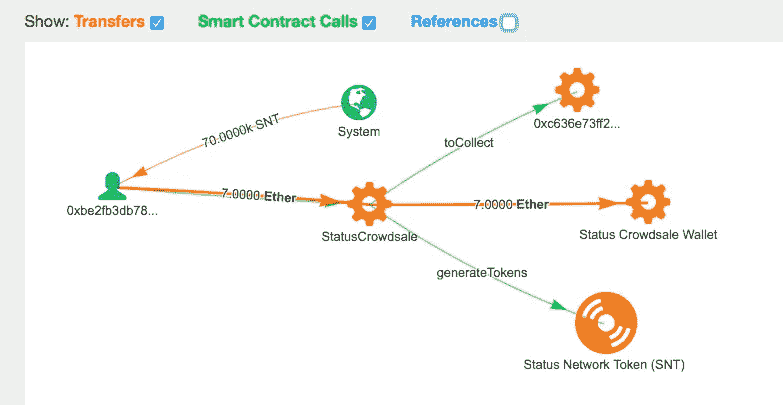

*Source:* [*bloxy.info*](https://bloxy.info/tx/0x0000a869f651ad0d9c4fa9f19fe00c2d9fa14b3319a734983bf22dc3f0cf8923)

智能合约在这里完成向买方出售令牌的所有工作，交换 7 ETH 到 70K SNT 令牌。令牌是从系统中的系统(零)地址“铸造”的，类似于加密货币挖掘过程。尽管代币销售的智能合约可能相当复杂，但简单的代码行确保了这一过程:

```
// calculate how much token to give, based on exchange rate and
// amount of ETH transfered ( contained in _toFund variable )
uint256 tokensGenerated = _toFund.mul(exchangeRate);// create ( mint ) new tokens
assert(SNT.generateTokens(_th, tokensGenerated));// how tokens are generated
function generateTokens(address _owner, uint _amount
) onlyController returns (bool) {
   ...
// Update balances and generate event on transfer tokens from system // (zero) address to token buyer updateValueAtNow(balances[_owner], previousBalanceTo + _amount);
    Transfer(0, _owner, _amount);

}
```

如果我们甚至不知道智能合约源代码或逻辑，我们仍然有一个基于上面的事务图的知识，它完全是从链上数据构建的:

1.  智能合约在一次交易中将 ETH 兑换为 SNT 令牌
2.  同一个地址(代币购买者)发送 ETH 并得到 SNT 代币
3.  SNT 令牌起源于零系统地址，这通常意味着它是伪造的

看看同一智能合约的另一个交易，后来发生了:

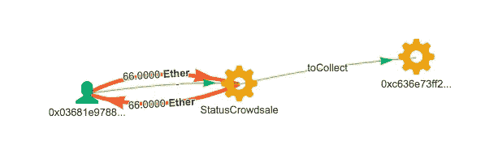

*Source:* [*bloxy.info*](https://bloxy.info/tx/0x5b5511dc93c06734cd4046f69997fb98bcc582f789be5c55c095e082c47566b0)

显然，现在的众包销售智能合同规则不允许接受 ETH 发送的代币销售，可能是因为硬封顶的临近。然而，ETH 被接受并被发送回发送者。一个重要的结论是**你不能依赖发送到合同或其他地址的 ETH 数量**，作为收集 ICO 资金的基础。

该方案有多种变体，其中令牌被预先挖掘并从“令牌钱包”中发送。首先，令牌钱包接收令牌总量的:

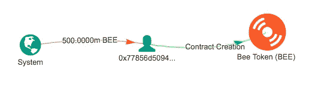

*Source:* [*bloxy.info*](https://bloxy.info/tx/0xa9b3ebc3d8e52509425e372a4a0c7eddd435e7559377c26c85da2d1ac8a28138)

从这个钱包里送出令牌后( [0x778…](https://bloxy.info/address/0x77856d50941e1b5b29e291b083740e05e800883a) ):

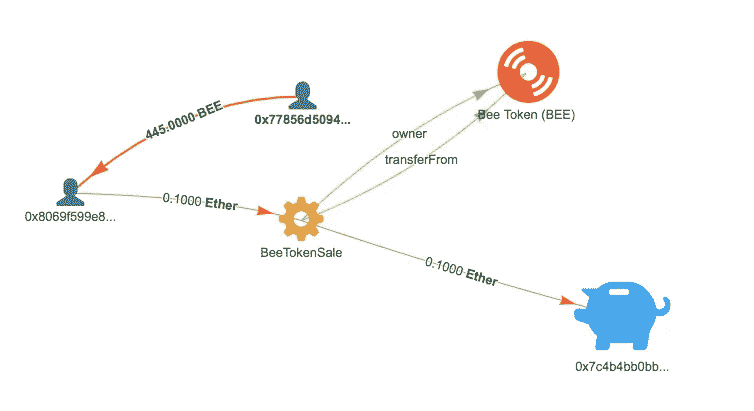

*Source:* [*bloxy.info*](https://bloxy.info/tx/0x9fd32b40af6a04b02f0254460d0f105ab373c1ef150ef5303bfe00d32025b0c7)

该方案的变体是当令牌从相同的地址发送时，ETH 被转移到:

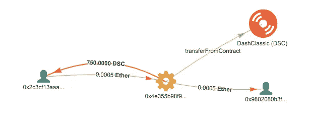

*来源:* [*bloxy.info*](https://bloxy.info/tx/0x645b7756dbb48c83eee984ca57c5d940d9293860fa6781d96abb6e1490a4ad01)

…或者 ETH 直接发送到令牌合同，如下例所示:

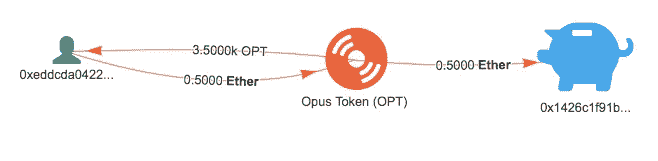

*Source:* [*bloxy.info*](https://bloxy.info/tx/0x3568e210799b4becd0092f6fd95719198458db393109fbfc3a26a0a1a9b92e1a)

# 基于交易的分析

知道了 ICO 事务的结构，我们现在可以从区块链数据中提取数据。我们根据以下标准从区块链中选择交易:

1.  代币购买者使用智能合约启动交易
2.  智能合约将令牌发送回令牌购买者，以换取 ETH

类似于 ICO，还需要其他规则来过滤一些其他情况，但它们不是:

1.  不涉及其他货币
2.  不涉及 DEX(分散交易所)智能合约
3.  令牌发送者未收到与 ETH 交换的令牌

这里的最后一点需要一些解释。由于我们盲目地关注区块链交易，有时很难对代币销售是否是初始的进行分类。

# 二级代币销售

请看这个例子，它与 ICO 事务极其相似，只是它实际上不是:

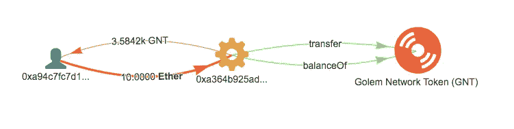

*Source:* [*bloxy.info*](https://bloxy.info/tx/0x1521ee8f826c642c802b87dbdbb7a7ee2b517b6398dc2b6b5df4d83d20f22283)

ICO 交易与 GNT 令牌的唯一区别在于**以外的**交易。通过这种智能合约交易的代币在二级市场上，它们已经在 ICO 流程中被购买，现在再次交易。有人创建了一个智能合同来自动化这一过程。

从计算代币销售值中过滤出这些交易的唯一方法是跟踪在该交易中销售的代币的来源。要做到这一点，我们必须分析交易之前的令牌转移图:

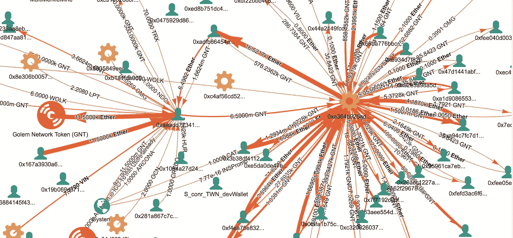

*Source:* [*bloxy.info*](https://bloxy.info/graphs/0xaaadd77341055d1eed488f184b165ec0e555f6af)

从这张图中可以清楚地看到，GNT 令牌最初是通过地址 [0xaaad](https://bloxy.info/graphs/0xaaadd77341055d1eed488f184b165ec0e555f6af) 在 ICO 上以 11，5k ETH 购买的..，转移到利益的[智能合约](https://bloxy.info/address/0xa364b925adab4de983e6770277ee13570b573e3a)，创造自己的交易，最终从这次二次出售中获得 16.5 千 ETH。不错的生意！

# 哪种方案更受欢迎？

现在，当我们看到最常见的方案时，我们可以对整个区块链进行统计，并总结每个方案的交易。结果显示了历年 ico 的数量和相应的 ETH 数量:

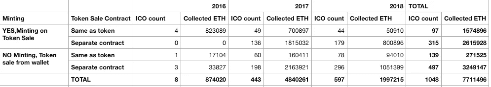

最受欢迎的是“无铸币”、“单独代币买卖合同”。最不受欢迎的组合是代币智能合约，接受 ETH，带铸币。

# 现在是钱，以后是代币

ICO 智能合约可以接受 ETH，登记到期转让给买方的代币数量，以后再进行分配。这种机制的示例如下所示:

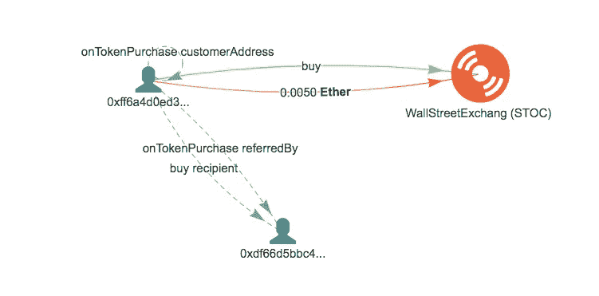

*Source:* [*bloxy.info*](https://bloxy.info/tx/0xa11be40bbafa1e71b242bd0d0c543b37270d646479a288b74e9f696654cdd238)

智能合约实际上不转移合约上的任何令牌，只是更新到期余额并触发一个事件:

```
// update circulating supply & the ledger address for the customer
**tokenBalanceLedger_[msg.sender] = SafeMath.add(tokenBalanceLedger_[msg.sender], _amountOfTokens);**

// Tells the contract that the buyer doesn't deserve dividends for the tokens before they owned them;
//really i know you think you do but you don't
int256 _updatedPayouts = (int256) ((profitPerShare_ * _amountOfTokens) - _fee);
payoutsTo_[msg.sender] += _updatedPayouts;

// fire event
**onTokenPurchase(msg.sender, _incomingEthereum, _amountOfTokens, _referredBy);**
```

*来源:* [*以太扫描*](https://etherscan.io/address/0x51c46c33064a9d7171dbdbfc65c3bf2d2ef688a4#code)

这种类型的 ICO 合同通常是令牌合同的一部分。否则，很难以一种清晰的方式将单独的契约绑定到令牌分发。

为了通过该方案找到 ico，我们必须找到到 ERC20 令牌智能合约的多个 ETH 传输。

这类 ico 按年份统计如下:

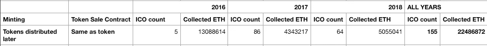

有趣的是，根据 ICO 统计，这种机制并不像“交易中”销售那样受欢迎，但根据收集的 ETH 数量，它远远超过。可以用几个非常大的 ICO 来解释:2016 年的 [TheDAO](https://bloxy.info/address/0xbb9bc244d798123fde783fcc1c72d3bb8c189413) 和 2017-2018 年的 [EOS](https://bloxy.info/address/0x86fa049857e0209aa7d9e616f7eb3b3b78ecfdb0) 都采用了这个方案。

# 现在有钱，代币不确定

从各种意义上来说，完成 ICO 的最后一种方式是从钱包里拿钱，然后手动分发令牌。

人们将 ETH(或其他加密货币)发送到某个指定的地址，如下例所示:

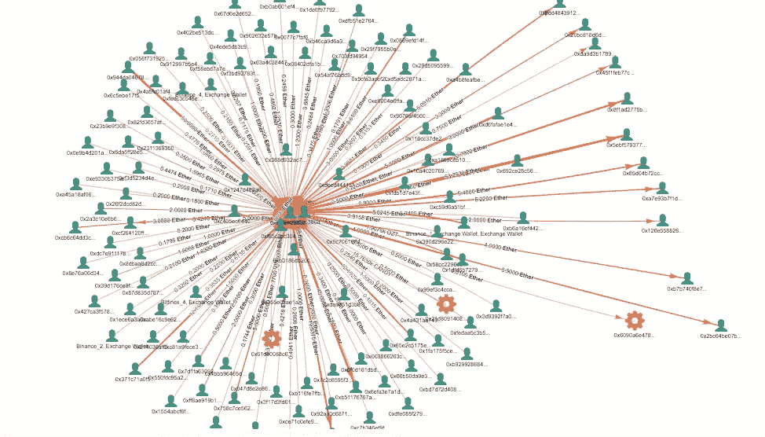

Source: [bloxy.info](https://bloxy.info/graphs/0xddfe42ddb9c406b9143d85f294583e0f1c00c223)

在区块链，未来代币的分发与在该地址上的 ETH 的收集之间没有关系。

# 结论

1.  只要查看区块链数据，就可以识别与初始代币销售(ICO)相关的交易；
2.  大多数 ico 遵循该方案，在与 ETH 支付相同的交易中，令牌由单独的“令牌销售”智能合约自动分发；
3.  该方案有多种变型，其中代币通过在区块链上的同一或单独交易中铸造或通过转移预先铸造的代币来分发。
4.  有些 ico 中的金额(全部或部分)可能不是来自区块链数据。它们中的大多数并没有真正使用区块链的去中心化特性，并且可以在任何其他支付机制上执行。

```
*This article was composed from the data and by analytical tools from* [*Bloxy.info*](https://bloxy.info) *analytical engine.* [*Bloxy.info*](https://bloxy.info) *web site provides a set of tools for analytics, traders, companies and crypto enthusiasts.

The tools include APIs, dashboards and search engine, all available on-site, providing accurate data, indexed directly from the blockchain live node.

Bloxy mission is to make blockchain more transparent and accessible to people and businesses.

Please, make a reference to the source of data when referencing this article.*
```

> [在您的收件箱中直接获得最佳软件交易](https://coincodecap.com/?utm_source=coinmonks)

[](https://coincodecap.com/?utm_source=coinmonks)