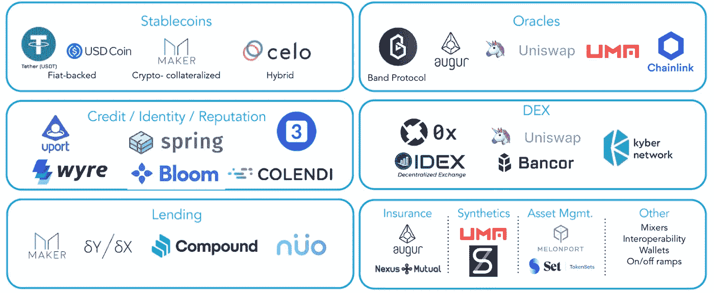

# 代币互换可以有不同的含义

> 原文：<https://medium.com/coinmonks/token-swaps-can-mean-different-things-20b4043b59f8?source=collection_archive---------5----------------------->

## [2 分钟视频](https://youtu.be/QIRwMDDKvKk)讲述为什么代币互换可以有不同的含义

Source: [Wave Group.com](https://www.wavegp.com/media/building-the-future-of-cross-fi)

一些最初的硬币发行(ico)已经使用以太坊的 ERC20 令牌推出，然后一旦他们自己的区块链准备好，就进行令牌交换，这有时被称为“mainnet”交换。此外，当令牌升级并提供更多功能时，可以提供令牌交换。