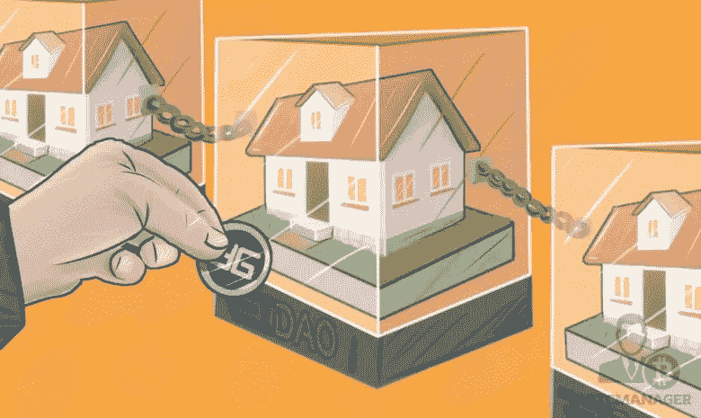
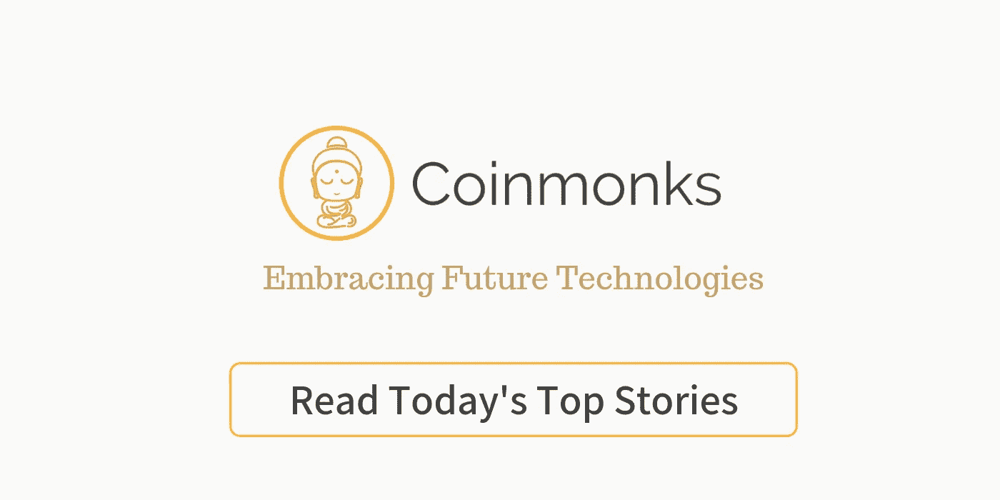

# 符号化:炒作还是正版颠覆者？

> 原文：<https://medium.com/coinmonks/tokenization-hype-or-genuine-disruptor-2d8ba5d341aa?source=collection_archive---------1----------------------->

[REIDAO’s RE Tokenization Initiative](https://btcmanager.com/reidao-offers-blockchain-based-real-estate-investing-using-digix/)

从智能签约到点对点交易，区块链技术将在许多方面为房地产(再)行业带来好处。这将极大地解决当前可再生能源行业赖以繁荣的许多低效率问题，但将可再生能源置于区块链有一个影响，需要进行更深入的分析。无论好坏，令牌化改变了可再生能源行业的一个基本方面，因此改变了我们将可再生能源作为一种投资类别的方法。

关于区块链上资产的数字化——记号化——如何通过显著降低参与可再生能源市场的资本要求来使可再生能源投资民主化，已经有很多炒作。严格地说，即使属性仅由一个数字标记表示，从技术上讲，它仍然可以被认为是标记化的，但是就本文的目的而言，标记化将更符合它在关于 re 的讨论中的用法:创建多个标记，每个标记表示一个属性的一部分。虽然这绝对是一个很好的机会均衡器，但新投资者的涌入需要仔细权衡他们对市场可能产生的影响，即波动性增加。

令牌化为投资者在传统上被称为流动缓慢、流动性差的资产类别中分配资本提供了更大的流动性和灵活性。然而，正是 RE 市场的这一方面使其成为一种有价值的多样化资产，因为它形成了对经济不确定性的对冲，大大降低了非理性市场中的投资组合波动性。作为一种资产类别，可再生能源的潜在吸引力在于这样一种假设，即可再生能源具有相对最小的负面影响，因为它是真实的，具有明显的价值主张，最重要的是，在它重要的地方，供应是有限的。

工业中的摩擦大大有助于稀土的稳定性。由于低效和冗余的合同处理以及不透明的非标准化数据模型，过时的商业模式涉及中间商，他们提供收取的实际价值的一小部分来维持他们的地位。当区块链技术用于解决上述问题时，它肯定会产生大量剩余价值(我将在即将发表的文章中介绍)。然而，就我们这里的目的而言，这种摩擦的减少会增加市场波动性，因为交易成本对贸易的障碍变得小得多。

这未必是一件坏事，因为贸易摩擦减少带来的市场活动增加，是稀土行业一个非常受欢迎的进步。我甚至可以说，在这个日益数字化的世界里，这是行业发展过程中不可避免的一步。然而，我们需要谨慎对待重新令牌化，因为它引入的波动性很可能主要是由人的冲动驱动的，而不是提高流程效率。

人的因素:人们为什么投资可再生能源？

尽管世界各地的数字有所不同，但作为一种投资产品，RE 通常会占到个人投资组合的 10%到 10%之间(T2)。随着记号化的引入，这一比例是上升还是下降，将取决于人们在多大程度上继续将其视为价值储存手段。因此，这很大程度上是主观的，并受到[文化品味](https://editorialexpress.com/cgi-bin/conference/download.cgi?db_name=IAAE2016&paper_id=451)的严重影响。尽管如此，令牌化可能会破坏可再生能源的这一方面，因为它进一步将可再生能源资产暴露给自由市场的突发奇想和复杂性。

在低迷时期，投资者更有可能按市值计价，就好像损失百分比可能是相同的，但损失量要小得多。如果一个价值 1000 万美元的财产损失了 10%的价值，那么 100 万美元的损失在心理上比 1000 美元对 10000 美元的损失更难接受，如果财产被分成 1000 个相等的代币。另一方面，为了锁定 1000 万美元房地产投资的 100 万美元利润而出售的紧迫性可能会高于 1000 美元的 1 万美元房地产投资。这可能会在一个似乎几乎没有价格上限的市场中引入急需的下行风险。然而，这里的问题是，标记化的属性将是首当其冲的，所以不清楚开发人员是否会在第一时间冒这个风险。

令牌化的另一个可能的影响是，令牌化的属性变得越来越抽象，导致由于技术而可能出现的不可预见的市场行为。这类似于支付(信用卡/借记卡)卡的引入，它实际上改变了人们花钱的方式。除了促销和忠诚度计划，人们会认为，对于任何理性的消费者来说，通过现金或信用卡消费的数量不会有什么不同，但事实证明并非如此。由于令牌化，很难预测行为变化，但随着投资越来越脱离基础资产，投资变得越来越像数字游戏，估值可能会出现更大的差异。

不用说，上述所有情况对稀土行业都不一定是坏事，因为价格发现将更接近自由市场，而不是今天使用的自我参照估值模型。此外，分辨率的提高将极大地帮助投资者定价和管理风险。尽管如此，数据的增加必须与随之而来的复杂性的增加保持良好的平衡。毕竟，除了极少数知识渊博的投资者之外，复杂的金融工具通常表明所产生的真实价值越来越难以量化。

需要注意的是，标记化不是一个全有或全无的命题。房东/开发商可以根据最适合他们的模型，轻松选择是否应该对房产进行令牌化。这反过来又取决于社会如何根据记号化提供的替代投资模型将可再生能源重新视为一种资产类别。

如果对可再生能源的需求是继续作为价值储存和投资组合多样化，令牌化可能会被降级到吸引利基投资者群体的次要市场，就像 REITs 或 SPV 一样。或者，在令牌化达到临界质量并成为行业标准的可能性较小的情况下，仍然会有对非令牌化资产的需求，以避免处理多股东财产的治理复杂性。和往常一样，最有可能的结果可能是中间的某个地方。

象征化将通过显著降低进入壁垒来使可再生能源投资民主化，但同时增加了资产的波动性。令牌化将增强“众筹”商业模式，但会带来更多的治理复杂性。令牌化将有助于更好地发现价格，但会将可再生能源暴露于自由市场中不太受欢迎的方面。令牌化将为投资者提供更好地管理风险的工具，但代价是让行业变得过于复杂。

最终，区块链技术可能是 re 未来不可避免的一部分，因为它解决了当今核心 RE 业务流程中固有的许多低效问题，但令牌化不一定是对话的一部分，因为它解决了一个不同的问题。这种区别非常关键，因为无需令牌化，就可以实现财产、智能签约和 p2p 市场的数字身份，反之则不行。令牌化是市场就单个资产是否应该改变其治理和资本分配模式做出的主动决策。这反过来又将取决于记号化所带来的替代模型将如何塑造社会对未来可再生能源的看法。优化复杂的流程很容易，预测人的因素是一个愚蠢的游戏。

谢谢你坚持到最后。希望听到你的想法/评论，所以请留言。我在 twitter 上很活跃[*@*AwKaiShin](https://twitter.com/awkaishin)*如果你想收到更多易消化的密码相关信息，或者访问我的* [*个人网站*](https://www.awkaishin.com/) *如果你想要我的服务:)*

