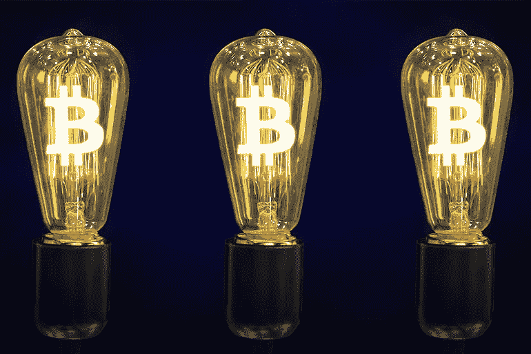
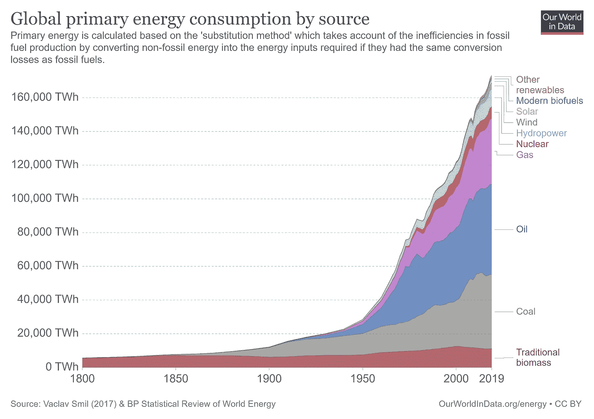
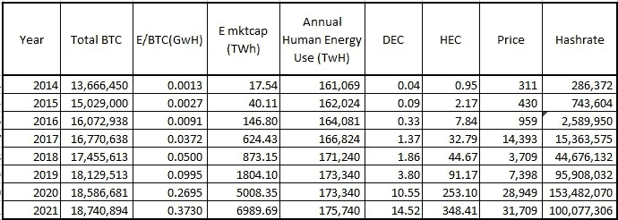
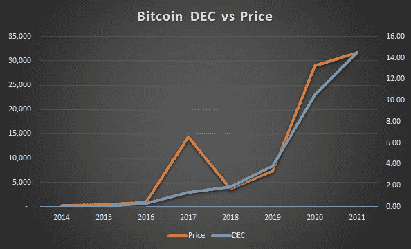
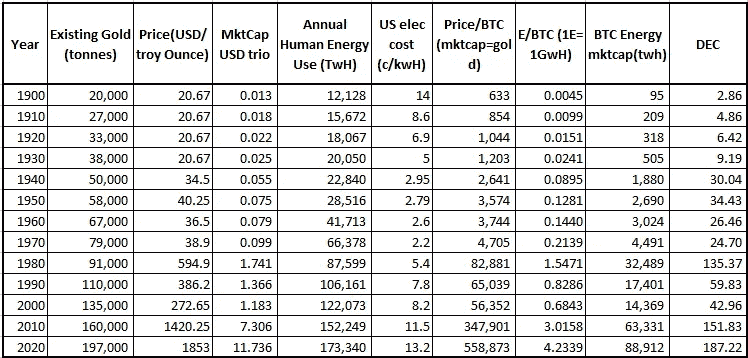
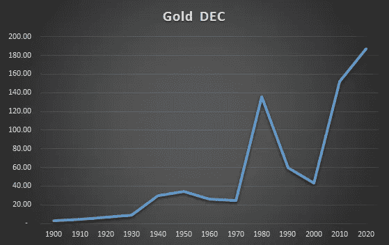

# 令牌化的能源:为什么比特币是一种新的经济范式

> 原文：<https://medium.com/coinmonks/tokenized-energy-why-bitcoin-is-a-new-economic-paradigm-fab3ee6fe5b0?source=collection_archive---------7----------------------->

## 高能耗使比特币成为完美的价值储存手段

有一大堆文章阐述了比特币的许多优点，因为它在许多方面都是革命性的。在这篇文章中，我想重点介绍比特币的一个独特特征及其重要性。我还定义了一个新的指标叫做经济能力天数(DEC)T1，它可以成为衡量经济发展的一个重要尺度。

比特币实际上是一种象征性的能源形式。作为比特币支柱的 PoW 算法消耗能量来生成称为比特币的代币。这种挖掘过程有效地为创造的每个比特币赋予了能量值。因此，比特币是一种方便、便携、可转让、可替代的代币，体现了其中蕴含的某种能量价值。比特币的能源使用是一个特性，而不是一个 bug。

从历史上看，我们的武器库中从来没有任何工具或经济结构可以用来表征和评价能源。BTC 是一次技术飞跃，它带来了衡量经济进步的新范式，并为我们提供了前所未有的新能力。

这有什么大不了的？要回答这个问题，我们需要了解如何衡量一个文明的发展。任何文明的进步程度都与其能源使用量成正比。随着人类的不断进步，我们驾驭新能源并将其用于造福人类的能力也相应提高。为了详细说明，我们来看看卡尔达舍夫标度。

## **卡尔达舍夫量表**

[卡尔达舍夫星等](https://en.wikipedia.org/wiki/Kardashev_scale)是苏联天文学家尼古拉·卡尔达舍夫在 1964 年描述的一个颇有见地的概念。它基本上说明了一个文明的进步水平是由它使用的能源数量来表示的。第一类文明的经济控制着其母星的可用能量，第二类控制着其恒星的能量，第三类控制着其星系的能量。我们在规模上大约是 0.74，并且一直在稳步增长。我们目前的进展也反映了我们的能源使用模式。在上个世纪，全球经济出现了前所未有的增长，与此同时，能源使用总量也呈指数级增长。

由于一个文明的总体进步与其能源使用密不可分，我们需要更好的衡量标准来评估经济激励，并使其与公认的科学进步定义相一致。这些工具在过去并不存在，因为我们没有手段或技术来将我们的经济行为与能源联系起来并进行衡量，尽管能源应该是货币体系基础的概念已经存在了很长时间。(**能值是一个成熟的概念，亨利·福特在 20 世纪 20 年代想要一种能源支持的货币等等。)现在有了比特币，我们终于可以开始连接一些点了。**

> **想法 1:能源消耗是人类经济进步的代表**

## ****对比特币的一些观察****

**1)BTC 的价格由市场供求力量决定。采矿能力增加/减少以匹配价格，这样采矿成本接近 BTC 价格，导致矿工的微利(竞争非常激烈的行业，所以利润很小)。在发展我们的理论框架时，让我们近似地以无套利为例，BTC 的价格正好等于开采它的成本。同样为了简单起见，让我们暂时忽略采矿作业的间接成本。**

> **开采 1 BTC 所需的总能量= BTC 价格/1 单位能量的成本**

**由于能源成本在世界不同地区是可变的，采矿作业集中在廉价能源地区。我们将使用剑桥比特币能源指数的数据来估算开采 1 BTC 所需的能源。**

**2)从上面我们可以看出，BTC 是按照最近开采的 BTC 的边际能耗定价的。[查尔斯·爱德华兹](https://medium.com/u/3e17a788b1e?source=post_page-----fab3ee6fe5b0--------------------------------)有一个[非常好的系列文章](/capriole/bitcoins-production-cost-88d889462ea7)描述这种动态，尽管我认为驱动因素是 BTC 价格，导致能源消耗与之匹配，而不是能源消耗是价格的驱动因素。**

**3) **比特币的能源市场上限**:让我们假设有一种叫做 E 的代币可供使用并四处浮动，1 个 E 代表 1 GwH(千兆瓦时)的能源。在撰写本文时，用于制造 1 BTC 的能源总量约为 0.37 GwH=0.37E。乘以现有 BTC 的总数(1874.1 万)得出能源市值为 698.9 万 e**

**4)世界经济一年使用的能源总量为 175，000 TwH = 175，000，0.04。因此，目前 BTC 市场的总市值相当于人类年度能源经济总量的 0.04 倍，或**人类每日经济总量的 14.5 倍。****

> **想法 2:比特币是象征性的能源，是能源和货币之间的直接联系:比特币的能源市值**

## ****经济能力天数(DEC)****

**我想介绍一个新的指标，叫做 ***经济能力天数。*****

**人类文明能在一天内取得什么成就？当然，这取决于我们的技术和资源水平，但什么是客观衡量它的合适的科学方法呢？这就是卡尔达舍夫尺度所阐述的概念发挥作用的地方，一个文明所拥有的能量是其能力的一个很好的代表(尽管它不是全部)。目前，我们的全球经济每年消耗约 17.5 万 TWH 的能源(不仅仅是电力，还包括运输和工业的化石燃料消耗)。因此，我们可以将人类文明的能力量化为 479.45 TWH/天等于 479，452 埃。**

> ****经济生产能力天数(DEC)**= 365 *总能耗 mkt cap/年人类能耗(AHE)**
> 
> **= 365 *(BTC 总人数*开采最新 BTC 的能源)/AHE**

**为了计算用于开采最新 BTC 的能源，我们使用来自[剑桥比特币能源指数](https://cbeci.org/)的数据来估算用于最新区块的能源，然后得出每 BTC 值。在稳态均衡中，生产 1 BTC 的成本应该(几乎)等于价格(市场需求和供给力量相匹配)，但实际上，价格波动太快，矿业产能无法做出同样快的反应。*我相信，当比特币作为一种资产成熟并达到稳定点*、*时，矿业资源和能源也会变得相当稳定。*稳态下，BTC 使用的能源应等于比特币的价格。**

> **用于开采的能源最新 BTC=网络哈希表*平均开采效率**
> 
> **在稳态下，我们也可以说**
> 
> **开采最新 BTC 的能源=价格/电费**

> **想法 3:用能源来衡量一天内完成的经济活动的价值是一个有价值的指标**

## ****DEC 的优势****

**使用 DEC 作为衡量价值储存系统绩效的晴雨表，可以适当调整激励措施。如果一项资产是一种很好的价值储存，它被经济行为所交换的能力应该随着时间保持不变。**如果一项资产现在可以购买人类经济活动的 1%，那么它将来也应该可以购买 1%来保持其价值**。升值的资产将能够购买更多的经济活动，反之亦然，以换取贬值的价值储备。(如果它在贬值，就不是真正的价值储备了，是吗？j)**

**让我们考虑一些场景，看看 DEC 值如何随着输入参数的变化而变化。为了让 DEC 成为一个有用的指标，它的价值应该与我们认为对我们经济有利的发展保持一致。**

> **1)场景一:采矿效率变化**
> 
> **采矿效率提高:这对我们来说是天生的好事，我们的硬件和计算技术已经得到了改善。也导致了更高的 DEC 值，因为更多的能量被嵌入到每个 BTC 中(记住，BTC 是以生产 1 BTC 的成本=价格的边际定价的)，给予整个资产更高的 E 市值。**
> 
> **采矿效率下降:这是一种倒退，我们的经济模型的价值将反映这一较低的 DEC 数。**
> 
> **2)情景 2:更广泛经济中的能源效率变化**
> 
> **这影响了人类年度总能耗变量。固有的更高的总能耗对我们的社会是有益的，由于效率的提高，用同样的能源做更多的事情就更好了！**
> 
> ***能源效率提高:*这意味着我们可以用更少的能源消耗进行同样的经济活动，这是一个积极的发展。这可能导致两件事，要么是利用闲置能源产能的活动增加，要么是能源价格下跌。最有可能的是，这将是两者的结合。在这两种情况下，DEC 都增加了。**
> 
> ***能源效率降低:*导致相同经济活动的能源消耗更高，和/或能源价格的上涨导致更低的 DEC**
> 
> **3)情景 3:年度人类能源消耗总量变化**
> 
> ***总能源使用量增加:*这直接代表做功的能力更强，是我们文明的进步。这也将导致更低的 DEC 数字，暗示 BTC 已经落后于更广泛的经济增长。为了保持它的价值，它必须升值并与 DEC 数相匹配。**
> 
> ***总能耗减少:*总产能在经济中下降，如果 BTC 价格保持不变，它可以购买更多产能，相对于整体经济表现更好，因此 DEC 价格更高。**

> **想法 4:价值储存必须随着时间的推移保持其购买力，并购买相同比例的人类经济能力**

## ****比特币的 DEC****

**如上所述，DEC 值和 HEC 值(小时经济容量)自 2014 年起每年年底计算。(剑桥 BTC 能源指数从 2014 年开始)。我们可以看到，随着比特币市场价值的上升，以及用于保护网络的能源随之增加，DEC 值稳步上升。目前，所有比特币的总市值约为 7000 TwH，相当于 **14.52 DEC.****

> **因此，今天，比特币的全部市值相当于全人类在 14.52 天内使用的能量。**

****

**BTC Valuation in terms of Days of Economic Capacity**

****

**请注意，2017 年的价格飙升并没有导致 12 月份的价格飙升。这是因为矿业供应的反应有所延迟，在 2017 年的快速上涨期间没有快速上涨。矿工在此期间赚取的更高利润导致了更大的竞争，在接下来的几年里，更多的矿业公司上线。这可以在 DEC 图中看到，因为更多的 hashrate 意味着更多的能量嵌入到每个产生的 BTC 中。**

**请注意，我们仍然处于 BTC 生命周期的早期，还远远没有接近它的全部潜力！随着其作为一种资产类别的成熟，其市值将会高得多。BTC 的值越高，人类经济能力的天数就越多，从而导致更高的 DEC**

## ****使用 DEC 概念，黄金在过去 120 年中作为价值储存手段的表现:****

**黄金被广泛认为是经济史上最好的价值储存手段，几千年来一直是主要支柱。它在 DEC 指标上表现如何？理想情况下，我们会期望它随着时间的推移保持甚至增加它的 DEC 值，让我们看看是不是这样。**

**计算黄金的 DEC 的挑战在于，没有直接的方法将黄金与能源联系起来(这是 BTC 提出的独特命题)。开采黄金所消耗的实际能量因不同的开采作业及其地质条件而有很大差异，因此不同来源的原生黄金是不可替代的。因为在 BTC 之前，能量记号化是不可能的，我们需要用它作为代理来计算黄金的 DEC。我做了一些假设来计算:**

*   **2100 万比特币在历史上存在于我们想要评估黄金的所有时间点**
*   **总 BTC 市值=当时的黄金市值**
*   **BTC 按边际价格定价，即生产 1 BTC 的成本=BTC 价格**
*   **1 BTC 的成本=当时的电价*效率系数(为简单起见，效率系数= 1)**

********

**从数据来看，很明显黄金被证明是一种极好的价值储存手段，其购买力在上个世纪稳步上升。从只能购买价值 2.9 天的经济活动，黄金的估值已经增加到现在的 187 天。(这是相当好的，即使考虑到我们的黄金库存增加了 10 倍，导致更高的总市值)很有趣的是，黄金 DEC 从 1970 年的 24.7 天飙升到 1980 年的 135.4 天。这是因为 70 年代的特点是由石油输出国组织石油供应冲击引起的持续高通胀。美国也在 1971 年放弃了[黄金与美元挂钩](https://www.federalreservehistory.org/essays/gold-convertibility-ends)。这一时期的特点是股票和债券市场崩盘，大宗商品、土地等实物资产出现划时代的反弹。在这些艰难的宏观经济时期，黄金绝对证明了其作为通胀对冲和价值储存手段的资格，并获得了成功！事实上，相对于更广泛的经济而言，黄金增加了其购买力，并将其价值从 25 天的经济能力增加到 135 天。80 年代更加温和，黄金过度上涨降温，导致 DEC 下降，直到 2000 年。**

## ****结论****

**从上面的数据中，我们看到 DEC 作为衡量价值的指标非常好，随着比特币作为一种资产类别的增长和成熟，其 DEC 一直在稳步上升。我们现在有了一套新的工具，只有通过比特币将能源几乎直接转化为货币，才有可能实现这一点。**

**随着密码经济的进一步发展，比特币和其他密码将为我们提供新的更好的工具，从不同的角度衡量和看待经济现象。加密货币的可编程性和它提供的巨大可能性将是后续文章的主题。**

> **加入 [Coinmonks 电报频道](https://t.me/coincodecap)，了解加密交易和投资**

## **另外，阅读**

*   **[顶级付费加密货币和区块链课程](https://blog.coincodecap.com/blockchain-courses) | [币安评论](/coinmonks/binance-review-ee10d3bf3b6e)**
*   **[MXC 交易所评论](/coinmonks/mxc-exchange-review-3af0ec1cba8c) | [Pionex vs 币安](https://blog.coincodecap.com/pionex-vs-binance) | [Pionex 套利机器人](https://blog.coincodecap.com/pionex-arbitrage-bot)**
*   **[如何在印度购买比特币？](/coinmonks/buy-bitcoin-in-india-feb50ddfef94) | [WazirX 评论](/coinmonks/wazirx-review-5c811b074f5b) | [BitMEX 评论](https://blog.coincodecap.com/bitmex-review)**
*   **[印度的加密交易所](/coinmonks/bitcoin-exchange-in-india-7f1fe79715c9) | [比特币储蓄账户](/coinmonks/bitcoin-savings-account-e65b13f92451) | [HitBTC 评论](/coinmonks/hitbtc-review-c5143c5d53c2)**
*   **[币安收费](/coinmonks/binance-fees-8588ec17965) | [Botcrypto 审查](/coinmonks/botcrypto-review-2021-build-your-own-trading-bot-coincodecap-6b8332d736c7) | [Hotbit 审查](/coinmonks/hotbit-review-cd5bec41dafb) | [KuCoin 审查](https://blog.coincodecap.com/kucoin-review)**
*   **[我的加密副本交易经历](/coinmonks/my-experience-with-crypto-copy-trading-d6feb2ce3ac5) | [AAX 交易所评论](/coinmonks/aax-exchange-review-2021-67c5ea09330c)**
*   **[Bybit 融资融券交易](/coinmonks/bybit-margin-trading-e5071676244e) | [币安融资融券交易](/coinmonks/binance-margin-trading-c9eb5e9d2116) | [Overbit 审核](/coinmonks/overbit-review-9446ed4f2188)**
*   **[加密货币储蓄账户](/coinmonks/cryptocurrency-savings-accounts-be3bc0feffbf) | [YoBit 审核](/coinmonks/yobit-review-175464162c62) | [Bitbns 审核](/coinmonks/bitbns-review-38256a07e161)**
*   **[Botsfolio vs nap bots vs Mudrex](/coinmonks/botsfolio-vs-napbots-vs-mudrex-c81344970c02)|[gate . io 交流回顾](/coinmonks/gate-io-exchange-review-61bf87b7078f)**
*   **[CoinFLEX 评论](https://blog.coincodecap.com/coinflex-review) | [AEX 交易所评论](https://blog.coincodecap.com/aex-exchange-review) | [UPbit 评论](https://blog.coincodecap.com/upbit-review)**
*   **[AscendEx 保证金交易](https://blog.coincodecap.com/ascendex-margin-trading) | [Bitfinex 赌注](https://blog.coincodecap.com/bitfinex-staking) | [bitFlyer 点评](https://blog.coincodecap.com/bitflyer-review)**
*   **[Bitget 回顾](https://blog.coincodecap.com/bitget-review)|[Gemini vs block fi](https://blog.coincodecap.com/gemini-vs-blockfi)|[OKEx 期货交易](https://blog.coincodecap.com/okex-futures-trading)**
*   **[AscendEx Staking](https://blog.coincodecap.com/ascendex-staking)|[Bot Ocean Review](https://blog.coincodecap.com/bot-ocean-review)|[最佳比特币钱包](https://blog.coincodecap.com/bitcoin-wallets-india)**
*   **[霍比评论](https://blog.coincodecap.com/huobi-review) | [OKEx 保证金交易](https://blog.coincodecap.com/okex-margin-trading) | [期货交易](https://blog.coincodecap.com/futures-trading)**
*   **[麻雀交换评论](https://blog.coincodecap.com/sparrow-exchange-review) | [纳什交换评论](https://blog.coincodecap.com/nash-exchange-review) | [菜鸟评论](https://blog.coincodecap.com/probit-review)**
*   **[Godex.io 评审](/coinmonks/godex-io-review-7366086519fb) | [邀请评审](/coinmonks/invity-review-70f3030c0502) | [BitForex 评审](https://blog.coincodecap.com/bitforex-review) | [北海巨妖评审](/coinmonks/kraken-review-6165fc1056ac)**
*   **[最佳比特币保证金交易](/coinmonks/bitcoin-margin-trading-exchange-bcbfcbf7b8e3) | [萝莉点评](/coinmonks/lolli-review-e6ddc7895ad8) | [比特币保证金交易](https://blog.coincodecap.com/bityard-margin-trading)**
*   **[创造并出售你的第一个 NFT](https://blog.coincodecap.com/create-nft) | [本地比特币评论](/coinmonks/localbitcoins-review-6cc001c6ed56) | [Prokey 评论](/coinmonks/prokey-review-26611173c13c)**
*   **[加密保证金交易交易所](/coinmonks/crypto-margin-trading-exchanges-428b1f7ad108) | [赚取比特币](/coinmonks/earn-bitcoin-6e8bd3c592d9) | [Mudrex 投资](https://blog.coincodecap.com/mudrex-invest-review-the-best-way-to-invest-in-crypto)**
*   **[WazirX vs CoinDCX vs bit bns](/coinmonks/wazirx-vs-coindcx-vs-bitbns-149f4f19a2f1)|[block fi vs coin loan vs Nexo](/coinmonks/blockfi-vs-coinloan-vs-nexo-cb624635230d)**
*   **[杠杆代币](/coinmonks/leveraged-token-3f5257808b22) | [最佳密码交易所](/coinmonks/crypto-exchange-dd2f9d6f3769) | [Paxful 点评](/coinmonks/paxful-review-4daf2354ab70)**
*   **[加密套利](/coinmonks/crypto-arbitrage-guide-how-to-make-money-as-a-beginner-62bfe5c868f6)指南| [如何做空比特币](/coinmonks/how-to-short-bitcoin-568a2d0b4ae5) | [1xBit 回顾](https://blog.coincodecap.com/1xbit-review)**
*   **[如何在印度购买以太坊？](https://blog.coincodecap.com/buy-ethereum-in-india) | [如何在币安购买比特币](https://blog.coincodecap.com/buy-bitcoin-binance)**
*   **[在美国如何使用 BitMEX？](https://blog.coincodecap.com/use-bitmex-in-usa) | [BitMEX 评论](https://blog.coincodecap.com/bitmex-review) | [期货交易机器人](/coinmonks/futures-trading-bots-5a282ccee3f5)**