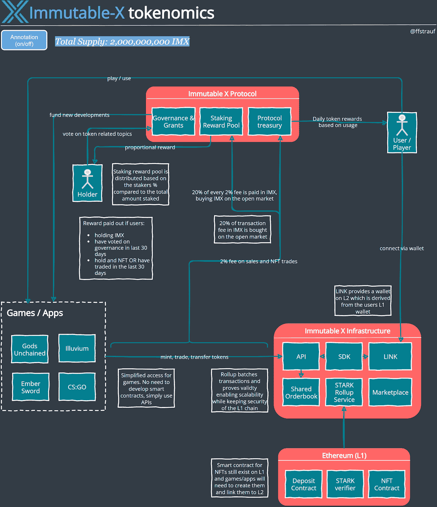

# 令牌组学 101:不可变的 X

> 原文：<https://medium.com/coinmonks/tokenomics-101-immutable-x-1bc3c32d6d7b?source=collection_archive---------0----------------------->

我过去喜欢游戏，可能现在也是，但是现在我不会再去玩游戏了，因为我太沉迷了。玩魔兽世界是关于建立一个角色，并为其配备稀有物品，这些物品必须通过任务、地牢突袭和玩家对玩家比赛来收集。收集到的物品最终会进入角色的物品清单，但是玩家并不真正拥有这些物品。玩家和他的角色在支付游戏订阅的时间内或游戏存在的时间内拥有它们，但除此之外不保留任何东西。这些物品通常不能在游戏之外进行交易，甚至不能以真钱出售。

数字资产所有权有可能改变这一点，让任何玩家拥有游戏中收集和建造的物品。所有权被记录在区块链上，这样做的技术被称为 NFT。不可替换令牌是一个图像、视频或游戏物品的唯一令牌，可以由某人通过钱包拥有。它使用户能够将这些游戏中的数字资产带到游戏之外，潜在地在其他游戏中使用它们，并在市场上进行交易以获得真正的金钱。不可替换意味着令牌彼此之间不可互换(可替换)。如果你把一个不可替换的令牌换成另一个，你不会得到同样的东西。这就像贸易公司。他们每个人都是独一无二的。

这项技术在过去的几个月里被大肆宣传，包括[无聊猿游艇俱乐部](https://boredapeyachtclub.com/#/home)、[秘密朋克](https://www.larvalabs.com/cryptopunks)和 [Axie Infinity](https://axieinfinity.com/) 。NFT 不仅仅是为了数字吹嘘的权利和昂贵的 twitter 个人资料图片。他们可以在所有者之间形成社区，或者在 Axie Infinity 等游戏中找到用途。Axie 是一种具有独特特征的小生物，它们在游戏中互相决斗。Axie 的也可以被繁殖来创造新的独特生物，当然，因为它们是区块链上的 NFT，它们[可以被主人](https://marketplace.axieinfinity.com/)卖掉。

Axie Infinity marketplace

像这样的游戏越来越受欢迎，以太坊很快就达到了极限。Axie Infinity 工作室建立了自己的侧链来支持大量 Axie 的铸造和交易，并降低交易费用，这样用户就可以真正享受玩游戏的乐趣。

但是并不是每个游戏项目都愿意自己构建基础设施，这正是不可变 X 介入的地方。它在以太坊上为 NFTs 构建了第一个第 2 层解决方案，并为游戏做好了准备。[从他们的文档](https://docs.x.immutable.com/docs/getting-started):

> 在网络使用率为 30%的情况下，该网络目前每天支持大约 150，000 笔不可替换的令牌交易。我们的计划是让 Immutable X 支持每天超过 2 亿笔交易，同时消耗不到以太坊 30%的容量。

第二层意味着在第一层之外运行大量的事务，在这里是以太坊区块链，然后在稍后阶段将它们汇总回第一层。这意味着许多交易可以以低交易费用执行，但可以保持主链的安全性。不可变 X 使用 rollups 来实现这一点。

# 第 2 层和 ZK 汇总

下面是一个很棒的视频，概括地解释了汇总，这种技术总结了发生在链外的交易:

Check out this great intro to rollups

[汇总](https://research.paradigm.xyz/rollups)只是一种可能的选择，但已经成为最常见的缩放技术——Vitalik 进入了更多的[细节](https://vitalik.ca/general/2021/01/05/rollup.html)。这是我在 [Tokenomics 101:链间](https://fstrauf.substack.com/p/tokenomics-101-in-between-chains)上发表的文章中的图表:

Rollups bridging from layer 1 to layer 2

第 2 层实现了两方面的优势，第 1 层区块链的安全性和辅助系统的高可伸缩性。

不可变 X 利用零知识汇总或 ZK 汇总。当回滚到第 1 层时，rollup 使用加密技术生成所有事务数据的加密证明。这也称为有效性证明，因为该过程中涉及的数学证明发生在第 2 层的所有事务都是有效的，并且一旦它们被第 1 层区块链接受，它们就像所有其他第 1 层事务一样变得不可变。

与其他汇总技术相比，ZK 汇总需要大量的计算能力，但通过有效性证明，可以立即退回到第 1 层，创建无缝的用户体验。

不可变 X 是由 [Starkware](https://starkware.co/) 使用 [StarkEx](https://docs.starkware.co/starkex-v3/overview) 技术构建的。下图给出了 StarkEx 如何使交易在区块链之外的第 2 层上执行，然后在第 1 层主链上更新和验证([这里有一个很棒的小片段](https://starkware.co/wp-content/uploads/2021/10/StarkEx_v5.mp4)演示了高级流程)。

StarkEx foundation to ZK-Rollups

如果 Starkware 提供了所有这些，那么 immutable 实际上做了什么？

# 不可变 X

Immutable X 根据 NFT 的具体要求调整 StarkEx 技术，允许用户铸造、存放、转移和提取 NFT。此外，该团队通过抽象大部分复杂的智能契约和区块链逻辑，提供了一系列功能，使开发人员的生活变得非常简单。这也是这个项目如此有趣的部分原因。很少有开发者知道如何使用 web3 技术，开发智能合约并构建连接到它们的应用程序，因此一个易于使用的 API 来为游戏项目创建 NFT 可以让任何游戏进入这个新领域。

> 在不可变的 X 上，每一个交互，从铸造到交易到转移，都是通过简单的 API 调用来执行的。不可变 X APIs 包含构建应用程序所需的读和写功能，而无需构建后端，这意味着不可变 X 将区块链的复杂性抽象为后端功能。

最近在 Immutable X 上推出了一堆有趣的项目。

*   [被解放的神](https://godsunchained.com/)是一款流行的卡牌游戏，其中稀有卡牌是由不可变的 NFT 构建的。
*   Illuvium ，一个开放世界 RPG 计划在不可变 x 上推出。
*   各种 NFT 项目包括[抖音巅峰时刻](https://tiktok.immutable.com/)。
*   [余烬之剑](https://embersword.com/)正在构建一个免费的 MMORPG，让玩家和社区能够塑造游戏。
*   游戏联盟 [ESL](https://twitter.com/Immutable/status/1453723476645355520) 与 Immutable X 合作提供 CS:GO NFTs。

# 令牌组学

下图混合了令牌组学和运行服务的高级架构。此处可找到该图的互动版本。

Tokenomics of Immutable X

# 以太坊(第一层)

*   这是该协议使用以太坊上的智能合约来持有将被桥接到第 2 层的资金的地方。该契约映射第 1 层和第 2 层的钱包。
*   用户需要将资金存入第 1 层的合同中，以便在第 2 层的钱包中可以使用这些资金。
*   在汇总之后，验证者将验证从第 2 层接收的证明，以确保正确的网络状态在第 1 层。

# 不可变的 X 基础设施

*   [API](https://docs.x.immutable.com/reference/get_v1-applications-1) s 允许游戏/应用程序创建、传输、刻录或更新 NFTs 的元数据。这个想法是大多数游戏不需要很多 web3 逻辑，所以通过 API 访问这些服务简化了开发。
*   [SDK](https://docs.x.immutable.com/docs/concepts#link) 只是一个利用 API 的 javascript 库。
*   [LINK](https://docs.x.immutable.com/docs/concepts#link) 通过将用户的第 1 层钱包链接到第 2 层钱包，将用户连接到不可变 X。用户可以继续使用他们的第一层以太坊钱包。
*   提交给 Immutable X 的所有订单都可以通过一个共享的订单簿获得，这使得开发人员在构建自己的市场时可以快速起步。不可变的 X 自带了自己的市场实现，NFT 可以在这里交易，并且拥有完整订单簿的未过滤视图。
*   rollup 服务在一棵巨大的 merkle 树中跟踪第 2 层的状态([这里很好地解释了它们是如何工作的](https://media.consensys.net/ever-wonder-how-merkle-trees-work-c2f8b7100ed3))，该树被批量处理以计算其有效性的证明。这是一个计算密集型步骤，但允许以压缩形式在线存储状态。

# 不可变 X 协议

*   该协议将我们带到不可变 x 的令牌组学。该项目带有一个实用令牌，IMX，用于治理、支付协议费用和赌注。它的总供应量为 20 亿英镑。在下图中可以看到分布情况，并将在长达 4.5 年的时间内提供(详情请见[)。](https://www.immutable.com/token)

Token Distribution

*   大型生态系统发展基金的一部分根据用户的使用情况作为每日奖励支付给用户。另一部分被授予支持使用不可变 x 的开发项目。
*   赠款的支付过程涉及一个使用[快照](https://snapshot.org/#/)的投票系统，IMX 令牌持有者可以对赠款提案进行投票。
*   如果代币持有者满足以下标准，他们将获得赌注奖励:
*   在过去的 30 天里对政府进行了投票。
*   持有 NFT 或在过去 30 天内交易过。
*   奖励按照用户下注金额与下注总额的比例支付。

Staking on Immutable X

*   赌注的资金来自销售和 NFT 交易的费用，其中不可变 X 收取 2%。这 2%中的 20%被交易到 IMX，并存入赌注奖励池。IMX 是在公开市场上购买的，以防交易是以 IMX 以外的货币进行的(主要使用 ETH)。
*   2%交易费的 80%部分是不可变 X 协议的主要收入来源。
*   IMX 令牌当然没有其他令牌那么重要，但是它可以被看作是不可变 X 协议的一个值捕获。使用的不可变 X 越多，支付的交易费用就越多。这些费用被部分支付，就像给 IMX 持有者的股息一样。

# 游戏/应用程序

*   游戏和应用程序通过 API 或 SDK 与不可变的 X 交互，给游戏工作室一个简单的方法来将 NFT 添加到他们的游戏中。智能契约需要存在于第 1 层，但是所有的交互都是通过 API 进行的。

# NFT 细节

不可变 X 完全是关于 NFT 的，所以有必要仔细看看它们在协议中是如何工作的。

**第一层和第二层之间的联系:**在不可变 x 上创建 NFT 之前，一个新游戏需要经过[几个步骤](https://docs.x.immutable.com/docs/partner-nft-minting-setup)。这包括为要在第二层上使用的 NFT 创建一个智能合同。然后，智能契约需要在不可变 x 中进行链接。一旦发生这种情况，就可以在第 1 层和第 2 层上创建 NFT，并且可以使用不可变 x 的存款和取款功能在这两层之间进行桥接。

版权费:创作者从每次购买 NFT 中获得固定比例的费用。对于创作者来说，这是一个在作品首次售出后赚钱的好方法。

**元数据:**不直接存储在 NFT 中的 NFT 的具体细节。NFT 有一个描述这些特性的文档的指针( [IPFS](https://ipfs.io/) 只是可以存储这种文档和实际 jpeg 的地方之一)。这张来自 [Opensea](https://docs.opensea.io/docs/metadata-standards) 的精彩图片解释了这个概念:

NFT Metadata

不可变 X 还支持[可变元数据](https://docs.x.immutable.com/docs/concepts#metadata)，它不存储在链上，而是完全由应用程序控制，允许应用程序更好地描述市场的 NFT。

# 结束语

我很喜欢这种发展趋势。创建 NFTs 变得便宜、可扩展，并且容易被任何游戏开发工作室访问，而不需要雇佣整个 web3 开发团队。不可变 X 通过让使用这项技术变得如此容易，打破了入门的壁垒。

除此之外，游戏玩家和用户也要求转向这种新的游戏盈利模式。我简直无法想象游戏不提供游戏内物品作为 NFT，以便玩家可以拥有它们。这是玩家想要的，最终是玩家通过选择他们想玩的游戏来推动新变化的需求。

在这场变革的下一步，游戏公司可能不得不再次反思他们的商业模式。过去几年,“免费玩”是一个巨大的转变，公司免费提供游戏，并从游戏内物品的销售中获得收入。虽然他们将继续销售 NFT，但新的收入流肯定会随之而来。[被解放的神](https://images.godsunchained.com/misc/whitepaper.pdf)计划当 ingame 卡在交易所易手时，他们的大部分收入来自 NFT 皇室。

不可变的 X 作为这一切的基础是一个令人兴奋的基础设施，它让我们离主流 web3 的使用更近了一步。

**对令牌组学合作**和发现新协议感兴趣？加入我们的 [tokenomics 不和谐频道](https://discord.gg/mUvknr2wjw)。

> 加入 Coinmonks [电报频道](https://t.me/coincodecap)和 [Youtube 频道](https://www.youtube.com/c/coinmonks/videos)了解加密交易和投资

## 另外，阅读

*   最佳[加密制图工具](/coinmonks/what-are-the-best-charting-platforms-for-cryptocurrency-trading-85aade584d80) | [最佳加密交易所](/coinmonks/crypto-exchange-dd2f9d6f3769)
*   [比特币基地僵尸工具](/coinmonks/coinbase-bots-ac6359e897f3) | [AscendEX 审查](/coinmonks/ascendex-review-53e829cf75fa) | [OKEx 交易僵尸工具](/coinmonks/okex-trading-bots-234920f61e60)
*   [如何在印度购买比特币？](/coinmonks/buy-bitcoin-in-india-feb50ddfef94) | [瓦济克斯审查](/coinmonks/wazirx-review-5c811b074f5b)
*   [隐翅虫替代品](/coinmonks/cryptohopper-alternatives-d67287b16d27) | [HitBTC 审查](/coinmonks/hitbtc-review-c5143c5d53c2)
*   [折叠 App 审核](https://blog.coincodecap.com/fold-app-review) | [Kucoin 交易机器人](/coinmonks/kucoin-trading-bot-automate-your-trades-8cf0ca2138e0) | [Probit 审核](https://blog.coincodecap.com/probit-review)
*   [如何匿名购买比特币](https://blog.coincodecap.com/buy-bitcoin-anonymously) | [比特币现金钱包](https://blog.coincodecap.com/bitcoin-cash-wallets)
*   [币安 vs FTX](https://blog.coincodecap.com/binance-vs-ftx) | [最佳(SOL)索拉纳钱包](https://blog.coincodecap.com/solana-wallets)
*   [如何在 Uniswap 上交换加密？](https://blog.coincodecap.com/swap-crypto-on-uniswap) | [A-Ads 评论](https://blog.coincodecap.com/a-ads-review)
*   [WazirX vs CoinDCX vs bit bns](/coinmonks/wazirx-vs-coindcx-vs-bitbns-149f4f19a2f1)|[block fi vs coin loan vs Nexo](/coinmonks/blockfi-vs-coinloan-vs-nexo-cb624635230d)
*   [本地比特币评论](/coinmonks/localbitcoins-review-6cc001c6ed56) | [加密货币储蓄账户](https://blog.coincodecap.com/cryptocurrency-savings-accounts)
*   [比特币基地评论](/coinmonks/coinbase-review-6ef4e0f56064) | [德里比特评论](/coinmonks/deribit-review-options-fees-apis-and-testnet-2ca16c4bbdb2) | [FTX 评论](/coinmonks/ftx-crypto-exchange-review-53664ac1198f)
*   [n rave ZERO Review](/coinmonks/ngrave-zero-review-c465cf8307fc)|[phe MEX Review](/coinmonks/phemex-review-4cfba0b49e28)|[PrimeXBT Review](/coinmonks/primexbt-review-88e0815be858)
*   最佳[区块链分析](https://bitquery.io/blog/best-blockchain-analysis-tools-and-software)工具| [赚比特币](/coinmonks/earn-bitcoin-6e8bd3c592d9)
*   [加密套利](/coinmonks/crypto-arbitrage-guide-how-to-make-money-as-a-beginner-62bfe5c868f6)指南| [如何做空比特币](/coinmonks/how-to-short-bitcoin-568a2d0b4ae5)
*   [德国最佳加密交易所](https://blog.coincodecap.com/crypto-exchanges-in-germany) | [Arbitrum:第二层解决方案](https://blog.coincodecap.com/arbitrum)
*   [币安交易机器人](/coinmonks/binance-trading-bots-d0d57bb62c4c) | [OKEx 评论](/coinmonks/okex-review-6b369304110f) | [Atani 评论](https://blog.coincodecap.com/atani-review)
*   [最佳加密交易信号电报](/coinmonks/best-crypto-signals-telegram-5785cdbc4b2b) | [MoonXBT 评论](/coinmonks/moonxbt-review-6e4ab26d037)
*   [如何在 Bitbns 上购买柴犬(SHIB)币？](https://blog.coincodecap.com/buy-shiba-bitbns)
*   [Godex.io 评审](/coinmonks/godex-io-review-7366086519fb) | [邀请评审](/coinmonks/invity-review-70f3030c0502) | [BitForex 评审](https://blog.coincodecap.com/bitforex-review)
*   [MoonXBT vs Bybit vs 币安](https://blog.coincodecap.com/bybit-binance-moonxbt) | [硬件钱包](/coinmonks/hardware-wallets-dfa1211730c6)
*   [火币交易机器人](https://blog.coincodecap.com/huobi-trading-bot) | [如何购买 ADA](https://blog.coincodecap.com/buy-ada-cardano) | [Geco。一次审查](https://blog.coincodecap.com/geco-one-review)
*   [币安 vs 比特邮票](https://blog.coincodecap.com/binance-vs-bitstamp) | [比特熊猫 vs 比特币基地 vs Coinsbit](https://blog.coincodecap.com/bitpanda-coinbase-coinsbit)
*   [如何购买瑞波(XRP)](https://blog.coincodecap.com/buy-ripple-india) | [非洲最好的加密交易所](https://blog.coincodecap.com/crypto-exchange-africa)