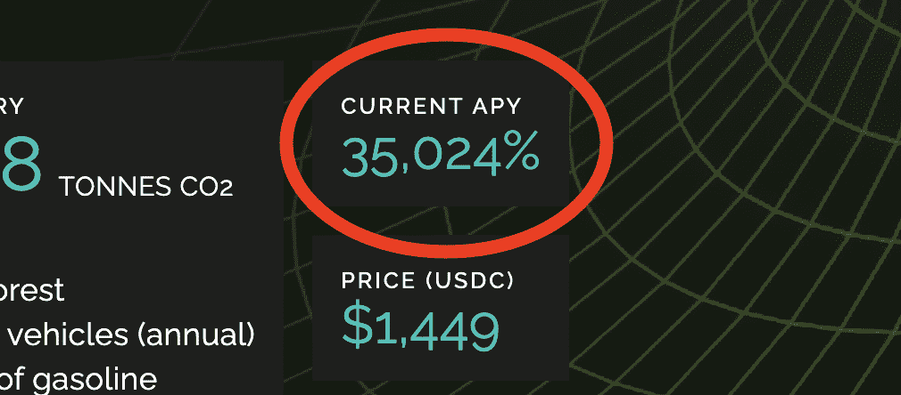
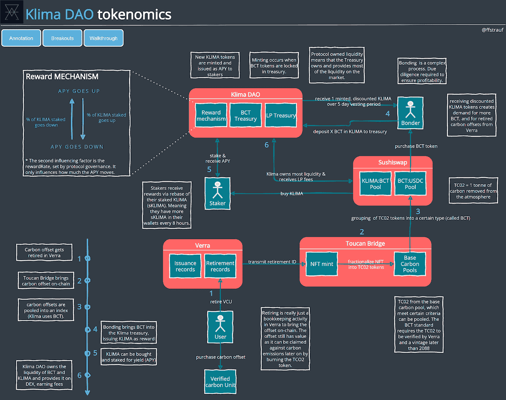
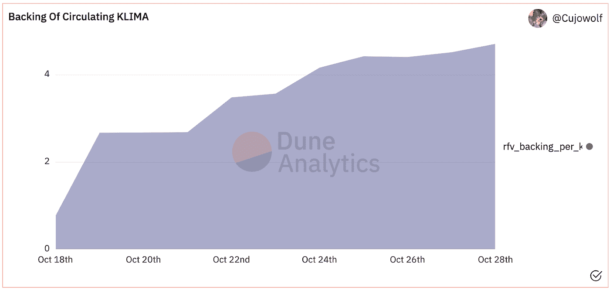
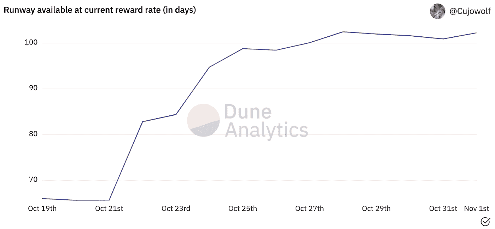
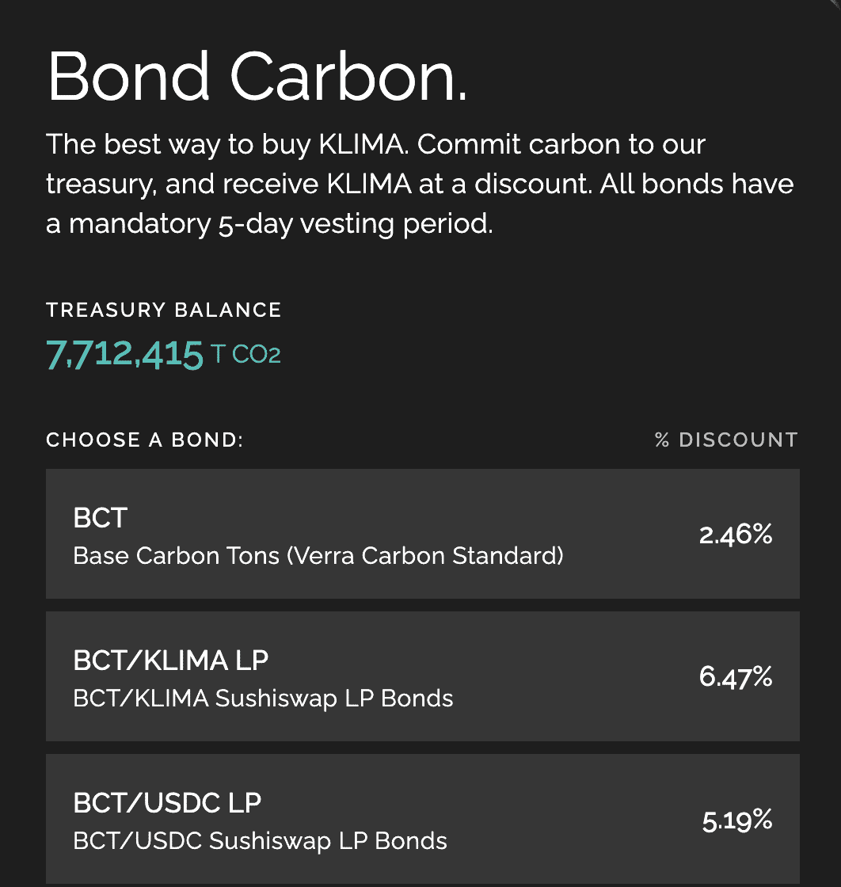
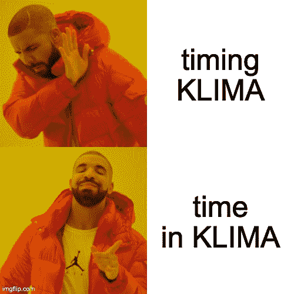
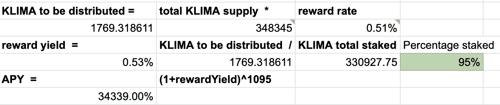
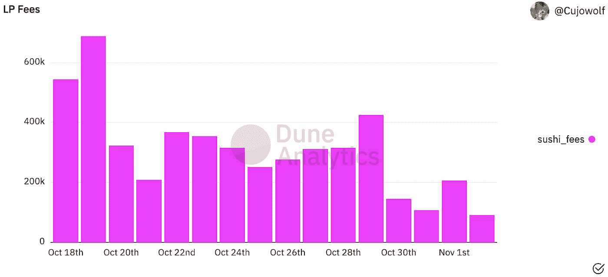

# 词汇学 101:克里玛岛

> 原文：<https://medium.com/coinmonks/tokenomics-101-klima-dao-e8fac497454f?source=collection_archive---------0----------------------->

Big yield and saving the planet?

35024%年收益率？即使在加密中，这也是巨大的。当它听起来好得令人难以置信时，它往往是真的。一个协议是如何实现这一点的，他们能持续多久支付这么大的奖励？在我介绍这个之前，让我们先来看看这个协议的基础。

[Klima DAO](https://www.klimadao.finance/) 是 [Olympus DAO](https://www.olympusdao.finance/) 的一个分支，所以如果你不熟悉 protocol-owned liquidity，我推荐看看这个伟大的 [intro](https://www.loom.com/share/e3910cda194347dd83174d989609de29) 。

Klima DAO 使用了与奥林巴斯类似的概念，但目标不同。

> *克利马道的目标是加速碳资产的价格升值。高昂的碳价格迫使企业和经济体更快地适应气候变化的现实，并让低碳技术和碳去除项目更有利可图。*

这是一个如此有趣的项目，因为它不仅仅是 DeFi，而是与一些有形的东西联系在一起:碳抵消。如果你对碳交易知之甚少，一开始可能很难理解。从本质上来说，Klima DAO 参与了一个碳排放补偿的自愿市场。不污染或捕捉碳(通过植树)的企业可以收集补偿并出售给排放碳的参与者。通过购买碳补偿，并对他们的排放量进行索赔，排放大量碳的公司可以减少他们的排放量(至少在纸面上)。Klima DAO 只是试图通过尽可能多的购买来实现这些补偿。

 [## 克利马岛出价 5 万 APY:克利马岛是骗局吗？CoinCodeCap

### 克利马道提供 50000% APY。KLIMA 是由 Klima DAO 社区创建的一种算法碳支持货币，也…

coincodecap.com](https://coincodecap.com/klimadao-offers-50000-apy-is-klimadao-a-scam) 

这些链上的碳补偿，以代币的形式，还没有被要求，也就是说，它们仍然有价值，因为代币可以被燃烧以要求它对抗排放。这些代币被称为 BCT ( [基础碳吨](https://docs.klimadao.finance/klima-dao-key-terms))，为储备货币克利马提供支持。克利马不盯住任何东西；它的价格是由供求关系决定的。

使克利马岛成为可能的一个关键基础设施是[巨嘴鸟碳桥](https://docs.toucan.earth/protocol/bridge/carbon-bridge):

> "*碳桥允许任何人以象征性的形式将他们的碳补偿带到供应链上。令牌相对于传统偏移有多种优势，包括完全透明性、可编程性、可细分性以及与新兴的 DeFi 生态系统的可组合性。*

碳桥是连接现实世界和 DeFi 的桥梁，并有可能使 DAO 对气候产生影响。Klima DAO 真的是在赌更多的人关心环境。可以肯定的是，越来越多的人会接受增加碳信用需求(和价格)的想法，以迫使企业减少碳排放，而不仅仅是购买和要求补偿。

这种机制很复杂。这张图表给出了全局视图，下面是每个部分的细节。[图的互动版本可以在这里找到](https://tokenomicsdao.com/klimadao/)。

Tokenomics of bringing carbon on-chain and using it to back $KLIMA

# 克利马岛—财政部

*   Klima DAO 是协议的“中心”实体。这是一个通过治理运行的道和决策，并且可以改变 Klima 道的各个方面。
*   克利马刀可以在收到 BCT 支持克利马后铸造新的克利马代币。如下图所示，目前的倒车速度约为每 1 公里 4 BCT:

KLIMA is backed > 4 times by BCT

*   支持被称为[无风险价值](https://docs.klimadao.finance/references/glossary#rfv):这是财政部支持 KLIMA 的金额。每个 KLIMA 持有者都可以将此作为协议运行情况的路标。
*   [一个 KLIMA 令牌由至少一个 BCT 支持](https://docs.klimadao.finance/klima-dao-key-terms#klima-dao-key-terms)。以每公里 2700 美元的价格，需要供应价值 2700 美元的 BCT。按照 BCT 6 美元的价格，这将导致 450 BCT 接收 1 KLIMA。
*   财政部还负责跑道——在国库耗尽之前，按当前比率支付奖励的期限。假设没有额外收入，目前 35K%的 APY 可以在未来 100 天支付。

Current yield can be payed out for > 100 days

*   报酬率可以通过治理进行调整。这引入了一个手动步骤，以确保支持和收入流与支出相匹配，并且财务状况保持稳定。

# 黏结

*   [BCT 通过债券](https://docs.klimadao.finance/klima-dao-key-terms#klima-dao-key-terms)供应给财政部。**债券持有人**将从财政部以市场价的[折扣](https://dapp.klimadao.finance/#/bonds)获得 KLIMA，以提供 BCT。克利马和 BCT 将在 5 天内得到支付，以避免即期套利交易。
*   **克利马刀可以免费铸造新克利马**并获得 BCT 作为交换(这个过程叫做[铸币税](https://www.investopedia.com/terms/s/seigniorage.asp))。然而，债券持有人需要为购买 BCT 买单。这是克利马道的收入流之一。
*   一个类似的收入流是债券 [LP(流动性提供者)代币](https://www.gemini.com/cryptopedia/liquidity-provider-amm-tokens#section-how-lp-tokens-enhanced-de-fi-liquidity)。Klima DAO 对 LP 代币提供折扣，并将其添加到国库中。

Incentivising bonders to bring in new BCT

*   该协议通过押注提供高收益，以激励债券持有人不要出售，而是持有 KLIMA。这减少了总供应量，因为 KLIMA 被锁定在桩柱中。

# 立桩标界

*   克利马道通过奖励赌注者[目前](https://www.klimadao.finance/)35%的 APY 来鼓励克利马的赌注(我们会知道为什么这么高)。这样做的目的很简单。Klima DAO 希望拥有自己的流动性，而不是向流动性提供者[支付农业收益](https://coinmarketcap.com/alexandria/article/what-is-yield-farming)。
*   锁定克利马为财政部提供了流动性。作为回报，用户的钱包里会收到等量的 sKLIMA。
*   如果 KLIMA 持有人可以通过简单地押注 KLIMA 而不是卖出 KLIMA 来获得更好的回报，把握市场时机，他们会这样做。

Time in KLIMA > timing KLIMA

*   赌注奖励通过[重置机制](https://docs.klimadao.finance/klima-dao-ecosystem)支付。该协议根据计算出的奖励率发放新的克利马代币，增加克利马的供应量。
*   然后，根据 KLIMA 供应量的增加，重新设定标桩 KLIMA (sKLIMA)供应量的基数。简单来说，用户钱包里的 sKLIMA 随着时间的推移而增加。
*   通过使用由治理定义的报酬率来计算报酬。APY 的主要驱动因素是持股比例。该协议希望鼓励高比例的 KLIMA 被标桩。为了实现这一点，APY 增加的百分比押克利马下降。更高的 APY 将增加对克立马的需求。一个非常简单的示例计算可以在[这里](https://docs.google.com/spreadsheets/d/1bS_wOTTBYiJ3CTSRZot0Dj6O0yfEuaQF-EjuUn93daE/edit?usp=sharing)找到。

What impacts the APY

*   持有 KLIMA 或 sKLIMA [将允许参与](https://docs.klimadao.finance/faq-klima-mechanics)治理。
*   [@Asfi](https://twitter.com/ishaheen10) 在这里模拟一个拆堆事件[。最终，财政部将能够出售 BCT，以保持 KLIMA 高于其内在价值。](https://twitter.com/ishaheen10/status/1455015382868131841)

# Sushiswap 流动性

*   克利马道拥有其大部分流动性；KLIMA via staking，带 BCT 和 LP 代币的金库。
*   Klima DAOs 的目标是为 BCT 提供一个流动性市场。为了实现这一目标，该协议将其资产作为流动性提供给分散的交易所。这是协议的**收入流**([~ 10 天 400 万](https://dune.xyz/queries/209018/391976)):

Income streams via LP fees

*   目前，在 Sushiswap 上提供了 BCT、克利马和 BCT、USDC 的游泳池。

# 韦尔拉

*   Verra ( [验证碳标](https://verra.org/))本身与 crypto 无关。可以把它想象成碳补偿的登记处。
*   补偿可以被撤销，这意味着它们在一个叫做[撤销](https://docs.toucan.earth/protocol/bridge/carbon-bridge/retire-on-verra)的簿记过程中被锁定在 Verra 平台中。这种机制通常用于在不同系统之间转移碳补偿。
*   然而，取消抵消并不意味着它被要求。这对协议非常重要。无人认领的补偿仍然有价值，因为他们仍然可以对碳排放进行认领。

# 巨嘴桥

*   [巨嘴鸟为即将退役的碳补偿(一批)铸造了一个 NFT](https://docs.toucan.earth/protocol/bridge/carbon-bridge/initialize) 。NFTs 事务哈希用于报废流程，将哈希保存在 Verra 的报废通知中。这连接了 Verra 中的 NFT 在线批次和碳补偿批次。
*   抵消批量 NFT 现在可以通过[细分](https://docs.toucan.earth/protocol/bridge/fractionalize)变成令牌。代表一批 100 个偏移量的 NFT 将产生 100 个 TCO2 令牌。现在，每一个 TCO2 令牌代表 1 吨碳补偿(细节在这里[解释](https://coolerfuture.com/en/blog/co2e))。
*   某些类型的 TCO2 被分组在索引池中。BCT 是 TC02 令牌池，经 Verra 验证，年份晚于 2008 年。

# 那么这 35K%到底从何而来呢？

Klima DAO 的经济是建立在网络增长和为 BCT 供货的参与者数量的基础上的，这就是人们通常对庞氏骗局的描述，但 Klima DAO 不是欺诈性的。协议正在做什么是开放的；智能合同、分析和统计都存在于链上，任何人都可以查看。如果对海滩附近房屋的需求下降，这个市场很可能也会像庞氏骗局一样崩溃。

回答最初的问题，收入流是向市场提供流动性的费用和债券销售的铸币税。只要克利马道[有收入](https://dune.xyz/Cujowolf/Klima-Policy)并达到 1 BCT 兑 1 克利马的目标支持率，就能支付出一个 APY。就像奥林巴斯刀一样，APY 可能会随着时间的推移而降低，但目前 8K% 的[奥林巴斯刀 APY 还是相当不错的。只要对这个项目有需求，它就有可能支持一个健康的 APY。](https://www.olympusdao.finance/)

整个模型是围绕气候变化叙事而构建的。越多的人对支持它感兴趣，对 KLIMA 和 BCT 的需求就会越多。对 BCT 的需求将有助于推高其价格，并影响 Klima DAOs 财政部的支持以及现实世界中的公司产生碳抵消的激励。这是一个拯救地球的赌注，我可以看到很多这样的需求。

# 结束语

这个协议最令人兴奋的一点是，它能够而且将会对现实世界产生影响。对碳抵消需求的增加会提高碳抵消的价格，并使企业捕捉或减少碳变得有价值。

根据 [COP26](https://ukcop26.org/) 的报道，Klima DAO 作为提高碳抵消价格的驱动力之一，已经成为主流新闻:

正如雅各布·格雷伯在《澳大利亚金融评论》的文章中所写的:

> *“…一种名为 KLIMA 的新型碳支持数字货币创造的潜在需求，在过去两周内，该货币吸收和回收了 700 万碳信用额，比必和必拓去年所需的碳信用额多 23 倍。”*

“加密使我们能够在更大的范围内进行协调”是我在无银行播客中听到的，它完美地总结了 Klima DAO 在这里正在做的事情和取得的成就。看到像 Klima 这样的协议解决气候变化等重大实际问题，同时也提供经济回报的机会，是 Web3 技术的一个主要好处，也是我们都希望看到更多的好处。

**有兴趣在记号组学上合作**并发现新协议？加入我们的 [tokenomics discord 频道](https://discord.gg/mUvknr2wjw)。

> 加入 Coinmonks [电报频道](https://t.me/coincodecap)和 [Youtube 频道](https://www.youtube.com/c/coinmonks/videos)了解加密交易和投资

## 也阅读

 [## 最佳加密交易所| 2021 年十大加密货币交易所

### 编辑描述

blog.coincodecap.com](https://blog.coincodecap.com/crypto-exchange)  [## 2021 年最佳加密借贷平台| 6 大比特币借贷平台

### 获得比特币和其他加密货币的最佳贷款利率

medium.com](/coinmonks/top-5-crypto-lending-platforms-in-2020-that-you-need-to-know-a1b675cec3fa)  [## 2021 年最佳免费加密交易机器人

### 2021 年币安、比特币基地、库币和其他密码交易所的最佳密码交易机器人。四进制，位间隙…

medium.com](/coinmonks/crypto-trading-bot-c2ffce8acb2a)  [## 最佳 4 个加密交易信号电报通道

### 这是乏味的找到正确的加密交易信号提供商。因此，在本文中，我们将讨论最好的…

medium.com](/coinmonks/best-crypto-signals-telegram-5785cdbc4b2b)  [## 5 个最佳社交交易平台[2021] | CoinCodeCap

### 编辑描述

blog.coincodecap.com](https://blog.coincodecap.com/best-social-trading-platforms)  [## BlockFi 评论 2021:利弊和利率| CoinCodeCap

### 编辑描述

blog.coincodecap.com](https://blog.coincodecap.com/blockfi-review)  [## 如何在印度购买比特币？2021 年购买比特币的 7 款最佳应用[手机版]

### 如何使用移动应用程序购买比特币印度

medium.com](/coinmonks/buy-bitcoin-in-india-feb50ddfef94)  [## 加密税务软件——五大最佳比特币税务计算器[2021]

### 不管你是刚接触加密还是已经在这个领域呆了一段时间，你都需要交税。

medium.com](/coinmonks/best-crypto-tax-tool-for-my-money-72d4b430816b)  [## 存储比特币的最佳加密硬件钱包[2021] | CoinCodeCap

### 编辑描述

blog.coincodecap.com](https://blog.coincodecap.com/best-hardware-wallet-bitcoin)  [## Pionex 评论 2021 |免费加密交易机器人和交换

### Pionex 是为交易自动化提供工具的后起之秀。Pionex 上提供了 9 个加密交易机器人…

medium.com](/coinmonks/pionex-review-exchange-with-crypto-trading-bot-1e459d0191ea)