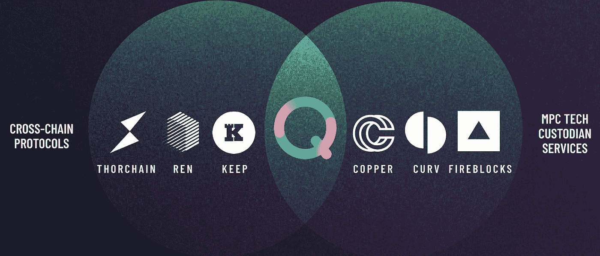

# 令牌组学 101: Qredo

> 原文：<https://medium.com/coinmonks/tokenomics-101-qredo-4757fbac7079?source=collection_archive---------1----------------------->

不是你的钥匙，不是你的硬币，描述了一个事实，如果你不拥有你钱包的私人钥匙，你拥有的硬币也不是你的。这是一个可怕的说法，但这是事实。如果持有你的硬币的私钥的交易所发生了什么事，你可能会失去你的硬币。这对任何人都很重要。没有人想赔钱。

另一边，有一堆故事，人们因为丢了钥匙而拿不到钱包。不仅对个人，而且对持有数十亿美元代币的基金来说，风险都很大。可以理解的是，大型基金希望将这种风险的管理交给像 coinbase 托管这样的中央机构。

**真是进退两难；拿着自己的钥匙，冒着丢失的风险，但不要依赖某个机构，或者把你的资金托管起来，相信某个机构，不要担心钥匙。**

Qredo 试图通过分散监管来解决这个问题(稍后将详细介绍其工作原理)。但要真正与比特币基地这样的中央交易所竞争，Qredo 需要提供的不仅仅是托管选择。机构也想有个兑换代币的地方。

区块链和代币的庞大生态系统使得分散化环境下的基金运营变得复杂。集中交易很容易解决这个问题，因为它持有许多不同的代币，并允许在一个数据库中进行交易，只有在资金撤出时才结算到区块链。

分散操作要复杂得多，但分散托管、合成资产和追踪代币所有权的区块链提供了一种为机构提供交易服务的方式。凭借这一点，Qredo 将自己定位在 Thorchain(一个跨链交易所— [我在这里写过](https://fstrauf.substack.com/p/tokenomics-101-thorchain))和 [Fireblocks](https://www.fireblocks.com/) (一个 MPC 托管服务)之间的某个交叉部分:

Thorchain exchange + Fireblock custody = Qredo

# 奎雷多基础

Qredo 自己的话，“网络是金库”，最好地描述了他们的目标。

The network is the vault

从官方[网站上分解出来的](https://www.qredo.com/)有三个主要组成部分:

**区块链互通。**跨多个区块链交换代币的问题是 Qredo 以类似于集中式交换的方式来解决的。只是分散了。第 2 层股权证明区块链用于记录来自各种第 1 层区块链的令牌的所有权。资产由真实令牌支持的合成版本来表示。BTC 成为 qBTC。这使得 Qredo 用户和 Qredo 做市商之间的代币交易无需在第一层区块链上立即结算。像集中式交换一样，当从交换中提取代币时，用户实际上只将代币放入他自己的钱包中。

这里代币的所有权由奎雷多的区块链担保。第 2 层的术语可能有点混乱，因为它不像以太坊第 2 层，它使用第 1 层区块链的共识。Qredo 有自己的共识机制，所以技术上更像是侧链。

**闪电般的结算。**合成资产是第 1 层拥有的实际资产的镜像版本。要转移合成资产，只需在 Qredo 的第 2 层区块链上进行交易，从而实现更快、更便宜的交易。

**安全分散保管。**为了使机构能够在第 1 层上自保管令牌，通常需要某种多签名安排，其中多个用户拥有签署交易所需的密钥，并且签署交易需要密钥的多数投票(例如，5 个中的 3 个)。这增加了用户丢失密钥的风险。

Qredo 利用多方计算(MPC ),它使用高级加密技术在不同的节点之间分发部分密钥。这意味着没有一方真正拥有完整密钥的所有权。只有所有各方的组合才能使用完整密钥来签署第 1 层资产的交易。

Qredo 将 MPC 与它自己的区块链的共识机制结合起来([阅读这里的细节](https://www.qredo.com/blog/qredos-consensus-driven-mpc?hsCtaTracking=1910b0cb-e453-4709-9724-58347ee6240a%7Cbfdda281-2bad-4aed-9f4a-c72879b8985e))。下图描述了多个用户如何启动比特币等第 1 层资产的交易，以及 MPC 如何执行该交易。

Multi party computation custody logic

1.  用户注册 Qredo 并组成小组，共同管理钱包。每个用户都拥有一个 Qredo 私钥，可以签署 Qredo 交易。
2.  Qredo 第 2 层区块链跟踪钱包的资产所有权。钱包可以容纳不同链的代币。
3.  交易由签署交易的大多数钱包用户发起。
4.  MPC 节点然后验证第 2 层上记录的资产所有权。
5.  MPC 节点联合签署事务以执行第 1 层上的资产转移。

当在第 1 层转移资产时，需要 MPC，从而为流程增加分散的安全性。资产的转移也可以在第 2 层上综合执行，依赖于 Qredo 第 2 层区块链的共识，而无需在第 1 层上解决。

# Qredo token

Tokenomics of Qredo

Qredo 有四个主要用户在令牌组学中发挥作用(还有两个，但目前似乎没有发挥主要作用)。托管用户、交易商、做市商和验证商。图[的互动全屏幕版本可以在这里找到](https://viewer.diagrams.net/?tags=%7B%7D&highlight=0000ff&layers=1&nav=1&title=tokenomics_QREDO.drawio#Uhttps%3A%2F%2Fdrive.google.com%2Fuc%3Fid%3D1V08nG9EhpkXJ618XVQhqVs7cwlK_-nEx%26export%3Ddownload)。

# Qredo 协议

*   Qredo 有代币$QRDO，供应量 20 亿，分配如下:

Supply distribution

*   第一笔 10 亿英镑在两年内发行(部分授予)。第二个 10 亿美元的 QRDO 令牌将在 50 年的运行时间内通过通货膨胀分发给网络用户，以激励网络使用。
*   上述 MPC 概念允许协议安全地保管第 1 层钱包中的资产。在 Qredo 第二层区块链上，资产由合成版本表示，以跟踪谁拥有什么。
*   计划过渡到完全基于 DAO 的治理。道决定通货膨胀的分布。
*   基于 Qredo 平台的工具集允许用户创建账户，与同行联系，为资金创建钱包，并组成管理资金的小组。
*   Qredo 协议一般在层资产中收取费用，并保存在专用的钱包中。一旦积累了足够的金额，协议就向所有做市商发出 RFQ(报价请求),以将层代币交换为 QRDO 代币。$QRDO 令牌的分发方式如下:

Reward distribution to network participants

# 保管用户

*   托管用户是 Qredo 最基本的功能。他们通常将第 1 层资产放在受 MPC 保护的钱包中。钱包可以组合成基金，由多个托管用户管理，以实现额外的保护级别。
*   托管用户以他们持有的第 1 层令牌支付月费。费用总计为 0.75 个基点或 0.0075%，存储在不同的协议钱包中，直到兑换成$QRDO 令牌。
*   为了激励托管用户，protocol inflation 根据托管的资产数量分发新的令牌。
*   Qredo 目前支持 BTC、ETH 和一系列 ERC20 令牌。计划今后支持更多令牌。

# 商人

*   持有代币的用户可以在 Qredo 内进行交易。交易可以通过可信的同行之间或与做市商之间的原子互换来执行。原子交换在这里有点混乱，因为它们不是指正常的第 1 层到第 1 层原子交换，而是一种交换合成资产。
*   交易者支付 0.5 个基点或 0.005%的第 1 层代币费用，并可能获得基于协议膨胀奖励的现金返还。

# 做市商

*   做市商支持交易，提供流动性，并且不支付任何费用。
*   做市商可以对他们可能提供的优质服务收取费用。
*   要成为做市商，需要在钱包中存入最低金额的资产，并需要投入 100 美元的代币。
*   该协议将向所有做市商发行 RFQ，将其从费用中收取的第一层资产转换为美元 QRDO 代币。赢得 RFQ 的做市商将获得交易的 20%的第一层代币。
*   协议膨胀根据做市商的交易量来奖励他们。

# 验证器

*   区块链第 2 层 Qredo 委托的股份证明的验证人需要投入$QRDO，并从 Qredo 收取的费用中获得约 80%的奖励。
*   协议膨胀会在赌注百分比的基础上增加额外的奖励。

# 以用户为中心的令牌组学

Qredo 采用了与大多数第 1 层区块链不同的令牌组学方法，在第 1 层中，只有挖掘者/验证者因参与网络而获得奖励。该协议希望通过通货膨胀奖励来奖励所有用户，从而激励网络参与者。50 年来缓慢而稳定的发行将有助于激励 Qredo 的用户，但也会慢慢引入新的代币，潜在地稀释代币的价格。然而，50 年是一个很长的时间框架，对于其他协议追求的通常更快的新令牌发行来说是一个很好的改变。

除了投机和协议的一般价值获取之外，对令牌的主要需求来自做市商和验证商，他们被要求下注$QRDO。增加平台上的金额使用和采用将增加赌注金额和财政部持有的金额。一旦协议完全去中心化，财政部大概会被用来资助新的开发和改进协议。

# 结束语

跨链交易所和分散托管的交集可能正是机构投资者或 Dao 正在等待的投资。至少是那些关心去中心化的人。MPC 是一个已经存在了一段时间的概念，其他人已经提供了类似的服务，但与记录资产所有权的区块链相结合似乎是独一无二的。

虽然比特币和以太坊是一个良好的开端，但 Qredo 需要支持更多种类的代币，才能真正吸引机构。与交易所合作可能是解决方案的一部分。最近[宣布使用 Qredo 作为 Metamask Institutional 内的托管人](https://consensys.net/blog/press-release/metamask-institutional-announces-the-integration-of-bitgo-qredo-and-cactus-custody/)是一个很好的开端，让用户在访问 DeFi 应用程序的同时进行分散托管。虽然这不会立即增加对新令牌的支持，但 Qredo 正计划建立对更多层链的支持。

这个项目仍然很早，不和谐服务器有点安静，许多功能，如完全去中心化仍在工作，文档可能有点混乱。然而，这是一个具有巨大潜力的项目，我很高兴看到令牌组学如何被更多人采用。

**对在记号组学上合作**和发现新协议感兴趣？加入我们的[外交辞令不和谐频道](https://discord.gg/mUvknr2wjw)。

> 加入 Coinmonks [电报频道](https://t.me/coincodecap)和 [Youtube 频道](https://www.youtube.com/c/coinmonks/videos)了解加密交易和投资

## 另外，阅读

*   [网格交易机器人](https://blog.coincodecap.com/grid-trading) | [Cryptohopper 审查](/coinmonks/cryptohopper-review-a388ff5bae88) | [Bexplus 审查](https://blog.coincodecap.com/bexplus-review)
*   [7 个最佳零费用加密交易平台](https://blog.coincodecap.com/zero-fee-crypto-exchanges)
*   [分散交易所](https://blog.coincodecap.com/what-are-decentralized-exchanges) | [比特 FIP](https://blog.coincodecap.com/bitbns-fip) | [Pionex 评论](https://blog.coincodecap.com/pionex-review-exchange-with-crypto-trading-bot)
*   [用信用卡购买密码的 10 个最佳地点](https://blog.coincodecap.com/buy-crypto-with-credit-card)
*   [最好的卡达诺钱包](https://blog.coincodecap.com/best-cardano-wallets) | [Bingbon 副本交易](https://blog.coincodecap.com/bingbon-copy-trading)
*   [印度最佳 P2P 加密交易所](https://blog.coincodecap.com/p2p-crypto-exchanges-in-india) | [柴犬钱包](https://blog.coincodecap.com/baby-shiba-inu-wallets)
*   [8 大加密附属计划](https://blog.coincodecap.com/crypto-affiliate-programs) | [eToro vs 比特币基地](https://blog.coincodecap.com/etoro-vs-coinbase)
*   [最佳以太坊钱包](https://blog.coincodecap.com/best-ethereum-wallets) | [电报上的加密货币机器人](https://blog.coincodecap.com/telegram-crypto-bots)
*   [交易杠杆代币的最佳交易所](https://blog.coincodecap.com/leveraged-token-exchanges) | [购买 Floki](https://blog.coincodecap.com/buy-floki-inu-token)
*   [3 commas vs . Pionex vs . crypto hopper](https://blog.coincodecap.com/3commas-vs-pionex-vs-cryptohopper)|[Bingbon Review](https://blog.coincodecap.com/bingbon-review)
*   [加密复制交易平台](/coinmonks/top-10-crypto-copy-trading-platforms-for-beginners-d0c37c7d698c) | [如何在 WazirX 上购买比特币](/coinmonks/buy-bitcoin-on-wazirx-2d12b7989af1)
*   [如何购买 Monero](https://blog.coincodecap.com/buy-monero) | [IDEX 评论](https://blog.coincodecap.com/idex-review) | [BitKan 交易机器人](https://blog.coincodecap.com/bitkan-trading-bot)
*   [尤霍德勒 vs 考尼洛 vs 霍德诺特](/coinmonks/youhodler-vs-coinloan-vs-hodlnaut-b1050acde55a) | [Cryptohopper vs 哈斯博特](https://blog.coincodecap.com/cryptohopper-vs-haasbot)
*   [顶级付费加密货币和区块链课程](https://blog.coincodecap.com/blockchain-courses)
*   [MXC 交易所评论](/coinmonks/mxc-exchange-review-3af0ec1cba8c) | [Pionex vs 币安](https://blog.coincodecap.com/pionex-vs-binance) | [Pionex 套利机器人](https://blog.coincodecap.com/pionex-arbitrage-bot)
*   [如何在印度购买比特币？](/coinmonks/buy-bitcoin-in-india-feb50ddfef94) | [瓦济克斯审查](/coinmonks/wazirx-review-5c811b074f5b)
*   [印度加密交易所](/coinmonks/bitcoin-exchange-in-india-7f1fe79715c9) | [比特币储蓄账户](/coinmonks/bitcoin-savings-account-e65b13f92451)
*   [币安费用](/coinmonks/binance-fees-8588ec17965) | [Botcrypto 审查](/coinmonks/botcrypto-review-2021-build-your-own-trading-bot-coincodecap-6b8332d736c7) | [Hotbit 审查](/coinmonks/hotbit-review-cd5bec41dafb)
*   [我的加密副本交易经验](/coinmonks/my-experience-with-crypto-copy-trading-d6feb2ce3ac5) | [AAX 交易所评论](/coinmonks/aax-exchange-review-2021-67c5ea09330c)
*   [Bybit 融资融券交易](/coinmonks/bybit-margin-trading-e5071676244e) | [币安融资融券交易](/coinmonks/binance-margin-trading-c9eb5e9d2116) | [Overbit 审核](/coinmonks/overbit-review-9446ed4f2188)