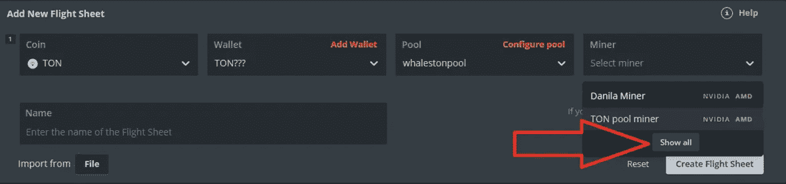
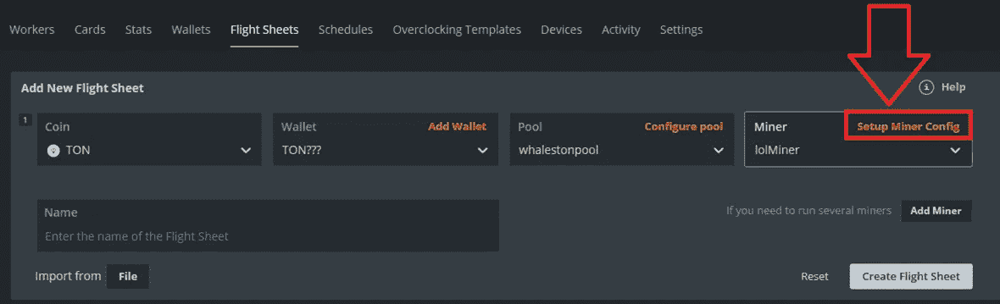
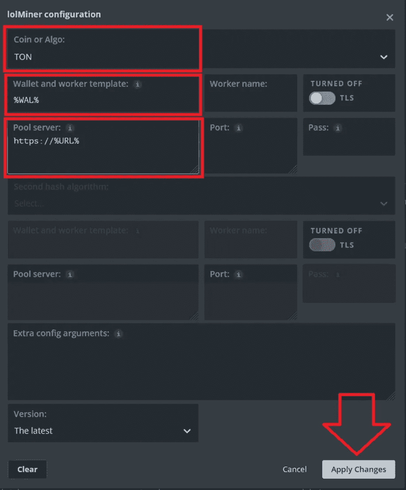
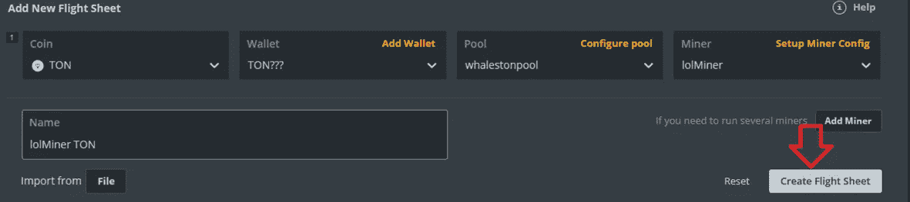
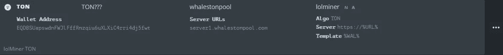
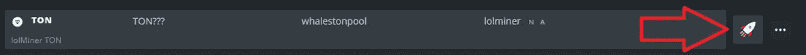
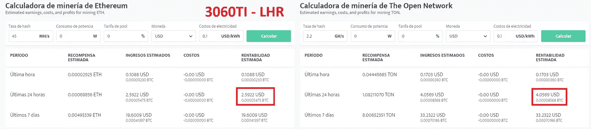

# 用 lolMiner 进行吨采矿

> 原文：<https://medium.com/coinmonks/ton-mining-with-lolminer-de3e92ee2108?source=collection_archive---------2----------------------->

我们将讨论如何获得最大利润与吨对我们的图形处理器特别是在 LHR。目前是所有 LHR GPU 和 NOLHR 最赚钱的硬币。

LolMiner 已发布 1.39 吨硬币开采。我们来看看如何在 HiveOS 中进行配置。

> **首先更新 HIVEOS**

我们已经添加了以 EQ 开头的 TON 钱包…

泳池:记得登录每个泳池的电报机器人，输入你的钱包地址:

Whalestonpool : @WhalesPoolBot

对于 Whalenstonpool，选择服务器 2 和服务器 3。

ton-pool . com:@ next _ ton _ pool _ bot

现在选择全部显示:

选择 lolMiner 并进入设置 Miner 配置

选择 TON

将%WAL%添加到钱包和模板

将 [https://%URL%](https://%25URL%25) 添加到池服务器:

在这里输入一个名字，我们输入 lolMiner TON，然后点击创建飞行表

应该是这样的:

我们现在去装备处点击火箭:

3060TI LHR 利润:

Nvidia OC 建议:

使用内核时钟偏移:

70–250(这将取决于你设置的功率限制和硅彩票)

内存:

-2000 使用负值，不需要内存，这将为内核提供额外的提升

功率限制:

这取决于每个人，但甜蜜的价值观应该是存在的

1060 年至 1660 年

1070–1070 ti-1080–1080 ti:125–205

2060 年至 2080 年

3060–3070/TI:120–180

3080/TI:200–250

3090 : 280–350

> 加入 Coinmonks [电报频道](https://t.me/coincodecap)和 [Youtube 频道](https://www.youtube.com/c/coinmonks/videos)了解加密交易和投资

## 也阅读

 [## 杠杆代币[多头代币]终极指南

### 杠杆化令牌是具有杠杆化风险敞口的 ERC20 令牌，不考虑保证金、要求、管理…

medium.com](/coinmonks/leveraged-token-3f5257808b22)  [## 最佳加密交易所| 2021 年十大加密货币交易所

### 编辑描述

blog.coincodecap.com](https://blog.coincodecap.com/crypto-exchange)  [## 2021 年最佳加密交换平台| CoinCodeCap

### 编辑描述

blog.coincodecap.com](https://blog.coincodecap.com/best-swap-platforms)  [## 2021 年最佳加密借贷平台| 6 大比特币借贷平台

### 获得比特币和其他加密货币的最佳贷款利率

medium.com](/coinmonks/top-5-crypto-lending-platforms-in-2020-that-you-need-to-know-a1b675cec3fa)  [## 2021 年 6 大最佳硬件钱包|顶级加密硬件钱包[更新]

### 最好的加密货币硬件钱包是绝对必要的。我们将在 NGRAVE、Ledger Nano X 和…

medium.com](/coinmonks/the-best-cryptocurrency-hardware-wallets-of-2020-e28b1c124069)  [## 2021 年最佳免费加密交易机器人

### 2021 年币安、比特币基地、库币和其他密码交易所的最佳密码交易机器人。四进制，位间隙…

medium.com](/coinmonks/crypto-trading-bot-c2ffce8acb2a)  [## 最佳 4 个加密交易信号电报通道

### 这是乏味的找到正确的加密交易信号提供商。因此，在本文中，我们将讨论最好的…

medium.com](/coinmonks/best-crypto-signals-telegram-5785cdbc4b2b)