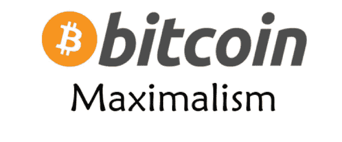

# 有史以来十大比特币最大列表推文

> 原文：<https://medium.com/coinmonks/top-10-bitcoin-maximalist-tweets-of-all-time-8857bc28767c?source=collection_archive---------0----------------------->

我不确定你是否知道:

秘密熊市通常会创造比特币最大化者。

这次熊市也不例外，许多另类投资者现在成为比特币创造者也就不足为奇了。

但情况并非总是如此，因为许多人从一开始就只是比特币的信徒。(自 2009 年 1 月 3 日 Satoshi 创建第一个区块以来)。

我认为这些信徒更敬畏比特币带来的货币方面，而不是技术本身。

甚至，我赞同货币价值的想法，因为技术只是促进实现货币部分，即健全的货币用例。

对于那些不知道 BTC 最大主义是什么的人来说？我应该坚持读完这篇文章，下面是对初学者的解释:

> *据我所知，*“比特币最大主义者是铁杆比特币信徒，他们不相信比特币之外的任何其他加密货币的替代用途，如以太坊、莱特币等。不可否认的原则是，他们不相信任何其他加密货币是值得的。”

好吧，但今天我不会评论这是一个正确还是错误的思想流派，而是想给你呈现由流行的 BTC 最大化主义者在**2018-2019**发布的最好的比特币最大化主义者推文。

让我们转动一下眼球:

# #1 Saifedean Ammous

我名单上的第一位是 Saifedeam AMM ous——这两位经济学教授写了关于比特币(即比特币标准)的最多产的书。

Saifedean 做了一件非常值得称赞的工作，在几百页的篇幅里将货币历史和比特币结合在一起，这是一件很难做到的事情。

阅读他的推文，你肯定可以看出他坚持他在《比特币标准》一书中陈述的信仰

# #2.音调值

Tone Vays 是我所知道的这个领域中最早的比特币最大化者之一。当然，当他开始时，他的观点是不同的，但在这个领域投入大量时间后，他已经成为一个 BTC 最大主义者。

他曾是华尔街的资深交易员，现在围绕#经济学、#金融、#区块链和#比特币领域创作内容。

这就是为什么我很喜欢阅读他的最大化主义推文，我希望你也喜欢:

# #3.Trace Mayer

trace Mayer——比特币的早期采用者和传播者，当比特币还不到一美元时，他就开始推荐 BTC。他还是一名货币学家，也是比特币和最后手段霍德勒的铁杆信徒。

如果你是比特币的粉丝，他的推文也很有信息量和洞察力。

# #4.马克斯·凯瑟

前华尔街资深人士、RT 电视台最受关注的财经报道节目主持人马克斯·凯瑟(Max Keiser)也支持比特币。

Max 在比特币还不到 3 美元的时候就开始使用比特币，从那以后，他为社区做了很多工作来教育人们关于这个主题的知识。

然而，他确实持有其他密码，但他是比特币的铁杆信徒，没有什么能取代 BTC。

# #5.吉米·宋

另一位比特币最大主义者看好比特币，并认为当我们拥有比特币时，我们不需要其他硬币。Jimmy 是这个领域最重要的比特币教育者、开发者和企业家之一。

他的定期推文和短视频也传达了他前瞻性的比特币最大主义心态，背后有合理的推理。

# #6.丹尼斯·帕克

丹尼斯·帕克(Dennis Parker)是另一位比特币信徒，他自称是 permabull 比特币最大主义者。permabull 是指对市场和经济的未来方向始终保持乐观的人，在这种情况下，丹尼斯对比特币牛市在法定货币世界中狂奔很有把握。

# #7.穆拉德·马哈穆多夫

穆拉德·马赫穆多夫是另一位终极比特币狂热主义者。他还是一名加密货币分析师和交易员，他大力宣扬“比特币，而非区块链”的思想。他也是一个思想上的货币经济学家和天使投资者。

我必须补充一点，他对播客和 Twitter 的想法和见解令人大开眼界:

# #8.迈克尔·戈尔茨坦

如果你是比特币和肉食爱好者，你需要关注迈克尔·戈尔茨坦。

有点特别的组合，但这也能满足你对比特币的渴望，因为他是比特币的铁杆信徒和最大化主义者。

他还主持一个比特币播客，并且是比特币教育机构 Nakamoto Institute 的主席。而且他在比特币上的推文也相当翔实:

# #9.弗朗西斯·波利奥特

Francis Pouliot 是一位著名的比特币看涨者，也是加密领域比特币的最大拥护者。他还是加拿大比特币公司 Bull Bitcoin 的首席执行官和联合创始人，该公司不断表达他对加密 Twitter 的及时看法:

# 10.斯蒂芬·利维拉

想向最大化主义者本人学习比特币？

嗯，是的，那么你需要关注斯蒂芬·利维拉，一个受欢迎的比特币播客，他采访了这个领域最优秀和最聪明的人。他还提倡给自己一个财务优势，并学习更多关于比特币的经济和技术。

他的推文是最有见识的:

# 长话短说…

如果你开始你的比特币最大化之旅，这些是你可以看看的 Twitter 加密宝石。

我敢肯定，如果你对比特币感兴趣，你一定有自己的最大化主义者清单。但这是我的清单，尽管我不是最大清单。

这只是因为我相信这个领域将有不止一个赢家，但要实现这一点，比特币必须是这些赢家之一。

不管怎样:

我发现比特币极大主义是一股向善的力量，最终至少会教育人们关于加密货币以及从比特币本身开始的更好的地方。

那都是我送的。让我们继续#学习#建设。

**PS:** 但我还不是比特币狂热分子！！

作者是[金钱贩子](https://themoneymongers.com/)的创始人，也是一个狂热的密码研究者，他可以帮助你以一种清晰的方式穿越这个密码的蛮荒西部。

[**Follow us on twitter**](https://twitter.com/coinmonks)

> [在您的收件箱中直接获得最佳软件交易](https://coincodecap.com/?utm_source=coinmonks)

