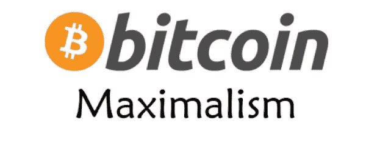

# 有史以来十大比特币最大列表推文

> 原文：<https://medium.com/coinmonks/top-10-bitcoin-maximalist-tweets-of-all-time-9daeb62cc547?source=collection_archive---------0----------------------->

我正在全职研究 [**CryptoFi**](https://cryptofi.co) ，看看吧，请❤️给我一些反馈，如果你遇到任何问题，就给我发[电报](https://t.me/joinchat/FyuZEQ7M7YucH1FY3cVa0A)。

**本周报价-**

> 开始的时候比结束的时候容易抵抗。— **达芬奇**

本周故事👇 👇

## 有史以来十大比特币最大列表推文

秘密熊市通常会创造比特币最大化者。

这次熊市也不例外，许多另类投资者现在成为比特币创造者也就不足为奇了。

但情况并非总是如此，因为许多人从一开始就只是比特币的信徒。(自 2009 年 1 月 3 日 Satoshi 创建第一个区块以来)。

我认为这些信徒更敬畏比特币带来的货币方面，而不是技术本身。

甚至，我赞同货币价值的想法，因为技术只是促进实现货币部分，即健全的货币用例。

对于那些不知道 BTC 最大主义是什么的人来说？我应该坚持读完这篇文章，下面是对初学者的解释:

> *据我所知，*“比特币狂热主义者是比特币的铁杆信徒，他们不相信比特币之外的任何其他加密货币的替代用途，如以太坊、莱特币等。不可否认的原则是，他们不相信任何其他加密货币是值得的。”

好吧，但今天我不会评论这是一个正确还是错误的思想流派，而是想向你展示由受欢迎的 BTC 最大化主义者发布的 2018-2019 年最好的比特币最大化主义者推文。

***。*。…** [***阅读更多***](/coinmonks/top-10-bitcoin-maximalist-tweets-of-all-time-8857bc28767c)

**由**[**sud hir Khatwani**](https://medium.com/u/77151546352?source=post_page-----9daeb62cc547--------------------------------)

> [直接在您的收件箱中获得最佳软件交易](https://coincodecap.com/?utm_source=coinmonks)

## **寿师爷**

[**Komodo 平台**](https://komodoplatform.com/) **—** 一个构建分散技术的开源项目。

[**中性美元**](https://twitter.com/neutral_project)**——**稳定的硬币，本月上线。

给我发微博 [@coinmonks](https://twitter.com/coinmonks) 或者发邮件到 gaurav@coincodecap.com

> “我们是一个非宣传性和非营利性的教育出版物，如果你喜欢阅读《僧侣》，你也可以捐赠给我们”

***暂时就这样吧，送我❤️，下次再说😄***