# 12 个最佳免费交易平台和应用(2023)

> 原文：<https://medium.com/coinmonks/top-10-crypto-copy-trading-platforms-for-beginners-d0c37c7d698c?source=collection_archive---------0----------------------->

## 今天我们将讨论复制交易应用程序，并回顾这些平台...

复制交易、社交交易、镜像交易——大多数时候都是一样的。随便你怎么称呼，但基本概念是你跟随其他交易者。基于它们的特点，本文将讨论加密、外汇和股票市场中最好的复制交易应用和平台。

## 为什么要复制交易？

交易不容易；这是一项需要持续努力的技能。此外，不是每个人都有时间或能力成为优秀的交易者。因此，模仿优秀的交易者要容易得多。

设置激励是为了让你跟随的交易者在你获利时获利。因此，你跟随的交易者是为自己工作的，所以这是一个双赢的局面。

## 为什么复制交易在新手交易者中很受欢迎？

1.  对于希望学习如何独立交易的人来说，模仿有经验的交易者是一种教育工具。
2.  这是进入加密市场最容易也是最有利可图的**——不需要太多专业知识。**
3.  **拷贝交易遵循**同舟共济的原则**:交易者在为拷贝交易时会拿自己的资金冒险。此外，只有当你获利时，他们才会获利。**

> **我们 CoinCodeCap 也是 Bybit 的交易大师。在 Bybit 跟随我们，让我们为你交易。**

# **12 个最佳复制交易平台和复制交易应用**

# **1. [Bybit](https://coincodecap.com/go/bybit)**

**Bybit 是最近推出拷贝交易服务的最大的加密交易所之一。Bybit 复制交易最好的一点是，它不对复制交易收取任何额外费用。**

**[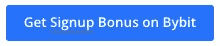](https://coincodecap.com/go/bybit)**

**然而，Bybit 允许高达 100 倍的杠杆，这看起来非常鲁莽。任何交易所都不应该允许拷贝交易的杠杆率超过 10 倍。**

> **我们现在是 Bybit 的[主要交易者，你可以跟着我们去那里。](https://coincodecap.com/go/coincodecap_page)**

## **Bybit:复制交易特征**

*   **只有期货交易可用于复制交易。**
*   **与交易大师分享 10%的利润。换句话说，无论你赚了多少钱，都有 10%将与交易大师分享。**
*   **如果你连续输了 10 个交易者，Bybit 会自动停止复制你账户中的交易。**
*   **Bybit 使用投资回报率、累计利润、最大亏损、跟随者、胜率、总交易量、平均 P&L、平均持仓时间和交易频率来计算主要交易者的业绩。**
*   **建议对主要交易者(主交易者)进行高度限制，以增强追随者的安全性。**
*   **如果交易高手 14 天不交易，他/她就会失去交易高手的身份。**
*   **首席交易员不能持有亏损头寸(亏损 30%)超过 7 天。Bybit 认为这是恶意交易，可以禁止主交易者。**

**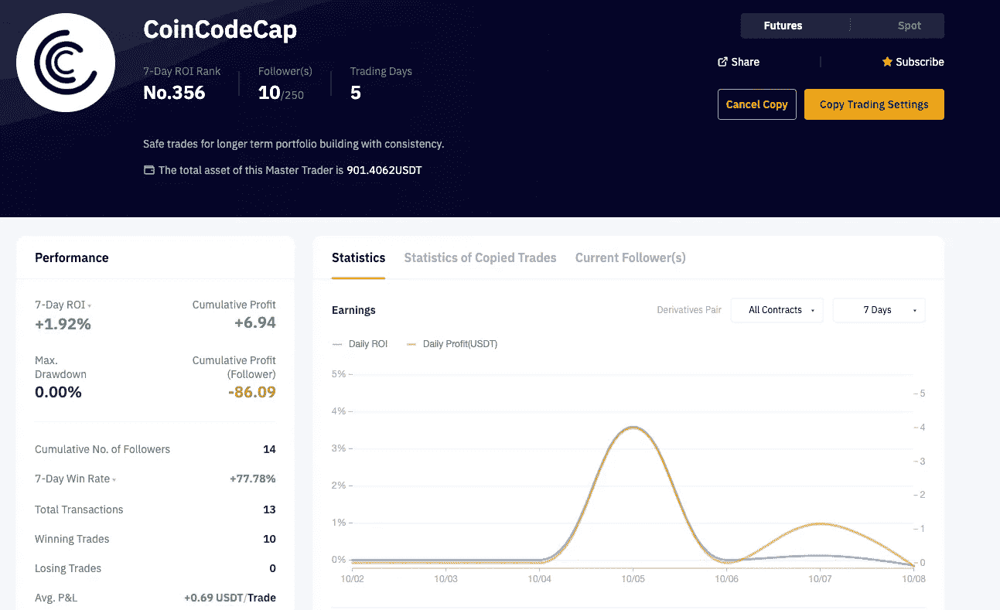**

# **2. [BingX](https://bingx.com/invite/GB5TAS) —交易所+复制交易 App**

**[BingX](https://coincodecap.com/bingx-review) 是一家成立于 2018 年的加密社交交易交易所，提供复制、现货和衍生品交易服务。是一个币安经纪人。所以所有的交易都有交易费(0.04%)。**

**BingX 提供三种类型的复制交易功能。**

*   ****按仓位复制** —复制与主交易者相同的仓位(不是数量而是百分比)。例如，如果股票交易账户有 10K USDT 的净资产，用 20%的资金即 2k USDT，以 3 倍的杠杆买入龙 ETH/USDT，抄底者也会用其 20%的资金(假设 1kUSDT)，即 200 USDT 5X 买入龙 ETH/USDT。**
*   ****按固定边距复印** —您可以在单独边距模式下设置特定的边距量。**
*   ****按现货网格复制—** 主交易者开立网格交易头寸时。复印机将复制相同的配置。**

**此外，该平台还提供最好的外汇复制交易、全球指数、自动复制交易功能、商品和其他合约交易产品。**

****

## **BingX:功能**

*   **也支持非加密市场。**
*   **直接[交易查看](https://coincodecap.com/go/tradingview)整合是大师级交易者的最佳选择。**
*   **它为全世界 100 多个国家提供服务。**
*   **申请大师级交易者时，你需要在过去 3 周内完成以下工作(交易量> 10 万 USDT，赢率> 55%，累计 ROOI > 55%)**
*   **BTC 和 ETH 以及非加密市场的杠杆最大为 20 倍，shitcoins 最大为 10 倍。**
*   **与交易大师分享 8%的利润，每日分享。**
*   **排名是给那些有更好的交易业绩数据和地点。交易性能数据包括利润率，胜率，最大值。提款、账户中的存款/资金等。**
*   **BingX 还能检测出抄袭的交易指令。阅读 [**本**](https://support.bingx.com/hc/en-001/articles/360056989014-Copy-Trading-Terms-Conditions-Trader-Application-Limitation-Profit-Share-Ranking-Rules-and-Prohibition) 了解更多。**

# **3. [BitYard](https://www.bityard.com/?ru=zPe4QC) :最佳文案交易经纪人**

**BitYard 位于新加坡，拥有一个覆盖 150 多个国家的庞大组织，因此它允许其交易员独立于他们的国家进行交易。**

## **BitYard 功能**

*   **为了鼓励他们的用户，BitYard trading 在用户注册账户时提供 258 USDT 邀请奖励。**
*   **它的网站简单易用，为用户提供了快速的交易体验。**
*   **向每一个交易者提出全额退款保证。**
*   **该平台为用户提供了一个模拟账户来试用他们的网站。**
*   **该平台允许交易者享受加密到加密的交易，进一步允许他们购买著名的加密货币。**
*   **通过 [BitYard 保证金交易](https://coincodecap.com/bityard-margin-trading)，你可以在密码上利用高达 125 倍的杠杆，在衍生品上利用大约 200 倍的杠杆。**
*   **查看这篇文章，了解 Bityard 上值得关注的[十大文案交易员。](https://coincodecap.com/copy-traders-on-bityard)**

**[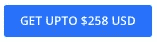](https://www.bityard.com/?ru=zPe4QC)**

## **Bityard 顶级交易员资格**

**Bayard 用下面的标准展示了顶级的复制交易者。**

*   **过去 30 天的总交易量和胜率，胜率是(盈利交易/总交易量)**
*   **当前或过去的关注者总数。**
*   **利润率，即总价格除以**最大**头寸(包括保证金)**
*   **和 P/L 比率，即 30 天的利润率**

## **比特码的利弊**

****优点****

*   **各种复制交易模式可用，因此更好地控制用户。**
*   **有各种各样的硬币可供选择。**
*   **基金是 SAFU，因为它在后台使用像币安这样的大交易所。**
*   **对领导者杠杆高达 20 倍的限制**
*   **各种交易产品都有现货、期货、衍生品，应有尽有。**
*   **每个交易者都有上限**
*   **良好的透明度**

****缺点****

*   **流动性将需要改善。**
*   **在计算顶级副本交易者时，它们应该包括最大的亏损(因为交易者而导致的投资组合的最大损失)。**

# **4. [PrimeXBT](https://coincodecap.com/go/primexbt)**

**PrimeXBT 是领先的比特币交易平台之一。它支持其他加密货币，如以太币、莱特币和 Ripple。没有 KYC，你只需 40 秒就可以设置并开始交易。**

**此外， [PrimeXBT](https://coincodecap.com/go/primexbt) 拥有最好的 UI/UX，提供高达 1000 倍的杠杆作用。它象征性地收取 0.05%的费用。更多关于费用和交易条件的信息可以在[这里](https://primexbt.com/fees)找到。要了解更多关于该平台的信息，也请阅读*我们的* [*PrimeXBT 评论*](/coinmonks/primexbt-review-88e0815be858) *。***

**[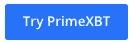](https://coincodecap.com/go/primexbt)**

## **PrimeXBT 功能**

*   ****易于导航:**网站易于导航。复制交易功能位于交易工具菜单中。然而，我们认为把它放在标题菜单上会更好。而且菜单和复印交易页面上的名称也不一样，分别是“**复印交易**”和“**复印交易**”这些改变的名字经常让新交易者感到困惑。**
*   ****杠杆交易:**平台提供 100 倍杠杆交易。你只需存入 1%的交易资金就可以交易。**
*   ****支持的加密货币:**平台支持 17 种加密货币，比 eToro 多一种。**

## **PrimeXBT 费用**

**交易[费用](https://primexbt.com/fees)随着每个交易对和交易特征的不同而显著变化。通常交易的费用是 0.001%，而复制交易的费用是 1%(跟随者费用)。**

## **PrimeXBT 利弊**

**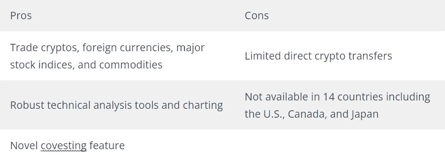**

# **5. [Traderwagon](https://coincodecap.com/go/traderwagon)**

**trader wagon(TW)是最新的副本交易经纪人之一，它在有经验的交易者和新手之间架起了一座桥梁。它是世界上最受欢迎的加密拷贝交易网站之一。它有过多的拷贝交易选项和功能。此外，这是一个联系经验丰富的交易者和新手的平台。用户可以利用 TraderWagon 来识别、跟踪和模仿世界上最好的交易者所做的交易。**

**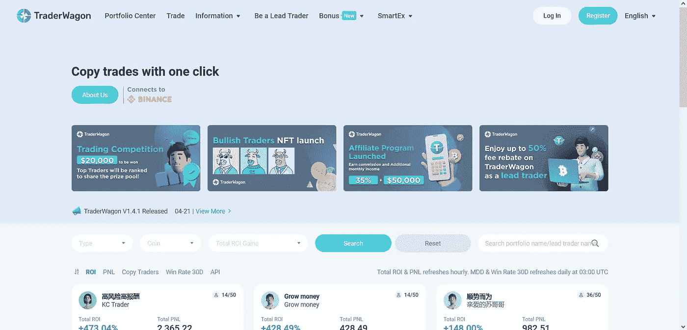**

**Traderwagon**

****优点-** 资金瞬间送到。交易成本保持在低水平。它还提供各种其他服务，比如 Smart，让消费者能够创建自己的交易网站。**

**没有太多的货币可供贸易。投资的最低金额是 100 美元。**

**安全- 安全是他们的头等大事。用户的资金和个人数据总是受到必要的保护。**

## **6.[**Trality**](https://coincodecap.com/go/Trality)**—最先进的加密交易机器人触手可及****

**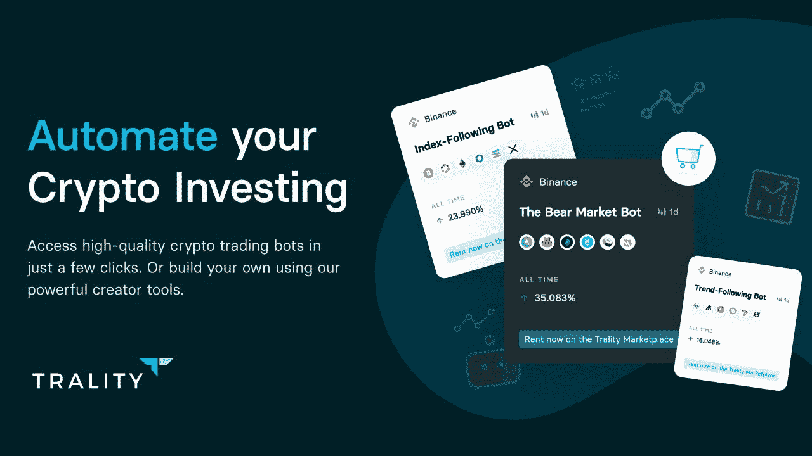**

**Trality 是维也纳的自动化专家，为投资者提供最高质量的加密交易机器人。无论你是高级交易者还是好奇的初学者，现在任何人都可以自动化他们自己的投资策略或由世界上最有经验的量化分析师创建的租赁策略。在 Trality 的两个旗舰功能之间进行选择 Crypto Bot Marketplace 或 Python 代码编辑器。**

**通过将世界一流的 Python 程序员的专业知识与人工智能(AI)的最新发展相结合，Trality 为所有条件提供了一系列超越市场的机器人，使每一位投资者都能在最小化风险的同时实现利润最大化。**

**为了更加方便和灵活，Trality 与币安合作提供了 Trality 钱包，允许用户直接存款(信用卡、银行转账、Apple Pay 或 Google Pay)，并立即开始使用 350 多种密码进行复制交易。**

**现在，Trality 的移动应用程序(iOS 和 Android)让最好的加密交易机器人触手可及。**

****特性****

*   **专为机器人创造者和加密投资者的加密机器人市场**
*   **世界上最先进的 Python bot 创建工具**
*   **保证金交易机器人**
*   **奖金计划(推荐和旅游钱包奖金)**
*   **移动应用程序(iOS 和 Android)**

****定价:**基础入门计划永远免费使用，但交易量仅限€5000。骑士计划每月花费€9.99 英镑，车计划每月花费€39.99 英镑，而女王计划每月花费€59.99 英镑。查看[旅游价格页面](https://www.trality.com/pricing?fpr=coinmonks)了解更多详情。**

# **7. [3Commas](https://3commas.io/?c=coinmonks) -免费复制交易策略**

**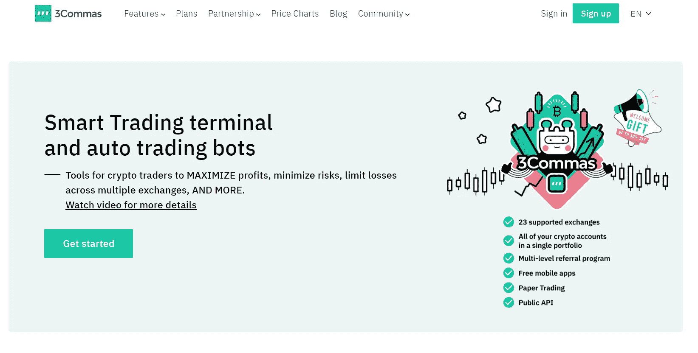**

**3Commas — Free copy trading strategy**

**一个提供复制交易策略的平台。 [**3Commas**](https://3commas.io/?c=tc252152) 提供*比特币机器人和加密交易机器人*以及一个专业交易员向其他平台用户提供交易策略的市场。**

**因此，只需将交易策略复制到你的账户上，加密机器人就会处理剩下的事情，并自动在你的 3commas 账户上下单买入或卖出。**

**3Commas 博客的优势之一是其令人印象深刻的加密交易所列表，在这些交易所上可以进行自动加密交易:*币安，币安美国，币安 DEX，币安新泽西，北海巨妖，Bitfinex，Bitmex，Bitstamp，Bittrex，Bybit，CEX，以太坊钱包，Exmo，Gate.io，比特币基地 Pro，Hitbtc，Huobi，Huobi US，北海巨妖，Kucoin，OKex，Poloniex，Yobit。***

****安全性:**资金不在平台持有；交易机器人不能取款。**

****优点:**支持交易量大；口碑好；出色的用户体验和初学者友好的界面。**

****缺点:**不是所有的交易所都支持自动化交易；没有 TradingView，很难定制机器人，这是一个复杂的初学者工具。**

****定价:** 3 天免费获得 PRO 计划；3 关税:初级(14.50 美元/月)、专业(49.90 美元/月)、高级(24.50 美元/月)。最便宜的计划功能较少。**

**阅读我们的 [**3Commas review**](/coinmonks/3commas-review-an-excellent-crypto-trading-bot-2020-1313a58bec92) 。**

**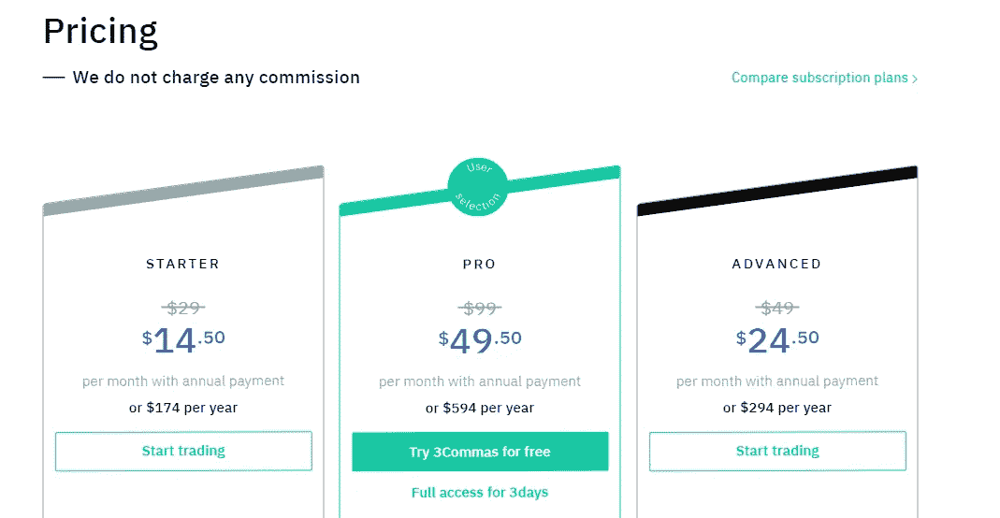**

**3Commas Pricing**

# **8 [MoonXBT](https://www.moonxbt.com/user/register?invite_code=evo42n)**

**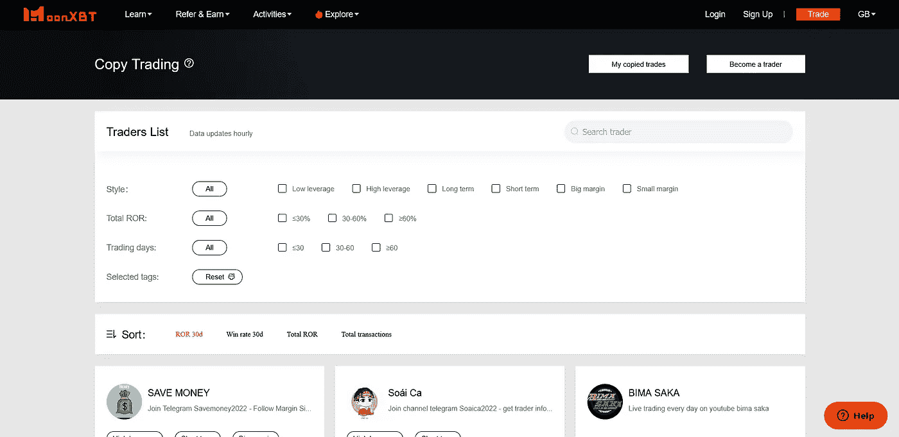**

**MoonXBT**

**于 2021 年首次亮相的 MoonXBT 是一个加密衍生品交易平台，拥有无限的功能和无与伦比的交易。它因其独一无二的轻型交易合同而闻名，该平台可在 200 多个国家使用。它只是在其平台上包含了拷贝交易。这个功能允许用户一步一步地复制经验丰富的优秀交易者。**

****优点-** 保证高流动性。它还具有透明的 k 线价格。高速交易过程。零押金费用。**

****缺点-** 相对较新的平台。加密货币的数量有限。**

****安全性-** MoonXBT 已经实施了技术和组织安全措施，以确保您的个人信息的机密性，并保护您的个人信息不被丢失、滥用、未经授权的更改或破坏。只有 MoonXBT 的授权人员才能访问您的个人信息。**

# **9.[神童](https://wundertrading.com/en/trader/register?ref=wbt8e5404fc)**

****

**Wunderbit**

**[Wunderbit](https://blog.coincodecap.com/go/wunderbit) 是另一款值得一提的高级加密货币社交副本交易软件。在这个地方，加密投资者可以复制经验丰富的加密货币交易商的交易，或者通过创建自动化交易机器人自己进行交易。此外，用户可以使用*智能交易终端*。支持的交易所有 [Wunderbit](https://medium.com/u/683016334952?source=post_page-----d0c37c7d698c--------------------------------) : *币安、币安期货、德里比特、FTX、FTX 美国、拜比特、库科恩、OKEX、HitBTC、北海巨妖。***

****安全性:**由于 API 限制和 2FA，资金是安全的。**

****优点:**大选择交易所；交易者的透明跟踪记录；易用性；2000+以上用户；自有买卖交易所；副本交易+终端+僵尸工具的可用性；第一个月可以免费使用。**

****缺点:**没有好的交易者可以复制；缓慢的客户支持；用户基数小。**

****定价:**利润分享原则(第一个月是免费的，然后你需要每两周分享 30%的利润)，没有每月付款。**

**另外，请阅读我们的[神童评论](/coinmonks/wunderbit-review-a99697c2addc)。**

**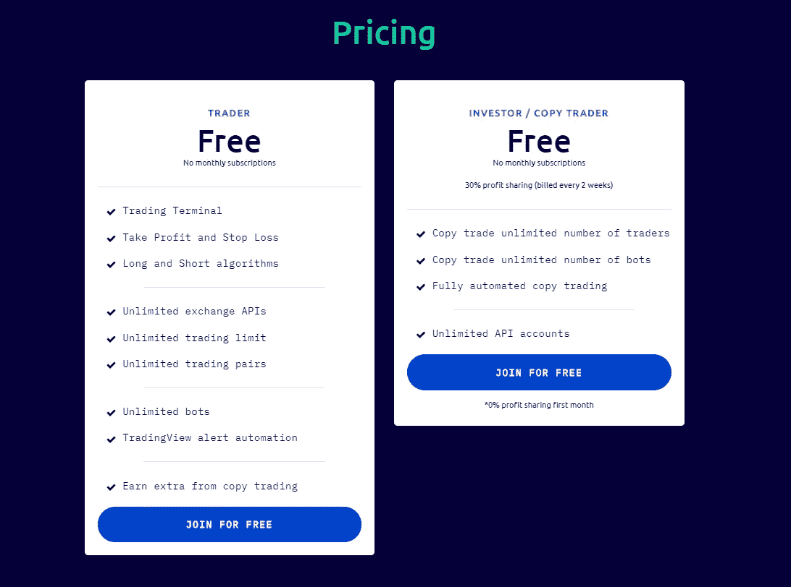**

**Wunderbit Pricing Policy**

# **10. [eToro](https://med.etoro.com/B13049_A94531_TClick_Scopy%20trading.aspx) 复制交易**

**eToro 是外汇和股票市场社交交易的先驱。它拥有市场上最先进的社交交易功能。它可以让你交易外汇、商品、股票和交易所交易基金合约以获取差价。现在它支持超过 16 种加密货币。**

****

**“When they trade, you trade”.**

**eToro 的外汇副本交易是一个令人兴奋的功能。与常规的外汇交易不同，社交投资允许你模仿其他交易者的行为，并调整风险和敞口水平。**

**这样，你就不完全依赖于其他外汇交易商的交易活动，如果你愿意的话，可以减轻损失的风险。此外，这项服务就像一个投资社交网络——交易者可以创建自己的博客。**

**[eToro_Official](https://medium.com/u/3757d1b09194?source=post_page-----d0c37c7d698c--------------------------------) 声称复制交易商的年均利润+29.1%(2019 年复制最多的 50 家交易商)。**

****安全性:** Etoro 是完全受 FCA 和 CySec 监管的**；行业领先的安全协议保护您的资金；未经您的允许，不得私自共享数据。****

******优点:**乐器种类繁多；声誉良好、受监管的公司；交易者维护他们的博客的能力，在那里他们可以与用户交流；副本交易+终端+机器人的可用性。****

****缺点:不活动费，没有加密存款(只有美元)，缓慢的客户支持，对新手来说可能是一个复杂的工具，因为验证过程，许多不专业的交易者，以及提取资金的费用。****

******定价:**只有取款需要支付 5 美元的手续费， [eToro_Official](https://medium.com/u/3757d1b09194) 收取差价。****

> ****阅读 [**eToro 评论**](/coinmonks/etoro-review-78807ddeb33c)****

********

****eToro Pricing for Spreads****

# ****11.[虾米](https://www.shrimpy.io/signup?r=I6VFZ7d2E)****

****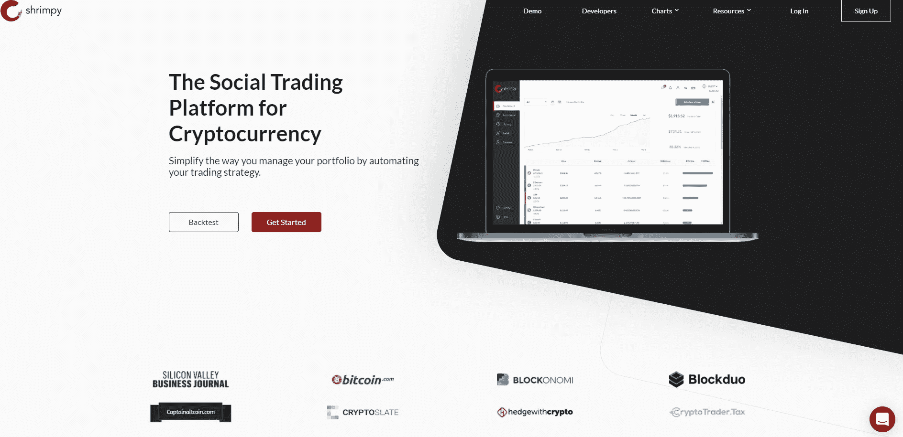****

****SHRIMPY****

****ShrimpyApp 是一个基于云计算的加密交易平台。Shrimpy 允许用户配置*一个加密资产组合*，指定*每个硬币的价值在组合*中的百分比权重，并设置*为* [*在设定的时间段自动重新平衡*](/coinmonks/rebalancing-strategy-for-your-crypto-portfolio-590397f2282b) *。*****

****ShrimpyApp 还有其他功能，比如社交(跟随其他 Shrimpy 交易者的策略)、洞察(深入了解其他 Shrimpy 用户如何管理他们的投资组合)和回溯测试。你会惊讶于 Shrimpy company 支持的众多交易所:*币安、币安美国、BitFinex、Bibox、Bittrex、Bittrex Global、Bitmart、Bitstamp、比特币基地 Pro、Gemini、HitBTC、Huobi Global、北海巨妖、KuCoin、OKEx、Poloniex。*****

******安全性:** API 密钥加密；双因素认证；完全安全的 HTTPS 协议(带 SSL)。****

******优点:**大量支持的交易所(16 个不同的交易所！);自动再平衡；安全措施；一个有益的推荐项目。****

******缺点:**未检出。****

****定价:一个月的会员费。区别:免费的 Hodler 订阅允许用户创建一个投资组合并连接到他们的 exchange 帐户。Professional pack 包含所有 Shrimpy 特性，包括自定义索引生成器、重新平衡、回溯测试、社交交易和洞察。****

****还有，看我们的 [**Shrimpy 评论**](https://coincodecap.com/shrimpy-crypto-trading-bot-review) 。****

****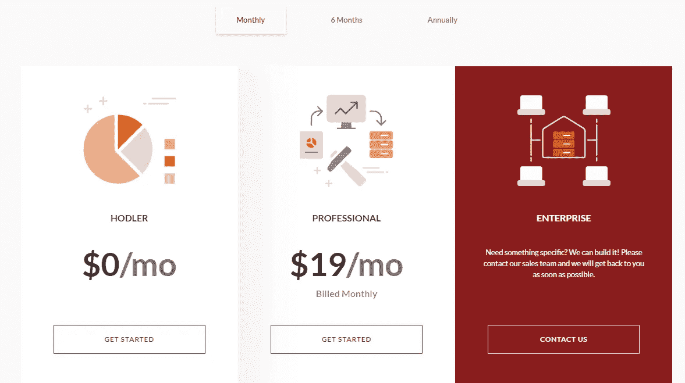****

****Shrimpy Pricing****

# ****12.齐格纳里****

****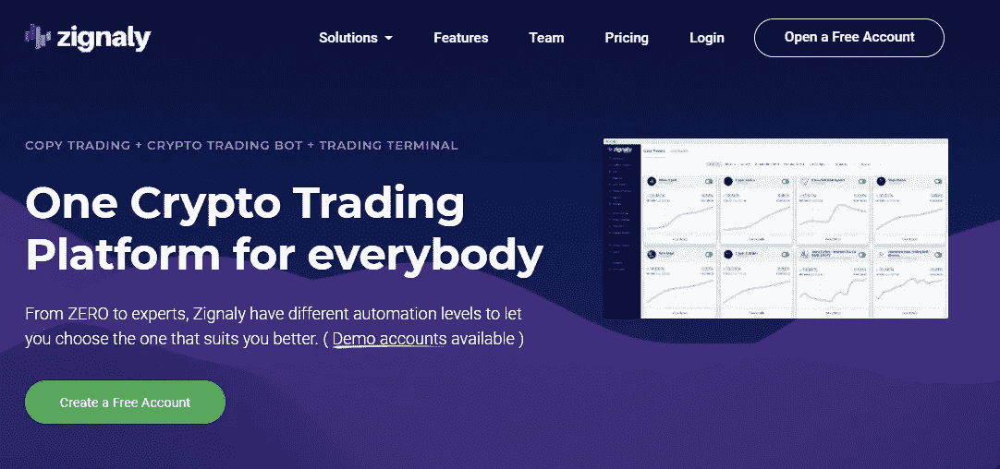****

****ZIGNALY****

****[Zignaly](https://zignaly.com/) 是币安和其他交易所的社交加密副本交易，专门关注加密货币和加密投资者。投资者可以通过 API 密钥连接不同的加密交易所来创建交易组合。币安和库币迷喜欢这项服务。****

*****如何复制交易？*创建一个 Zignaly 账户，用 API 密匙连接你的交易所，并在众多加密货币交易商中进行选择。****

****总而言之， [Zignaly Zignaly](https://medium.com/u/97e79689bf49?source=post_page-----d0c37c7d698c--------------------------------) 是一个复制其他交易者的惊人平台，绝对可以消除像加密货币一样高度波动的市场所产生的压力。****

******安全:******

> ****我们非常重视安全性，并在构建平台时考虑到了这一点。交易指令是代表你在交易所执行的，我们不要求提款权，所以你的资金是 100%安全的。****

******优点:**人性化的界面；交易费用返现；复制交易+终端+机器人的可用性。****

******缺点:**未检出。****

******定价:**使用平台免费；复制交易可以是免费的，但交易者也有每月订阅的价格:5-500 美元；14 天试用期。****

# ****常见问题****

## ****如何选择最好的文案交易 app？****

****选择最适合你的文案交易平台并不容易。你在选择一个文案交易软件的时候需要考虑很多因素。****

****以下是你在复制交易应用中需要检查的一些要点:****

*   ******规定:**您使用的副本交易软件或经纪商必须获得权威机构的许可。****
*   ******安全性**:现在大多数拷贝交易都需要资金存款(除了提供拷贝交易的加密交易所)，所以避免拷贝交易应用程序要求你存款。(除非是交易所)****
*   ******要复制的交易者的素质:**最好的复制交易应用对可以成为领导者的交易者和可以作为复制交易者的交易者有一些标准。比如他们的交易员表现、杠杆历史、风险回报比等。此外，他们不允许复制交易者的杠杆超过 20 倍。****
*   ******透明度:**复制交易应用必须提供你可以复制的交易者的所有细节。所以你可以分析他们的交易策略，了解他们的表现。****
*   ******寻找成功的交易者:**大多数外汇社交交易平台都简化了追踪哪些交易者的投资回报率最高。然而，你应该检查他们是否在投资回报中包括他们的损失？以及他们允许这些交易者使用多少杠杆。****

## ****复制交易合法吗？👮‍♀****

****是的，与复制交易相关的法规与交易相似。然而，这取决于你的管辖权。如果您的经纪人或交易所受到法律当局的监管和授权，并且您所在的司法管辖区允许加密交易，您就不必担心。复制交易在外汇和股票市场也很普遍。有数以百计的外汇复制交易商。****

## ****最好的文案交易平台有哪些？👷****

****以下是最好的复制交易软件列表:****

*   ****👍[位码](https://www.bityard.com/?ru=zPe4QC)****
*   ****👍 [BingX](https://bingx.com/invite/GB5TAS)****
*   ****eToro****
*   ****[CoinCodeCap](https://app.coincodecap.com/) (这是我们自己的服务，用于长期投资组合构建)****

## ****复制交易是如何运作的？🍀****

****你必须明白复制交易是如何运作的。顾名思义，复制交易就是简单地复制交易。你跟踪一个特定的交易者，他们的交易被复制到你的账户里。换句话说，当你跟踪的交易者在他们的账户中开仓时，同样的交易也会在你的账户中开仓。你可以设置手数(交易量)和杠杆。****

****我建议你跟踪的交易者让他们控制手数和杠杆。****

****您必须创建 API 密钥，并连接复制交易软件以提供访问权限。请确保您只提供与交易相关的权限，而不提供撤销权限。****

****如今，密码交易所已经开始提供拷贝交易服务；在这些情况下，您不需要 API 键。****

## ****复制交易能赚钱吗？复制交易有风险吗？💲****

****是的，复制交易有效。然而，你必须非常小心。****

****我有几次没有分析交易者的历史交易就跟踪了他们。你可以阅读[我的副本交易经历](/coinmonks/my-experience-with-crypto-copy-trading-d6feb2ce3ac5)。****

****还有，记住，“高风险，高回报。”因此，如果任何人承诺高回报，就必然会增加风险。****

****如果你是复制交易的新手，你必须记住一些事情。****

*   ****分析你想跟踪的交易者的交易历史。****
*   ****把你的钱分成三份。一小部分用于高风险交易，另一部分用于中等风险交易，以及用于低风险投资组合构建策略的良好头寸；为这些选择不同的交易者。****
*   ****从小处着手，一旦你理解了你所跟随的交易者的交易模式，然后慢慢增加你的投资。****
*   ****避免使用超过 10 倍杠杆的交易者。****
*   ****不要投资；你输不起。****

****对于长期投资组合的构建，你可以遵循我们的内部 c [opy-trade 解决方案](https://app.coincodecap.com/)。****

## ****复制、社交、镜像交易有什么区别？****

****以下是三个交易平台的简要信息和主要区别:****

******社交交易******

****社交交易允许新交易者通过跟随有经验的交易者来学习和投资。这些平台中的大多数都启用了类似社交媒体的功能来实现社区体验。****

****在二元期权社交交易时，你可以和其他交易者交流，分享你的技术分析，评论别人的帖子。****

******复制交易******

****副本交易是一个软件应用程序，主要侧重于实现核心交易功能，而不是侧重于社区体验。****

****它们提供详细的交易者分析，并支持外汇、加密和股票等市场的期货和保证金交易。大多数复制交易平台专注于为他们的策略启用[交易自动化工具](/coinmonks/crypto-trading-bot-c2ffce8acb2a)。****

******镜像交易******

****你可以将顶级交易者的策略和交易方法与镜像交易结合起来。因此，镜像交易提供了更加准确和可预测的 T4 交易信号。他们是想了解所有外汇交易的投资者的完美选择。****

## ****eToro 有哪些优秀的交易者值得效仿？🚀****

*   ****杰佩·柯克·邦德(etoro . com/people/jeppekirkbonde):****
*   ****奥利维尔·丹维尔(etoro.com/people/olivierdanvel):仅交易外汇，自 2017 年 1 月以来仅交易绿色月份。他的目标是每月 1%，到目前为止相当稳定****
*   ****Mariano Pardo(etoro.com/people/marianopardo):连续 5 年获得正回报(5 年中有 4 年超过 25%)****
*   ****balance am(etoro.com/people/balanceam):低风险得分(3)，2019 年非常好。最近似乎变得很流行****
*   ****LIBOR Vasa(etoro.com/people/liborvasa):自 2014 年以来的年度正回报****

## ****最佳文案交易软件:结论****

****随着时间的推移，社交交易在希望开始产生被动加密收入的加密投资者中越来越受欢迎。****

****对于刚开始交易的新手来说，复制交易看起来很有吸引力。一切都是自动的。交易在后台进行，买卖订单全天候运行。****

****同样的道理也适用于专业交易者。如果你只是没有时间看图表，让别人帮你交易并模仿他们的做法是有意义的。****

****也就是说，我们建议你永远不要停止学习自己，不要盲目跟随交易者。这样，你不需要相信任何人，你会学到一些没人能从你身上拿走的东西。****

****如果你觉得这篇文章有帮助，请分享。让我们鼓励更多的人投资密码市场。区块链是未来。****

****What is copy trading****

# ****折扣和优惠券代码🔥****

> *****在*[***BingX***](https://bingx.com/invite/GB5TAS)*上创建一个副本交易账户，并获得 UPTO 100 美元签约奖金。*****
> 
> *****在***[*【比特币基地】*](https://coinbase-consumer.sjv.io/VLeLj) *上注册，并获得交易费用折扣。*******
> 
> ******如果你想找一个**的免费交易机器人，试试 [**Poinex**](https://www.pionex.com/offers/#/grid-4?r=BI2UEarX) ，它们只收取交易费，不按月固定定价。也试试 *Pionex* [**杠杆代币**](/coinmonks/leveraged-token-3f5257808b22) *少花钱多赚。*********
> 
> ******检查 [**Bityard**](https://www.bityard.com/?ru=zPe4QC) ，一个带有复制交易的交易所。******
> 
> ******报名参加**[**FTX**](/coinmonks/ftx-crypto-exchange-review-53664ac1198f)[**deri bit**](/coinmonks/deribit-review-options-fees-apis-and-testnet-2ca16c4bbdb2)[**Bybit**](/coinmonks/bybit-exchange-review-dbd570019b71)和 [**PrimeXBT**](/coinmonks/primexbt-review-88e0815be858) 等 [**最佳密码交易所**](/coinmonks/crypto-exchange-dd2f9d6f3769) 并获得交易费用优惠。********
> 
> *******对于印度来说，加密社区检查* [*最好的印度加密交易所*](/coinmonks/bitcoin-exchange-in-india-7f1fe79715c9) *和* [*应用程序在印度购买比特币*](/coinmonks/buy-bitcoin-in-india-feb50ddfef94) *。*******
> 
> *******使用* [*最佳加密税务软件*](/coinmonks/best-crypto-tax-tool-for-my-money-72d4b430816b) *支付您的加密税款，使用* [*最佳加密硬件钱包*](/coinmonks/the-best-cryptocurrency-hardware-wallets-of-2020-e28b1c124069) *保护您的加密。*******

## ******另外，阅读******

****** [## 加密交易机器人——20 个最好的免费加密交易机器人

### 2022 年币安、比特币基地、库币和其他密码交易所的最佳密码交易机器人。Pionex，Bitsgap…

medium.com](/coinmonks/crypto-trading-bot-c2ffce8acb2a)  [## 最佳加密交易所| 2022 年十大加密货币交易所

### 哪一个是最好的加密交换？在本文中，我们将根据多种加密货币列出 10 大加密货币交易所

medium.com](/coinmonks/crypto-exchange-dd2f9d6f3769)  [## 11 个 2022 年最佳加密税务软件—回顾与比较

### 不管你是刚接触加密还是已经在这个领域呆了一段时间，你都需要交税。

medium.com](/coinmonks/best-crypto-tax-tool-for-my-money-72d4b430816b)  [## 10 大最佳加密贷款平台 2022 | CoinCodeCap

### 当谈到加密货币贷款时，大量因素等同于良好的收入状况。此外，借款的一部分…

coincodecap.com](https://coincodecap.com/crypto-lending)  [## 8 大最佳硬件钱包|顶级加密硬件钱包

### 保管您的数字资产很容易，但找到正确的存储方式却是一项繁琐的任务。在线钱包有一个风险…

medium.com](/coinmonks/hardware-wallets-dfa1211730c6)  [## 2022 年最佳加密借贷平台| 6 大比特币借贷平台

### 获得比特币和其他加密货币的最佳贷款利率

medium.com](/coinmonks/top-5-crypto-lending-platforms-in-2020-that-you-need-to-know-a1b675cec3fa) 

More isn’t always better (this rule shouldn’t be applied to copy-trading ROI).******