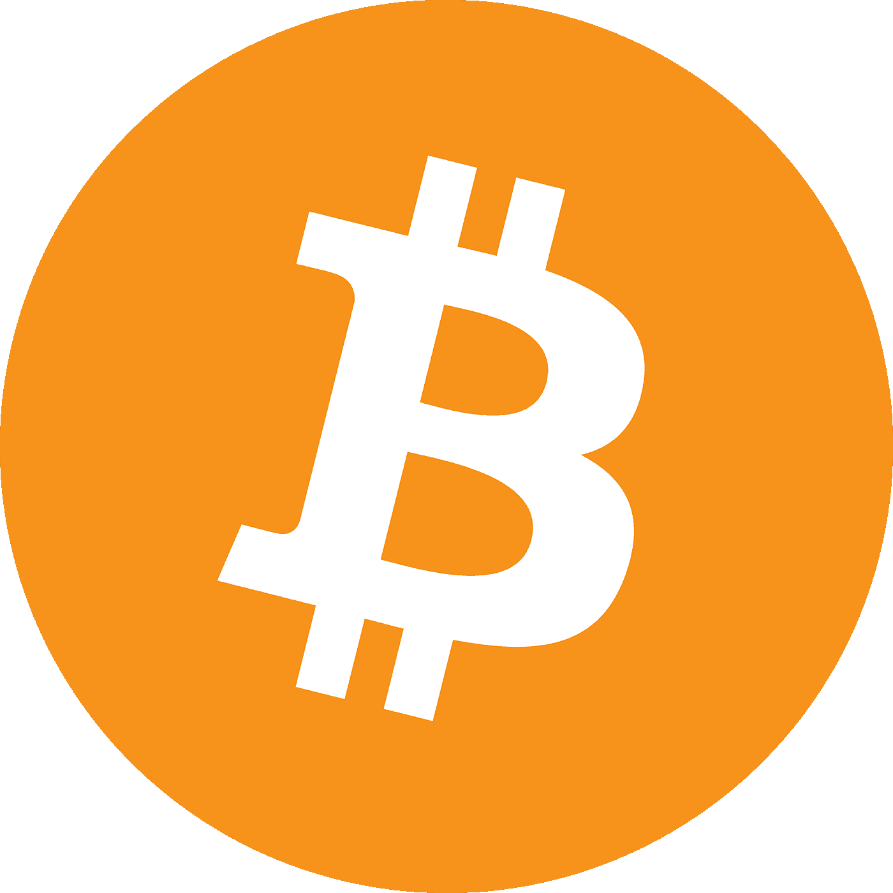
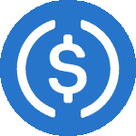

# 十大加密货币:简介

> 原文：<https://medium.com/coinmonks/top-10-cryptocurrencies-a-brief-intro-59392e425d28?source=collection_archive---------9----------------------->

如果你是加密新手，或者你只是想更新一下关于 10 大加密货币的知识，这篇文章是为你准备的。由于特色列表不断变化，它提供了加密市场当前状态的准确描述。以下是截至 2021 年 11 月初的 10 大密码:

*   **比特币** —有史以来第一种从未放弃领先地位的加密货币。
*   **以太坊、币安币和索拉纳** —三个分散的计算环境，为分散的金融和其他加密经济领域提供动力。
*   **Tether 和 USD Coin**——stable coins，与美元挂钩的加密货币，每种价格约为 1 美元，由寻求保持抗波动稳定性的投资者选择。
*   **Cardano 和 Polkadot** —由前以太坊联合创始人构建的平台，用于推进区块链的用例。
*   **Ripple**——一个为银行提供跨境支付便利的系统。
*   **doge coin**——一种迷因加密货币，不仅仅是一个笑话。

让我们仔细看看每一个。

# 1.比特币(BTC)

价格:65078 美元

**市值:1.22 万亿美元**

比特币于 2009 年由一位匿名程序员(或一群程序员)中本聪推出，至今仍不为人知。开发商旨在引入一种全新的货币概念:电子点对点现金，人们将真正拥有它，而不是普通的法定货币。

按照 Nakamoto 的设想，加密货币将成为一种不受任何银行或政府控制的货币形式，因此没有人能够暂停交易或冻结钱包。他通过在区块链上建立加密货币来实现这一目标，这是一个分散的数据库和价值交换协议，由全球数千个节点运行，没有一个节点可以完全控制网络。

除了这种系统的不变性、透明性和安全性之外，还有一个更重要的概念。这是比特币的稀缺性:该协议称，将永远不会存在超过 2100 万 BTC。通过这一规则，中本聪希望保护加密货币免受通货膨胀的影响——虽然政府可以随心所欲地印刷数万亿美元，但没有人可以“印刷”额外的比特币:新的硬币是根据一个众所周知的预设规则开采的。这使得该体系比国民经济更具可预测性。

如今，比特币的主要使用案例包括长期投资(HODLing)、交易以及在线支付商品和服务。

# 2.以太坊

**价格:4728 美元**

市值:5580 亿美元

第二大加密货币以太坊是由俄罗斯-加拿大程序员 Vitalik Buterin 在 2015 年推出的。他意识到，比特币的功能可以通过引入智能合约得到极大扩展:用代码编写的自动执行合约，可以推动此前互不相识的各方之间建立不信任的经济关系。在他的提议被拒绝后，Vitalik 决定推出自己的平台——以太坊。

在这个网络中，开发者和企业家可以运行分散的应用程序——看起来像普通的应用程序，但它们的后端运行在区块链上。这些应用程序拥有基于其本地令牌的内部经济；以太坊的主要加密货币 ETH 为这个区块链上的所有交易提供燃料。

在这种去中心化的应用中，有借贷服务，使 DeFi 经济(MakerDAO，Compound)，基于以太坊的令牌的去中心化交易所(Uniswap)，游戏(Axie Infinity，decoupled land)和 NFT 市场(Opensea，Rarible)。

对开发者的开放、良好的去中心化和清晰的路线图帮助以太坊获得了成千上万加密用户的信任。它目前向以太坊 2.0 的过渡将使网络更快、更便宜、效率提高几十倍。

# 3.币安硬币(BNB)

**价格:625 美元**

**市值:1043 亿美元**

币安币为庞大的币安生态系统提供燃料，包括世界上最大的加密货币交易所之一，用于构建去中心化应用的公共区块链(币安智能链——BSC)，另一个区块链(币安链)，以及十几个其他产品。币安因其友好的用户界面、对新项目的开放性和低廉的费用吸引了数百万用户。

币安硬币(BNB)允许用户支付币安交易所和 BSC 的所有交易和交易。随着这些服务的兴起，BNB 也跃升至十大加密货币排行榜的首位。

# 4.卡尔达诺

**价格:2.08 美元**

市值:692 亿美元

以太坊联合创始人查尔斯·霍斯金森(Charles Hoskinson)在 2015 年任职该公司期间指出了第二大加密货币的一些关键缺陷:它运行在低效的工作共识证明上，容易受到安全攻击和集中化风险，吞吐量低，费用结构不可预测。

因此，Cardano 诞生了:一种加密货币，其区块链的安全性将得到科学证明，其中利益证明系统将允许低费用和高可扩展性。

卡尔达诺拥有一个强大的路线图，在 2021 年，硬币暴涨，因为它已经实现了其计划的几个强大的里程碑。该网络丰富了智能合约功能，可以运行 dApps、推出新令牌和制造 NFT。卡尔达诺的热情社区支持快速硬币的增长。

# 5.茄属植物

**价格:238.05 美元**

**市值:723 亿美元**

Solana 有点类似于以太坊和 Cardano——它也是一个运行 dApps 的网络，试图成为诸如 DeFi 等加密经济发展部门的家园。Solana 的杀手锏是，它建立在 PoS 协议上，与竞争对手相比，该协议显示出出色的数字，每秒至少提供[2000](https://explorer.solana.com/)笔交易(不像以太坊的 15-20 笔和卡尔达诺的约 250 笔)，费用不到 1 美元，阻塞时间高达 400 毫秒。

Solana 于 2020 年推出，2021 年起价 1.79 美元，一路飙升至 215 美元，这意味着今年迄今为止它已经赚了 126 倍。随着 Solana 将 10 亿用户带入 crypto 的野心，这个数字可能会增长更多。

# 6.系绳(USDT)

**价格:1.00 美元**

市值:738 亿美元

假设你在交易比特币。在它的价值显著增长后，你想获利并卖掉你的 BTC——但是为了什么资产呢？其他加密货币也不稳定，如果没有稳定的货币，你永远也不会亏钱。

像 Tether 这样的 Stablecoins 解决了这个问题。这种资产的价格与美元挂钩，这意味着 1 系绳(USDT)的成本总是 1 美元。这个令牌存在于以太坊，币安智能链，创，和其他区块链。每当你觉得你想留在你在交易中的价值，你可以把你的加密货币换成系绳。交易员这样做既是为了锁定利润，也是为了防止投资组合在某项资产暴跌时贬值。

# 7.涟漪(XRP)

**价格:1.21 美元**

市值:569 亿美元

Ripple 不是一种典型的加密货币，它直接与银行合作，有些人甚至认为这违反了加密货币的理念。然而，到目前为止，XRP 已经进入前 10 名相当长一段时间了，这证明了它的价值。Ripple 支持跨境法定支付，允许银行摆脱多个中介，减少电汇时间，并降低费用。

XRP 在 2021 年增长了五倍，这是一个很好的结果，尽管与其他一些加密货币相比，它可能看起来不那么辉煌。Ripple 增长的限制之一可能是其与 SEC 之间持续的法律诉讼。这是许多人认为人民币被低估的原因之一。如果这个问题得到解决，我们可能会看到 XRP 的进一步发展。

# 8.波尔卡多(点)

**价格:47.8 美元**

**市值:472 亿美元**

Polkadot 专注于区块链互操作性:构建 Web 3.0 的中心话题，赢得了当今密码爱好者的心。其核心思想是联合不同的区块链:例如，比特币和以太坊网络仍然不能交换价值和数据，而使这种跨链互换成为可能将为加密货币的采用提供另一个激励。

Polkadot 还有另一个重要的用例:企业可以使用该平台构建可定制的区块链，通过 Polkadot mainnet 进行互操作。这是互操作性的一个方面，被视为加密的未来。这个话题的相关性得到了网络价格动态的支持:在过去的 10 个月里，硬币已经上涨了 6 倍多。

# 9.Dogecoin (DOGE)

**价格:0.26 美元**

市值:350 亿美元

Dogecoin 是当今流行的一大批 doge meme 硬币中的第一个。只是作为一个笑话推出的，并没有追求进入前 10 的目标。虽然“一美元一只狗”的口号对许多人来说更像是一个笑话，但它似乎不再是不切实际的了。

DOGE 是 Litecoin 的一个分支，所以这些硬币在某种程度上是相似的:Dogecoin 在 PoW consensus 上工作，其阻塞时间约为 1 分钟，费用不到 1 美元。令人难以置信的热情的 DOGE 社区推动了它的发展，但直到今天，硬币仍然是一个相当不稳定和相当高风险的投资。

# 10.美元硬币(USDC)

**价格:1 美元**

**市值:344 亿美元**

如果有系绳，为什么还要有另一个稳定币？USDT 被密码爱好者广泛使用，但是它有一个严重的缺点:它缺乏透明度。审计不够频繁，有人怀疑 USDT 代币是否真的像声明的那样与来自菲亚特世界的资产是 1:1 的比例。

同时，美元硬币是一种稳定的硬币，透明度更高。它完全由美元 1:1 支持，均富 LLP 会计事务所在其月度审计中证实了这一点。以太坊不是 USDC 经营的唯一连锁店:Stellar 和 Solana 也有代币。

# 一锤定音

这是市值最大的 10 种加密货币。虽然这份名单上有价值数百亿、数千亿美元的项目，但几乎每个月都在不断变化。请随时关注我们对顶级硬币的最新评论，并了解与 [Solana](/coinmonks/whats-the-deal-with-solana-a-guide-into-the-skyrocketing-cryptocurrency-5f5dbaf68d94) 的交易或 [Polkadot](https://changenow-io.medium.com/is-polkadot-the-future-of-a-decentralized-internet-71e81266abfe) 如何革新区块链互操作性。

> 加入 Coinmonks [电报频道](https://t.me/coincodecap)和 [Youtube 频道](https://www.youtube.com/c/coinmonks/videos)了解加密交易和投资

## 也阅读

 [## 最佳加密交易所| 2021 年十大加密货币交易所

### 编辑描述

blog.coincodecap.com](https://blog.coincodecap.com/crypto-exchange)  [## 2021 年 10 大最佳加密贷款平台| CoinCodeCap

### 编辑描述

blog.coincodecap.com](https://blog.coincodecap.com/crypto-lending)  [## 2021 年最佳免费加密交易机器人

### 2021 年币安、比特币基地、库币和其他密码交易所的最佳密码交易机器人。四进制，位间隙…

medium.com](/coinmonks/crypto-trading-bot-c2ffce8acb2a)  [## 最佳 4 个加密交易信号电报通道

### 这是乏味的找到正确的加密交易信号提供商。因此，在本文中，我们将讨论最好的…

medium.com](/coinmonks/best-crypto-signals-telegram-5785cdbc4b2b)  [## BlockFi 评论 2021:利弊和利率| CoinCodeCap

### 编辑描述

blog.coincodecap.com](https://blog.coincodecap.com/blockfi-review)  [## 如何在印度购买比特币？2021 年购买比特币的 7 款最佳应用[手机版]

### 如何使用移动应用程序购买比特币印度

medium.com](/coinmonks/buy-bitcoin-in-india-feb50ddfef94)  [## 加密税务软件——五大最佳比特币税务计算器[2021]

### 不管你是刚接触加密还是已经在这个领域呆了一段时间，你都需要交税。

medium.com](/coinmonks/best-crypto-tax-tool-for-my-money-72d4b430816b)  [## 存储比特币的最佳加密硬件钱包[2021] | CoinCodeCap

### 编辑描述

blog.coincodecap.com](https://blog.coincodecap.com/best-hardware-wallet-bitcoin)  [## Pionex 评论 2021 |免费加密交易机器人和交换

### Pionex 是为交易自动化提供工具的后起之秀。Pionex 上提供了 9 个加密交易机器人…

medium.com](/coinmonks/pionex-review-exchange-with-crypto-trading-bot-1e459d0191ea)