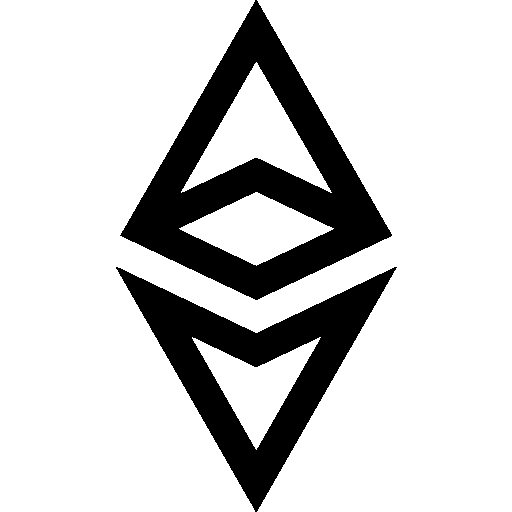

# 十大以太坊时事通讯

> 原文：<https://medium.com/coinmonks/top-10-ethereum-newsletter-3ff685478a38?source=collection_archive---------4----------------------->

以太坊生态系统正在以惊人的速度增长。你可以订阅下面的以太坊时事通讯来帮助你获得最新的以太坊新闻。

## [以太坊新闻周](https://weekinethereumnews.com/)

由[埃文·范尼斯](https://twitter.com/evan_van_ness)撰写的《以太坊新闻周刊》是(自 2016 年以来)持续时间最长的以太坊时事通讯之一。时事通讯是一份每周一次的关于以太坊生态系统的综述。

## [Ethhub](https://ethhub.substack.com/)

每周时事通讯关注项目更新、媒体报道和大量有见地的博客文章。Ethhub 是更新以太坊生态系统的绝佳资源。Ethhub 由安东尼·萨萨诺([@萨萨尔 0x](https://twitter.com/sassal0x) )和埃里克·康纳( [@econoar](https://twitter.com/econoar) )担任策划

## [无银行](https://bankless.substack.com/)

无银行时事通讯关注开放金融(或分散金融)。由 Mythos 的加密投资者 Ryan Sean Adams 撰写的《无银行》为另一种金融系统提供了发人深省的论点。

## [DeFi 周刊](https://defiweekly.substack.com/)

DeFi 周刊提供不同 DeFi 项目的综合分析。这份时事通讯是由科曼·科利撰写的，是一份内容丰富的周报。

## [吃积木](https://eattheblocks.com/)

Eat the blocks 为区块链开发者提供以太坊教程和最新更新。如果你想了解 Dapp 开发、智能合同或可靠性，吃积木是一个很好的起点。

## [目中无人](https://thedefiant.substack.com/)

由金融记者卡蜜拉·鲁索撰写，时事通讯提供了最新的 DeFi(去中心化金融)新闻和各种以太坊项目的更新。

## [DeFi 教程](https://defitutorials.substack.com/)

DeFi 教程是一个教育时事通讯，提供关于不同以太坊协议和项目的教程。由 Nodar Janashia 撰写的时事通讯是学习分散金融各个方面的极好资源。

## [DeFi 的剂量](https://mailchi.mp/b95fc066ba08/doseofdefi)

每周一期的 DeFi 是一份必须订阅的时事通讯，可以深入了解 Defi 生态系统。时事通讯提供了有关分散金融生态系统的最新新闻、更新和分析内容。

## [我的两个圭](https://mytwogwei.substack.com/)

该简讯由 Dex.blue 策划，介绍以太坊生态系统中杰出的思想领袖和创始人。这是一个了解太空中一些重要人物的绝佳场所。

## [考利](https://beta.kauri.io/)

Kauri 是一个使用 IPFS 和以太坊构建的分散式博客平台。该平台主要关注以太坊生态系统的教育资源。Kauri 的每月时事通讯将为您提供其平台上的最新教程。

**另外，了解一下**

*   [**什么是 Dapps？**](https://blog.coincodecap.com/what-are-dapps-an-ultimate-guide/)
*   [**智能合约钱包**](https://blog.coincodecap.com/best-smart-contract-wallet/)
*   [**比特币新手**](https://blog.coincodecap.com/bitcoin-for-beginners-common-questions/)
*   [**区块链分析软件**](https://blog.coincodecap.com/best-blockchain-analytics-softwares/)

> [直接在您的收件箱中获得最佳软件交易](https://coincodecap.com/?utm_source=coinmonks)

