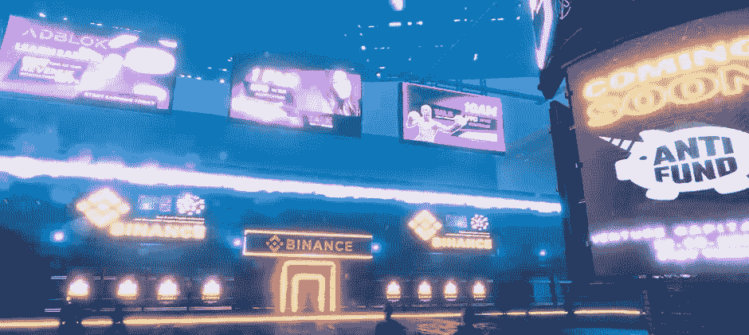
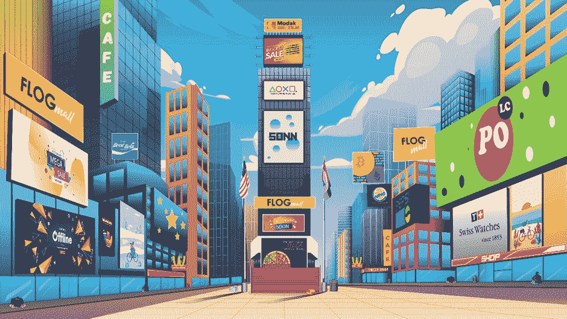
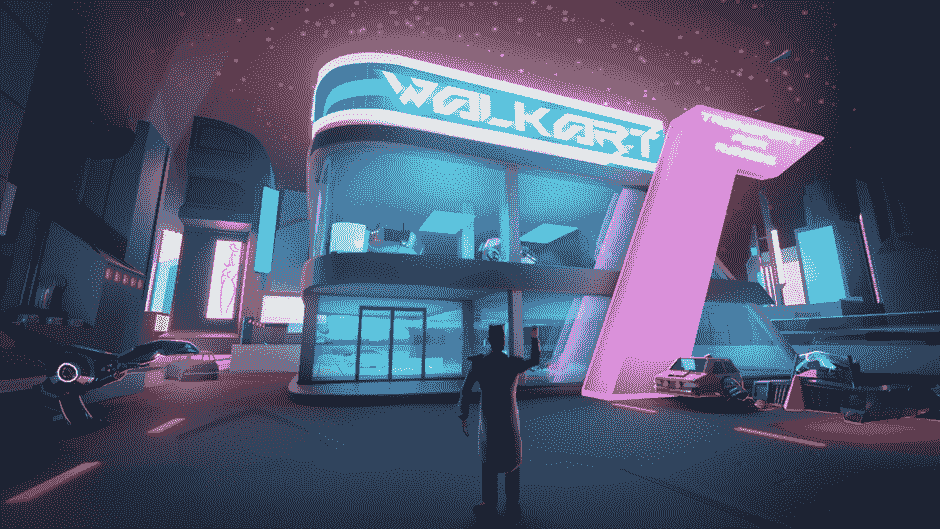

# 2022 年值得关注的三大元宇宙项目

> 原文：<https://medium.com/coinmonks/top-3-metaverse-projects-to-look-out-for-in-2022-db115b48c4db?source=collection_archive---------3----------------------->

不管你喜不喜欢，随着在线社交越来越成为我们生活的一部分，以及虚拟现实技术的不断进步，元宇宙游戏将成为未来的重要组成部分。

当我们走向 2021 年的最后一个季度时，分散的土地和 T2 沙盒充斥着新闻。随着大量的投机资金被注入到购买 NFT 的土地和这些虚拟世界中的物品，剩下的就是游戏来证明他们可以维持炒作和关注的时刻，以真正做大。

到 2022 年，我们将关注 3 个元宇宙游戏项目，它们很可能在未来一年成为有价值的竞争对手。

# Bloktopia

[Bloktopia](/@bloktopia) 是一座“分散式虚拟现实”摩天大楼，由 21 层组成，社区“Bloktopia”就住在这里。

在视频预览中，飞行汽车驶过霓虹闪烁的广告牌，这些广告牌贴在街道的背景上，这一场景看起来好像是从《银翼杀手 2049》中的某个时刻拍摄的。

Bloktopia 的目标是成为一个关于加密的信息中心，因为当前的信息，通过 Youtube、Twitter 和 Telegram 等多种媒体传播，“可能非常脱节”。因此，他们的元宇宙将为教育目的主办来自加密影响者的身临其境的交互式视频演示，并且还可以通过 VR 头戴设备访问世界。

除了信息资源，游戏世界中还有许多娱乐活动。用户可以“在多人游戏、家庭友好型游戏或像扑克这样的赌场游戏中争夺 BLOK”。投资者也会很高兴知道有机会创造主动和被动收入流，交易虚拟房地产和 NFT。

虽然目前处于封闭测试阶段，但用户钱包对这个基于多边形的项目反应良好。该项目的完全稀释市值为 130 亿美元。

**我们喜欢:**绚丽的图形，丰富多彩的活动。

**我们不喜欢的:**这听起来很局限，因为一切都发生在摩天大楼里，而不是一个开放的世界。我们并不完全相信游戏世界会成为加密信息的中心。

 [## blok topia——密码之家

### Bloktopia 是一座由 21 层组成的摩天大楼，以支付 2100 万比特币的认可。代币持有者将被称为…

www.bloktopia.com](https://www.bloktopia.com/) 

# 波尔卡城

[波尔卡城](https://polkacity.medium.com/)是一座虚拟城市，旨在通过建立世界上第一个 3D 和 AR NFT 平台来“彻底改变虚拟资产的所有权”，该平台将在多个区块链上运行。

非常像 GTA 的玩法，玩家会有可以完成的任务。虚拟城市也将成为市民参与娱乐活动和交易资产的地方。

NFT 市场出售各种东西，从虚拟出租车、加油站、直升机、喷气背包、体育场，甚至银行。当你出租你的 NFT 时，你可以从中赚钱。Polkacity 的人工智能使这些交易能够自动发生，本质上产生了一种被动收入。

看到生态系统中出现的商业类型是很有趣的。在 2022 年游戏发布之前，目前 2 . 25 亿美元的市值表明该项目已经获得了相当大的关注。

我们应该注意到，市值不包括以早期购买 NFT 的形式投资的金额，因此该项目可能比图表显示的还要热。

**我们喜欢:**有趣的经济和非正规金融机构为你创造收入的能力。

**我们不喜欢的:**我们希望在游戏中看到更多令人兴奋的元素，因为目前听起来大多数活动都围绕着成为商人。

[**https://www.polkacity.io/**](https://www.polkacity.io/)

# TipsyVerse (TipsyCoin)

甚至在启动之前，这个崭露头角的元宇宙项目就已经获得了名人和 Investing.com、福布斯和科技时报等主要媒体的关注。

玩家可以探索开放的世界，穿越不同的地区，每个地区都有自己独特的风格，以完成任务和参加娱乐活动。在被描述为“虚拟现实天堂”的 TipsyVerse 中，你可以社交、交易、玩游戏赚钱，或者只是探索世界和与朋友一起闲逛。

TipsyVerse 是免费的，迷你游戏包括跳伞，滑雪，赛车，甚至皇家战役。想要测试自己勇气的玩家可以参加官方锦标赛来赚取货币，TipsyCoin。

作为一个虚拟生活方式和文化的平台，TipsyVerse 还将举办其他有趣的活动，包括指导冥想会议、水疗、虚拟俱乐部、赌场和现场表演，并有机会会见和问候受人尊敬的 DJ 和艺术家。

还有炫耀或交易 NFT 的机会，NFT 涵盖从服装、房地产、汽车和品牌商品(想想耐克和路易威登等公司的虚拟服装)。

基于虚幻引擎 5 的无与伦比的图形和身临其境的体验，游戏还将提供虚拟现实耳机的可访问性，团队将开发身体套装，以便你可以用你的感官体验这个世界。

我们热切期待 TipsyCoin 在 2022 年 Q1 奥运会上的发布会。随着媒体对该项目的大肆宣传，随着项目的进展，我们很可能会看到图表开始出现。

**我们喜欢:**很高兴看到游戏的重点是吸引人的活动，因为持续的注意力是元宇宙项目成功的关键。

该项目还因其社区拓展计划而引起轰动。团队[收养了 50 只企鹅](/@tipsycoin/we-just-saved-some-penguins-we-are-not-done-6821471df798)以支持天堂野生动物园，[拯救了 81 名尼日尼亚儿童](/@tipsycoin/wealth-is-a-responsibility-and-if-not-managed-properly-it-becomes-a-liability-88441f9649f7)，并为这些儿童的食物、住所和教育进行了大量捐赠。

**我们不喜欢的:**离游戏发布还有一段时间，所以还有一些事情要做。(值得注意的是，TipsyCoin 持有人持有股票的动机是获得被动奖励)。

[**https://tipsycoin.io/**](https://tipsycoin.io/)

# 最后的想法

全球抗击新冠肺炎病毒的斗争已经进入第三年，随着我们在日益遥远的生活方式中找到新的互动方式，技术也在不断进步。

在浮华和魅力的背后，元宇宙项目获得主流关注的原因是因为它们提供了满足我们社交需求的解决方案。随着 web 3.0 和 VR 硬件的不断发展，3 个雄心勃勃的元宇宙项目前景光明，每个项目都有自己独特的主张。

我们特别关注 TipsyVerse，因为我们相信他们的娱乐、生活方式和游戏赚钱机会的组合将吸引并保持玩家的兴趣，并成为下一个大事件。