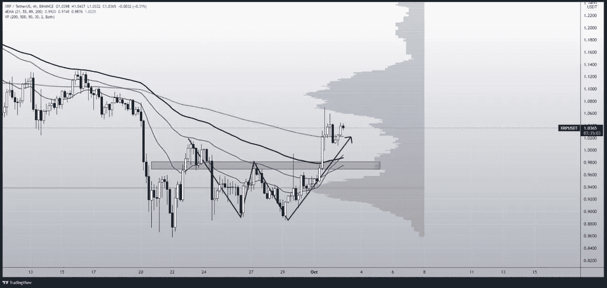

# 2021 年 10 月最值得购买的 5 种代用币

> 原文：<https://medium.com/coinmonks/top-5-altcoins-to-buy-in-october-2021-c864fa9140da?source=collection_archive---------1----------------------->

## 点、链接等。是本月您应该关注的五大加密资产。为什么？继续读！

在不太好的 9 月份之后，我们所有人都在期待 10 月份的一些回报。此外，由于大多数分析师和专家认为当前的市场周期与 2017 年相似，牛市不会很快结束。然而，着眼于短期目标，以下是 2021 年 10 月你应该关注的五种最佳加密货币。

# 1.圆点(波尔卡圆点)

我们一直在观察 DOT 价格的停滞增长，草间弥生-波尔卡多 Parachain 拍卖预计将进一步推动其价格上涨。然而，我们很有可能在 2021 年 10 月或 11 月观察到一个新的 ATH。

就目前的市场情况而言，DOT 目前拒绝强阻力区。此外，它位于强支撑位上方，这也是一个阻力。所以现在，如果我们观察之前的价格走势，在突破下降阻力趋势线后进场是很重要的。

下面的图表清楚地描绘了长期霍德勒的积累区，目前的阻力/支持区，和强阻力区。因此，等待目前阻力的突破和成功的再次测试，然后进入市场将是一个不错的选择。

# 2.文学

Litentry 是一种网络无关的分散式身份聚合协议，具有分布式身份(DID)索引机制和基于底层的信用计算网络。Litentry 的本地实用令牌 LIT 有以下应用:每次用户请求基于网络的实时信用计算时，以 LIT 支付费用。

LIT 令牌刚刚突破了下跌的楔形形态，如果重新测试成功，可能会有不错的收益。此外，正如我们在下面的图表中看到的硬币的预计运动，很明显，硬币在 10 月份被列入了我们的 crypto 购买名单。

# 3.FTM (Fantom)

Fantom 正在开发一个基于分布式账本的可编程平台——基于有向无环图。

正如我们在下面的图表中看到的，FTM 做了一个上升三角形的突破，目前正在重新测试。此外，该项目的价格行为非常好，我们将很可能在成功的重新测试后看到一个上升趋势。

# 4.链环(链环)

随着 BTC 加速启动 GreenTocber，所有其他 alts 都在打破他们之前的阻力水平。此外，Chainlink 一直在等待价格运动中出现这样的突破。

根据下面的图表，Chainlink 打破了下跌的楔形形态，目前保持良好的支撑。此外，从长远来看，这是一个很好的项目，我们很可能会看到它的价格有一些巨大的收益。

# 5.XRP(涟漪)

XRP 在之前的牛市中取得了显著的收益。此外，尽管项目创始人拥有 XRP 大约 60%的股份，但它的表现异常出色。这将会更加令人兴奋！

根据下面的图表，XRP 已经走出了双底形态，开始上涨。正如你所看到的，市场目前在成交量较低的地方盘整。然而，在突破之后，我们可能会看到一些好的收益。

# 结束语

交易最重要的部分是纪律和耐心。因此，根据上述分析，我们刚刚谈到的硬币可能会有一些不错的收益。再说一次，你要投资的是你的血汗钱，所以在投资前做好自己的研究。

本文中没有任何金融建议，此外，你应该只投资于你认为对你的投资组合有利的市场。

最初发布于:

https://blog.coincodecap.com/crypto-to-buy-in-october-2021

下周末我会带着另一篇文章回来。在那之前，请点击“关注”按钮继续阅读我的文章，如果你读得不错，请鼓掌表示支持！

与我联系，

[Twitter](https://twitter.com/prabxat)|[LinkedIn](https://www.linkedin.com/in/praxhat/)

1.  [银行会灭亡还是会适应？DeFi 的未来将会决定。](/coinmonks/will-banks-perish-or-adapt-the-future-of-defi-will-decide-80f13284f76?source=user_profile---------1----------------------------)
2.  [你钱包里的 100 元钞票，是钱，还是没有价值的东西？](/coinmonks/is-the-100-bill-in-your-wallet-money-or-something-that-has-no-value-99263e8dfba6?source=user_profile---------0----------------------------)
3.  [2021 年底前比特币还在破 100K 的路上吗？](/coinmonks/is-bitcoin-still-on-its-path-to-break-100k-before-the-end-of-2021-4716a56745ce?source=user_profile---------1----------------------------)
4.  [我是如何在大学本科阶段开始投资 Crypto 的？](https://praxhat.medium.com/how-did-i-start-investing-in-crypto-as-a-college-undergrad-ac9635d9d6b3?source=user_profile---------2----------------------------)

这篇文章中所写的一切都是我所相信的，很可能你的想法和我的不同(显然我们是两个不同的人)。因此，把这篇文章当成轻松读物，如果你不喜欢它的内容，就当你没读过它吧！

> 加入 [Coinmonks 电报频道](https://t.me/coincodecap)，了解加密交易和投资

**还有，读**

*   [币安 vs 北海巨妖](https://blog.coincodecap.com/binance-vs-kraken) | [美元成本平均交易机器人](https://blog.coincodecap.com/pionex-dca-bot)
*   [如何在印度购买比特币？](/coinmonks/buy-bitcoin-in-india-feb50ddfef94) | [WazirX 评论](/coinmonks/wazirx-review-5c811b074f5b) | [BitMEX 评论](https://blog.coincodecap.com/bitmex-review)
*   [比特币主根](https://blog.coincodecap.com/bitcoin-taproot) | [Bitso 点评](https://blog.coincodecap.com/bitso-review) | [排名前 6 的比特币信用卡](/coinmonks/bitcoin-credit-card-bc8ab6f377c6)
*   [双子座 vs 比特币基地](https://blog.coincodecap.com/gemini-vs-coinbase) | [比特币基地 vs 北海巨妖](https://blog.coincodecap.com/kraken-vs-coinbase) | [硬币罐 vs 硬币点](https://blog.coincodecap.com/coinspot-vs-coinjar)
*   [印度密码交易所](/coinmonks/bitcoin-exchange-in-india-7f1fe79715c9) | [比特币储蓄账户](/coinmonks/bitcoin-savings-account-e65b13f92451) | [Paxful 审核](/coinmonks/paxful-review-4daf2354ab70)
*   [杠杆令牌](/coinmonks/leveraged-token-3f5257808b22) | [最佳加密交易所](/coinmonks/crypto-exchange-dd2f9d6f3769) | [AscendEX 评论](/coinmonks/ascendex-review-53e829cf75fa)
*   [Godex.io 审核](/coinmonks/godex-io-review-7366086519fb) | [邀请审核](/coinmonks/invity-review-70f3030c0502) | [BitForex 审核](https://blog.coincodecap.com/bitforex-review) | [HitBTC 审核](/coinmonks/hitbtc-review-c5143c5d53c2)
*   [Crypto.com 费用](/coinmonks/binance-fees-8588ec17965) | [Botcrypto 审查](/coinmonks/botcrypto-review-2021-build-your-own-trading-bot-coincodecap-6b8332d736c7) | [替代方案](https://blog.coincodecap.com/crypto-com-alternatives)
*   [有哪些交易信号？](https://blog.coincodecap.com/trading-signal) | [Bitstamp vs 比特币基地](https://blog.coincodecap.com/bitstamp-coinbase)
*   [ProfitFarmers 回顾](https://blog.coincodecap.com/profitfarmers-review) | [如何使用 Cornix Trading Bot](https://blog.coincodecap.com/cornix-trading-bot)
*   [MXC 交易所评论](/coinmonks/mxc-exchange-review-3af0ec1cba8c) | [Pionex vs 币安](https://blog.coincodecap.com/pionex-vs-binance) | [Pionex 套利机器人](https://blog.coincodecap.com/pionex-arbitrage-bot)
*   [我的密码交易经验](/coinmonks/my-experience-with-crypto-copy-trading-d6feb2ce3ac5) | [比特币基地评论](/coinmonks/coinbase-review-6ef4e0f56064)
*   [CoinFLEX 评论](https://blog.coincodecap.com/coinflex-review) | [AEX 交易所评论](https://blog.coincodecap.com/aex-exchange-review) | [UPbit 评论](https://blog.coincodecap.com/upbit-review)
*   [AscendEx 保证金交易](https://blog.coincodecap.com/ascendex-margin-trading) | [Bitfinex 赌注](https://blog.coincodecap.com/bitfinex-staking) | [bitFlyer 审核](https://blog.coincodecap.com/bitflyer-review)
*   [麻雀交换评论](https://blog.coincodecap.com/sparrow-exchange-review) | [纳什交换评论](https://blog.coincodecap.com/nash-exchange-review)
*   [加密货币储蓄账户](/coinmonks/cryptocurrency-savings-accounts-be3bc0feffbf) | [赌注加密](https://blog.coincodecap.com/staking-crypto)
*   [BigONE 交易所评论](/coinmonks/bigone-exchange-review-64705d85a1d4) | [CEX。IO 审查](https://blog.coincodecap.com/cex-io-review) | [Swapzone 审查](/coinmonks/swapzone-review-crypto-exchange-data-aggregator-e0ad78e55ed7)
*   [最佳比特币保证金交易](/coinmonks/bitcoin-margin-trading-exchange-bcbfcbf7b8e3) | [比特币保证金交易](https://blog.coincodecap.com/bityard-margin-trading)
*   [加密保证金交易交易所](/coinmonks/crypto-margin-trading-exchanges-428b1f7ad108) | [赚取比特币](/coinmonks/earn-bitcoin-6e8bd3c592d9) | [Mudrex 投资](https://blog.coincodecap.com/mudrex-invest-review-the-best-way-to-invest-in-crypto)
*   [WazirX vs CoinDCX vs bit bns](/coinmonks/wazirx-vs-coindcx-vs-bitbns-149f4f19a2f1)|[block fi vs coin loan vs Nexo](/coinmonks/blockfi-vs-coinloan-vs-nexo-cb624635230d)
*   [BlockFi 信用卡](https://blog.coincodecap.com/blockfi-credit-card) | [如何在币安购买比特币](https://blog.coincodecap.com/buy-bitcoin-binance)
*   [火币交易 Bot](https://blog.coincodecap.com/huobi-trading-bot) | [如何购买 ADA](https://blog.coincodecap.com/buy-ada-cardano) | [Geco？一次回顾](https://blog.coincodecap.com/geco-one-review)
*   [加密副本交易平台](/coinmonks/top-10-crypto-copy-trading-platforms-for-beginners-d0c37c7d698c) | [五大 BlockFi 替代方案](https://blog.coincodecap.com/blockfi-alternatives)
*   [信用贷款审核](https://blog.coincodecap.com/coinloan-review)|[Crypto.com 审核](/coinmonks/crypto-com-review-f143dca1f74c) | [货币融资融券交易](/coinmonks/huobi-margin-trading-b3b06cdc1519)
*   [拜比特 vs 币安](https://blog.coincodecap.com/bybit-binance-moonxbt)|[stealthexreview](/coinmonks/stealthex-review-396c67309988)|[Probit Review](https://blog.coincodecap.com/probit-review)