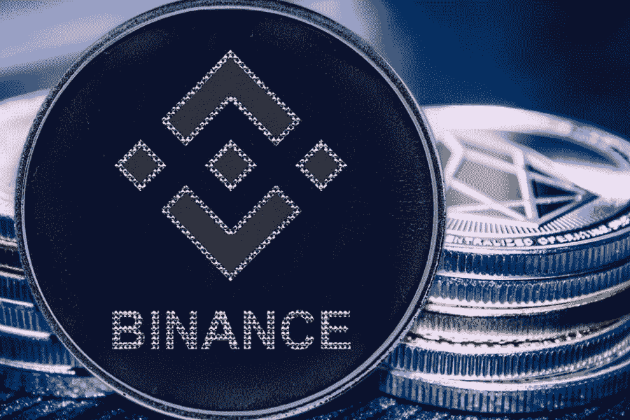

# 2022 年投资的五大最佳加密技术

> 原文：<https://medium.com/coinmonks/top-5-best-crypto-to-invest-in-2022-47e0d900de4a?source=collection_archive---------11----------------------->

由于需求强劲，吸引了大量新投资者，加密货币在过去几年中引起了巨大轰动。数字货币在现代世界的实施速度如此之快，以至于即使是怀疑论者也不怀疑加密货币不是一个很快就会破裂的泡沫。据推测，到 2025 年底，全球将有大约 10 亿个比特币钱包。此外，大量专家预测，由于互联网在全球的广泛使用，加密货币将继续增加。现在不仅比特币在呈现高速增长，其他的币比如以太，从 2019 年开始采用的速度比比特币还快。

就 DeFi 而言，它很快就占领了市场，加密社区的兴趣令人印象深刻。自 2021 年以来，其用户数量大约增加了两倍。尽管这个市场存在各种风险，但它吸引了大量投资者，随着 2021 年即将结束，用户正在等待 2022 年最佳的加密投资。因此，对于新手和有经验的加密投资者，我们编制了一份 2021 年增长的加密公司名单，预计将在 2022 年及以后带来利润。

投资哪种加密技术最好？

下面你可以看到今年表现不错，预计在 2022 年带来不错收益的加密货币。因此，你将很容易决定投资哪种加密货币，以及应该选择什么样的加密货币投资策略。

**以太坊**

以太坊基于区块链网络，以交换和加密货币以太网(ETH)为媒介。以太坊的需求源于其智能合约的功能。智能合同被认为类似于纸质合同，在所有条件都满足的情况下实施，但不需要通过银行等中介。随着 ETH-2.0 的升级，以太坊将其共识机制从 PoW 机制转换为利益证明(PoS)。因此，赌注者目前有机会提供他们的以太作为额外被动收入的加密投资。

Digitalcoinprice 预测以太坊在 2021 年底将价值 5324.55 美元，比目前的价格上涨 56%。他们的预测计算到 2028 年。他们预测，到 2028 年 11 月，ETH 的成本将为 16，142.80 美元，这相当于比今天的硬币成本增加了 371.64%，年回报率为 24.8%。

Finder 还就以太的前景和成本调查了 36 位加密货币专家。大多数密码投资者认为 ETH-2.0 的升级非常积极。专家预测，到 2021 年底，乙醚的平均成本将达到 4596 美元。此外，他们预测以太坊将在 2025 年 12 月达到 17810 美元。到 2030 年 12 月，ETH 的平均价格将达到 71763 美元。大多数专家还认为，到 2025 年底，以太网将超过 BTC 的加密市值。

**比特币(BTC)**

如果你决定投资加密，比特币可能是一个理想的选择。比特币是 2009 年由化名为中本聪的个人或群体推出的第一种数字货币。与大多数其他加密货币一样，BTC 基于区块链，这是一个由数千台计算机组成的复杂网络。BTC 的安全性由一种被称为工作证明(PoW)的共识机制来维护。

比特币交易相对迅速，性价比高，最大带宽约为每秒七笔交易(TPS)，10 分钟左右创建一个新块。与法定货币不同，用户在比特币交易过程中不需要提供个人数据。

比特币仍然是最知名、增长最快的加密货币之一。今天比特币的价格是 61290 美元。至于对 Btс未来成本的预测，看起来相当乐观。

许多专家目前正试图给出比特币在 2022 年的未来价值估计。2021 年 6 月，亿万富翁风险投资家、比特币投资者蒂姆·德雷珀(Tim Draper)给出了一个预测，比特币价格将在 2023 年初达到 25 万美元。FiCAS AG Swiss 的首席信息官 Ali Mizani Oskui 预测，2021 年 12 月至 2022 年 3 月期间，BTC 的价格将在 20 万美元至 30 万美元之间。

根据 2021 年 4 月的彭博报告，年底 BTC 将耗资 40 万美元。

Digitalcoinprice 有一个更保守的预测，他们认为 BTC 价格将在今年年底达到 75，000 美元，然后 BTC 的价值将在 2022 年 2 月达到 90，127.56 美元。

**卡尔达诺(阿达)**

下一个最好的投资对象是 Cardano(ADA)。

Cardano(ADA)是第三代加密货币，始于 2017 年，基于比特币和以太坊，但更稳定、更环保、可扩展、更安全。尽管这种硬币并没有像比特币和以太坊那样在新闻中被提及，但据 the Motley Fool 称，它是值得关注的。

硬币价格预测预测，卡尔达诺的硬币成本将在今年年底达到 3 美元，2025 年达到 12.66 美元，比目前的价格高出 355%，到 2030 年将达到 19.01 美元。

GOV Capital 也对一年的 ADA 给出了乐观的预测。它的价格将升至 3.43 美元(31.58%)，这种硬币的下降预计在 2022 年 1 月。硬币价格下跌后，他们认为未来 5 年 ADA 的成本将上涨 11.56 美元，年化回报率为 33.6%。

**索拉纳(SOL)**

Solana 可能是 2021 年至 2022 年投资 crypto 的一个好选择，因为它上个月增长了 300%，年初至今增长了 13，000%。它已经以 518 亿美元的市值排名第七，并与 Cardano 和 Ethereum 竞争最佳智能合约平台。NFTs 成为 Solana 在 NFT 市场增长的主要原因。

根据硬币价格预测的预测，索拉纳的硬币成本将在今年年底达到 500 美元，2022 年达到 1000 美元。此外，它将继续增长，到 2025 年达到 4086 美元，到 2030 年达到 6829 美元。

根据 Digitalcoinprice 的数据，SOL 将增长至 262.23 美元，然后在今年年底降至 245.39 美元，并在 2022 年达到 346.61 美元，2025 年达到 517.21 美元，2028 年达到 761.39 美元；年总收益率将为 23.29%。

**币安币(BNB)**

币安硬币(BNB)是一种加密货币，用于在币安加密交易所进行交易和支付费用。BNB 也可以兑换其他加密货币，如 BTC 或 ETH。

硬币价格预测预测，币安硬币的成本将在今年年底达到 500 美元，到 2025 年中期达到 1000 美元，到 2030 年达到 1800 美元。

Digitalcoinprice 认为，币安将增长到 649 美元，然后价格将在今年年底下降到 597 美元，并在 2022 年达到 824 美元，2025 年达到 1287 美元，2028 年达到 1821 美元；年收益率将达到 17.8%。

因此，正如我们所见，币安硬币可能是投资加密的一个好选择。

**如何投资 crypto？**

加密货币交易被认为是投资加密货币最赚钱、最知名的方式。如果你想推出一个成功的交易流程，给你带来不错的利润，可以使用 Cryptorobotics 交易平台。

通过该平台进行加密货币交易非常容易，因为它为用户提供了广泛的算法和手动交易工具。要在此加密交易平台上开始交易，您应该遵循以下步骤:

1.  去 Cryptorobotics 交易终端，在这里注册[。](https://cryptorobotics.io/)
2.  在下拉菜单中，您应该输入您的姓名、电子邮件和密码，单击复选框接受协议条款，然后单击“完成”按钮。
3.  接下来，您需要确认一个代码，该代码将发送到您的电子邮件地址。
4.  为了提高安全性，每个交易者都可以启用双因素身份验证。
5.  在这些加密交换中的一个上创建帐户:

*   **景点:**币安，比特芬尼斯，CEX，币安。US、Gate.io、P2PB2B、Bittrex、EXMO、火币、北海巨妖、OKEX、Poloniex
*   **期货:**币安期货，逐位和逐位逆

1.  您应该使用 API 密钥将您的 exchange 帐户绑定到 Cryptobotics 交易平台。
2.  对于终端中的进一步工作，您可以使用一个免费的基本功能包或连接一个 PRO 包。
3.  使用交易机器人、信号交易、自动跟踪或复制交易的功能开始手动或算法交易。

此外，Cryptorobotics 平台上还有其他可用的工具，如 OCOs 或 s [mart 订单](http://global.cryptorobotics.io/2020/07/09/ocos/)、图表交易、限价和限价止损订单，以及警报(通知)。这些功能可以显著提高您的交易质量，降低损失风险，增加盈利机会。

> 加入 Coinmonks [电报频道](https://t.me/coincodecap)和 [Youtube 频道](https://www.youtube.com/c/coinmonks/videos)了解加密交易和投资

## 另外，阅读

*   [7 大副本交易平台](https://blog.coincodecap.com/copy-trading-platforms) | [BuyCoins 点评](https://blog.coincodecap.com/buycoins-review)
*   [my constant Review](https://blog.coincodecap.com/myconstant-review)|[8 款最佳摇摆交易机器人](https://blog.coincodecap.com/best-swing-trading-bots)
*   [Godex.io 审核](/coinmonks/godex-io-review-7366086519fb) | [邀请审核](/coinmonks/invity-review-70f3030c0502) | [BitForex 审核](https://blog.coincodecap.com/bitforex-review)
*   [10 本关于加密的最佳书籍](https://blog.coincodecap.com/best-crypto-books) | [英国 5 个最佳加密机器人](https://blog.coincodecap.com/uk-trading-bots)
*   [ko only 回顾](https://blog.coincodecap.com/koinly-review) | [Binaryx 回顾](https://blog.coincodecap.com/binaryx-review)|[Hodlnaut vs CakeDefi](https://blog.coincodecap.com/hodlnaut-vs-cakedefi-vs-celsius)
*   [MoonXBT vs Bybit vs 币安](https://blog.coincodecap.com/bybit-binance-moonxbt) | [硬件钱包](/coinmonks/hardware-wallets-dfa1211730c6)
*   [火币交易机器人](https://blog.coincodecap.com/huobi-trading-bot) | [如何购买 ADA](https://blog.coincodecap.com/buy-ada-cardano) | [Geco？一次回顾](https://blog.coincodecap.com/geco-one-review)
*   [币安 vs Bitstamp](https://blog.coincodecap.com/binance-vs-bitstamp) | [比特熊猫 vs 比特币基地 vs Coinsbit](https://blog.coincodecap.com/bitpanda-coinbase-coinsbit)
*   [如何购买 Ripple (XRP)](https://blog.coincodecap.com/buy-ripple-india) | [非洲最好的加密交易所](https://blog.coincodecap.com/crypto-exchange-africa)
*   [非洲最佳加密交易所](https://blog.coincodecap.com/crypto-exchange-africa) | [胡交易所评论](https://blog.coincodecap.com/hoo-exchange-review)
*   [eToro vs robin hood](https://blog.coincodecap.com/etoro-robinhood)|[MoonXBT vs by bit vs Bityard](https://blog.coincodecap.com/bybit-bityard-moonxbt)
*   [有哪些交易信号？](https://blog.coincodecap.com/trading-signal) | [比特斯坦普 vs 比特币基地](https://blog.coincodecap.com/bitstamp-coinbase)