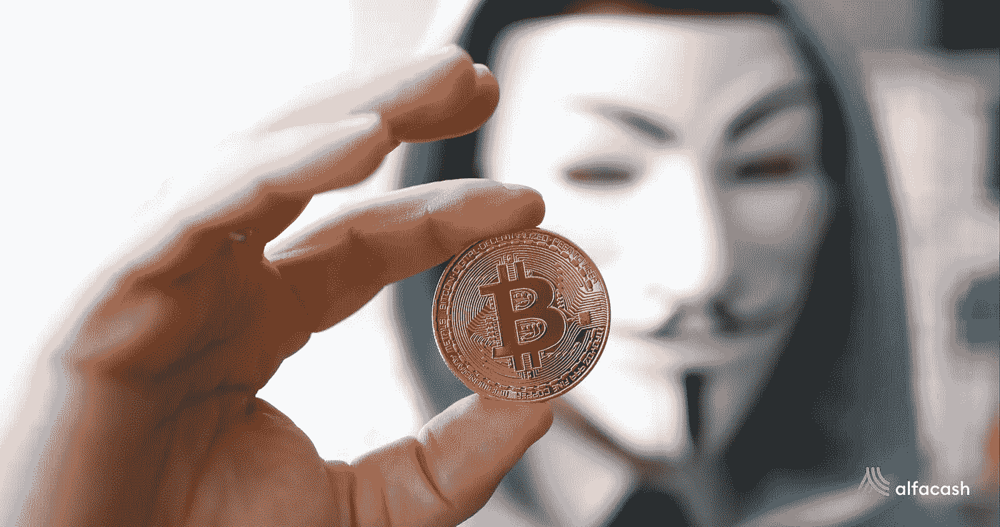
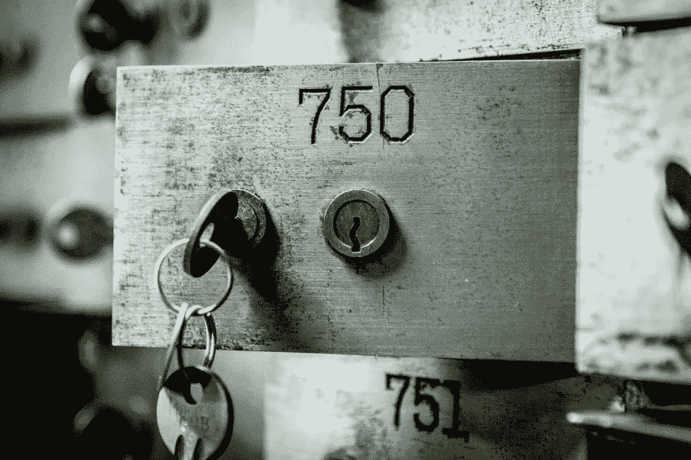
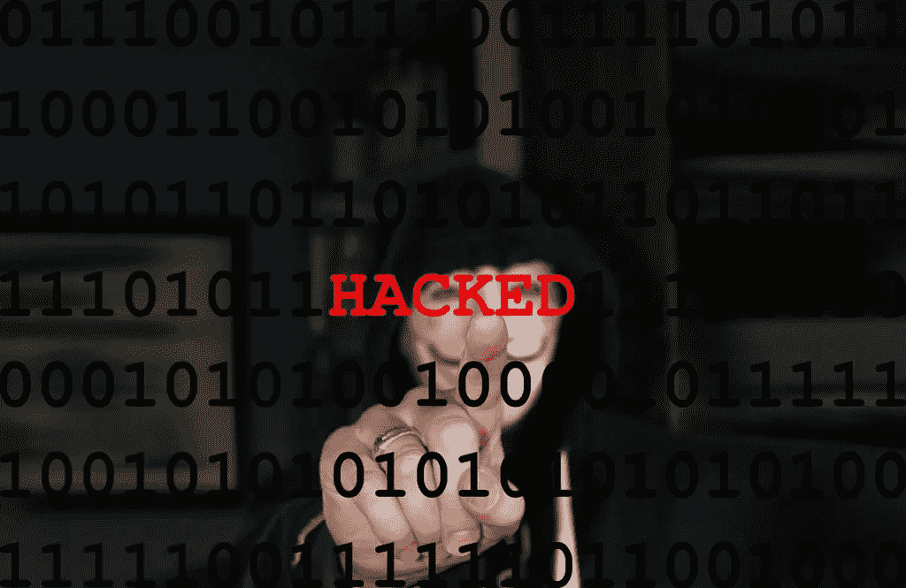
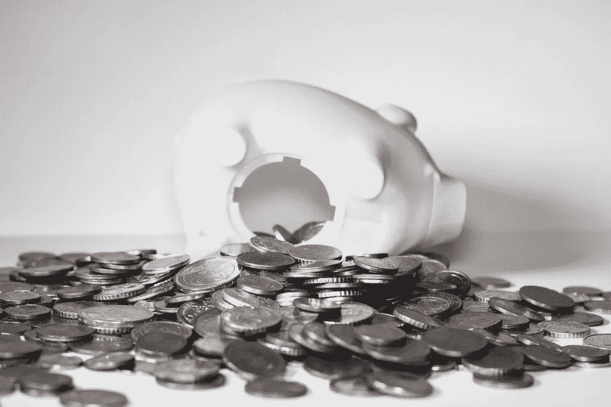
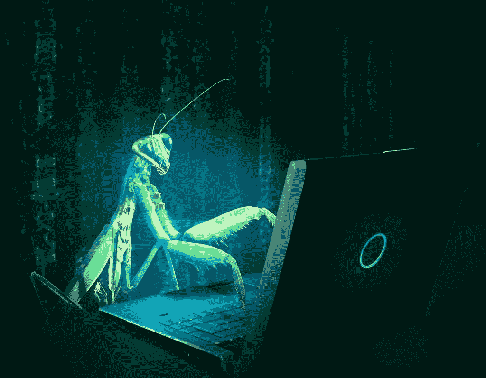
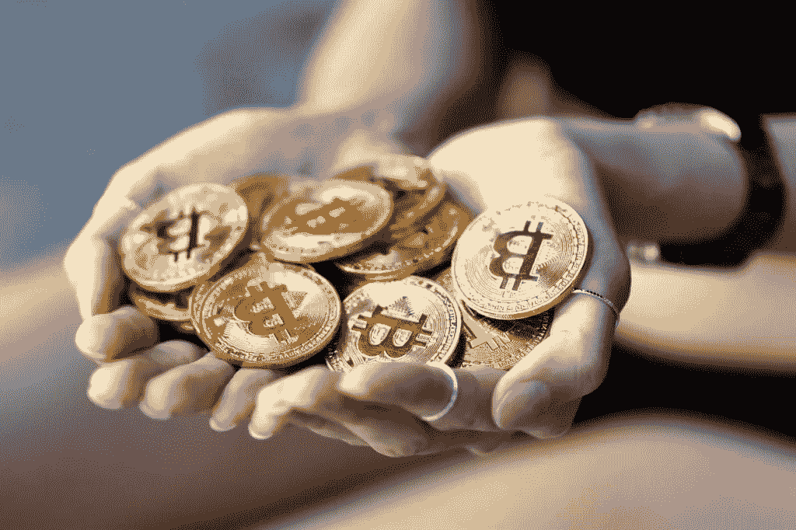
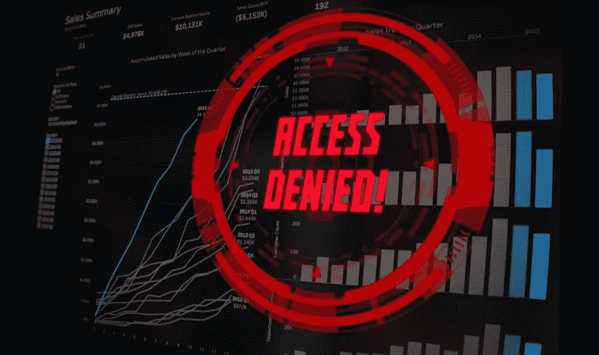

# 前 5 名:历史上最大的秘密黑客

> 原文：<https://medium.com/coinmonks/top-5-biggest-crypto-hacks-in-history-1bd1b7934654?source=collection_archive---------11----------------------->

不管是什么:在数字世界里，每一种服务都可能被黑客攻击。可悲的是，保管加密货币交易所和一些相关服务也不例外。区块链通常是安全的，几乎不可能被攻破。然而，当大量加密货币仅由一家公司控制时，最大的加密黑客攻击必然会发生。

据区块链安全公司[slow MIT](https://hacked.slowmist.io/en/)**称，自 2012 年**以来，黑客从加密平台和服务中窃取的总金额超过 174 亿美元。他们甚至不包括币安智能链(BSC)内部的[众多事件](https://blog.alfa.cash/2021/06/02/what-happened-may-cryptocurrency-world/)。但谈到最大的几个，它们已经发生在加密货币交易所好几年了。

# 最大的密码黑客是如何制造的

其中大部分都是可能的，要么是由于交易所的私钥泄露，要么是由于公司数据库内部未经授权的更改。[一个小小的解释](/lgogroup/why-institutions-will-not-use-centralized-cryptocurrency-exchanges-dc5ef711eb4a):一旦你把你的资金寄给他们，他们会把这些资金和所有其他资金混合在一个或几个加密货币钱包里，完全由公司控制。

然后，你在账户上看到的余额，仅仅是一张登记在庞大内部数据库中的“借条”。因此，如果有人设法破坏这个数据库的安全(这比“黑掉”一个区块链容易得多)，他们可以欺骗系统注册他们的账户实际上有一笔他们没有的钱。

**黑客迅速提走资金，然后抢劫完成**。很可能，托管交易所发现的时候已经太晚了。这就是为什么不要将加密货币长期留在托管交易所内是非常明智的。另一方面，用户也可以求助于非托管交易所(如 [Alfacash](https://www.alfa.cash/) )，在那里他们可以完全控制自己的钱。

说到这里，让我们来看看历史上最大的黑客攻击吧！

 [## 最佳加密交易所| 2021 年十大加密货币交易所

### 哪一个是最好的加密交换？在本文中，我们将根据多种加密货币列出 10 大加密货币交易所

medium.com](/coinmonks/crypto-exchange-dd2f9d6f3769) 

# 比特圣杯

对于纳米(XRB)社区来说，这是糟糕的一天。2018 年 2 月 9 日，意大利加密交易所 Bitgrail 在其网页上发布了一则[不良公告](https://web.archive.org/web/20180215053431/https:/bitgrail.com/news)。在检查其内部平台时，他们注意到有人在某个时候，**能够窃取 1700 万 XRB，相当于当时超过 1.92 亿美元。**

Bitgrail 创始人弗朗西斯科·菲拉诺(Francisco Firano)将此次事件归咎于纳米开发者，声称区块链存在漏洞。法庭证明他错了，法律费用部分由 Nano 团队支付。警方调查证实，该交易所将资金放在一个易受攻击的[热钱包](https://blog.alfa.cash/2021/02/03/how-to-choose-first-crypto-wallet-tips-tricks/)中，而菲拉诺未能妥善保管这些资金。结果，他负责赔偿损失，他所有的资产都被查封了。

遗憾的是，这不足以弥补损失。受害者仍在等待全额退款。与此同时，Bitgrail 已经不存在了，XRB/纳米的价格从那时起已经下降了 63%以上。

# 库科恩

这是名单上最近的一个。回到 2020 年 9 月 25 日，新加坡加密交易所 KuCoin [宣布](https://www.kucoin.com/news/en-kucoin-security-incident-update)一次高调的黑客攻击，涉及[比特币](https://blog.alfa.cash/2020/08/20/how-buy-bitcoin-simple-steps-nice-recipe/)、ERC-20 代币和其他资产。一开始，他们没有提到确切的数额，但一些消息来源估计超过 1.5 亿美元。**没过多久，被盗总金额被确认为 2.85 亿美元。**

一个恶意的第三方攻击了他们的热钱包，但交易所承担了责任，并承诺在必要时向用户退款。他们迅速与其他密码交易所、社区和当局合作，追踪和追回资金。令人惊讶的是，这个故事有一个美好的结局。在这份名单中提到的所有人当中，KuCoin 是唯一一个真正从黑客手中追回大部分资金的人。

根据 KuCoin 首席执行官 Johnny Lyu 的一封信，他们通过与其他交易所和合作伙伴合作，成功追回了 78%的被盗资金。他们通过区块链追踪资金，其他交易所阻止了黑客进行的交易，并没收了代币。另外 16%由保险支付，剩下的 6%由执法部门和安全机构收回。KuCoin 现在保持正常工作。

 [## KuCoin 评论 2021 |你能相信这个交易所吗？

### 本文将回顾 KuCoin，这是一个安全易用的加密交易所，用于买卖比特币和其他…

medium.com](/coinmonks/kucoin-review-bb5e3071f0e) 

# 硬币检查

很可能，[这次攻击](https://cryptonews.com/news/coincheck-hacked-more-than-500-million-xem-stolen-1093.htm)会被一些人认为是历史上最大的加密黑客攻击。然而，由于所涉及的加密货币的价值和后果的变化，我们已经为这里的其他人保留了那个位置。但这并不意味着它不大。数额巨大:**一夜之间，超过 5 . 3 亿美元在 NEM (XEM)被盗。**

他们犯了和 Bitgrail 一样的错误:把资金放在热钱包里，而不是冷钱包里(互联网之外)。然而，与第一个案例不同的是，[日本的](https://blog.alfa.cash/2021/02/10/top-5-most-crypto-friendly-countries-taxes/) Coincheck 承担了违约的全部责任。自 2018 年 1 月事件发生以来，他们暂停了所有活动。到了 3 月，他们又恢复了活动，开始了针对受害者的[退款计划](https://corporate.coincheck.com/2018/03/12/47.html)。被盗总额为 5.26 亿 XEM。自那以后，代币价格下降了 90%以上。

Coincheck 攻击标志着日本密码公司的一个转折点。事件发生后，该国加强了对加密货币的监管。由于其他一些原因，[私有加密货币](https://blog.alfa.cash/2021/03/29/discover-monero-how-use-it-full-privacy/)被禁止，对服务提供商的运营要求提高。

# Bitfinex

2016 年 8 月 2 日，总部位于香港的[加密交易所因其安全系统遭到破坏，近 12 万 BTC 被盗。事后，认为公司完蛋的人不在少数。到那时，金额上升到超过 7500 万美元，但这些年来只动过几次。**黑客们的钱包里仍然有大约 118，000 BTC，现在价值超过 37 亿美元，不亚于**。确实是最大的黑客之一。](https://blog.alfa.cash/2021/03/11/top-countries-most-crypto-users-laws/)

但回到 2016 年，Bitfinex 停止了几天的所有操作，并将损失社会化(这使其所有用户的余额减少了 36%)。他们还创造了 [BFX 代币](https://www.bitfinex.com/posts/184)，这些代币将保留在每个投资组合中，直到交易所结束偿还债务，或者直到客户决定用它们交换公司股票。

2016 年 9 月开始对客户进行首批报销。八个月后，损失被弥补了，尽管被盗总额中的极小一部分已经被追回。至少，黑客们似乎在清洗和交换它们方面也存在问题。

 [## Bitfinex 评论 2021 —它是合法的还是骗局？

### 正如该网站所述，Bitfinex 是一个用于交易加密货币的加密交易平台。本交易所成立于…

medium.com](/coinmonks/bitfinex-review-48727c953cc0) 

# 史上最大的加密黑客:Mt. Gox

这次日本交流度过了一个充满情感的 2013 年。截至 4 月份，该交易所处理的交易量超过总交易量的 70%,成为全球领先的比特币交易所。正是因为它没有能力管理这么大的业务量，同一个月在 BTC 股市 6 小时内暴跌 52%之后，它停止了几天的运营。而这只是结束的开始。

2014 年 2 月 7 日， [Mt. Gox](https://www.wired.com/2014/03/bitcoin-exchange/) 停止了所有的比特币提现，并开始为此寻找系统性的借口。其首席执行官马克·卡尔佩莱斯(Mark Karpelès)从比特币基金会董事会辞职，并删除了他所有的推文。其余的交易操作被暂停，最后，该网站在月底下线。

忧心忡忡的用户很快就会发现可怕的事实。744.408 号(当时价值约 4.73 亿美元，今天价值 238 亿美元以上)遭遇黑客攻击后，该公司资不抵债。2 月底，Mt. Gox 在东京申请破产，就在那里，它的老客户开始了收回资金的漫长旅程(这一过程从[一直持续到](https://www.bloomberg.com/news/articles/2021-03-19/fortress-said-to-offer-earlier-payout-on-mt-gox-creditor-claims))。

Mt. Gox 袭击事件是比特币和[加密货币世界](https://blog.alfa.cash/2021/07/03/what-happened-june-cryptocurrency-world/)的转折点。从那时起，密码交易所开始改善他们的安全性，他们的储备，和他们的法规。我们现在有了更好的选择，也有了非监禁交换。

*想交易比特币和其他代币吗？你可以在 Alfacash* *上* *放心的做* [*！别忘了我们正在社交媒体上谈论这件事和许多其他事情。*](https://www.alfa.cash/buy/bitcoin)

[推特](https://twitter.com/alfacash_crypto) * [电报](https://t.me/AlfacashCommunity)*[insta gram](https://www.instagram.com/alfacashstore)*[Youtube](https://www.youtube.com/channel/UCOl4fdRHj8AseQ5b6z9udaw)*[脸书](https://www.facebook.com/alfacashstore) * [Vkontakte](https://vk.com/alfacashcrypto)

*原载于 2021 年 7 月 8 日*[*https://blog . alfa . cash*](https://blog.alfa.cash/2021/07/08/top-5-biggest-crypto-hacks-history/)*。*

> 加入 [Coinmonks 电报频道](https://t.me/coincodecap)，了解加密交易和投资

## 另外，阅读

 [## 最佳免费加密交易机器人——前 16 名比特币交易机器人[2021]

### 2021 年币安、比特币基地、库币和其他密码交易所的最佳密码交易机器人。四进制，位间隙…

medium.com](/coinmonks/crypto-trading-bot-c2ffce8acb2a)  [## 最佳 6 个加密交易信号电报通道

### 这是乏味的找到正确的加密交易信号提供商。因此，在本文中，我们将讨论最好的…

medium.com](/coinmonks/best-crypto-signals-telegram-5785cdbc4b2b)  [## BlockFi 评论 2021 —通过您的加密获得 8.6%的利率

### 让你的密码发挥作用，获得比特币和其他加密货币的最佳利率

medium.com](/coinmonks/blockfi-review-53096053c097)  [## 加密税务软件——五大最佳比特币税务计算器[2021]

### 不管你是刚接触加密还是已经在这个领域呆了一段时间，你都需要交税。

medium.com](/coinmonks/best-crypto-tax-tool-for-my-money-72d4b430816b) 

*   [尤霍德勒 vs 考尼洛 vs 霍德诺特](/coinmonks/youhodler-vs-coinloan-vs-hodlnaut-b1050acde55a) | [Cryptohopper vs 哈斯博特](https://blog.coincodecap.com/cryptohopper-vs-haasbot)
*   [币安 vs 北海巨妖](https://blog.coincodecap.com/binance-vs-kraken) | [美元成本平均交易机器人](https://blog.coincodecap.com/pionex-dca-bot)
*   [如何在印度购买比特币？](/coinmonks/buy-bitcoin-in-india-feb50ddfef94) | [WazirX 评论](/coinmonks/wazirx-review-5c811b074f5b) | [BitMEX 评论](https://blog.coincodecap.com/bitmex-review)
*   [比特币主根](https://blog.coincodecap.com/bitcoin-taproot) | [Bitso 点评](https://blog.coincodecap.com/bitso-review) | [排名前 6 的比特币信用卡](/coinmonks/bitcoin-credit-card-bc8ab6f377c6)
*   [双子座 vs 比特币基地](https://blog.coincodecap.com/gemini-vs-coinbase) | [比特币基地 vs 北海巨妖](https://blog.coincodecap.com/kraken-vs-coinbase) | [硬币罐 vs 硬币点](https://blog.coincodecap.com/coinspot-vs-coinjar)
*   [印度密码交易所](/coinmonks/bitcoin-exchange-in-india-7f1fe79715c9) | [比特币储蓄账户](/coinmonks/bitcoin-savings-account-e65b13f92451) | [Paxful 审核](/coinmonks/paxful-review-4daf2354ab70)
*   [杠杆令牌](/coinmonks/leveraged-token-3f5257808b22) | [最佳加密交易所](/coinmonks/crypto-exchange-dd2f9d6f3769) | [AscendEX 评论](/coinmonks/ascendex-review-53e829cf75fa)
*   [Godex.io 审核](/coinmonks/godex-io-review-7366086519fb) | [邀请审核](/coinmonks/invity-review-70f3030c0502) | [BitForex 审核](/coinmonks/bitforex-review-c4bb28d9e271) | [HitBTC 审核](/coinmonks/hitbtc-review-c5143c5d53c2)
*   [Crypto.com 费用](/coinmonks/binance-fees-8588ec17965) | [僵尸加密审查](/coinmonks/botcrypto-review-2021-build-your-own-trading-bot-coincodecap-6b8332d736c7) | [替代品](https://blog.coincodecap.com/crypto-com-alternatives)
*   [MXC 交易所评论](/coinmonks/mxc-exchange-review-3af0ec1cba8c) | [Pionex vs 币安](https://blog.coincodecap.com/pionex-vs-binance) | [Pionex 套利机器人](https://blog.coincodecap.com/pionex-arbitrage-bot)
*   [我的密码交易经验](/coinmonks/my-experience-with-crypto-copy-trading-d6feb2ce3ac5) | [比特币基地评论](/coinmonks/coinbase-review-6ef4e0f56064)
*   [CoinFLEX 评论](https://blog.coincodecap.com/coinflex-review) | [AEX 交易所评论](https://blog.coincodecap.com/aex-exchange-review) | [UPbit 评论](https://blog.coincodecap.com/upbit-review)
*   [AscendEx 保证金交易](https://blog.coincodecap.com/ascendex-margin-trading) | [Bitfinex 赌注](https://blog.coincodecap.com/bitfinex-staking)
*   [麻雀交换评论](https://blog.coincodecap.com/sparrow-exchange-review) | [纳什交换评论](https://blog.coincodecap.com/nash-exchange-review)
*   [加密货币储蓄账户](/coinmonks/cryptocurrency-savings-accounts-be3bc0feffbf) | [赌注加密](https://blog.coincodecap.com/staking-crypto) | [StealthEX 评论](/coinmonks/stealthex-review-396c67309988)