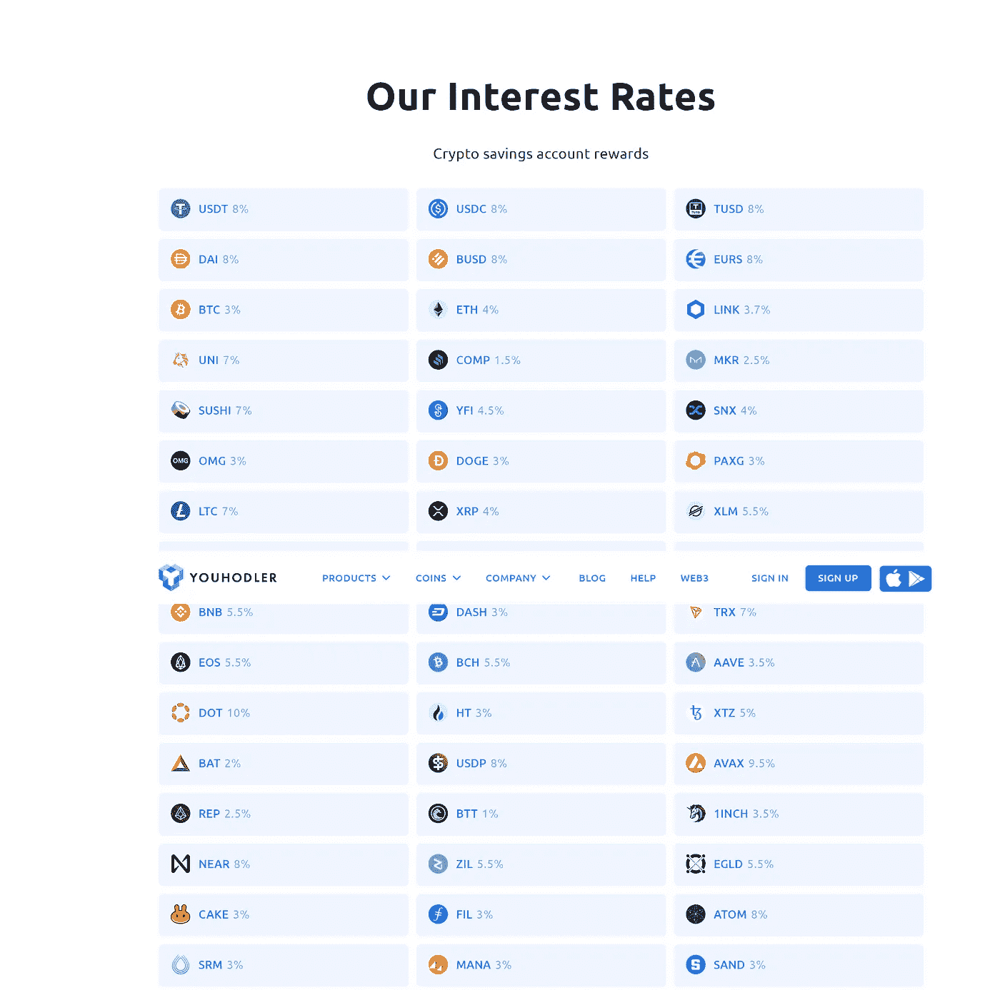
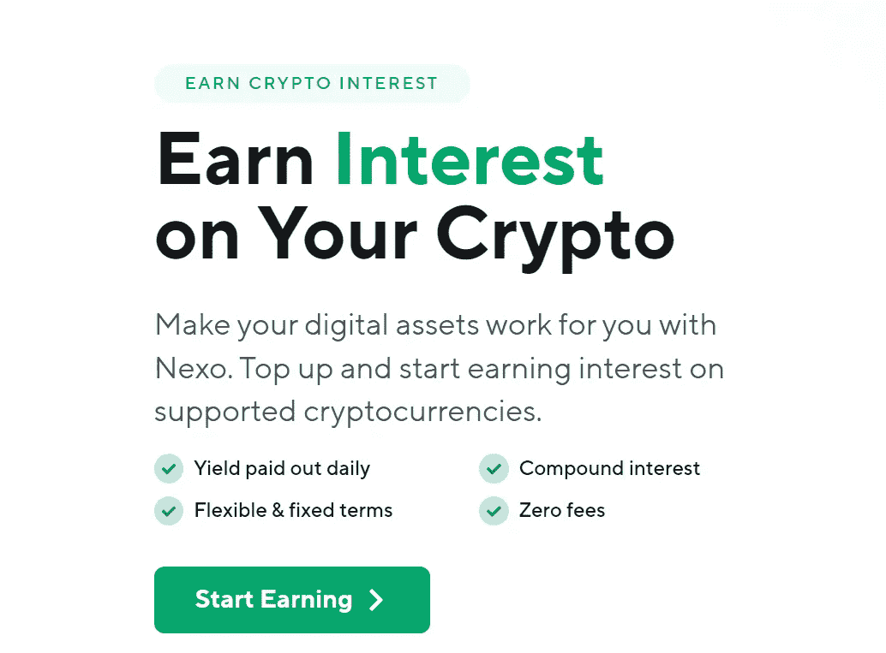
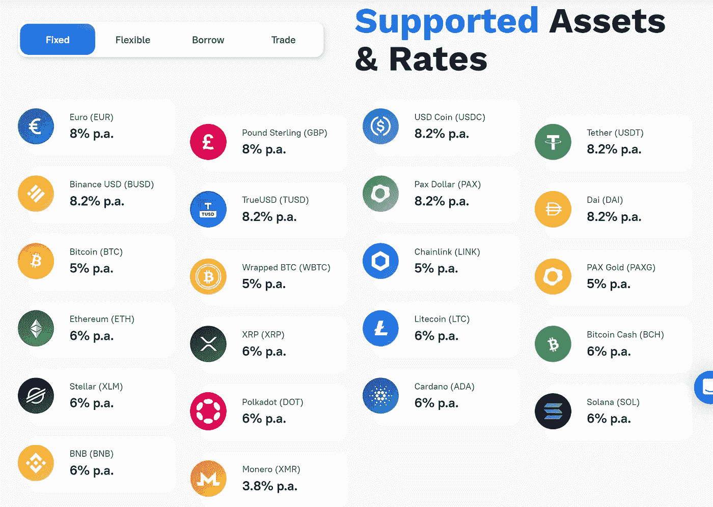

# 3 个最佳加密贷款平台-加密贷款网站

> 原文：<https://medium.com/coinmonks/top-5-crypto-lending-platforms-in-2020-that-you-need-to-know-a1b675cec3fa?source=collection_archive---------0----------------------->

## 获得比特币和其他加密货币的最佳贷款利率。

我们都同意，2020 年是充满挑战的一年。由于新冠肺炎疫情，加密货币和传统市场在去年 3 月走下坡路。情况一直在好转，比特币在 8 月份达到了 12000 美元，比 3600 美元的价格暴跌有了显著的上涨。临近 2020 年底，比特币卷土重来，达到 2 万美元的历史新高，截至 2021 年 2 月初，已经翻倍至 4 万美元以上。对于加密货币来说，这无疑是一次令人印象深刻的反弹。然而，全球经济仍在挣扎，尽管在政府干预下缓慢反弹。新冠肺炎疫情还没有结束，并继续在全球市场制造波动。

在这种时候，尽管经历了动荡的一年，比特币等加密货币仍然是有价值的金融资产。出色的增长和最近破纪录的历史高点证明了比特币正在巩固其在金融界的地位。它是一种非通货膨胀的数字货币，不是由个人或公司管理，而是由一个协议管理。随着关于传统市场的传言达到负利率，比特币投资者是时候通过出借资产并赚取利息来保持资产保值和提高生产率了。

加密贷款是一种你借出加密货币并赚取利息的交易。加密贷款平台促进了这种交易，这些平台接受不同加密货币的存款，如比特币、以太币或稳定币，并有一定的利息回报。比特币贷款利率各不相同，但通常非常具有竞争力，有些利率高达年收益率的 12%(APY)。这些平台也经常借出有抵押品的资产，通常是加密的，因此被称为加密支持贷款。

如果你正在考虑通过加密贷款来增加你的加密资产，这里有 3 个值得考虑的加密贷款平台。

# #1 [**尤霍德勒**](https://coincodecap.com/go/youhodler)

来自瑞士的 [YouHodler](https://coincodecap.com/go/youhodler) 是一家欧盟公司，专注于通过法定贷款选项提供加密贷款。该平台提供美元、欧元、瑞士法郎、英镑、欧元和稳定币贷款，抵押品为 BTC、瑞士联邦理工学院、XRP 和其他主要加密货币。

值得注意的是，如果你没有想要存入并赚取利息的密码，你可以从你拥有的另一个密码或法定货币转换。

## 优霍德尔利率

YouHodlers 为稳定币提供高达 12.3%的年利率(BTC 为 4.8%)，并支持 4 种法定货币、7 种稳定币和 15 种加密货币。

> **读** [读**读**读](/coinmonks/youhodler-4-easy-ways-to-make-money-98969b9689f2)
> 
> [**4 种轻松赚钱的方法**](https://blog.coincodecap.com/youhodler-earn-crypto-interest) **与 YouHodler**

# #2 [Nexo](https://coincodecap.com/go/nexo)

作为全球最大的加密贷款机构之一，Nexo 在分散金融领域备受推崇。Nexo 已经为 200 个国家的 800，000 多名客户处理了价值超过 30 亿美元的交易，其目标是一步一步地扰乱金融系统。

## Nexo 利率

用户可以通过他们的平台，从存放在利息账户中的加密或法定资产中赚取利息。crypto 的利率为 5 %, stable coins 的利率高达 10%,按日支付。

随着 Nexo 卡的推出，Nexo 扩展了其服务，该卡使符合条件的用户可以立即获得加密信用额度，他们可以在不出售其加密的情况下消费。

# #3 [信用贷款](https://coincodecap.com/go/coinloan)

CoinLoan 是爱沙尼亚的一个流行的加密生息平台。该公司旨在为每个加密用户提供一个易于使用、移动友好的平台，以充分利用他们的数字资产。

该平台还提供了一项快速服务，将他们持有的密码从一家交易所快速转移到同一平台下的一家贷款服务机构。用户可以从他们的加密货币中赚取高达 12.3%的利息，资产类型包括 BTC、瑞士联邦理工学院和 USDC。

阅读我们的 [CoinLoan 评论](https://coincodecap.com/coinloan-review)了解更多。

# 最佳加密贷款平台

1.  
2.  **[**尤霍德勒**](https://blog.coincodecap.com/go/youhodler)**
3.  **[**Nexo**](http://blog.coincodecap.com/go/nexo)**

> **加入 Coinmonks [电报频道](https://t.me/coincodecap)和 [Youtube 频道](https://www.youtube.com/c/coinmonks/videos)获取每日[加密新闻](http://coincodecap.com/)**

## **另外，阅读**

*   **[五大加密管理平台](https://coincodecap.com/crypto-management-platforms)**
*   **[复制交易](/coinmonks/top-10-crypto-copy-trading-platforms-for-beginners-d0c37c7d698c) | [加密税务软件](/coinmonks/crypto-tax-software-ed4b4810e338)**
*   **[网格交易](https://coincodecap.com/grid-trading) | [加密硬件钱包](/coinmonks/the-best-cryptocurrency-hardware-wallets-of-2020-e28b1c124069)**
*   **[加密交易所](/coinmonks/crypto-exchange-dd2f9d6f3769) | [印度的加密应用](/coinmonks/buy-bitcoin-in-india-feb50ddfef94)**
*   **[开发人员的最佳加密 API](/coinmonks/best-crypto-apis-for-developers-5efe3a597a9f)**
*   **最佳[加密借贷平台](/coinmonks/top-5-crypto-lending-platforms-in-2020-that-you-need-to-know-a1b675cec3fa)**
*   **杠杆代币的终极指南**
*   **[ko only 审查](https://coincodecap.com/koinly-review) | [Binaryx 审查](https://coincodecap.com/binaryx-review)**
*   **[40 个最佳电报频道](https://coincodecap.com/best-telegram-channels) | [1xBit 回顾](https://coincodecap.com/1xbit-review) | [Keevo 钱包回顾](https://coincodecap.com/keevo-wallet-review)**
*   **[如何在印度购买以太坊？](https://coincodecap.com/buy-ethereum-in-india) | [如何在币安购买比特币](https://coincodecap.com/buy-bitcoin-binance)**
*   **[在美国如何使用 BitMEX？](https://coincodecap.com/use-bitmex-in-usa) | [BitMEX 评论](https://coincodecap.com/bitmex-review) | [买入索拉纳](https://coincodecap.com/buy-solana)**