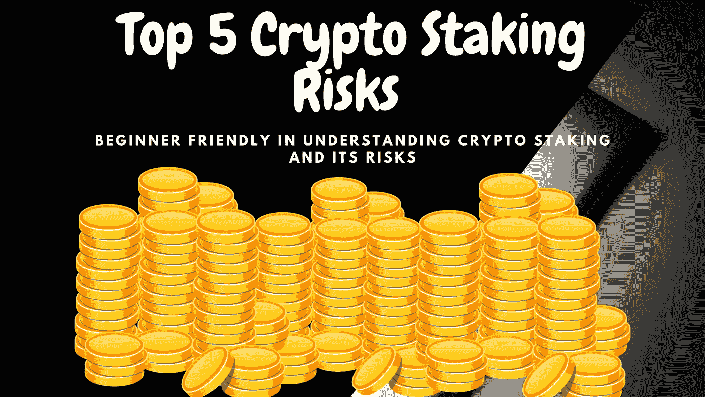

# 你应该知道的 5 大加密赌注风险|加密投资|初学者友好

> 原文：<https://medium.com/coinmonks/top-5-crypto-staking-risks-which-you-should-know-crypto-investment-beginner-friendly-dbab523a7fd5?source=collection_archive---------0----------------------->

## 初学者容易理解加密赌注及其风险

# 什么是加密赌注？

简单来说，跑马圈地就是锁定加密货币以获得奖励的行为。你可以从你的密码中直接下注你的硬币…