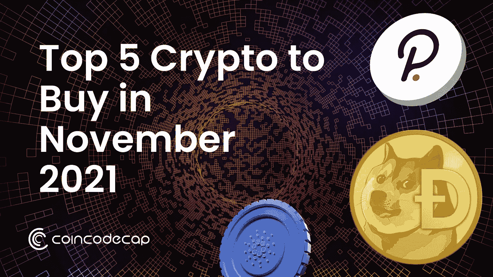
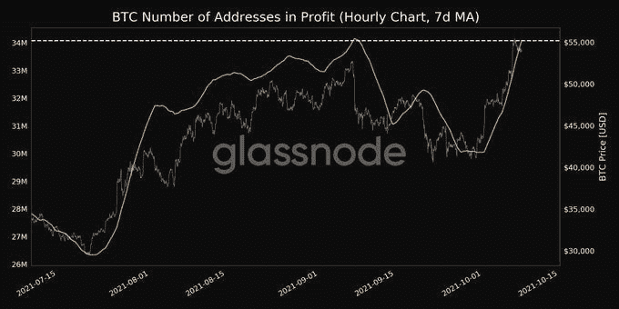
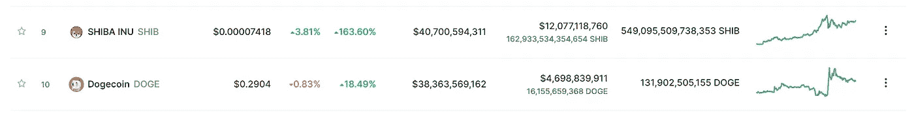
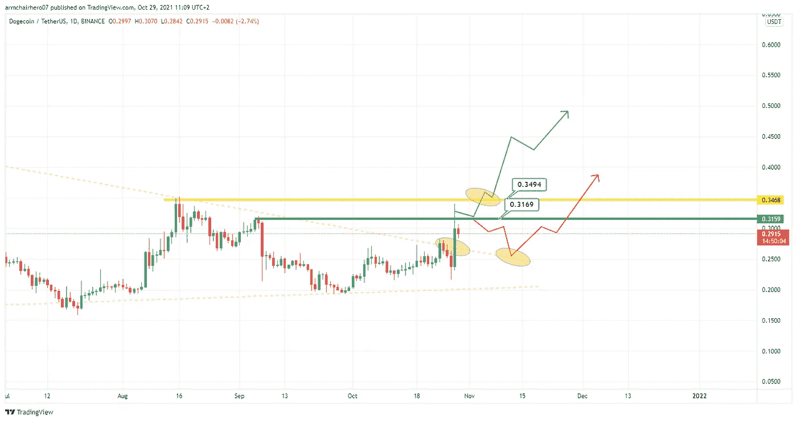
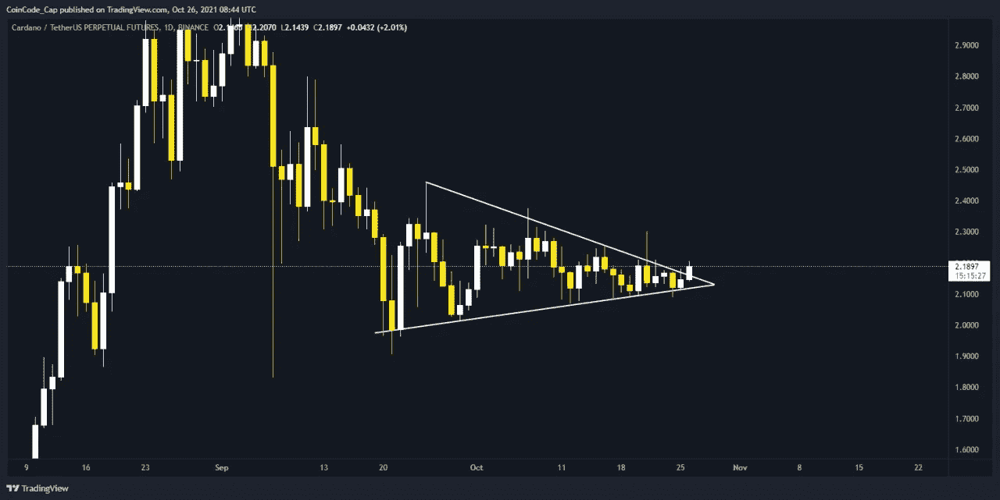
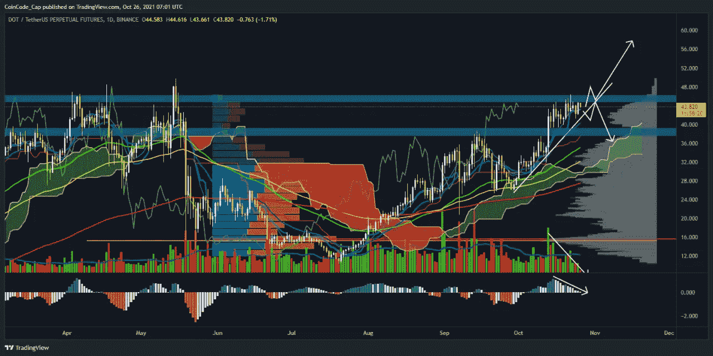
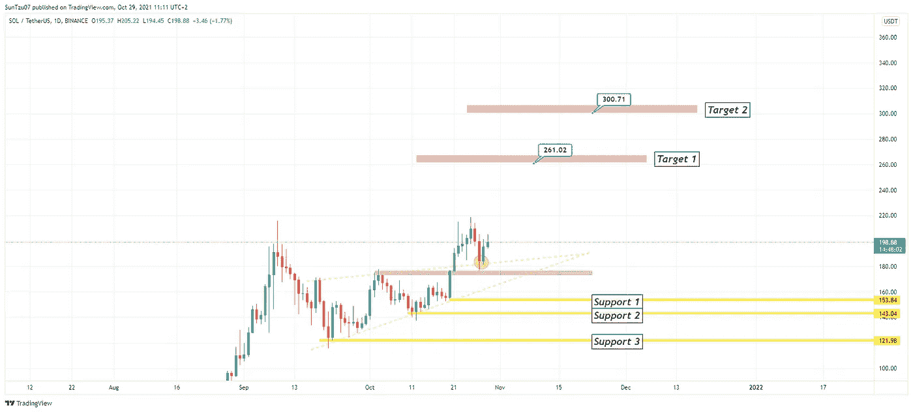
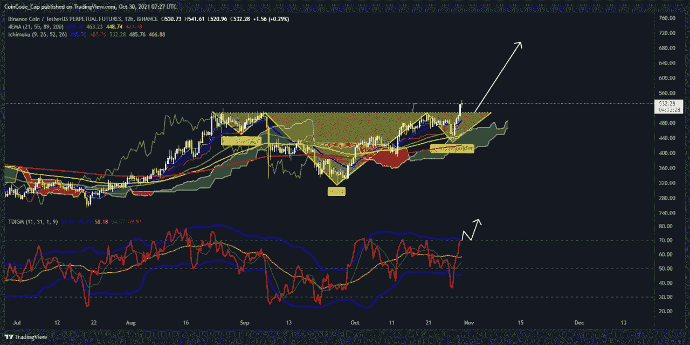

# 2022 年最值得购买的五大加密技术

> 原文：<https://medium.com/coinmonks/top-5-crypto-to-buy-in-november-2021-b9c99c44a704?source=collection_archive---------0----------------------->

## DOGE、ADA 和另外三家公司(继续阅读了解他们的名字)是 2021 年 11 月购买的最佳加密资产。

因此，我在这里与最佳替代硬币购买系列的另一篇文章。既然我们大多数人在 10 月份已经用比特币至少赚了一些利润[至少根据 [Glassnode](https://twitter.com/glassnodealerts/status/1446388896967843843) ]，那么让我们试着看看一些可以帮助我们在 11 月份获得良好回报的替代币。

在经历了一个月的小幅上涨后，我们是否会看到一次回调，或者这波涨势会持续下去，目前还不清楚。由于比特币在达到 67k 的 ATH 后出现了回调，许多人认为我们很快就会看到一个替代比特币的季节。因此，为了安全起见，让我们来看看你应该留意的五种最好的硬币/代币[除了 BTC 和 ETH (IYKYK)]

# 1.DOGE 分析(DOGE coin):DOGE to 1 美元还在轨道上吗？

DOGE 最终展示了一些迷因币的力量，因为从今年四月开始我们已经习惯了它。这背后的原因可能是资本从 SHIB 流向总督。见证迷因硬币之战将是奔牛节的一个有趣插曲。此外，两种硬币的持续走强显示了其背后投资者的实力。一方面，总督之父埃隆的目标是把它提高到 1 美元，另一方面，SHIB 可能会成为最终的总督杀手。

DOGE vs SHIB

正如我们看到的，SHIB 最近在市值方面超过了多格，他们都在为这个位置激烈竞争。此外，DOGE 确实再次超过 SHIB 一段时间，这是它打破 0.31 美元的强阻力区的时候，如下图所示:

DOGE Price Prediction

## 2021 年 11 月 DOGE 价格预测

可能会对支撑进行重新测试；然而，一旦这枚硬币开始加速，我们从今年早些时候就知道，它可以很快聚集很多动力。一个关键水平将是 0.35 美元以上，并保持这一水平，这将是一个非常乐观的迹象。总督的好日子就在前面；我们感觉到了！

# 2.ADA 分析(Cardano)

ADA 的价格图表最近表现不佳，因此出现在我们的列表中。Cardano 一直在改进区块链，并经常推出新功能以提高其采用率。因此，根据我们的分析师，ADA 在过去的一个月里一直在一个对称的三角形中整合，社区期待着很快会有一个大的向上移动。此外，根据我们的分析师，ADA 可能最终突破对称三角形，我们可能会看到一个完美的看涨情绪。然而，首先，我们应该在 2.21 点以上等待几个日线收盘，这样我们就可以完美进场，并体面地上涨。

ADA Price Prediction

# 3.点分析

我们在上个月的文章中也包括了 Polkadot，所以如果你真的读过它[没有？ [***阅读此处***](/coinmonks/top-5-altcoins-to-buy-in-october-2021-c864fa9140da) ，查看结果】Polkadot 从 10 月 2 日的价格上涨了 15 美元。我们也将其添加到本月的列表中，作为一系列可以导致 DOT 出色反弹的事件。在最近的公告中，Polkadot 将在 11 月举办第一次 Parachain 拍卖，因此很明显，我们应该密切关注其当前的市场价格。

此外，根据我们的市场分析师，如果 DOT 能够突破下图中市场水平的强大阻力，我们可以看到一个非常好的反弹和一些新的趋势。然而，如果 DOT 不能打破展示的阻力，那么我们可能会看到一个支持它的修正。我们也可以从 MACD 条形图中看到，DOT 正处于反转或继续下行的关键位置。此外，交易量也在稳步下降，我们应该密切关注交易量，因为上涨将伴随着高交易量。

DOT Price Prediction

# 4.溶胶分析(索拉纳)

你是否错过了 10 月份价格上涨 9 倍的 SOL 列车？别担心，SOL 似乎吸引了一些投资者。

根据我们的技术分析师，索拉纳仍然是 altcoin 市场的顶级玩家之一，在这一趋势中具有惊人的实力。我们有信心保持在 20 和 50 均线云之上，以及给所有投资者额外信心的新 ATH。

## SOL 价格预测 2021 年 11 月

我们预计 11 月份将有强劲表现，可能会创下历史新高，我们的第一个目标是 260 美元，第二个目标是 300 美元。任何对支撑线的回撤都是追加买入的好机会。

SOL Price Prediction

# 5.BNB 分析(币安硬币)

如果你们中的任何人还记得这波牛市(1 月)的开始，那么你可能知道当谈到 BNB 的市场价值时，我们已经走了多远。从一枚在 25-40 美元之间波动的硬币到一枚 ATH 达到大约 700 美元的硬币，(该死，大约是 28 倍)。

比特币反弹的第二阶段刚刚开始，所有的比特币都在回归正轨，BNB 也是如此。根据我们的技术分析师，BNB 刚刚打破了逆头肩底的模式，而且它还利用一片云做到了这一点。均线也显示了不错的实力。此外，贸易动态显示出阻力，因此我们期待从那里开始的上升趋势。

BNB Price Prediction

# 结束语

交易最重要的部分是纪律和耐心。因此，根据上述分析，我们刚刚谈到的硬币可能会有一些不错的收益。再说一遍，你要投资的是你的血汗钱，所以在投资前做好自己的研究。

本文中没有任何金融建议，此外，你应该只投资于你认为对你的投资组合有利的市场。

最初发布于:

[T3【https://blog.coincodecap.com/crypto-to-buy-in-november-2021】T5](https://blog.coincodecap.com/crypto-to-buy-in-november-2021)

下周末我会带着另一篇文章回来。在那之前，请点击“关注”按钮继续阅读我的文章，如果你读得不错，请鼓掌表示支持！

与我联系，

[**Twitter**](https://twitter.com/prabxat)**|**[**LinkedIn**](https://www.linkedin.com/in/praxhat/)

> [比特币:中本聪时代](/coinmonks/bitcoin-the-age-of-satoshi-nakamoto-fe58157e740d?source=user_profile---------0----------------------------)
> 
> [2021 年 10 月最值得购买的 5 种代用币](/coinmonks/top-5-altcoins-to-buy-in-october-2021-c864fa9140da?source=user_profile---------2----------------------------)
> 
> [BTCST 刚刚 3 天涨了 5 倍|目标是 1000 美元吗？](/coinmonks/btcst-just-went-5x-in-3-days-is-it-aiming-for-1-000-9dcba894c954?source=user_profile---------1----------------------------)
> 
> 银行会灭亡还是会适应？DeFi 的未来将会决定。
> 
> 你钱包里的 100 美元是钱还是没有价值的东西？
> 
> [2021 年底前比特币还在破 100K 的路上吗？](/coinmonks/is-bitcoin-still-on-its-path-to-break-100k-before-the-end-of-2021-4716a56745ce?source=user_profile---------1----------------------------)
> 
> 作为一名大学本科生，我是如何开始投资 Crypto 的？

这篇文章中所写的一切都是我所相信的，很可能你的想法和我的不同(显然我们是两个不同的人)。因此，把这篇文章当成轻松读物，如果你不喜欢它的内容，就当你没读过它吧！

关联披露:点击一些链接可能有助于我们获得金钱利益。

> 加入 Coinmonks [电报频道](https://t.me/coincodecap)和 [Youtube 频道](https://www.youtube.com/c/coinmonks/videos)获取每日[加密新闻](http://coincodecap.com/)

## 另外，阅读

*   [复制交易](/coinmonks/top-10-crypto-copy-trading-platforms-for-beginners-d0c37c7d698c) | [加密税务软件](/coinmonks/crypto-tax-software-ed4b4810e338)
*   [网格交易](https://coincodecap.com/grid-trading) | [加密硬件钱包](/coinmonks/the-best-cryptocurrency-hardware-wallets-of-2020-e28b1c124069)
*   [密码电报信号](http://Top 4 Telegram Channels for Crypto Traders) | [密码交易机器人](/coinmonks/crypto-trading-bot-c2ffce8acb2a)
*   [最佳加密交易所](/coinmonks/crypto-exchange-dd2f9d6f3769) | [印度最佳加密交易所](/coinmonks/bitcoin-exchange-in-india-7f1fe79715c9)
*   开发人员的最佳加密 API
*   最佳[密码借贷平台](/coinmonks/top-5-crypto-lending-platforms-in-2020-that-you-need-to-know-a1b675cec3fa)
*   杠杆代币的终极指南
*   [霍比评论](https://coincodecap.com/huobi-review) | [OKEx 保证金交易](https://coincodecap.com/okex-margin-trading) | [期货交易](https://coincodecap.com/futures-trading)
*   [麻雀交换评论](https://coincodecap.com/sparrow-exchange-review) | [纳什交换评论](https://coincodecap.com/nash-exchange-review)
*   [Stackedinvest 评论](https://coincodecap.com/stackedinvest-review) | [北海巨妖评论](/coinmonks/kraken-review-6165fc1056ac) | [bitFlyer 评论](https://coincodecap.com/bitflyer-review)
*   [MoonXBT vs Bybit vs 币安](https://coincodecap.com/bybit-binance-moonxbt) | [硬件钱包](/coinmonks/hardware-wallets-dfa1211730c6)
*   [如何购买 ADA](https://coincodecap.com/buy-ada-cardano) | [Geco？一次回顾](https://coincodecap.com/geco-one-review)