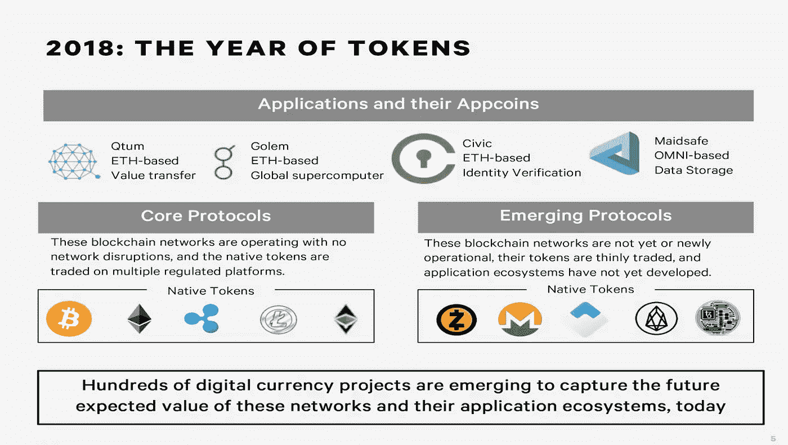
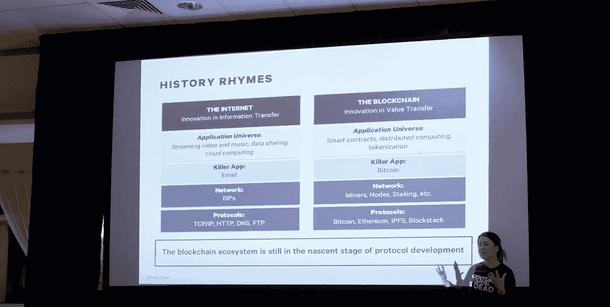
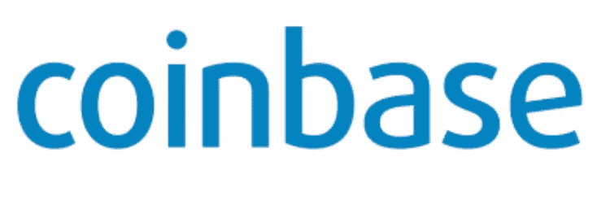
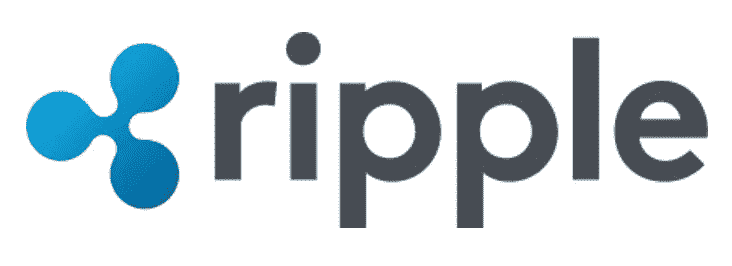
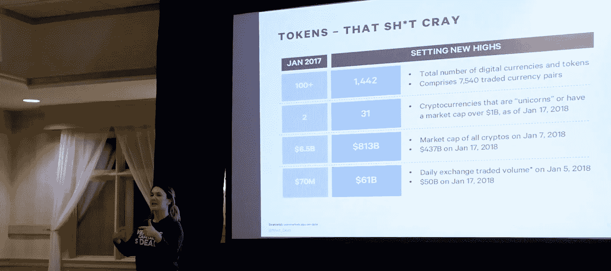

# 2018 年五大加密趋势

> 原文：<https://medium.com/coinmonks/top-5-crypto-trends-in-2018-d3b517d43aa0?source=collection_archive---------3----------------------->

作为一家投资公司，跟上在加密的兔子洞里出现的最新事物总是很重要的。理解是很重要的。 [Meltem DeMirrors](https://www.youtube.com/watch?v=nUhaQIT1wfI) 在细分 2017 年至 2018 年的市场规模方面做得非常好。

这是[的视频](https://www.youtube.com/watch?v=nUhaQIT1wfI)，它真正地诠释了这一切

# (1)今年是代币年

## 货币单位或效用单位可以用作建立在现有区块链和协议之上的系统

# (2)历史押韵

正如我在我的[博客中提到的，引用了 Fred Wilson](/coinmonks/fred-wilson-union-square-ventures-thinks-the-internet-rhymes-with-blockchain-c36ae1d38b21) 的话，Meltem 也提到了历史的韵律。我喜欢这张幻灯片，它展示了我们可以看到的与互联网的诞生相一致的技术。90 年代的杀手级应用是电子邮件。同样，从一个人向另一个人汇款的账本又名比特币，是新区块链时代的电子邮件。这是演示文稿中的一张很棒的图片

# (3)2018 年，风投支持的生态系统中只有 2 家独角兽，2017 年一家也没有

他们是比特币基地&里普。据 Investopedia 报道，“独角兽”一词最早是由风险投资家 Aileen Lee 推广开来的，她是位于加州帕洛阿尔托的种子期风险投资基金[的创始人。在她的文章《欢迎加入独角兽俱乐部:向十亿美元创业公司学习》中，她观察了 2000 年代成立的软件创业公司，估计其中只有 0.07%达到了 10 亿美元的估值。那些达到 10 亿美元大关的公司非常罕见，找到一个就像找到一只神话中的独角兽一样困难。”](https://www.investopedia.com/terms/v/vcfund.asp)

“比特币基地是购买和安全存储比特币、比特币现金、以太坊和莱特币的首选方式，为 btc、eth 和 ltc 提供最完整的网络和移动服务。我们让安全购买、使用和存储数字货币变得简单易行。”ripple 的强大之处在于它“通过 RippleNet 连接银行、支付提供商、数字资产交易所和企业，提供一种无摩擦的全球汇款体验。”

# (4)2018 年的交易所交易量为 610 亿美元

代币的交易所交易量正在激增，这实际上是因为货币不再以原始货币的形式进行评估。散户投资者和合格投资者都超额认购了这几轮股票，通常情况下，一旦他们进入交易所，价格往往会在 6 个月后归零。然而，从积极的一面来看，当代币是一个有用的项目时，它可以实现服务、社会信用和效用。如果以最简单的形式来看代币，最好的例子之一就是地铁通行证。你只需通过从美元兑换购买通票来支付乘车费用，但在使用后，就没有二级市场或套利机会，除非你能够以更高的价格出售月票，并从中赚取差价。但这需要额外的步骤，并说服某人去做一些没有动机的事情。我们感到兴奋的是，更多的基础设施扮演着安全令牌的角色

# (5)8130 亿美元的市值，而 2017 年仅为 65 亿美元

综上所述，如上图所示，这对整体市值有直接的下游影响。去年的问题是，许多人都在投机，而不是着眼于具有长远意义的正确项目。因此，一旦实现了流动性，受益于信息不对称的实际上是项目开发商和投资者。

仅供参考:在视频中观看的所有这些幻灯片都发布在 slideshare 上的[此处>](https://www.slideshare.net/DCGCo/venture-capital-is-dead-how-blockchain-tech-cryptocurrencies-and-tokens-are-changing-capital-formation?ref=https://www.slideshare.net/DCGCo) :

如果你觉得这篇文章是有益的，请为我们鼓掌，分享给你的朋友，并随时在 genbvc.com 给我们发短信。查看我们的电报频道[这里>](https://t.me/genesisblockholdings) ，关注我们的博客[这里>](/@genblockfund)

> [直接在您的收件箱中获得最佳软件交易](https://coincodecap.com/?utm_source=coinmonks)

