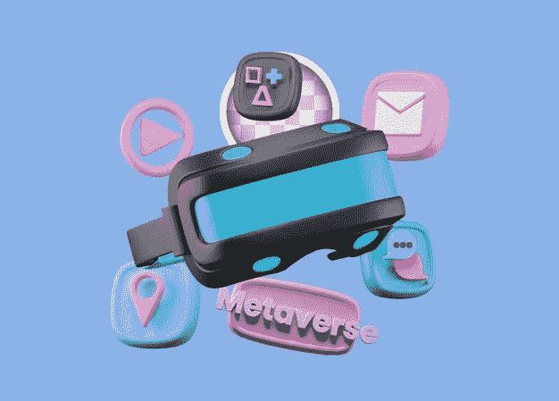
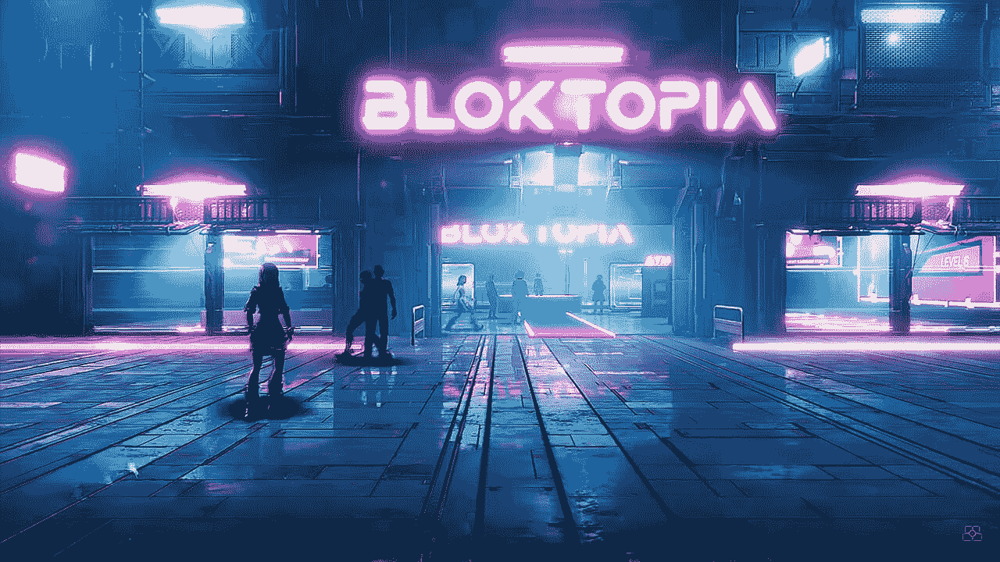
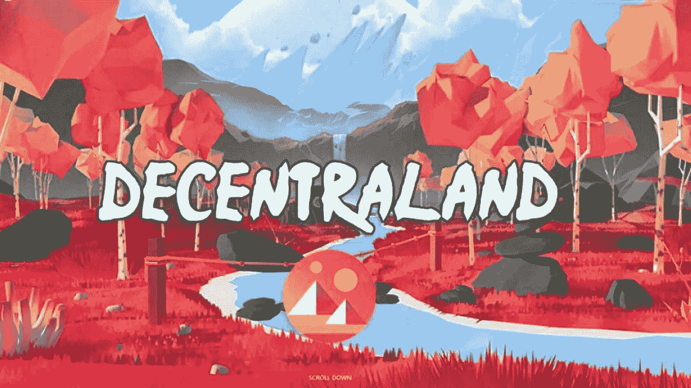
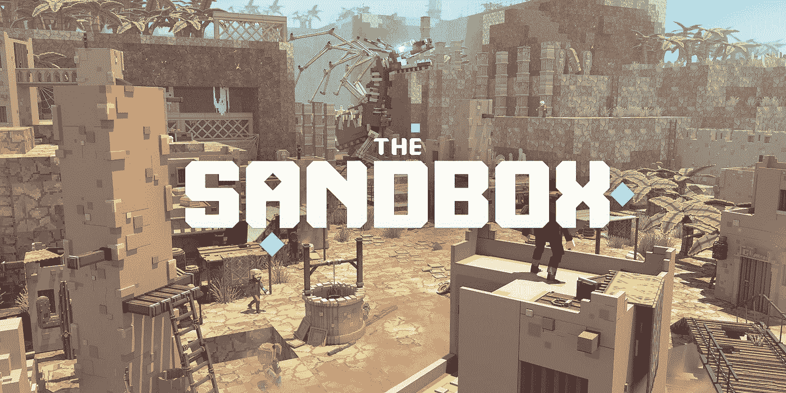
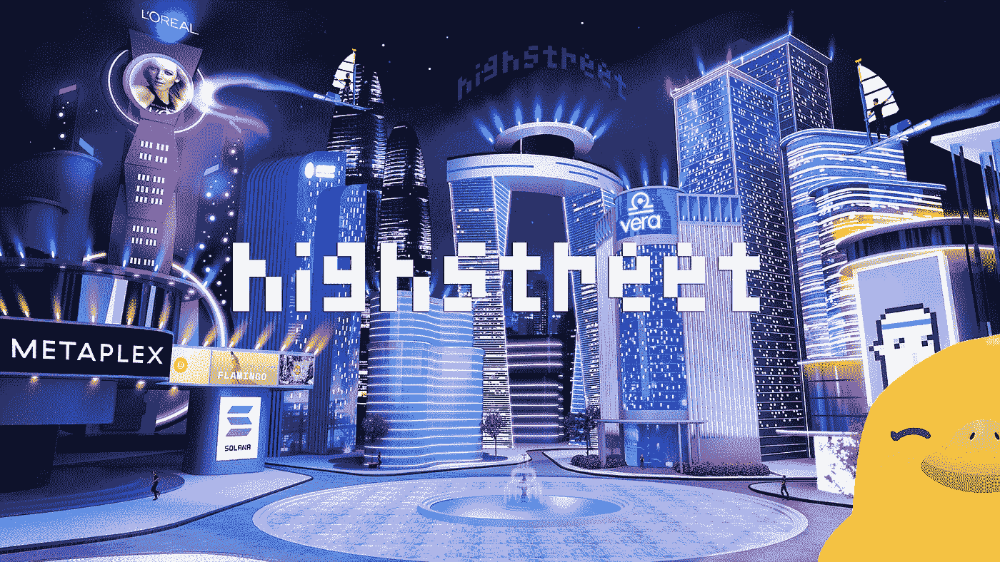
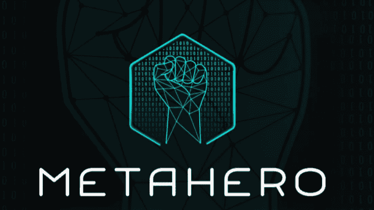

# 2021 年元宇宙五大博彩项目

> 原文：<https://medium.com/coinmonks/top-5-gaming-metaverse-projects-in-2021-e0460426c1d?source=collection_archive---------2----------------------->

***编者按:不是理财建议***

元宇宙项目已经抢走了密码舞台的聚光灯。随着微软和脸书等科技巨头推出自己的元宇宙项目，新的虚拟现实似乎准备颠覆这个世界。

据 EarthWeb 报道，[截至 2020 年，元宇宙市场价值不到 500 亿美元，而预计到 2025 年，该市场价值将达到 2800 亿美元。就在最近，](https://earthweb.com/metaverse-statistics/)[脸书更名为 Meta](https://www.laptopmag.com/news/facebook-changes-its-name-to-meta-and-drops-shocking-vr-news-gta-is-coming-to-oculus) ，即“元宇宙”一词的前缀，这给了大多数元宇宙加密货币一个巨大的推动。

今年给了元宇宙的粉丝们很多令人兴奋的项目。今天，我们将通过任何加密游戏爱好者应该知道的 5 大游戏元宇宙项目。

# 什么是元宇宙？

元宇宙代表了一种高度沉浸式的共享虚拟现实，允许个人玩游戏、社交和工作。“元宇宙”一词由两个前缀组成——“元”代表“背后或超越”，甚至“更全面”，而该词的第二个词“韵文”来自“宇宙”，它代表“区域、球体或虚构的世界”。

元宇宙与建立在区块链上的 Web3.0 的发展密切相关，基本上，它将赋予访问和权威，并软化最大的技术品牌的纽带。

元宇宙的概念并不全新。21 世纪初，世界迎来了大量元宇宙的先驱，包括林登实验室著名的[Second Life](https://venturebeat.com/2021/09/03/the-deanbeat-will-the-metaverse-bring-the-second-coming-of-second-life/)和苏拉克的 Habbo Hotel。他们都引起了早期元宇宙爱好者的注意，每天仍有超过 20 万用户使用第二人生。

然而，我们将在下面讨论的项目所提供的元宇宙是一个全新的水平。

## **1。Bloktopia**

Bloktopia 呈现了虚拟现实的一个创造性转折。Bloktopia 的创意团队提出了一个垂直堆叠的环境，用户可以在其中玩耍、赚钱、学习和创作，而不是构建一个巨大的地图。

Bloktopia 是一座 21 层的元宇宙摩天大楼，向第一种加密货币比特币的 2100 万枚硬币致敬。就像在其他 metaverses 中一样，用户可以购买、出售和拥有虚拟财产。Bloktopia 上的 NFT 以 REBLOK、ADBLOK 和 JOBE 的形式出现，它们分别通过虚拟房地产和广告产生收入，为所有者提供了以 BLOK 代币形式获得被动收入的巨大机会。

Bloktopia 已经完成了成功的融资活动，[包括与 BullPerks](https://app.bullperks.com/deals) 的风投交易，IDO 与 RedKite、Seedity、Oxbull 和 TrustPad 的交易。此外，该团队迄今为止已经宣布与业内一些最大的公司建立合作伙伴关系，包括埃尔隆德网络公司、Animoca Brands 和 Kucoin，这使得该项目成为加密界的焦点。还有。币安 NFT 公司最近刚刚在元宇宙区设立了自己的办事处。

在 Bloktopia 的虚拟世界中，用户将能够访问办公室，并与团队进行虚拟互动，从而使品牌能够改善与用户的互动和关系。

## **2。分散土地**

[分散地](https://decentraland.org/)成立于 2017 年，是第一批建立在以太坊网络上的元宇宙平台之一。

该项目的 NFT 模式允许个人从有限的 90，601 个游戏内地块中购买。每块土地总共有 16 平方米，所有者可以按照他们希望的方式建造和改善它，以获得更多的游戏利益，或者干脆卖掉它来获利。

分散之地的元宇宙生态系统以其固有的符号 MANA 运行。代币持有者有权投票决定政策变化，并提议土地上市的细节。

## **3。沙盒**

沙盒是一个位于 NFT 的元宇宙，用户可以在这里玩，建立和货币化他们的资产。沙盒构建的平台虚拟世界是社区驱动的，是去中心化基本原则的伟大代表。

该平台的用户生成内容环境有自己的 NFT 市场，玩家可以在那里买卖游戏中的土地和房地产，以获得更身临其境的体验。平台内部的交易是通过其官方令牌$SAND 来完成的。

此外，SAND 令牌持有者还可以访问该平台的独有功能，以及管理权限和赌注。

## **4。高街**

Highstreet 是一个基于 NFT 的游戏化购物体验，由以太坊和多边形网络支持。

Highstreet 与名单中的其他元宇宙项目不同，因为它提供了一种部分数字、部分物理(“物理”)的混合虚拟体验，将零售业带到了一个全新的水平。

NFT 是 Highstreet 生态系统的重要组成部分。游戏中的 NFT 角色，被称为 FOMO 鸭，使用户能够购买、销售和拥有现实生活中的物品，并允许品牌触及他们热衷于加密的客户。此外，用户只需花时间玩游戏或完成任务就能获得代币。

## **5。超级英雄**

[Meta Hero](https://metahero.io/) 是首批将 3D 扫描和建模技术引入元宇宙的平台之一。这项技术在其合作伙伴 Wolf Studio 的帮助下得以实现，允许用户毫不费力地将他们的现实世界资产转换为元宇宙的 NFT。

元扫描仪在元宇宙的应用提供了大量革命性的使用案例，包括 3D 打印、扫描网络和构建游戏角色。虽然 4K 高清扫描仪已经可以使用，但该团队正计划在不久的将来升级到 16K 超高清。

Metahero 的原生令牌$HERO 用于平台内的交易，例如在市场中买卖资产、支付扫描和版税。

> 加入 Coinmonks [电报频道](https://t.me/coincodecap)和 [Youtube 频道](https://www.youtube.com/c/coinmonks/videos)了解加密交易和投资

## 另外，阅读

*   [网格交易机器人](https://blog.coincodecap.com/grid-trading) | [Cryptohopper 审查](/coinmonks/cryptohopper-review-a388ff5bae88) | [Bexplus 审查](https://blog.coincodecap.com/bexplus-review)
*   [7 个最佳零费用加密交易平台](https://blog.coincodecap.com/zero-fee-crypto-exchanges)
*   [分散交易所](https://blog.coincodecap.com/what-are-decentralized-exchanges) | [比特 FIP](https://blog.coincodecap.com/bitbns-fip) | [Pionex 评论](https://blog.coincodecap.com/pionex-review-exchange-with-crypto-trading-bot)
*   [用信用卡购买密码的 10 个最佳地点](https://blog.coincodecap.com/buy-crypto-with-credit-card)
*   [最好的卡达诺钱包](https://blog.coincodecap.com/best-cardano-wallets) | [Bingbon 副本交易](https://blog.coincodecap.com/bingbon-copy-trading)
*   [印度最佳 P2P 加密交易所](https://blog.coincodecap.com/p2p-crypto-exchanges-in-india) | [柴犬钱包](https://blog.coincodecap.com/baby-shiba-inu-wallets)
*   [8 大加密联盟项目](https://blog.coincodecap.com/crypto-affiliate-programs) | [eToro vs 比特币基地](https://blog.coincodecap.com/etoro-vs-coinbase)
*   [最佳以太坊钱包](https://blog.coincodecap.com/best-ethereum-wallets) | [电报上的加密货币机器人](https://blog.coincodecap.com/telegram-crypto-bots)
*   [交易杠杆代币的最佳交易所](https://blog.coincodecap.com/leveraged-token-exchanges) | [购买 Floki](https://blog.coincodecap.com/buy-floki-inu-token)
*   [3Commas 诉 Pionex 诉 crypto hopper](https://blog.coincodecap.com/3commas-vs-pionex-vs-cryptohopper)|[Bingbon Review](https://blog.coincodecap.com/bingbon-review)