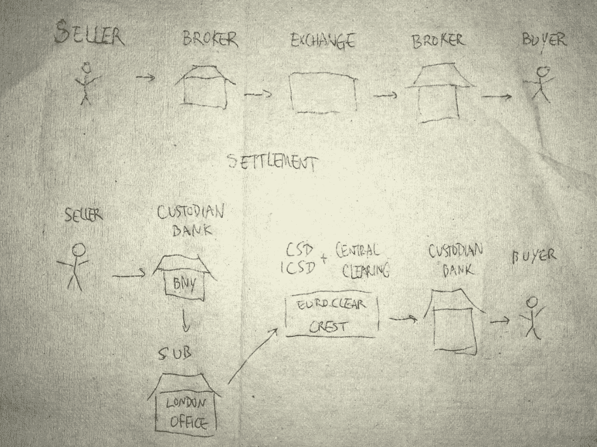

# 利用保管和冷存储保护您的加密资产的五大方法

> 原文：<https://medium.com/coinmonks/top-5-ways-to-protect-your-crypto-custody-with-cold-storage-9edf3f384153?source=collection_archive---------8----------------------->

监护仍然以集中的方式进行，目前没有真正分散的方法来广泛处理它。这是一个从[制度](/@jyz/institutional-custody-in-the-crypto-world-50a6814f2dfc)的角度看待事物的好方法。我喜欢他们参考的餐巾纸图来帮助想象下面的场景。

The old school way to handle custody reference [here](/@jyz/institutional-custody-in-the-crypto-world-50a6814f2dfc)

在 crypto 中，您在上面的图片中看到的许多银行功能可以在前端处理，并通过后端的服务、API、智能合同和业务逻辑向用户显示，以自动化许多操作。对于投资经理来说，购买、出售和存储数字资产可能是一笔很大的开销。

当我们看到像约翰·麦卡菲的[加密公司](https://blokt.com/news/investors-exposed-after-john-mcafee-backed-cryptocurrency-gets-hacked)遭到黑客攻击这样的新闻时，它会质疑是否有更安全的方法来备份私钥以及与数字身份和资产相关的资产。

[勇敢的新硬币](https://bravenewcoin.com/news/5-popular-custody-solutions-for-individuals-and-institutions/)提到了一些关于监护权的重要信息。从本质上讲，将资产隔离开来是保护它们的最佳方式。

# (1)

这里有一些引用的见解，他们分享给你的知识与冷藏。

引自勇敢的新硬币*“冷钱包是* ***而不是*** *联网的。这使得冰冷的钱包更少暴露于潜在的黑客攻击。因此，理想情况下，你的大部分资产应该冷藏起来。*

*纸质钱包是冷藏保管的一种，其中您的公共地址和私人密钥详细信息打印在一张物理纸条上，通常采用 QR 形式，然后存储在一个安全的地方。明智的做法是准备几份这张单子作为备份。下面介绍如何* [*制作纸质钱包*](https://www.coindesk.com/information/paper-wallet-tutorial/)

生成密钥的过程是在浏览器的 JavaScript 引擎中完成的，因此绝不会在互联网上传播。流行的纸质钱包生成器包括:

*   [*菌丝体*](http://pressreleases.datadriveninvestor.com/go/658996-54961-68954473) *，可以说是最安全的纸质钱包，因为它使用了一个 USB 加密狗，可以直接连接到你的打印机，因此永远不会与你的电脑接口；*
*   **它会使用您的浏览器生成随机地址和密钥，因此不会通过互联网发送任何内容。”**

# *(2)*

*在硬件方面，有像 [trezor](https://trezor.io/) 或其他外设可以用来支持用例，如 [ledger nano](https://www.ledgerwallet.com/)*

*说到更大的机构和对冲基金，这里列出了更多的选择。能够提供更好的资产所有权和安全性的更安全的替代方案是必不可少的。确保所有的制衡到位是至关重要的。*

*下面是这篇[博客](https://vauban.io/custody-options-for-crypto-hedge-funds/)的[摘录](/@vauban/custody-options-for-crypto-hedge-funds-fc4fd6c8a8a4)，它涵盖了 crypto 保护资产的其他领域。*

# *(3)*

***“多签名钱包***

**多签名钱包(“多签名”)本身不是一种保管方法，而是热/冷钱包的一项功能。**

**普通加密货币钱包通常使用单个私钥(相当于密码或 PIN 码)来授权钱包交易。**

**作为实施* [*适当治理&控制政策*](https://citadelle.io/crypto-hedge-funds-stopping-rogue-traders-asset-thefts/) *的对冲基金的一部分，访问权限可用于访问某些功能或进行某些交易。例如，在传统的对冲基金中，特定的交易需要由风险部门授权。**

**这种情况类似于多签名钱包，需要多个私钥(可以由不同的人分别持有)来授权该特定钱包的交易。**

# *(4)*

***机构托管人:交易所&加密经纪人***

**虽然与交易所内/交易所外的热钱包相比，冷(硬件)自保管钱包是更好的保管解决方案，但由于其自保管安排，丢失的风险&错误仍然由用户承担。**

**对于传统资产类别，国家立法和监管指引强制要求对冲基金使用* [*监管托管人*](https://citadelle.io/starting-a-hedge-fund-service-providers/) *。**

**对于加密货币，虽然没有正式的法律强制加密对冲基金使用托管人，但在实践中，机构投资者、hnw 和家族理财室更喜欢使用机构托管人的基金来保护加密资产。**

**一些交易所和加密货币经纪商(如* [*【比特币基地托管】*](https://custody.coinbase.com/)*[*双子星存管账户&隔离托管账户*](https://gemini.com/custody-services/) *)提供托管服务作为副产品。***

**使用机构托管人的好处是投资者更加信任基金资产的管理和安全。此外，托管安排的详情可添加至 [*私募备忘录*](https://citadelle.io/typical-documents-needed-to-start-a-hedge-fund/) *。***

# **(5)**

****机构托管人:专用托管人****

***虽然一些加密对冲基金可能决定使用其“主要”交易所作为其托管人，但希望进一步安抚机构投资者的基金经理可能会决定使用专门的托管人。***

***专用托管人是只做资产托管的托管人，不附带交易所或经纪业务。***

***使用专门的托管机构有两个主要优势。首先，将交易的执行&清算部分与资产托管分离在治理方面是积极的。最后，专门的托管人风险更低，破产的可能性也更小，因为它不会引起黑客的注意，不会直接与分数基础上运营的交易所相关联，也不会提供风险服务&产品，如保证金和衍生品。专用托管人的缺点是收取的费用可能远远高于交易所或经纪公司收取的加密托管费用。***

***总之，加密资产领域的托管安排是一系列的。在另一端，场内交易使交易者面临交易对手风险，而在另一端，专门的机构托管人非常昂贵，费用从 0.50%的 AUM 到 1%的 AUM 不等。基金经理必须考虑基金的 AUM、投资者的情况、交易策略和平均持有时间等因素，并据此做出选择。"***

**从我的博客这里了解更多有用的加密主题，成为专家:【https://medium.com/@joelpalathinkal **