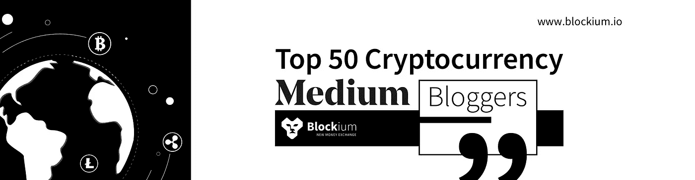

# 50 大加密货币媒体博主

> 原文：<https://medium.com/coinmonks/top-50-cryptocurrency-medium-bloggers-cf0e03a0c7fb?source=collection_archive---------1----------------------->

伊莱·埃德里

> 如果你在 Medium 上找不到合适的加密货币内容，我们列出了一些最值得狂欢的账户。坐下来，放松一下，准备好了解今天加密货币上最热门的一些内容。
> 
> 当然， [Coinmonks](/coinmonks/how-to-get-published-on-coinmonks-publication-bdf172add414) 的顶级加密出版物之一，这也是这篇文章发表在这里的原因。

## 1.[硬币和密码](https://medium.com/u/fffbcf90a5c9?source=post_page-----cf0e03a0c7fb--------------------------------)

《硬币与密码》展示了加密货币的一些优点和缺点。如果你还没有听说过他们，看看他们的一篇文章，从加密货币社区的 [19 位专业人士那里获得提示和技巧。阅读一篇文章，迷失在他们的平台上阅读各种有趣的加密货币新闻。](https://hackernoon.com/secrets-to-survival-19-pros-share-their-advice-on-crypto-trading-ec4b9d1dbb8b)

## 2.[维塔利克·布特林](https://medium.com/u/587a00dbce51?source=post_page-----cf0e03a0c7fb--------------------------------)

 [## 分权的含义

### “去中心化”是密码经济学领域中使用频率最高的词之一，甚至经常被认为是一个“去中心化”的词

medium.com](/@VitalikButerin/the-meaning-of-decentralization-a0c92b76a274) 

如果你还没有听说过 Vitalik Buterin，那你就错过了一位最知名的加密货币专家。Vitalik 是一个年轻的加拿大/俄罗斯密码天才，是以太坊的创始人之一。如果你从未有幸阅读过维塔利克·布特林的文章，那就看看他上面关于权力下放的文章吧。

## 3.[布莱恩·阿姆斯特朗](https://medium.com/u/cbc31cc3214a?source=post_page-----cf0e03a0c7fb--------------------------------)

不熟悉这个 crytopcurrency VIP？也许你会认出他是比特币基地的联合创始人兼首席执行官。布莱恩·阿姆斯特朗是加密货币社区中最有发言权的人之一。查看下面的文章，了解加密货币如何提供慈善捐赠。

 [## 加密货币慈善捐赠

### 我一直在思考如何加速世界向开放的金融体系转变(这是我们的使命…

medium.com](/@barmstrong/charitable-giving-with-cryptocurrency-11e24923cd4a) 

## 4.特伦特·拉平斯基

Trent Lapinski 为您报道比特币和加密货币新闻。查看他的账户，其中的文章涵盖了从加密货币到一般建议的各种主题。他关于区块链游戏化[的文章值得你花时间。](/@trentlapinski/gamification-of-the-blockchain-with-jai-hudes-f60d73db191d)

> 如果你碰巧喜欢那篇文章，看看我们的账户，了解更多关于[游戏化](/@Blockium/gamification-of-coins-simplifying-cryptocurrency-trading-d5a9ce46f965)

## 5.[比特币基金会](https://medium.com/u/84b337348a23?source=post_page-----cf0e03a0c7fb--------------------------------)

比特币综述是一个明确的目标。他们在 Medium 上策划了来自比特币和加密货币文章的最佳教育内容。你知道你会在这个博客上看到正确的内容，因为它是由最古老和最大的比特币倡导组织制作的。查看它们，了解更多关于比特币的信息。

 [## 比特币综述

### 这是一个教育资源，收录了一些跨媒介的关于比特币的最佳文章，由志愿者在最古老的…

medium.com](https://medium.com/bitcoinfoundation) 

## 6.[哈克顿](https://medium.com/u/4a8a924edf41?source=post_page-----cf0e03a0c7fb--------------------------------)

Hackernoon 是加密货币世界中最受关注的媒体博客之一，原因有很多。你会发现自己迷失在布局精美的博客页面上，浏览着令人惊叹的内容。内容总是在更新，不同的人谈论最新的科技新闻等等。不要犹豫。你不会后悔你找到了这个网页。

 [## 黑客正午

### 黑客如何开始他们的下午？

hackernoon.com](https://hackernoon.com) 

## 7.[琳达谢](https://medium.com/u/514b75d4b762?source=post_page-----cf0e03a0c7fb--------------------------------)

琳达·谢是加密货币最有影响力的女性之一。她对比特币新手有很多有价值的教育。如果你是加密货币社区的新手，那就行动起来，阅读她的内容，让自己安心一些。

 [## 给加密新手的提示

### 第一次接触加密货币既令人兴奋又令人畏惧。我问了密码部的人…

medium.com](/@linda.xie/tips-for-crypto-newcomers-2ee5ab2d85c1) 

## 8.[今日分散](https://medium.com/u/2bbdfed02d54?source=post_page-----cf0e03a0c7fb--------------------------------)

随着加密货币和比特币各方面内容的丰富，今天的去中心化正在走向去中心化。他们不断发布由大型加密货币公司和专家撰写的内容，这些人有很多可以分享的内容。今天就在分散中心获取你的每日剂量

## 9.丹尼尔·杰弗里斯

你应该关注的一位作家是丹尼尔·杰弗里斯。他为您带来了有趣的内容，并分享了他对加密货币主题以及其他文章的深刻见解，让您流连忘返。从阅读下面的文章开始，看看我们在谈论什么。

 [## 如何粉碎加密市场，辞掉工作，搬到天堂，做任何你想做的事情…

### 你喜欢按下按钮就能赚钱吗？

hackernoon.com](https://hackernoon.com/how-to-crush-the-crypto-market-quit-your-job-move-to-paradise-and-do-whatever-you-want-the-rest-27a4a3cc2bb1) 

## 10.[加密神谕](https://medium.com/crypto-oracle)

Crypto Oracle 是精英加密货币领导者向世界分享其宝贵思想的平台。你应该会发现许多专家在这个页面上写了文章，分享你可能没有听说过的新想法以及关于加密货币的有趣想法。

 [## 密码甲骨文

### 所有事物中的思想领袖

medium.com](https://medium.com/crypto-oracle) 

## 11.[密码链](https://medium.com/cryptolinks)

如果你是一个真正的加密货币爱好者，Cryptolinks 是你应该去的地方。该平台包括加密货币世界中所有不同观点的内容。你可以订阅他们的网页，获取必读文章的更新。你不会对他们发布的内容失望，因为它是由一群出色的作家和编辑策划的。

 [## 密码链接

### 加密货币爱好者的必读文章

medium.com](https://medium.com/cryptolinks) 

## 12.[米盖尔·库内塔](https://medium.com/u/85bcdb9bc7d9?source=post_page-----cf0e03a0c7fb--------------------------------)

以去中心化为特色。今天，Migeul Cuneta 专注于揭穿你可能在加密货币世界中听说过的常见误解。他就他认为的未来以及加密货币的未来给出了自己的观点和见解。

## 13.亚历山大·巴甫洛夫·尼尔森

如果你正在寻找一位撰写加密货币和比特币基础教程和操作指南的博主，亚历山大·巴甫洛夫·尼尔森就是你要找的人。如果你刚刚开始投资加密货币，他的内容侧重于解释一些基础知识。看看这个关于[如何存储比特币和其他加密货币](/@nellsonx/how-to-properly-store-bitcoins-and-other-cryptocurrencies-14e0db1910d)的简单解释。

## 14.[代币经济](https://tokeneconomy.co/)

Token Economy 是一个发布时事通讯的发布平台，包括加密货币事件、新闻、新技术、ICO 和整体增长的 token economy。他们是一个值得信赖的信息来源，将告知您加密货币领域最新、最激动人心的消息。

 [## 代币经济

### 跟踪分布式账本技术领域的新发展

tokeneconomy.co](https://tokeneconomy.co) 

## 15.[封锁通道](https://medium.com/u/211d5b924366?source=post_page-----cf0e03a0c7fb--------------------------------)

寻找一个新的教育中心，专注于与区块链技术相关的社会文化/经济问题，那么 BlockChannel 是您学习所有相关知识的新平台。

 [## 2018 年密码经济学需要关注的 5 件事

### 我们的重点是什么，接下来会发生什么？

medium.com](/blockchannel/5-things-to-keep-an-eye-on-in-cryptoeconomics-in-2018-f02b5c80d27) 

## 16.[吉米·宋](https://medium.com/u/4acb12744ff8?source=post_page-----cf0e03a0c7fb--------------------------------)

作为比特币技术谈话出版物的编辑，Jimmy Song 总是谈论比特币技术的最新进展以及更多你可能感兴趣的话题。查看他关于[比特币黄金](https://bitcointechtalk.com/bitcoin-gold-what-you-need-to-know-8b3e645be409?source=user_profile---------13----------------)的文章。

## 17.[哈苏卜·库雷希](https://medium.com/u/8bc4e5f8b505?source=post_page-----cf0e03a0c7fb--------------------------------)

Haseeb Qureshi 是一位多元化的作家和企业家，他取得了许多成就，他将在他的媒体账户上发表关于加密货币的文章，启发你。他通过[自由代码营](https://medium.freecodecamp.org)出版物写了科技世界中其他有趣的事情。

## 18.斯特凡诺·贝尔纳迪

Token Economy publication (14)的编辑 Stefano Bernardi 为企业家提供了一些关于加密货币的最佳内容。去他的个人页面上看看他的一些内容，找到他发表在 Token Economy 上的关于加密货币内容的文章。

## 19.[新闻 BTC](https://medium.com/u/6c907588c463?source=post_page-----cf0e03a0c7fb--------------------------------)

NewsBTC 旨在让您在加密货币世界中的生活更加轻松。他们发布与加密货币市场相关新闻相关的文章，并提供投资分析。

 [## 新闻 BTC -媒体

### WELL 宣布了新的顾问，一个合作伙伴对智能合同和智能设备以及 San 中的网络感到兴奋…

medium.com](/@NEWSBTC) 

## 20.[比特币基地](https://medium.com/u/913e7ed84452?source=post_page-----cf0e03a0c7fb--------------------------------)

如果你没有听说过比特币基地是最受欢迎的买卖数字货币的地方之一，那么你会很高兴知道他们的博客页面。他们分享关于比特币基地的故事以及其他有趣的加密货币文章。

 [## 比特币基地博客

### 了解在 https://www.coinbase.com/careers 比特币基地工作

blog.coinbase.com](https://blog.coinbase.com) 

## 21.[总账](https://medium.com/u/81dfab7e1454?source=post_page-----cf0e03a0c7fb--------------------------------)

尽管 Ledger 以为企业和用户创建一些最安全的区块链应用而闻名，但它也是一个阅读加密货币市场新技术和有趣产品的好地方。

## 22. [Bitfinex](https://medium.com/u/724240b60d22?source=post_page-----cf0e03a0c7fb--------------------------------)

Bitfinex 已经成为全球领先的加密货币交易所之一。博客也分享公司的故事和更新。

 [## Bitfinex

### Bitfinex 官方博客。

medium.com](https://medium.com/bitfinex) 

## 23.[创世纪矿业](https://medium.com/u/d3bf305af573?source=post_page-----cf0e03a0c7fb--------------------------------)

Genesis Mining Journal 是 Genesis Mining company 的博客，Genesis Mining company 是比特币和替代币最常用的 hashpower 提供商之一。他们在更新和解释全球数字货币的最新消息方面做得非常好。

 [## 创世纪矿业杂志

### 解释数字货币世界

medium.com](https://medium.com/the-genesis-mining-journal) 

## 24. [CoinCodeCap](https://blog.coincodecap.com/posts)

CoinCodeCap 发布加密产品的评论和比较。这有助于用户找到最好的加密产品并了解它们。这是由 Coinmonks 出版社创办的一个项目。

 [## 最佳加密产品|顶级加密货币工具| CoinCodeCap

### 最佳加密产品，硬件钱包，交易机器人，加密交易所，借贷，税务软件。等等。

blog.coincodecap.com](http://blog.coincodecap.com/) 

## 25. [Paxful](https://medium.com/u/5868f87b611b?source=post_page-----cf0e03a0c7fb--------------------------------)

如果你在寻找一些有趣的短文阅读，一定要看看 Paxful。阅读下面这篇关于比特币挖矿盈利能力的有趣文章。

 [## 比特币挖矿还赚钱吗？

### 我们都听说过那些早期在地下室开始挖掘比特币并赚了一大笔钱的人的成功故事

medium.com](/@paxful/is-bitcoin-mining-still-profitable-5f2743dde348) 

> 查看 [www.blockium.io](https://www.blockium.io) 了解更多关于加密货币游戏的信息

## 26.[比特币杂志](https://medium.com/u/da165ee059da?source=post_page-----cf0e03a0c7fb--------------------------------)

如果你在寻找一些关于比特币的最准确和最新的新闻，看看《比特币》杂志，你会发现不止这些。查看网站，你会发现一些关于比特币和其他加密货币的有趣评论。

 [## 比特币杂志-比特币和区块链新闻、价格、图表和分析

### 比特币杂志成立于 2011 年，是最古老、最值得信赖的新闻、观点、评论、指南和价格来源…

bitcoinmagazine.com](https://bitcoinmagazine.com) 

## 27.[硬币罐](https://medium.com/u/aba64911ef35?source=post_page-----cf0e03a0c7fb--------------------------------)

从 Coinjar 获取您的新闻和信息。他们分享使用比特币做惊人事情的人的故事。我们保证，您在读完这些故事后会受到启发。

 [## CoinJar 博客

### 来自 CoinJar 团队的新闻和信息

blog.coinjar.com](https://blog.coinjar.com) 

## 28.[钱包](https://medium.com/u/971b92cc448e?source=post_page-----cf0e03a0c7fb--------------------------------)

如果你想了解他们是如何让加密变得有用的，一定要关注钱包。

 [## 钱包博客

### 让加密变得有用

博客.钱包. io](https://blog.purse.io) 

## 29. [Friendz](https://medium.com/u/27592d73ba55?source=post_page-----cf0e03a0c7fb--------------------------------)

作为初创公司的顶级作家之一，你可能会想关注 Friendz，看看他们对加密货币世界有什么看法。

## 30.西尔万·里伯斯

Sylvain Ribes 在 medium 上写了一些最有见地的加密货币文章，他的第一篇文章获得了大约 12k 的掌声。看看下面的链接，看看为什么人们如此感兴趣。

 [## 追逐假卷:一场隐秘的瘟疫

### 在这篇文章中，我将揭露为什么我认为超过 30 亿美元的加密资产是伪造的，以及如何…

medium.com](/@sylvainartplayribes/chasing-fake-volume-a-crypto-plague-ea1a3c1e0b5e) 

## 31.[诺帕拉 73](https://medium.com/u/34bdb6a99bc1?source=post_page-----cf0e03a0c7fb--------------------------------)

希望阅读有趣的加密货币理论和新技术，然后前往 TumbleBit 中型账户的首席 Redditor。

 [## 谁会偷聪的比特币？

### 我在半夜醒来，所以我打开了推特，我遇到了两个著名的密码学家…

medium.com](/@nopara73/stealing-satoshis-bitcoins-cc4d57919a2b) 

## 32.彼得·麦科马克

彼得·麦科马克是比特币领域的顶级作家，也是 hackernoon.com 和 whatbitcoindid.com 的作家，他是一位著名的加密货币作家，拥有以下内容。看看他写给银行的关于比特币和加密货币的公开信。

 [## 关于比特币和加密货币给银行的公开信

### 亲爱的银行经理先生:

hackernoon.com](https://hackernoon.com/an-open-letter-to-banks-about-bitcoin-and-cryptocurrencies-b0c7ef9b7c62) 

## 33.[隐窝](https://medium.com/u/3c3059b00067?source=post_page-----cf0e03a0c7fb--------------------------------)

Crypterium 自称是密码人的密码银行。虽然他们写自己的公司，但他们的博客有一些有价值的内容，可以帮助所有加密货币读者。

 [## 选择正确的交易所:Crypterium 指南

### 你好。

medium.com](/@crypterium/choosing-the-right-exchange-crypteriums-guide-56ed42ab0ddd) 

## 34.[马特沃德](https://medium.com/u/de3bd78f4455?source=post_page-----cf0e03a0c7fb--------------------------------)

谈到加密货币，Matt Ward 有一些关于介质的最复杂的著作。他的文章让人大开眼界，值得你花时间去读。

 [## 为什么区块链流动性是一件坏事…

### 作为一名技术专家和天使投资人，我对区块链非常感兴趣。改写互联网的能力和…

hackernoon.com](https://hackernoon.com/liquidity-kind-of-sucks-64404b4c1cfe) 

## 35.[丹尼尔·范·弗莱明](https://medium.com/u/e6b17b7c57d5?source=post_page-----cf0e03a0c7fb--------------------------------)

当今最热切的加密货币作者之一有许多智慧和建议传播到加密货币世界。查看他在 hackernoon 上关于区块链的专题文章。

 [## 通过建造一个来了解区块链

### 了解区块链如何工作的最快方法是建造一个

hackernoon.com](https://hackernoon.com/learn-blockchains-by-building-one-117428612f46) 

## 36.[李肯尼](https://medium.com/u/f9523f18e303?source=post_page-----cf0e03a0c7fb--------------------------------)

作为比特币领域的顶级作家，Kenny Li 是一位充满希望的比特币作家，他试图证明投资加密货币还为时不晚。看看下面这篇文章，你可能还不知道一些有趣的东西。

 [## WTF 是空投？免费加密货币的详细指南

### 钱不可能凭空出现，但加密货币可以。

hackernoon.com](https://hackernoon.com/wtf-is-an-airdrop-a-detailed-guide-to-free-cryptocurrency-e70e8777dd83) 

## 37.[卢·肯纳](https://medium.com/u/b01056393401?source=post_page-----cf0e03a0c7fb--------------------------------)

想从一个最坚定的信仰者那里了解加密货币，那就去看看 Lou Kerner 吧。他是一位顶尖的媒体作家，分享了他对加密货币的坚定信念。

 [## 关于加密货币的最大误解是…

### 我在读美国消费者新闻与商业频道的一篇文章，标题是“高盛说，大多数加密货币将崩溃为零”。我同意…

medium.com](/crypto-oracle/the-single-biggest-misconception-of-crypto-is-3d2625a08405) 

## 38.[玛丽亚·巴斯提洛斯](https://medium.com/u/539043fdc07d?source=post_page-----cf0e03a0c7fb--------------------------------)

《popula.com》的记者兼编辑 Maria Bustillos 因其高质量的文章而备受关注。

 [## 马克·扎克伯格的渺小

### 以及为什么不应该相信他是世界信息的守护者

medium.com](/@mariabustillos/the-smallness-of-mark-zuckerberg-4e94a88bba02) 

## 39.埃尔莫斯·基里亚基德斯

Ermos Kryiakides 在他的媒介上有大量值得一读的文章。自 2012 年以来，他一直是加密货币运动的积极爱好者，有很多东西可以分享。

 [## 3 种加密货币让你在睡觉时也能赚钱——第 1 部分

### 在加密货币领域有许多赚钱的方法，包括长期投资、日内交易…

hackernoon.com](https://hackernoon.com/3-cryptocurrencies-to-earn-you-money-while-you-sleep-part-1-3ef340fa4c70) 

## 40.[夏亚·马尔瓦](https://medium.com/u/ff2918a83de9?source=post_page-----cf0e03a0c7fb--------------------------------)

如果你试图轻松理解加密货币和区块链，你的一站式媒体作家是 Shaurya Malwa。

 [## 区块链到底是做什么的？

### 考虑到区块链每天都有大量的新闻，更不用说比特币和其他货币的暴涨了…

hackernoon.com](https://hackernoon.com/what-does-the-blockchain-really-do-b060bd224125) 

## 41.[尼克拉斯·戈克](https://medium.com/u/e4d971c7eba7?source=post_page-----cf0e03a0c7fb--------------------------------)

关注并订阅 Niklas Goeke 博客，获取每周文章、操作指南等内容。他是《加密时报》的编辑，该报每天都会为你报道经过事实检验的加密货币新闻。

 [## 欢迎来到加密时代！

### 理性看待非理性空间

medium.com](/the-crypto-times/welcome-to-the-crypto-times-d1e68965dfa9) 

## 42.费宾·约翰·詹姆斯

前往 Febin John James medium account，在 hackernoon 上发布的众多出版物中找到一个。他的文章将帮助您了解加密货币中可能令人困惑的某些事情以及您应该了解的某些事情。

 [## 你需要知道的 3 种流行的区块链

### 区块链的三种流行类型

hackernoon.com](https://hackernoon.com/3-popular-types-of-blockchains-you-need-to-know-7a5b98ee545a) 

## 43. [DK](https://medium.com/u/8adae634cadf?source=post_page-----cf0e03a0c7fb--------------------------------)

寻找一个作家谁会照顾你，让你更新加密货币检查 DK 的页面。

 [## 加密泡沫正在破裂——如何从中吸取教训并加以改进

### 你可以看看我早期的故事，你会发现一个相当长的解释，为什么 2017 年 10 月至 12 月的价格…

medium.com](/@dennyk/the-cryptobubble-is-bursting-how-to-learn-from-it-and-improve-18c986b578aa) 

## 44.[德文·索尼](https://medium.com/u/5f4d2b8b896d?source=post_page-----cf0e03a0c7fb--------------------------------)

加密市场和数据科学作家 Devin Soni 有很多要分享的，不要浪费任何时间查看下面的文章。

 [## 2018 年度最佳睡眠币(上)

### 在它们价值爆炸之前，现在就买吧

hackernoon.com](https://hackernoon.com/best-sleeper-coins-for-2018-71a20e16e61b) 

## 45.菲尔·格雷泽

作为 hackernoon 的作家和 MGV 的投资者，Phil Glazer 在他的媒体页面上有很多有价值的内容。

 [## 分散式加密货币交易所

### 这篇文章将涵盖什么是分散式交易所，它们与集中式交易所有何不同，以及它们为什么…

hackernoon.com](https://hackernoon.com/decentralized-cryptocurrency-exchanges-93039613eeb7) 

## 46.[密码研究](https://cryptoresearch.report/)

Crypto Research 为交易所未来的上市做象征性的研究，如果你正在寻找下一个大事件，那么不要在它上面浪费你的时间，检查这个页面，因为它是他们做的。

## 47.[尼哈里卡·辛格](https://medium.com/u/44716129d0a2?source=post_page-----cf0e03a0c7fb--------------------------------)

quillhash 的编辑 Niharika Singh 在 medium 上发表了一些最聪明的文章，更多内容请查看她的 quillhash 账户。

## 48.【https://medium.com/quillhash 

关于区块链的一页。如果你正在寻找任何与超账本，以太坊，恒星和科达有关的东西，这就是你的地方。

## 49.[密码](https://medium.com/u/f4aaa233d678?source=post_page-----cf0e03a0c7fb--------------------------------)

无论对加密货币世界是新是旧，CryptoCred 都有一些必读文章，例如下面的文章。

 [## 新交易者应该具备的 5 个特质

### Nota bene:

medium.com](/@cryptocreddy/5-traits-new-traders-should-embrace-983ff9fa5165) 

## 50. [Blockium](https://medium.com/u/510dd0e988f4?source=post_page-----cf0e03a0c7fb--------------------------------)

Blockium 是一个革命性的游戏平台，通过结合加密货币和游戏化，允许你在封闭的锦标赛中交易加密货币。几乎每天都有关于加密货币世界热门话题的文章，以及加密货币社区中一些最重要人物的名单。去 [www。Blockium.io](http://www.blockium.io) 了解更多信息。

 [## 硬币游戏化:简化加密货币交易

### 游戏化是将已经存在的东西整合到游戏策略中，赋予它更多…

medium.com](/@Blockium/gamification-of-coins-simplifying-cryptocurrency-trading-d5a9ce46f965) 

> 如果你正在寻找一个大范围的加密货币社区，有数百人和账户可以关注，请查看下面的链接。

 [## 加密货币社区数据库

### 编辑描述

docs.google.com](https://docs.google.com/spreadsheets/u/3/d/e/2PACX-1vRejp679FcXbImcjh81mpRvhiOYNsDDQbvnoJ0paD9RjCTgM9cBegzdQF1S2pAdzIQPx2-RF7ScvlgR/pubhtml#) 

**51。Altcoin 杂志**

Altcoin 杂志的目标是成为世界上最大的加密货币出版物，内容包括加密货币、区块链、去中心化等等。

 [## ALTCOIN 杂志

### 我们的目标是让世界了解密码，并最终让大众掌握和理解它。带来了…

medium.com](https://medium.com/altcoin-magazine) 

52. [**掌握密码**](https://masterthecrypto.com/)

《掌握加密》是区块链专家 Aziz Zainuddin 的创意，他也是博客的创始人和首席加密官。Master the Crypto 是一个设计良好的博客，提供了大量关于加密领域任何主题的文章。每篇文章都旨在简化加密货币和区块链技术的复杂性，以便更有效地教育读者。除了掌握加密的大量文章，该网站还拥有关于分析加密货币的免费电子书和免费网络研讨会。

 [## 为什么人们讨厌比特币&加密货币？以下是 5 个常见的误解

### 本文探讨了人们为什么讨厌比特币和加密货币的 5 个常见误解，并试图…

masterthecrypto.com](https://masterthecrypto.com/) 

> 加入 Coinmonks [电报频道](https://t.me/coincodecap)和 [Youtube 频道](https://www.youtube.com/c/coinmonks/videos)获取每日[加密新闻](http://coincodecap.com/)

## 另外，阅读

*   [复制交易](/coinmonks/top-10-crypto-copy-trading-platforms-for-beginners-d0c37c7d698c) | [加密税务软件](/coinmonks/crypto-tax-software-ed4b4810e338)
*   [网格交易](https://coincodecap.com/grid-trading) | [加密硬件钱包](/coinmonks/the-best-cryptocurrency-hardware-wallets-of-2020-e28b1c124069)
*   [密码电报信号](http://Top 4 Telegram Channels for Crypto Traders) | [密码交易机器人](/coinmonks/crypto-trading-bot-c2ffce8acb2a)
*   [币安交易机器人](/coinmonks/binance-trading-bots-d0d57bb62c4c) | [OKEx 评论](/coinmonks/okex-review-6b369304110f) | [阿塔尼评论](https://coincodecap.com/atani-review)
*   [最佳加密交易信号电报](/coinmonks/best-crypto-signals-telegram-5785cdbc4b2b) | [MoonXBT 评论](/coinmonks/moonxbt-review-6e4ab26d037)
*   [如何在 Bitbns 上购买柴犬(SHIB)币？](https://coincodecap.com/buy-shiba-bitbns) | [买弗洛基](https://coincodecap.com/buy-floki-inu-token)
*   [CoinFLEX 评论](https://coincodecap.com/coinflex-review) | [AEX 交易所评论](https://coincodecap.com/aex-exchange-review) | [UPbit 评论](https://coincodecap.com/upbit-review)
*   [十大最佳加密货币博客](https://coincodecap.com/best-cryptocurrency-blogs) | [YouHodler 评论](https://coincodecap.com/youhodler-review)
*   [最佳加密交易所](/coinmonks/crypto-exchange-dd2f9d6f3769) | [印度最佳加密交易所](/coinmonks/bitcoin-exchange-in-india-7f1fe79715c9)
*   [开发人员的最佳加密 API](/coinmonks/best-crypto-apis-for-developers-5efe3a597a9f)
*   最佳[密码借贷平台](/coinmonks/top-5-crypto-lending-platforms-in-2020-that-you-need-to-know-a1b675cec3fa)
*   [免费加密信号](/coinmonks/free-crypto-signals-48b25e61a8da) | [加密交易机器人](/coinmonks/crypto-trading-bot-c2ffce8acb2a)
*   杠杆代币的终极指南