# 2021 年 12 月将购买的 6 大加密产品

> 原文：<https://medium.com/coinmonks/top-6-crypto-to-buy-in-december-2021-ca1d237e6caa?source=collection_archive---------0----------------------->

## 根据我们的技术分析师的说法，CAKE、BEL、HI 和其他货币是 2021 年 12 月购买的最佳加密货币。你也可以通过投资获得免费密码。怎么会？让我们找出答案。

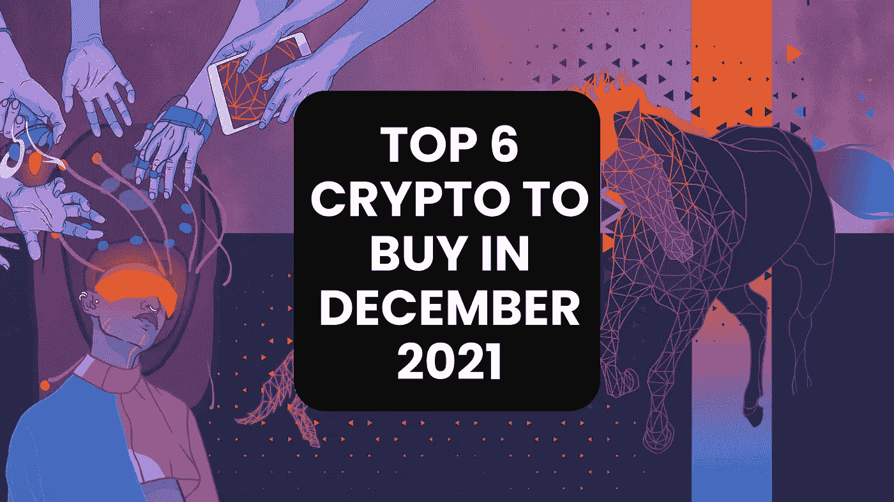

11 月不是一个好月份，对多头来说肯定不是。他们受伤了，正在尽最大努力重新站起来。然而，鉴于目前的市场情况，很难预测比特币的下一步走向。

除此之外，2021 年 11 月 26 日的比特币崩盘主要是由于新冠肺炎的新变种和几乎所有全球市场的崩溃。然而，下面的图表也显示了另一种情况。六个多月来，感恩节，或者黑色星期五的前一天，第一次有 20 万新 BTC 在流通。矿工的大抛售把我们带到了这里？也许吧。

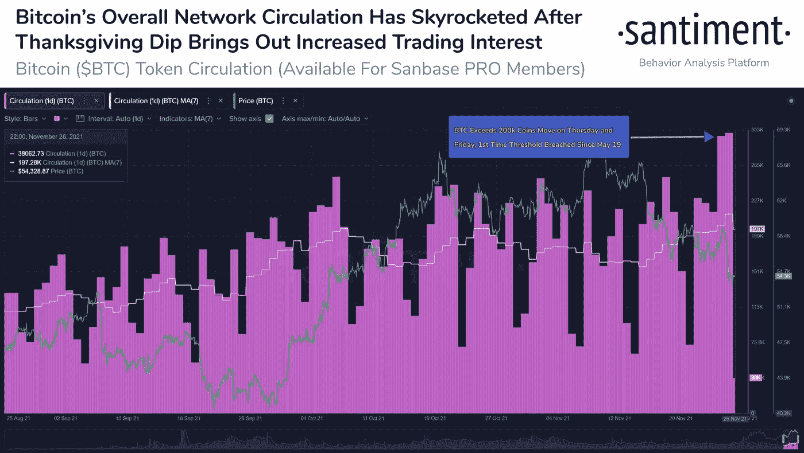

虽然有一种策略永远不会过时，但以一种抗脆弱的方式拥有你的资产有更好的效果；这叫“买蘸酱”现在，如果你不知道在这次下跌中该买什么，好吧，当然是比特币，伙计，但也要做[点击这里](/coinmonks/best-cryptocurrencies-to-buy-the-dip-november-2021-edition-bc27c551c18f?source=user_profile---------3-------------------------------)。

什么？你不相信买蘸酱？至少 Nayeb Bukele 知道。萨尔瓦多昨天(2021 年 11 月 26 日)购买了 100 BTC。而且不仅仅是他们！

[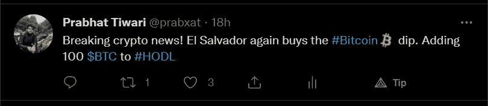](https://twitter.com/prabxat)

[Twitter](https://twitter.com/prabxat)

根据 Glassnode 的数据，猜猜还有谁买了蘸酱？

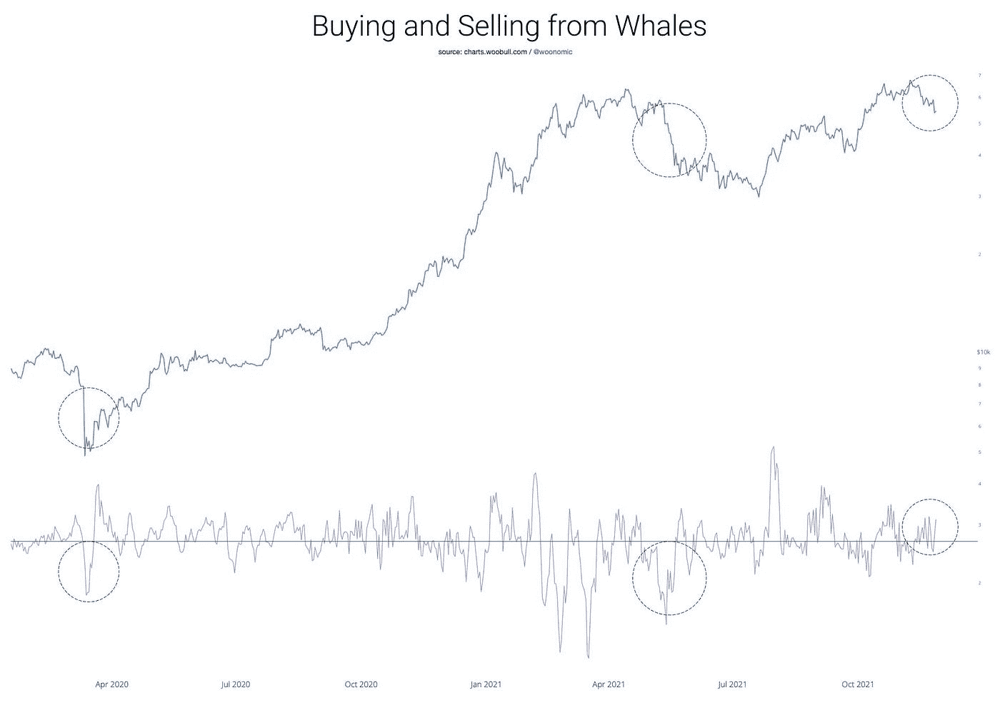

无论如何，让我们继续找出在 2021 年 12 月你可以购买哪些替代加密货币。

# 蛋糕/ USDT 市场分析

正如我们在下面的图表中看到的，蛋糕正在形成一个看涨的和谐模式。此外，由于价格在昨天的 COVID Pt 大幅下跌。2 崩溃(对，我就是这么叫的)，它在一个很好的积累区。此外，它也处于关键的趋势线支撑，价格也已经回撤。因此，相当估计，蛋糕可能会成为 12 月份获得回报的绝佳机会。

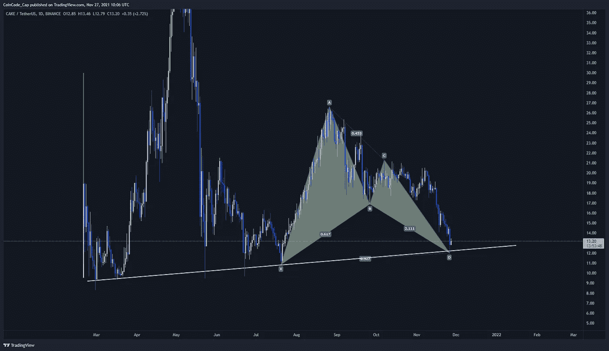

# 嗨/ USDT 市场分析

正如我在上一篇文章中解释的那样，你还没听说过的 3 种替代货币正在飙升！“美元在一个承压通道中移动。然而，11 月 18 日，它脱离了海峡，并一直盘整到 11 月 25 日。然后发生了一些事情，hi 释放了它的元宇宙，所以现在，“[向](https://t.co/DhglDfnCLV?amp=1)的元宇宙问好。”交易量大幅上升，导致其价格接近历史最高水平。然而，在市场获得足够的动力创造历史新高之前，比特币市场崩溃了。

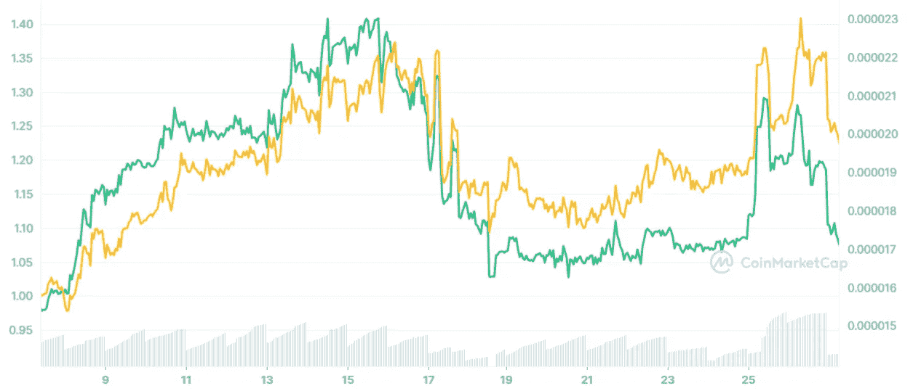

截至目前，美元兑日元位于 1 美元左右的强支撑区域上方。因此，如果我们看不到比特币进一步下跌，我们可以观察到 12 月份出现了相当不错的反弹。除此之外，还有传言称，hi dollar 将于 2021 年底在一个主要的集中交易所推出。因此为交易量的增加和价格的类似上涨铺平了道路。此外，根据下面来自 Coingecko 的数据，HI 的 30-D 回报率为 157%，我认为这已经相当不错了。因此，即使价格横向运行，我们也可以启动 DCA，买入下跌股票。

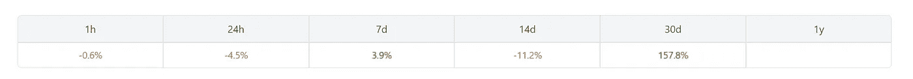

# CELR/ USDT 市场分析

正如我们在下图中看到的，CELR 目前正处于巩固阶段。因此，在一个良好的看涨反弹后，我们正在观察价格行动的势头。因此，我们可以预计价格会上涨，CELR 在 12 月份的表现会好得多。

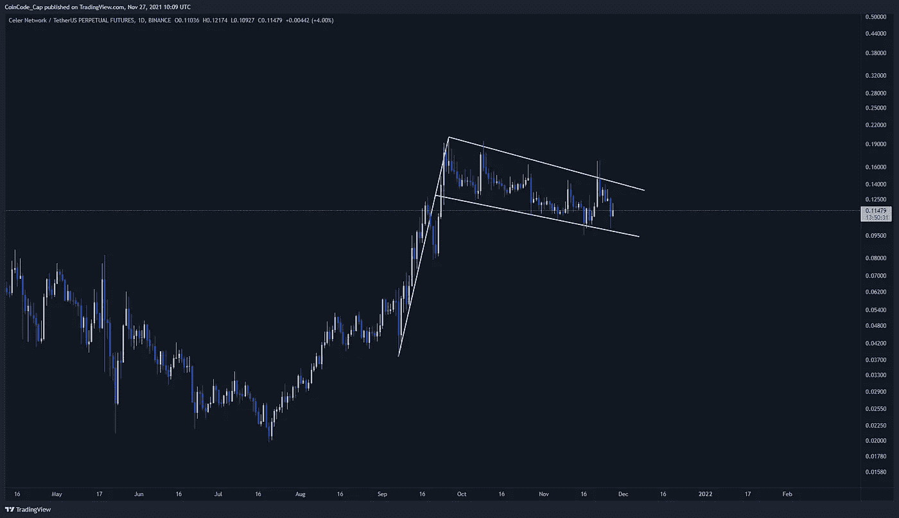

# 贝尔/ USDT 市场分析

市场目前对最强劲的趋势线支撑给予了尊重。此外，现在处于超卖区。通过观察它以前的价格行为，我们看到了一个从趋势线以下的向上移动。因此，BEL 可能会成为 2021 年 12 月购买的最佳加密货币之一。

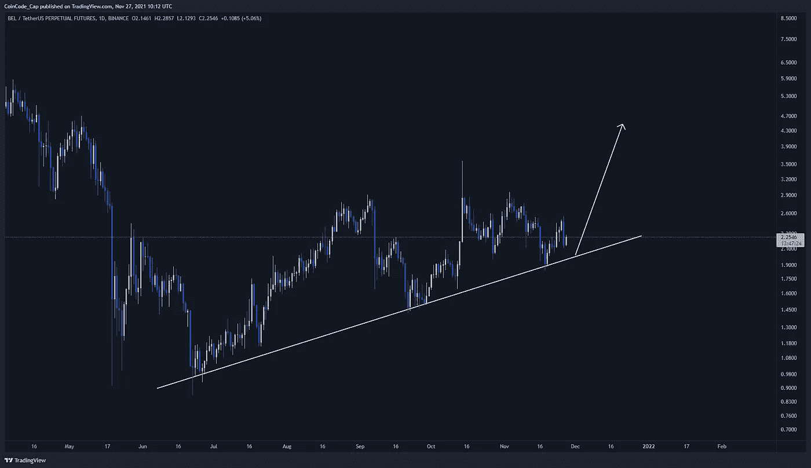

# 寿司/ USDT 市场分析

等等，我们刚刚在文章中看到了类似的模式。是蛋糕吗？是啊！寿司也处于和谐模式的潜在反转区。此外，它在需求区交易。因此，我们可以期待 12 月份的牛市行情。

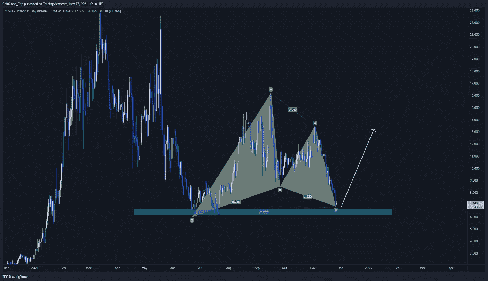

# KNC/ USDT 市场分析

价格在一个上升的三角形中盘整，形成突破的动力。我们可以预期它会有上升的趋势。请继续关注它。万一爆发，这将是进入市场的绝佳机会。

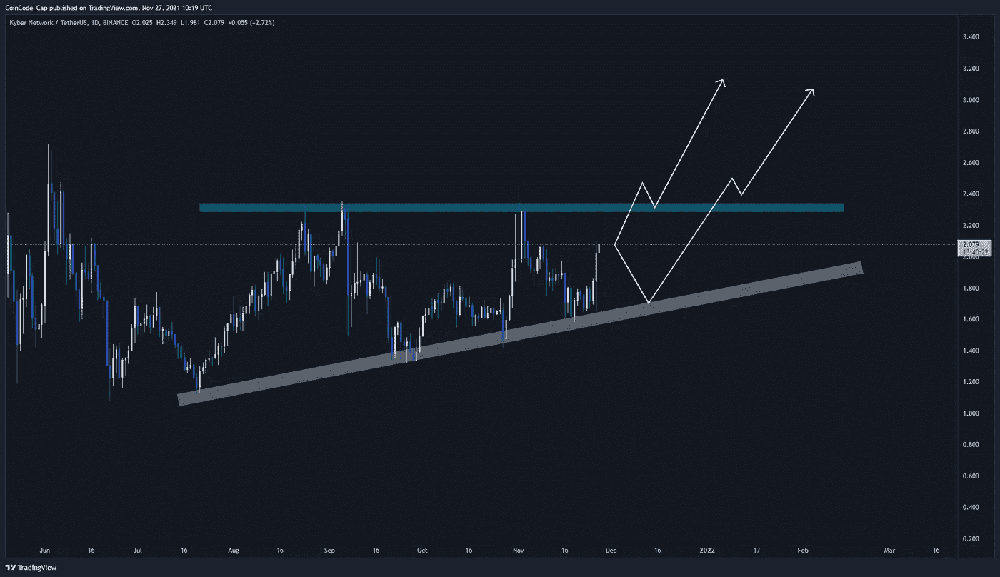

# 结束语

交易最重要的部分是纪律和耐心。因此，根据上述分析，我们刚刚谈到的硬币可能会有一些不错的收益。再说一遍，你要投资的是你的血汗钱，所以在投资前做好自己的研究。

资金不足以购买 dip？获得免费的 Hi 美元，使用下面的按钮注册，每天获得 1 美元。

本文没有任何金融建议，你应该只投资于你认为适合你的投资组合的市场。此外，文章包含附属链接，点击它们，我可能会赚取佣金。

***与我接通，***

[**Twitter**](https://twitter.com/prabxat)**|**[**LinkedIn**](https://www.linkedin.com/in/praxhat/)

ETH:0x 2784 D5 ca 62 ee 171192 ea 23 f 40 FB 76476547 c 244 e

> [*比特币:中本聪时代*](/coinmonks/bitcoin-the-age-of-satoshi-nakamoto-fe58157e740d?source=user_profile---------0-------------------------------)

> [*2021 年 11 月购买排名前 5 的密码*](/coinmonks/top-5-crypto-to-buy-in-november-2021-b9c99c44a704?source=user_profile---------1----------------------------)
> 
> [*美元弗洛基争霸|我们要 0.01 美元吗？*](/coinmonks/the-floki-supremacy-are-we-going-to-0-01-6763d56b9734?source=user_profile---------1-------------------------------)
> 
> [*BTCST 刚 3 天涨了 5 倍|目标是 1000 美元吗？*](/coinmonks/btcst-just-went-5x-in-3-days-is-it-aiming-for-1-000-9dcba894c954?source=user_profile---------1----------------------------)

> [*银行会灭亡还是会适应？DeFi 的未来将会决定。*](/coinmonks/will-banks-perish-or-adapt-the-future-of-defi-will-decide-80f13284f76?source=user_profile---------1----------------------------)

> [*你钱包里的 100 元钞票，是钱，还是没有价值的东西？*](/coinmonks/is-the-100-bill-in-your-wallet-money-or-something-that-has-no-value-99263e8dfba6?source=user_profile---------0----------------------------)
> 
> [*2021 年底前比特币还在破 100K 的路上吗？*](/coinmonks/is-bitcoin-still-on-its-path-to-break-100k-before-the-end-of-2021-4716a56745ce?source=user_profile---------1----------------------------)
> 
> [*我是如何在大学本科阶段开始投资 Crypto 的？*](https://praxhat.medium.com/how-did-i-start-investing-in-crypto-as-a-college-undergrad-ac9635d9d6b3?source=user_profile---------2----------------------------)

这篇文章中所写的一切都是我所相信的，你的想法可能与我的不同(显然，我们是两个不同的人)。所以，把这篇文章当做闲书，如果不喜欢内容，就当没看过吧！

*这篇文章最初发表于*

[T3【https://blog.coincodecap.com/crypto-to-buy-in-december-2021】T5](https://blog.coincodecap.com/crypto-to-buy-in-december-2021)

> *加入* [*Coinmonks 电报频道*](https://t.me/coincodecap) *了解加密交易和投资。*

**同样，阅读**

*   [币安 vs 北海巨妖](https://blog.coincodecap.com/binance-vs-kraken) | [美元成本平均交易机器人](https://blog.coincodecap.com/pionex-dca-bot)
*   [如何在印度购买比特币？](/coinmonks/buy-bitcoin-in-india-feb50ddfef94) | [WazirX 评论](/coinmonks/wazirx-review-5c811b074f5b) | [BitMEX 评论](https://blog.coincodecap.com/bitmex-review)
*   [比特币主根](https://blog.coincodecap.com/bitcoin-taproot) | [Bitso 点评](https://blog.coincodecap.com/bitso-review) | [排名前 6 的比特币信用卡](/coinmonks/bitcoin-credit-card-bc8ab6f377c6)
*   [双子座 vs 比特币基地](https://blog.coincodecap.com/gemini-vs-coinbase) | [比特币基地 vs 北海巨妖](https://blog.coincodecap.com/kraken-vs-coinbase)|[coin jar vs coin spot](https://blog.coincodecap.com/coinspot-vs-coinjar)
*   [印度密码交易所](/coinmonks/bitcoin-exchange-in-india-7f1fe79715c9) | [比特币储蓄账户](/coinmonks/bitcoin-savings-account-e65b13f92451) | [Paxful 审查](/coinmonks/paxful-review-4daf2354ab70)
*   [杠杆令牌](/coinmonks/leveraged-token-3f5257808b22) | [最佳加密交易所](/coinmonks/crypto-exchange-dd2f9d6f3769) | [AscendEX 评论](/coinmonks/ascendex-review-53e829cf75fa)
*   [Godex.io 审核](/coinmonks/godex-io-review-7366086519fb) | [邀请审核](/coinmonks/invity-review-70f3030c0502) | [BitForex 审核](https://blog.coincodecap.com/bitforex-review) | [HitBTC 审核](/coinmonks/hitbtc-review-c5143c5d53c2)
*   [Crypto.com 费用](/coinmonks/binance-fees-8588ec17965) | [僵尸加密审查](/coinmonks/botcrypto-review-2021-build-your-own-trading-bot-coincodecap-6b8332d736c7) | [替代品](https://blog.coincodecap.com/crypto-com-alternatives)
*   [有哪些交易信号？](https://blog.coincodecap.com/trading-signal) | [比特斯坦普 vs 比特币基地](https://blog.coincodecap.com/bitstamp-coinbase)
*   [ProfitFarmers 点评](https://blog.coincodecap.com/profitfarmers-review) | [如何使用 Cornix 交易机器人](https://blog.coincodecap.com/cornix-trading-bot)