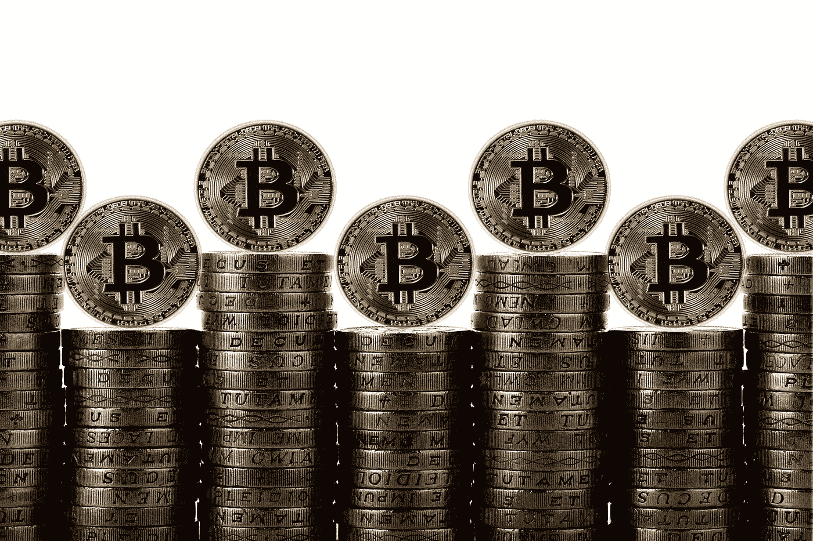

# 加密新手可以避免的 7 大常见错误

> 原文：<https://medium.com/coinmonks/top-7-common-mistakes-newbies-make-that-can-be-avoided-6e6b9eeea16c?source=collection_archive---------6----------------------->

Image by [Gerd Altmann](https://pixabay.com/users/geralt-9301/?utm_source=link-attribution&utm_medium=referral&utm_campaign=image&utm_content=2666200) from [Pixabay](https://pixabay.com/?utm_source=link-attribution&utm_medium=referral&utm_campaign=image&utm_content=2666200)

花时间去了解你正在做的投资以及你为什么要这么做。与股票不同，[加密货币没有市场价值](https://asedeyhotnaija.com/how-to-make-money-with-bitcoin-for-beginners-in-2022/)。

因为你在公司没有股份，所以没有分红。

如果一家公司发布加密货币，该公司可能会获利或被收购，而你不会从中受益。

即使一家公司经营良好，其货币价值也可能下跌。

可能为投资者提供所有权的证券代币可能是这一规则的唯一例外。

然而，这仍然是要约规则的问题。

不同的规则适用于[加密货币交易](https://www.sammaiyaki.com/5-ways-to-profit-from-bitcoin-in-2022-3aaf22712dc1)。

以下是可以避免的七个最常见的菜鸟失误。

> 另外，请看:[嘿新手，这是给你的加密指南！](/cryptostars/hey-newbie-this-crypto-guide-is-for-you-4aeb5f4a5408?source=user_profile---------0-------------------------------)

# 1.你不知道最基本的

如果你刚刚开始，你可能渴望交易。我明白。

然而，不要对此过于草率。花点时间了解比特币交易，制定一个基本的交易策略。

循环供应量占总供应量的百分比是一个数学概念。

通货膨胀是你理解的东西吗？钱包、交换、私钥和公钥都是您应该熟悉的术语。

如果你不能回答这些简单的问题，你会有大麻烦的。在开始旅行之前，确保你花一些时间做好准备。

我们的网站上有很多很棒的资源可以帮助你开始。

> 另见:[2022 年比特币(BTC)价格预测](https://www.sammaiyaki.com/predictions-for-the-price-of-bitcoin-btc-in-2022-69559d869147?source=user_profile---------1-------------------------------)

# 2.你不采取行动

每一天，潜在的比特币投资者都会错失良机，因为他们不知道如何开始。

如果投资者不保持参与，即使他们拥有多年的专业知识，也可能很容易在新工具和加密货币上失败。

对犯错的恐惧阻止他们尝试新事物。采取行动是初级阶段，不要退缩。

当你把自己放在一种情况下，你会获得经验，而这种经验会导致更聪明的决定。这个经历就是从你的错误中学习。

决定你是否准备好投资你的第一笔钱。即使你只有 10 美元可以花，你也可以使用任何你想要的兑换和支付方式。

如果你不采取行动，你永远不会知道会有多大的不同。

投资就像过山车一样有高有低，这里是你开始未知之旅的地方。

> 另请参见:[加密最后通牒——骗局还是合法？真相暴露](https://asedeyhotnaija.com/crypto-ultimatum-scam-or-legit-the-truth-exposed/)

# 3.你不懂技术

比特币和其他加密货币的基础技术是它们与众不同的地方。

然而，如果你没有掌握技术的基本原理，前面的道路会充满危险。

说到投资，你不想相信别人的“智慧”。

如果你不能自己评估这些项目，你将会失去很多好机会。

毕竟，比特币是由技术人员创造和采用的。

如果你想防止这一点，寻找可靠的教育资源，投入时间学习新的东西，最重要的是，在做的时候要有乐趣。

在你掌握了大宗奖励、共识方法、预挖掘和所有其他花哨的术语后，你会成为一个更好、更有见识的投资者。

你必须跟上区块链技术的最新发展。

> 还有，参见:[2022 年新手如何用比特币赚钱](https://asedeyhotnaija.com/how-to-make-money-with-bitcoin-for-beginners-in-2022/)

# 4.你忽略了费用

现在是时候慢慢来，选择最好的交换了。

当个人刚开始交易时，他们每天下大量订单，希望每个订单能赚几分钱。

费用正在杀死他们，尽管原则上这是美妙的。这些小事积少成多，不管多少。

在进行交易之前，做好你的功课。如果你想成为一名成功的投资者，你必须从今天开始培养健康的习惯。

> 另外，请看:[我为什么要投资比特币？](https://asedeyhotnaija.com/why-should-i-invest-in-bitcoin/)

# 5.你过度交易了

没有经验的投资者，大部分是新手，想一天交易 20 次。这有风险。

最后，他们中的许多人因为成本或因为他们做了糟糕的交易而亏损，然后交易更多来弥补他们遭受的损失。这样他们就可以继续挖掘他们越来越深的坟墓。"

在现实世界中，一天不会有 20 笔盈利的交易。当你大量交易时，你最终会做出错误的决定。

> 另外，请看:[如何在 2022 年开始一个加密博客并赚钱——第一部分](/technical-excellence/how-to-start-a-crypto-blog-and-make-money-in-2022-part-1-2bab836d7f83?source=user_profile---------6-------------------------------)

# 6.你不明白税收的含义

过度交易的结果是，你的税单会增加。

至少在北美是这样。绝大多数消费者认为，他们只需要对卖回美元/加元的收入缴税，而事实上，你需要对你做的每一笔交易缴税，甚至是加密对加密的交易。

国内税收署和加拿大税务局(CRA)将交易视为已实现的损益。换句话说，美国国税局将使用比特币购买乙醚视为导致收益或损失的应税事件。

然而，事实并非如此。他们假设你以美元卖出以太坊，然后用美元买入比特币。

如果你不考虑税收和交易费用，投资加密货币可能是一项风险很大的努力。

你应该避免过度交易，因为除了应计费用和不正确的交易之外，它还有税务影响。

> 同样，参见:[进入元宇宙](https://asedeyhotnaija.com/into-the-metaverse/)

# 7.你投资你一生的积蓄

投资的第一条规则是永远不要往你的账户里放超过你能承受损失的钱。

你应该做好失去所有努力的准备。最后，即使价格波动，你也应该保持冷静，保持健康的生活方式，让你可以花钱买必需品。

我听说过无数的恐怖故事，关于那些出于贪婪而投资或借贷巨额资金的人。多么可怕的错误。

即使你中了彩票，你的贪婪也很可能最终胜出。换句话说，如果你以 50，000 美元开始，以 150，000 美元结束，你的大脑会解释并正常化你的胜利，使它们看起来不那么实际。

如果市场下跌，你将回到收支平衡或可能更糟。

> 另见:[2022 年如何研究投资加密货币](https://www.sammaiyaki.com/how-to-research-cryptocurrencies-for-investing-in-2022-76b5c50783dd?source=user_profile---------8-------------------------------)

# 总结一下

不要浪费你的时间和金钱幻想兰博基尼和私人飞机。

许多不知情的加密投资者收购低价加密货币，希望获得高额利润。

在一枚硬币定价为 0.01 美元，另一枚为 75 美元的情况下，他们更有可能购买 0.01 美元的硬币，因为他们认为一枚硬币从 0.01 美元升至 0.02 美元比从 75 美元升至 150 美元更简单。

这是很多人经常陷入的绊脚石。

硬币的价格受几个变量的影响，包括:

市场中的货币供求。

当一枚低成本硬币的供应量很大时，每枚硬币的价值就被稀释了。如果供应量大，现实世界的价值低，定价为 0.01 美元的硬币既不会被低估，也不会被高估。

在寻找具有增长潜力的加密货币时，硬币的市值是一个更重要的因素。尽管市场资本化并不总是准确的，但它是比当前价格更好的(尽管不是完美的)资产对投资者价值的预测指标。

如果你想找到下一个宝石货币，寻找低市值的硬币。

市场资本总额低的硬币有更大的增长潜力，但它们也有更大的亏损风险(失败、流动性不足等)。)

最后，如果你是一个新的投资者，你应该避免这些硬币，而是专注于具有现实价值潜力的硬币。

***你还有我没有提到的更典型的大错吗？让我们在评论区讨论它们。***

***财务免责声明***

*内容仅供参考，您不应将任何此类信息或其他材料理解为法律、税务、投资、财务或其他建议。我们的文章中所包含的任何内容都不构成 HII 或任何第三方服务提供商在该司法管辖区或任何其他司法管辖区购买或出售任何证券或其他金融工具的邀约、建议、认可或要约，在这些司法管辖区，此类邀约或要约根据该司法管辖区的证券法是非法的。*

> 加入 Coinmonks [电报频道](https://t.me/coincodecap)和 [Youtube 频道](https://www.youtube.com/c/coinmonks/videos)了解加密交易和投资

## 也阅读

 [## 杠杆代币[多头代币]终极指南

### 杠杆化令牌是具有杠杆化风险敞口的 ERC20 令牌，不考虑保证金、要求、管理…

medium.com](/coinmonks/leveraged-token-3f5257808b22)  [## 最佳加密交易所| 2021 年十大加密货币交易所

### 编辑描述

blog.coincodecap.com](https://blog.coincodecap.com/crypto-exchange)  [## 2021 年最佳加密交换平台| CoinCodeCap

### 编辑描述

blog.coincodecap.com](https://blog.coincodecap.com/best-swap-platforms)  [## 2021 年最佳加密借贷平台| 6 大比特币借贷平台

### 获得比特币和其他加密货币的最佳贷款利率

medium.com](/coinmonks/top-5-crypto-lending-platforms-in-2020-that-you-need-to-know-a1b675cec3fa)  [## 2021 年 6 大最佳硬件钱包|顶级加密硬件钱包[更新]

### 最好的加密货币硬件钱包是绝对必要的。我们将在 NGRAVE、Ledger Nano X 和…

medium.com](/coinmonks/the-best-cryptocurrency-hardware-wallets-of-2020-e28b1c124069)  [## 2021 年最佳免费加密交易机器人

### 2021 年币安、比特币基地、库币和其他密码交易所的最佳密码交易机器人。四进制，位间隙…

medium.com](/coinmonks/crypto-trading-bot-c2ffce8acb2a)