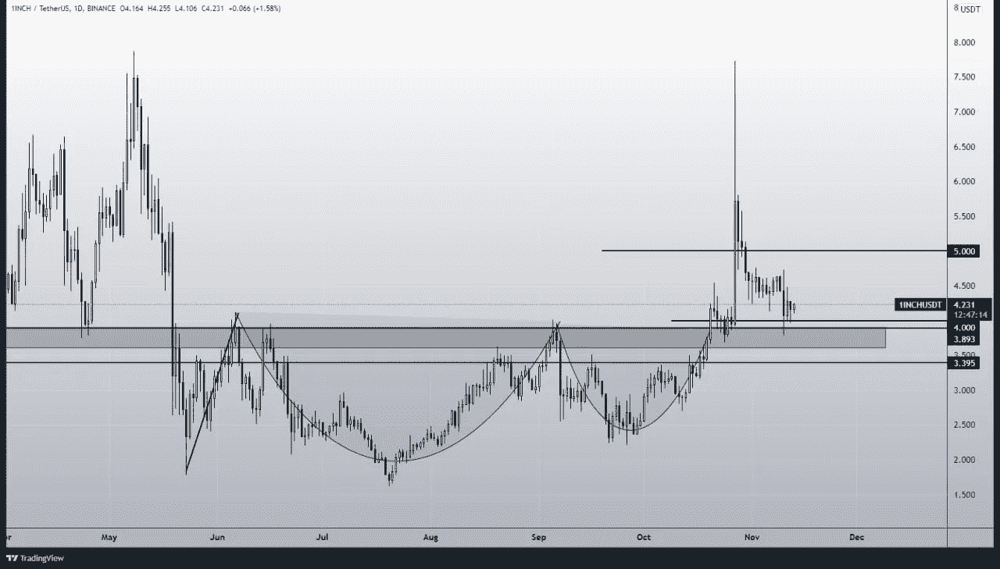

# 2021 年秋季最值得购买的另类硬币

> 原文：<https://medium.com/coinmonks/top-altcoins-to-buy-in-the-fall-of-2021top-altcoins-to-buy-in-the-fall-of-2021-d92c58a1bf3?source=collection_archive---------0----------------------->

## 在 2021 年底，你可以把一些最好的代用币放进你的包里。

所以我认为，我们即将结束为期 4 年的比特币市场周期。根据之前的数据，这个周期比我们之前看到的要晚一点。然而，比特币移动迅速，根据这个周期的预计结束时间，我们还有大约一个月的时间(以防它在那里结束；可能不会)。此外，正如我们所知，随着比特币的上涨，其他硬币也会加入进来，我相信我们不久就会看到替代硬币的历史新高(显然是那些在 5 月崩盘后没有替代硬币的人)。

不信任我？看看下面的股票-流量模型或彩虹图。它清楚地表明，比特币正在走向一些新的历史高点；但是，我们必须密切观察市场。因为如果事情出了岔子，准备好卖出，哈哈。

比特币可能是终极价值储存手段，但一个月内获得 10 倍回报的时代早已过去。不过我们还有 altcoins 在身边，一周内有 10 倍的潜力。因此，我们来看看 2021 年秋季你能买到的一些最好的 altcoins。

# 法力价格预测

法力是分散之地的实用令牌，也是那里最受欢迎的元宇宙令牌之一。分散王国是第一个虚拟世界，在这里你可以购买、出售或创造数字资产(如场景、艺术、公寓等)。)

如果你最近一直在关注市场，你可能会后悔没有在 2020 年 1 月买入，因为从那以后，它已经上涨了 200 倍。不仅如此，Mana 最近创下历史新高，高达 5 美元。此外，脸书更名为 Meta，原来是火焰上的气体。法力最近突破了 4H 时间框架的下降三角形，并得到了很好的抽水。我相信这次反弹还没有结束，我们可以看到所有元宇宙代币的新高。在这次牛市中，我们可以预计法力值的价格范围在 10 到 20 美元之间。

# 高美元价格预测

正如我在之前的文章中提到的，美元确实突破了 0.88 美元到 0.98 美元之间的强力阻力位，并且强劲上涨。然而，在此之前，hi 美元在短短十天内从 0.33 升至 0.93。此外，截至目前，日元兑美元汇率为 1.33 美元，创下 ATH 新高。不仅如此，它还拥有自诞生以来最高的交易量，这使它比其他硬币更具优势，创下了历史新高。

hi 美元不再有任何阻力，每隔一天都在创造新的历史新高；如果我们看到其当前价格回落，这将是 DCA 的一个绝佳机会。然而，如果你仍然对将你的钱投资于 hi dollar 持怀疑态度，只需通过 telegram 或 WhatsApp 在平台上注册，每天都可以获得免费的 hi dollar。

我相信 hi dollar 拥有出色的社区支持和采用，因此我们可以预计在这轮牛市结束前它将在 4 到 10 美元之间。

# AKRO 价格预测

Arko 已经在一个对称的三角形中移动了一段时间了。然而，最近它确实打破了三角形，并一直在重新测试。此外，它还伴随着出色的看涨势头，如果比特币现在暂时不横盘，我们可以观察到其市值飙升。

# 1 英寸价格预测

你们还记得 1 英寸在几个小时内猛增了大约 100%吗？这发生在它首次在韩国密码交易所 Upbit 上市的时候。然而，与此同时，1inch 却每日爆出杯柄格局。尽管它下跌了约 3 美元，达到 4.5 美元左右，但我相信它仍有能力创造新的历史高点。截至目前，它与图表中的市场一样处于强支撑区，此前该市场充当了强阻力。我相信 1inch 有很好的潜力，我们可以期待一个类似于我们在 5 月份看到的反弹，只是这次创造了一个新的历史高点。我相信我们可以预期在这轮牛市中，价格会在 10 美元到 30 美元之间。

说到基本面，1inch 是最强大的 DeX 聚合。因此，您不仅可以使用 1 英寸接口交换您的加密资产。尽管如此，它还会自动为你找到所有指数中最优惠的价格和最低的费用。

# 点价格预测

根据我在上一篇文章中的报道，DOT 从 43 美元涨到了 55 美元左右的 ATH。截至目前，它在 4h 的时间框架内打破了双顶。双顶是最显著的卖出信号之一，直接导致它成为强有力的支撑，因为它在过去也是一个极端的阻力。

Polkadot Parachain 拍卖刚刚开始，可能是这次回调的一个因素(因为拜托，卖新闻？).此外，由于 BTC 刚刚下跌，它拖累了整个市场。

然而，这并不是牛市的终结。因此，我相信我们将在未来几周看到更多的历史高点，在这轮牛市中，顶部可能在 150 美元至 300 美元之间。在下图中，我们标记了 DCA 的最佳区域。祝你好运，因为我们要和波尔卡多特一起去月球了。

# 结束语

交易最重要的部分是纪律和耐心。因此，不要只是前进，并在我们上面讨论的硬币或代币上全押。此外，相信 1 英寸和高美元可能会成为一个良好的长期投资机会。因此，HODL，并保持赌注，以赚取更多。

*本文中的任何内容都不是财务建议，您应该只投资于您认为适合您的投资组合的市场。*此外，文章包含会员链接，点击它们，我可能会获得佣金。

***与我接通，***

[**推特**](https://twitter.com/prabxat)**|**|[**领英**](https://www.linkedin.com/in/praxhat/)

> [*比特币:中本聪时代*](/coinmonks/bitcoin-the-age-of-satoshi-nakamoto-fe58157e740d?source=user_profile---------0----------------------------)

> [*2021 年 11 月 5 强密码购买*](/coinmonks/top-5-crypto-to-buy-in-november-2021-b9c99c44a704?source=user_profile---------1----------------------------)
> 
> [*美元的 FLOKI 争霸赛|我们要 0.01 美元吗？*](/coinmonks/the-floki-supremacy-are-we-going-to-0-01-6763d56b9734?source=user_profile---------1-------------------------------)
> 
> [*BTCST 仅在 3 天内上涨 5 倍|目标是 1000 美元吗？*](/coinmonks/btcst-just-went-5x-in-3-days-is-it-aiming-for-1-000-9dcba894c954?source=user_profile---------1----------------------------)

> [*银行会灭亡还是会适应？DeFi 的未来将由您决定。*](/coinmonks/will-banks-perish-or-adapt-the-future-of-defi-will-decide-80f13284f76?source=user_profile---------1----------------------------)

> [*您钱包里的 100 美元是钞票、钞票还是什么没有价值的东西？*](/coinmonks/is-the-100-bill-in-your-wallet-money-or-something-that-has-no-value-99263e8dfba6?source=user_profile---------0----------------------------)
> 
> [*比特币在 2021 年底前还会突破 10 万吗？*](/coinmonks/is-bitcoin-still-on-its-path-to-break-100k-before-the-end-of-2021-4716a56745ce?source=user_profile---------1----------------------------)
> 
> [我是如何在大学本科阶段开始投资密码的？](https://praxhat.medium.com/how-did-i-start-investing-in-crypto-as-a-college-undergrad-ac9635d9d6b3?source=user_profile---------2----------------------------)

本文中所写的一切都是我所相信的，你的想法可能与我的不同(显然，我们是两个不同的人)。因此，把这篇文章当作轻松的阅读，如果你不喜欢它的内容，如果你曾经读过它，就把它遗忘吧！

> *加入* [*币僧电报频道*](https://t.me/coincodecap) *学习密码交易和投资。*

**同样，阅读**

*   [币安 vs 北海巨妖](https://blog.coincodecap.com/binance-vs-kraken) | [美元成本平均交易机器人](https://blog.coincodecap.com/pionex-dca-bot)
*   [如何在印度购买比特币？](/coinmonks/buy-bitcoin-in-india-feb50ddfef94) | [WazirX 审核](/coinmonks/wazirx-review-5c811b074f5b) | [BitMEX 审核](https://blog.coincodecap.com/bitmex-review)
*   [比特币主根](https://blog.coincodecap.com/bitcoin-taproot) | [Bitso 评论](https://blog.coincodecap.com/bitso-review) | [排名前 6 的比特币信用卡](/coinmonks/bitcoin-credit-card-bc8ab6f377c6)
*   [双子座 vs 比特币基地](https://blog.coincodecap.com/gemini-vs-coinbase) | [比特币基地 vs 北海巨妖](https://blog.coincodecap.com/kraken-vs-coinbase) | [硬币罐 vs 硬币点](https://blog.coincodecap.com/coinspot-vs-coinjar)
*   [印度加密交易所](/coinmonks/bitcoin-exchange-in-india-7f1fe79715c9) | [比特币储蓄账户](/coinmonks/bitcoin-savings-account-e65b13f92451) | [Paxful 审核](/coinmonks/paxful-review-4daf2354ab70)
*   [杠杆令牌](/coinmonks/leveraged-token-3f5257808b22) | [最佳加密交易所](/coinmonks/crypto-exchange-dd2f9d6f3769) | [AscendEX 评论](/coinmonks/ascendex-review-53e829cf75fa)
*   [Godex.io 审核](/coinmonks/godex-io-review-7366086519fb) | [邀请审核](/coinmonks/invity-review-70f3030c0502) | [BitForex 审核](https://blog.coincodecap.com/bitforex-review) | [HitBTC 审核](/coinmonks/hitbtc-review-c5143c5d53c2)
*   [Crypto.com 费用](/coinmonks/binance-fees-8588ec17965) | [Botcrypto 审查](/coinmonks/botcrypto-review-2021-build-your-own-trading-bot-coincodecap-6b8332d736c7) | [替代方案](https://blog.coincodecap.com/crypto-com-alternatives)
*   [有哪些交易信号？](https://blog.coincodecap.com/trading-signal) | [Bitstamp vs 比特币基地](https://blog.coincodecap.com/bitstamp-coinbase)
*   [ProfitFarmers 回顾](https://blog.coincodecap.com/profitfarmers-review) | [如何使用 Cornix Trading Bot](https://blog.coincodecap.com/cornix-trading-bot)