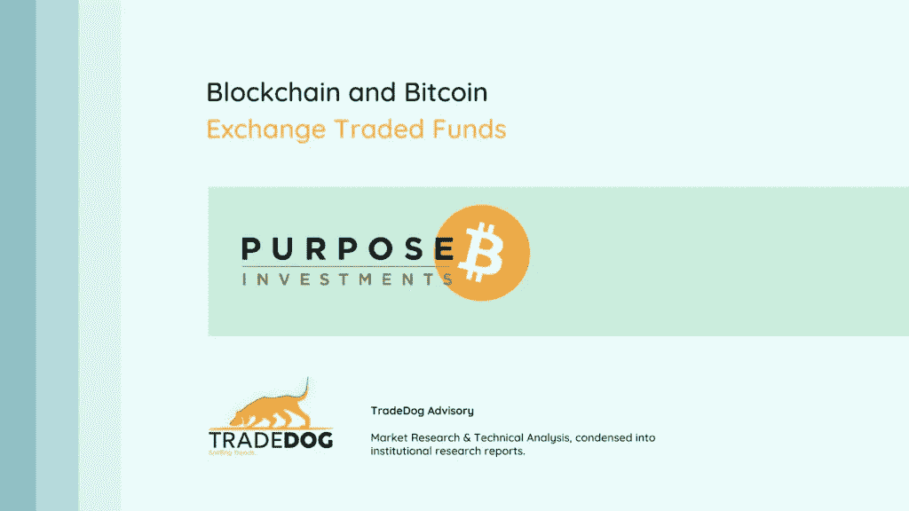
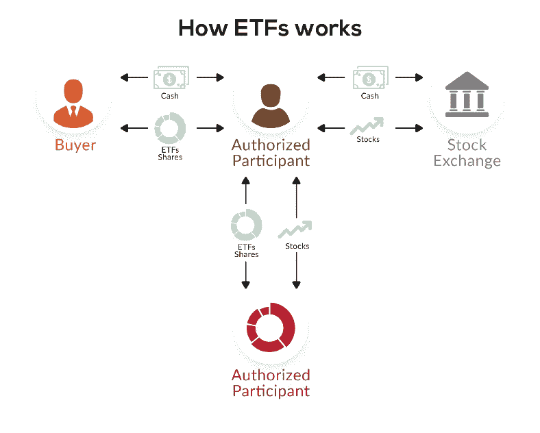
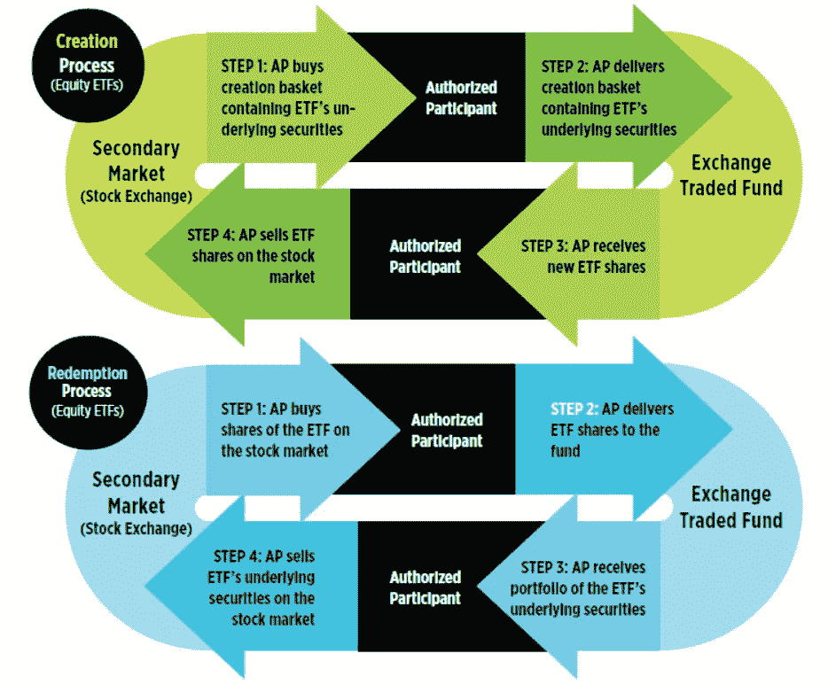
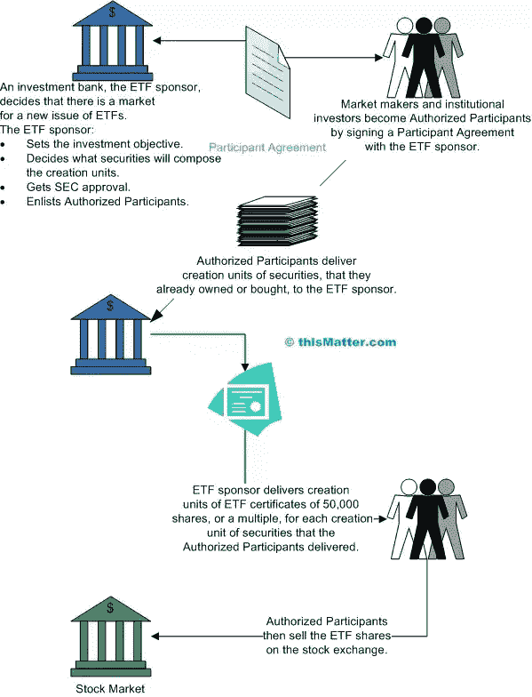
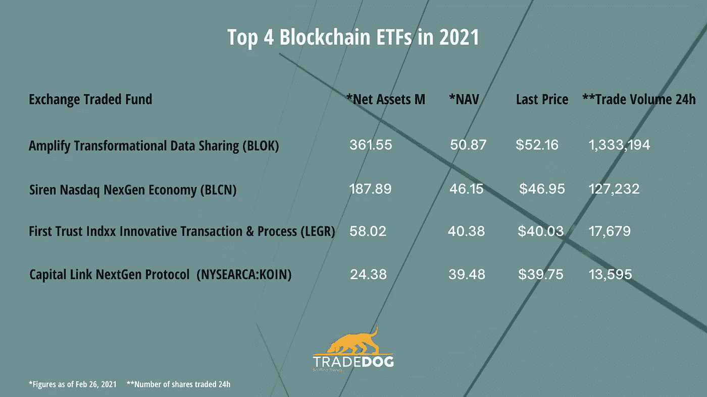

# 2021 年顶级区块链和比特币交易所交易基金

> 原文：<https://medium.com/coinmonks/top-blockchain-and-bitcoin-exchange-traded-funds-in-2021-efa7fccf346c?source=collection_archive---------10----------------------->

交易所交易基金或产品(ETF-ETP)是一种跟踪基础证券、加密货币或指数价格的节税投资基金。ETF 主要用于传统市场，汇集各种来源的资金，购买证券、股票、债券和衍生品等可交易资产。ETF 基金在证券交易所上市，可以买卖。

Kryption

交易所交易基金汇集了几个人的金融资源，并用它们来购买股票、债务证券、债券和衍生品等各种可交易资产。运营这只 ETF 的公司拥有它所追踪的资产，这种所有权将通过股票来体现。然后，投资者将购买这些股票并间接拥有这些代币，从而释放这些代币的全部价值。

**ETF 机制**

*ETF.com*
*AP- Authorized participant, simply someone with a lot of buying power*

牵头 ETF 的公司将规划资金池中的资产数量，并宣布它将创造的股票或代币数量

然后，EFT 需要接受监管机构的审查，如 SEC post，ETF 将准备向授权参与者出售其股票。

ETF 的第三个重要方面是创建/赎回过程，该过程使 ETF 股票价格与基金的基础**净资产值或 NAV** 保持一致。创造单位被用来交换份额所代表的类似数量的资产。

## **对加密 ETF 的真正需求**

将交易所交易基金引入加密市场将解决散户投资者在投资数字资产时面临的主要问题。在加密市场，ETP 股票将极大地简化资产收购、保管、处置、估价和对冲。

投资者获得了多样化的资产组合，投资于此类 ETF 将有助于投资者将资金分散到不同加密初创公司的股票上，而不是依赖于通常风险更大的一家公司的表现。

当你把这么多资产放在一个巨大的篮子里时，你就大大稀释了自己的风险敞口。因此，如果基金中的一项资产崩溃，你可以用基金中其他资产的增长来弥补损失的部分。

## **区块链交易所交易基金**

区块链 ETF 持有采用区块链技术的公司的股票，或者以某种方式从中获利。

这 4 只区块链交易所交易基金如下:

放大转换数据共享交易所交易基金(BLOK)

现实股票纳斯达克 NexGen 经济交易所交易基金(BLCN)

第一信托 Indxx 创新交易和流程 ETF (LEGR)

资本链接下一代协议交易所交易基金

## **全球首只比特币 ETF 在加拿大**

目的投资公司赢得了建立全球首只比特币交易所交易基金的竞赛。该公司现在在成立一周内在 AUM 拥有 5 . 94 亿美元(管理的资产)。该 ETF 在 AUM 创下了 4.218 亿美元的惊人业绩，目前也在多伦多证券交易所上市，股票代码为 BTCC。这一上市可能会为更多 ETF 出现并占据无人认领的前沿开辟新的可能性。

但市场上的事情总是以极快的速度运行，那些不能尾随和超越的人会遭受巨大的鞭打。

另一只 ETF 基金， [Evolve Funds](https://evolveetfs.com/product/ebit/) Group 在 AUM 管理着超过 17 亿美元的资产，它已经降低了自己的比特币 ETF EBIT 的管理费。Evolve Funds 已将其管理费从 1%削减至 0.75%，并打算通过降低费用来应对市场。

传统的 ETF 市场是一个 7.7 万亿美元的巨大行业，24 小时交易量超过 1000 亿美元。加密 ETF 的出现和数字资产的日益流行只能勉强触及这个金融市场大世界的表面。但是通过交易所交易基金增加加密技术的应用迫在眉睫。

## **ETF 的好处一览**

*   与传统 ETF 甚至加密交易所和基金相比，费用更低，管理费用更高。
*   更多的流动性
*   被动管理的 ETF 只投资于高收益资产
*   提供对资产的轻松访问，无需与实际的加密市场互动

出于多种原因，美国证券交易委员会一直在阻止和拒绝交易所交易基金在交易所上市，主要是因为投资者可以规避与加密投资相关的法律框架。过去，许多公司申请 ETF，但无人理睬。证券交易委员会认为缺乏透明度和监督是不感兴趣的一个主要方面。在这篇[文章](https://www.securities.io/what-is-a-bitcoin-etf/)中，可以找到更多公司大声疾呼需要 ETF 的例子。

在加拿大交易所交易基金 7 天的出色表现之后，美国证券交易委员会终于可以考虑批准这些具有坚定监管框架的工具。但容易获得的加密 ETF 的出现将有助于忘记加密的人、散户投资者甚至交易员利用开放、分散和透明的生态系统，而不会让自己面临极端波动的风险。

**在我们的每周简讯和其他 TD 每日电子邮件中查找更多主题。**

*原载于 2021 年 3 月 1 日*[*https://trade dog . io*](https://tradedog.io/blog/top-blockchain-and-bitcoin-exchange-traded-funds-in-2021/)*。*

## 也阅读

 [## 最佳免费加密交易机器人——前 16 名比特币交易机器人[2021]

### 2021 年币安、比特币基地、库币和其他密码交易所的最佳密码交易机器人。四进制，位间隙…

medium.com](/coinmonks/crypto-trading-bot-c2ffce8acb2a)  [## 最佳 6 个加密交易信号电报通道

### 这是乏味的找到正确的加密交易信号提供商。因此，在本文中，我们将讨论最好的…

medium.com](/coinmonks/best-crypto-signals-telegram-5785cdbc4b2b)  [## BlockFi 评论 2021 —通过您的加密获得 8.6%的利率

### 让你的密码发挥作用，获得比特币和其他加密货币的最佳利率

medium.com](/coinmonks/blockfi-review-53096053c097) 

> 加入 [Coinmonks 电报频道](https://t.me/coincodecap)，了解加密交易和投资

## 另外，阅读

*   [电网交易机器人](https://blog.coincodecap.com/grid-trading) | [Cryptohopper 审查](/coinmonks/cryptohopper-review-a388ff5bae88)
*   [加密复制交易平台](/coinmonks/top-10-crypto-copy-trading-platforms-for-beginners-d0c37c7d698c) | [如何在 WazirX 上购买比特币](/coinmonks/buy-bitcoin-on-wazirx-2d12b7989af1)
*   [CoinLoan 点评](/coinmonks/coinloan-review-18128b9badc4)|[Crypto.com 点评](/coinmonks/crypto-com-review-f143dca1f74c) | [火币保证金交易](/coinmonks/huobi-margin-trading-b3b06cdc1519)
*   [尤霍德勒 vs 考尼洛 vs 霍德诺特](/coinmonks/youhodler-vs-coinloan-vs-hodlnaut-b1050acde55a) | [Cryptohopper vs 哈斯博特](https://blog.coincodecap.com/cryptohopper-vs-haasbot)
*   [顶级付费加密货币和区块链课程](https://blog.coincodecap.com/blockchain-courses) | [币安评论](/coinmonks/binance-review-ee10d3bf3b6e)
*   [MXC 交易所评论](/coinmonks/mxc-exchange-review-3af0ec1cba8c) | [Pionex vs 币安](https://blog.coincodecap.com/pionex-vs-binance) | [Pionex 套利机器人](https://blog.coincodecap.com/pionex-arbitrage-bot)
*   [如何在印度购买比特币？](/coinmonks/buy-bitcoin-in-india-feb50ddfef94) | [WazirX 评论](/coinmonks/wazirx-review-5c811b074f5b) | [BitMEX 评论](https://blog.coincodecap.com/bitmex-review)
*   [印度的加密交易所](/coinmonks/bitcoin-exchange-in-india-7f1fe79715c9) | [比特币储蓄账户](/coinmonks/bitcoin-savings-account-e65b13f92451) | [HitBTC 评论](/coinmonks/hitbtc-review-c5143c5d53c2)
*   [币安收费](/coinmonks/binance-fees-8588ec17965) | [Botcrypto 审查](/coinmonks/botcrypto-review-2021-build-your-own-trading-bot-coincodecap-6b8332d736c7) | [Hotbit 审查](/coinmonks/hotbit-review-cd5bec41dafb) | [KuCoin 审查](https://blog.coincodecap.com/kucoin-review)
*   [我的加密副本交易经历](/coinmonks/my-experience-with-crypto-copy-trading-d6feb2ce3ac5) | [AAX 交易所评论](/coinmonks/aax-exchange-review-2021-67c5ea09330c)
*   [Bybit 融资融券交易](/coinmonks/bybit-margin-trading-e5071676244e) | [币安融资融券交易](/coinmonks/binance-margin-trading-c9eb5e9d2116) | [Overbit 审核](/coinmonks/overbit-review-9446ed4f2188)
*   [加密货币储蓄账户](/coinmonks/cryptocurrency-savings-accounts-be3bc0feffbf) | [YoBit 审核](/coinmonks/yobit-review-175464162c62) | [Bitbns 审核](/coinmonks/bitbns-review-38256a07e161)
*   [Botsfolio vs nap bots vs Mudrex](/coinmonks/botsfolio-vs-napbots-vs-mudrex-c81344970c02)|[gate . io 交流回顾](/coinmonks/gate-io-exchange-review-61bf87b7078f)
*   [Godex.io 评审](/coinmonks/godex-io-review-7366086519fb) | [邀请评审](/coinmonks/invity-review-70f3030c0502) | [BitForex 评审](/coinmonks/bitforex-review-c4bb28d9e271) | [北海巨妖评审](/coinmonks/kraken-review-6165fc1056ac)
*   [最佳比特币保证金交易](/coinmonks/bitcoin-margin-trading-exchange-bcbfcbf7b8e3) | [萝莉点评](/coinmonks/lolli-review-e6ddc7895ad8) | [比特币保证金交易](https://blog.coincodecap.com/bityard-margin-trading)
*   [创造并出售你的第一个 NFT](https://blog.coincodecap.com/create-nft) | [本地比特币评论](/coinmonks/localbitcoins-review-6cc001c6ed56) | [专业评论](/coinmonks/prokey-review-26611173c13c)
*   [加密保证金交易交易所](/coinmonks/crypto-margin-trading-exchanges-428b1f7ad108) | [赚取比特币](/coinmonks/earn-bitcoin-6e8bd3c592d9) | [Mudrex 投资](https://blog.coincodecap.com/mudrex-invest-review-the-best-way-to-invest-in-crypto)