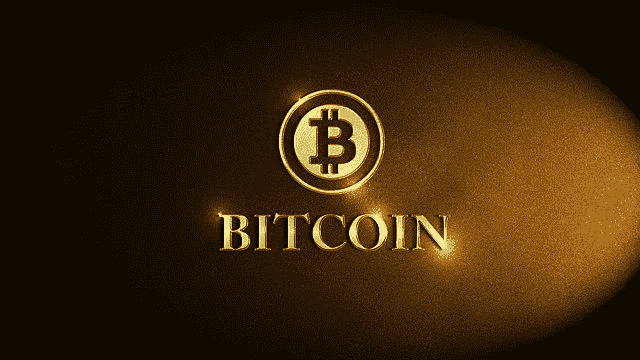
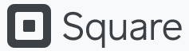
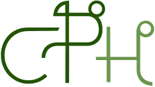

# 购买比特币的顶级公司

> 原文：<https://medium.com/coinmonks/top-companies-purchasing-bitcoin-30ae48b0df03?source=collection_archive---------3----------------------->

在[语音](https://www.voice.com/post/@tulip/top-companies-purchasing-bitcoin-1607875109-1)阅读我的原创文章。

**在一个非常令人沮丧的熊市中积累了近 3 年后，2020 年的秘密牛市开始了。由于冠状病毒黑天鹅事件，市场在 2020 年 3 月也出现了极端低点。在这个阶段，重要的项目也集中于开发他们的技术。他们中的许多现在正在被部署(例如:以太坊 2.0，Polkadot，Cardano 智能合同)。这些活动给市场带来了新的积极情绪。我们现在看到许多机构正在将比特币纳入他们的投资组合。**

*这篇文章谈论了购买比特币的顶级机构。*

## **1。** [**灰度比特币信托**](https://grayscale.co/)

**截至 2020 年 12 月 13 日的比特币持有量:546，544 BTC(100 亿美元)**

灰度投资是最大的数字货币资产，经理。2020 年 11 月，gray 管理着大约 122 亿美元的资产。它是大量购买比特币的主要机构之一。灰度持有的比特币占数字资产总流通供应量的 2.14%。据估计，到 2020 年，灰度已经购买了所有比特币的 70%。

## **2。**[**coin shares**](https://coinshares.com/)

**截至 2020 年 12 月 13 日的比特币持有量:69730 BTC(13 亿美元)**

CoinShares 是一家数字资产投资集团。该团队于 2014 年推出了全球首只受监管的比特币投资基金。它还于 2015 年在一个受监管的交易所推出了世界上第一批基于比特币的证券。该公司主要关注比特币和其他加密货币的直接和间接风险。Coinshares 管理着超过 10 亿美元的数字资产。比特币由近 80%的相同部分组成。

## **3。** [**微战略**](https://microstrategy.com/en/bitcoin)

**截至 2020 年 12 月 13 日的比特币持有量:40824 BTC(7.81 亿美元)**

MicroStrategy 为《财富》全球 500 强中最受推崇的品牌提供商业智能。其领先的企业分析平台包括增强智能和机器学习技术，用于分析内部和外部数据以做出商业决策。

Microstrategy 购买了价值 4.25 亿美元的比特币。它现在是 Microstrategy 的主要储备资产。比特币的价值现已升至约 7.81 亿美元。

## **4。** [**银河数码控股**](https://galaxydigital.io/)

**截至 2020 年 12 月 13 日的比特币持有量:16651 BTC(3.18 亿美元)**

银河数码将自己定位为机构和密码世界之间的桥梁。这是一家多元化的金融服务公司。服务包括交易、资产管理、本金投资和投资银行服务。非常受欢迎的迈克尔·诺沃格拉茨是首席执行官和创始人

银河数码 2020 年第三季度净收入为 4430 万美元，主要原因是比特币价格上涨。它最近收购了两家公司(DrawBridge Lending 和 Blue Fire Capital ),以加强其机构加密产品。

## **5。** [**方形**](https://squareup.com/us/en)

**截至 2020 年 12 月 13 日的比特币持有量:4709 BTC(5000 万美元)**

Square 是一家金融服务、商业服务聚合公司和移动支付公司。它由杰克·多西于 2009 年创立。Square 通过其现金应用向客户出售比特币。2020 年第三季度，Cash App 的比特币销售额约为 16.3 亿美元。这比前一年增加了 11 倍。2020 年 10 月，Square 以 5000 万美元的价格购买了 4709 个比特币，

Square 推出了加密货币开放专利联盟(COPA)，这是一个非营利组织，将提供覆盖基础加密货币技术的专利开放访问。

## **6。** [**庞克控股**](https://cypherpunkholdings.com/)

**截至 2020 年 12 月 13 日的比特币持有量:276.5 BTC(530 万美元)**

Cypherpunk Holdings 是一家数字资产投资公司，在加拿大证券交易所(CSE)上市，股票代码为 HODL。2020 年 11 月，该公司宣布更新后的比特币头寸为 276.5 比特币。该公司出售了在 Monero (XMR)和 Ethereum (ETH)等公司的头寸。来购买这个职位。

## 7。 [**万通**](https://massmutual.com/)

**2020 年 12 月 13 日比特币持有量:？？？(1 亿美元)**

马萨诸塞州相互人寿保险公司是该集团的最新成员。MassMutual 是一家人寿保险和保障产品公司，拥有 500 多万客户。它最近宣布购买 1 亿美元在 BTC 的一般保险账户。在这个过程中，MassMutual 还收购了纽约数字投资集团(NYDIG)500 万美元的股份。

其他著名的比特币机构投资者包括 **Voyager Digital，Block。一、Tezos 基金会、DigitalX、**等。

参考:[比特币国债](https://bitcointreasuries.org/)

## 阅读我的加密投资系列

1.[我的秘密投资:第一部分——定义——7 大投资技巧](/coinmonks/defi-top-7-investment-tips-9999d1679da2)

2.[我的加密投资:第二部分——构建平衡的加密投资组合](/coinmonks/building-a-balanced-crypto-portfolio-2a384492b1c)

**加入**

[Crypto.com](https://binance.com/en/register?ref=E8PCD3AF)——[币安](https://platinum.crypto.com/r/sut3pd9bzn)

**跟我来**

**👉** [推特](https://twitter.com/rumadas123)

**👉** [领英](https://www.linkedin.com/in/ruma-das-a1439320/)

## 另外，阅读

*   [学习以太坊和 Web3 开发](http://blog.coincodecap.com/go/learn)
*   最好的[密码交易机器人](/coinmonks/crypto-trading-bot-c2ffce8acb2a)
*   [3 商业评论](/coinmonks/3commas-review-an-excellent-crypto-trading-bot-2020-1313a58bec92)
*   [Pionex 审查](/coinmonks/pionex-review-exchange-with-crypto-trading-bot-1e459d0191ea)
*   [AAX 交易所评论](/coinmonks/aax-exchange-review-2021-67c5ea09330c) |推荐代码、交易费用、利弊
*   [Deribit 审查](/coinmonks/deribit-review-options-fees-apis-and-testnet-2ca16c4bbdb2) |选项、费用、API 和 Testnet
*   [FTX 密码交易所评论](/coinmonks/ftx-crypto-exchange-review-53664ac1198f)
*   [n 零审核](/coinmonks/ngrave-zero-review-c465cf8307fc)
*   [逐位交换审查](/coinmonks/bybit-exchange-review-dbd570019b71)
*   [3Commas vs Cryptohopper](/coinmonks/3commas-vs-pionex-vs-cryptohopper-best-crypto-bot-6a98d2baa203)
*   最好的比特币[硬件钱包](/coinmonks/the-best-cryptocurrency-hardware-wallets-of-2020-e28b1c124069?source=friends_link&sk=324dd9ff8556ab578d71e7ad7658ad7c)
*   [密码本交易平台](/coinmonks/top-10-crypto-copy-trading-platforms-for-beginners-d0c37c7d698c)
*   最佳 [monero 钱包](https://blog.coincodecap.com/best-monero-wallets)
*   [莱杰 nano s vs x](https://blog.coincodecap.com/ledger-nano-s-vs-x)
*   [Bitsgap vs 3 commas vs quad ency](https://blog.coincodecap.com/bitsgap-3commas-quadency)
*   最好的[加密税务软件](/coinmonks/best-crypto-tax-tool-for-my-money-72d4b430816b)
*   [最佳加密交易平台](/coinmonks/the-best-crypto-trading-platforms-in-2020-the-definitive-guide-updated-c72f8b874555)
*   最佳[加密贷款平台](/coinmonks/top-5-crypto-lending-platforms-in-2020-that-you-need-to-know-a1b675cec3fa)
*   [莱杰 Nano S vs 特雷佐 one vs 特雷佐 T vs 莱杰 Nano X](https://blog.coincodecap.com/ledger-nano-s-vs-trezor-one-ledger-nano-x-trezor-t)
*   [block fi vs Celsius](/coinmonks/blockfi-vs-celsius-vs-hodlnaut-8a1cc8c26630)vs Hodlnaut
*   [bits gap review](/coinmonks/bitsgap-review-a-crypto-trading-bot-that-makes-easy-money-a5d88a336df2)——一个轻松赚钱的加密交易机器人
*   为专业人士设计的加密交易机器人
*   [共同追踪审查](/coinmonks/cointracking-review-a-reliable-cryptocurrency-tax-software-5114e3eb5737)
*   [尤霍德勒评论](/coinmonks/youhodler-4-easy-ways-to-make-money-98969b9689f2)
*   [埃利帕尔泰坦评论](/coinmonks/ellipal-titan-review-85e9071dd029)
*   [赛克斯石评论](https://blog.coincodecap.com/secux-stone-hardware-wallet-review)
*   [BlockFi 评论](/coinmonks/blockfi-review-53096053c097) |赚取高达 8.6%的加密利息
*   [Coinrule 评论](https://blog.coincodecap.com/coinrule-review-a-perfect-trading-bot)
*   [最佳区块链分析工具](https://bitquery.io/blog/best-blockchain-analysis-tools-and-software)
*   [加密套利](/coinmonks/crypto-arbitrage-guide-how-to-make-money-as-a-beginner-62bfe5c868f6)指南:新手如何赚钱
*   最佳[加密制图工具](/coinmonks/what-are-the-best-charting-platforms-for-cryptocurrency-trading-85aade584d80)
*   了解比特币最好的[书籍有哪些？](/coinmonks/what-are-the-best-books-to-learn-bitcoin-409aeb9aff4b)

> [在您的收件箱中直接获得最佳软件交易](/coinmonks/newsletters/coinmonks)

