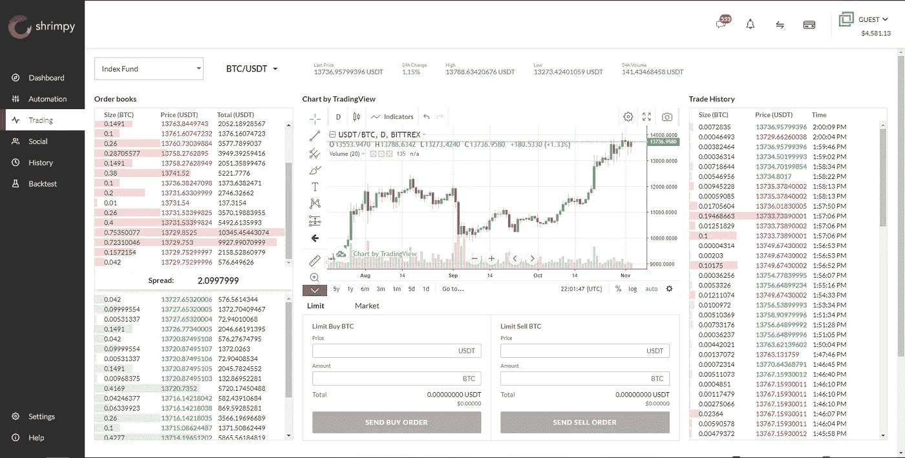
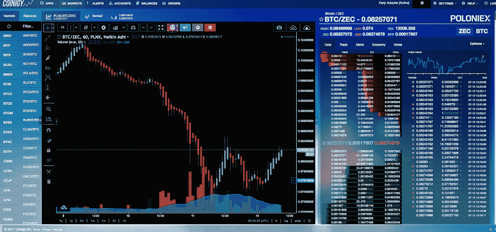
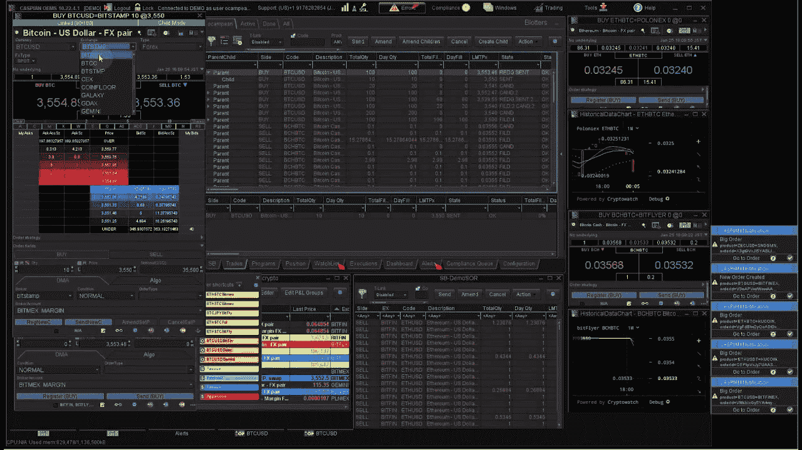

# 顶级加密交易终端(2021 年更新)

> 原文：<https://medium.com/coinmonks/top-crypto-trading-terminals-778907f4ce13?source=collection_archive---------0----------------------->

加密交易员使用交易终端通过 API 连接到交易所。通过第三方交易终端，交易者可以使用交易所没有的附加功能。

通过接入多个交易所，交易终端可以充当连接跨交易所投资组合的中心枢纽。交易员使用单一终端服务同时管理多个交易所的订单。

有了交易终端，投资者可以下单购买和出售数字资产，自动化琐碎的任务，并执行复杂的策略，如果没有终端，这些都是不可能的。其中一些策略甚至包括同时交易多种资产。

 [## 复制世界上最好的密码交易者的社会投资组合

### 谈到交易，加密货币社区一直很活跃。在过去的几年里，人们开发了…

blog.shrimpy.io](https://blog.shrimpy.io/blog/crypto-social-trading-how-to-copy-the-worlds-best-traders) 

交易终端最基本的功能包括:

*   连接到 exchanges 以收集帐户信息
*   下订单和取消订单
*   以图形和图表的形式显示市场数据
*   执行高级订单类型，如智能订单
*   计算和显示各种技术指标

## Shrimpy —初学者友好型

任何第一次入门交易加密货币的人，都应该看 [**Shrimpy**](https://blog.coincodecap.com/go/shrimpy) 。它的优雅和简单的设计提供了所有必要的工具，你需要执行一个有效的日内交易策略。

方便的是，由于大多数投资者不能整天坐在那里盯着图表，Shrimpy 还提供了在用户不在时自动交易投资组合的工具。

像重新平衡投资组合、实施投资组合止损或平均成本等投资策略都是史瑞比的专长。然而，这并没有掩盖使用终端管理精确订单的便利性。

Shrimpy 是新手、专业投资者和日内交易者的完美解决方案。该平台支持多种工具来管理多个不同交易所的各种资产。

与其他交易终端不同，Shrimpy 还提供了许多社交交易功能，投资者可以跟随其他顶级交易者查看他们的投资组合。

[**开始您的 Shrimpy 免费试用！**](https://blog.coincodecap.com/go/shrimpy)

**优点:**

*   自动化工具让交易变得简单
*   用户界面易于使用
*   被动投资者的理想选择

**缺点:**

*   没有交易警报
*   目前不支持冰山订单

 [## Shrimpy -加密货币的社交交易平台

### Shrimpy 是一个加密货币社交交易平台，专为简单的投资组合管理而打造

www.shrimpy.io](https://www.shrimpy.io/) 

## coinigy——带技术分析的中间交易

[**Coinigy**](https://www.coinigy.com/) 是最早为加密货币推出的交易终端之一。Coinigy 专为更高级的交易者设计，是希望管理多个投资组合的技术策略的日内交易者的理想解决方案。

使用 Coinigy 的客户可以利用警报系统随时掌握自己的交易情况。通过市场分析、应用程序集成和订单监控，Coinigy 旨在让您全天保持活跃的交易。

除了核心交易终端，Coinigy 在自动化或投资组合管理方面没有提供太多服务。该平台一直坚持其最初的目标，即为高级密码交易员创建一个强大的交易终端。

**优点:**

*   提醒可以让你了解交易的最新情况
*   许多技术指标和图表工具
*   是全职日内交易者的理想选择

**缺点:**

*   尚未在所有交易所增加贸易支持
*   没有自动化工具
*   不支持那么多功能

 [## Coinigy -专业的比特币和加密货币交易平台

### 让您的比特币交易更上一层楼！Coinigy 是您的数字货币一体化平台。在…的 45%以上进行交易

www.coinigy.com](https://www.coinigy.com/) 

## 里海—面向机构的高级交易

[**里海**](https://caspian.tech/) 无疑是加密市场上最复杂的交易终端。如果你有超过 1 亿美元的资产和一个全天候管理每笔交易的专业团队，里海就是你的工具。

Caspian 提供了最完整的一套交易功能，可以在各种不同的交易所中实现。使用该软件的团队对这个复杂的平台只有积极的评价。

别让高赞忽悠了你，凯斯宾有天文学习曲线。要有效管理里海的投资组合，可能需要多年的研究和学习。

里海不适合个人交易者或散户投资者使用。试图作为个人使用像 Caspian 这样复杂的软件不仅是不明智的，而且对于一个人来说也是多余的。

**优点:**

*   提供比任何交易终端更多的功能
*   非常适合老练的交易团队
*   非常适合管理超过 1 亿美元基金的机构

**缺点:**

*   使用起来非常复杂
*   不是为个人投资者设计的
*   昂贵的

 [## 阅读我们的专家对加密货币交易的看法

### 里海是一个完整的资产管理解决方案，涵盖了整个生命周期的贸易。它包括一个完整的…

里海科技](https://caspian.tech/) 

# 结论

如果没有合适的工具，交易加密货币可能是一项艰巨的任务。大多数交易者发现利用交易终端可以简化管理投资组合的任务。

根据您的需求，这三种交易终端仍然是市场上最突出的选择。 [**Shrimpy**](https://www.shrimpy.io/) 是刚刚起步或保持较为被动的投资策略的个人投资者的理想选择。 [**Coinigy**](https://www.coinigy.com/) 非常适合想全职交易的高级交易者。对于需要管理一支交易员团队和 1 亿多美元资产的机构基金来说，里海是最佳解决方案。

# 额外的好读物

*   [**市场上最好的自动加密交易机器人**](https://blog.shrimpy.io/blog/the-best-automated-crypto-trading-bots-in-the-market)
*   [**新手被动加密投资策略**](https://blog.shrimpy.io/blog/passive-crypto-investing-strategies-for-beginners)
*   [**如何用 Python 制作一个加密交易机器人**](https://blog.shrimpy.io/blog/how-to-make-a-crypto-trading-bot-using-python)
*   [**构建加密指数基金指南**](https://blog.shrimpy.io/blog/cryptocurrency-index-funds-step-by-step-guide)
*   [**加密交易机器人终极指南**](https://blog.shrimpy.io/blog/cryptocurrency-trading-bots-the-complete-guide)