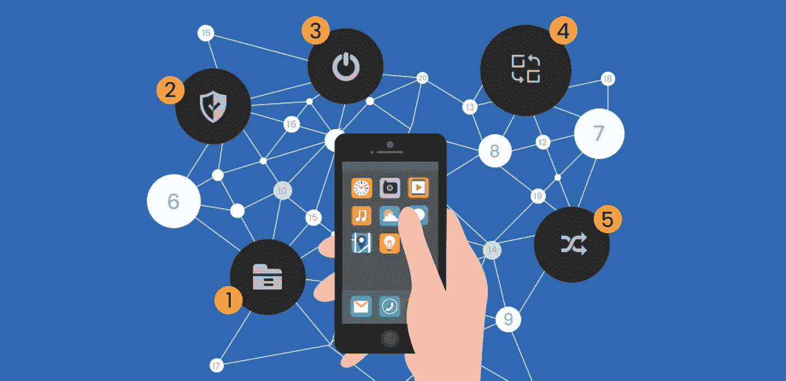
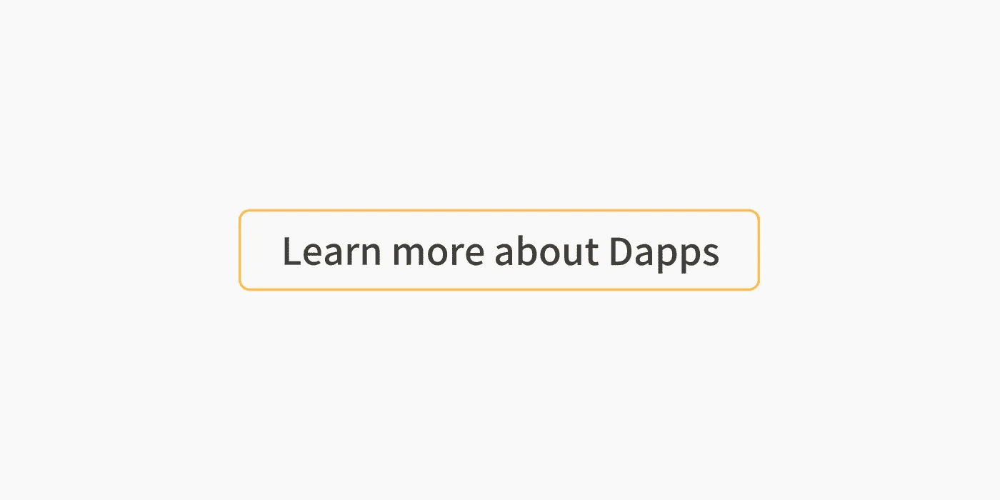

# 顶级 Dapp 教程系列

> 原文：<https://medium.com/coinmonks/top-dapp-tutorial-series-2e70c0d79782?source=collection_archive---------1----------------------->

## 从以太坊、Neo、Nebulas 和 Eos 的系列教程和故事中学习如何构建 Dapps——Dapps 规则

[source](https://www.collonmade.com/5-reasons-dapps-are-the-future-of-app-development/)

## [查看最新的 Dapps 教程](https://medium.com/coinmonks/dapp/home)

[**#HowToBUIDL 系列(第 1 部，共 n 部)**](/coinmonks/howtobuidl-series-1-of-n-bf51e248243d)

 [## # HowToBUIDL 系列(第 1 页，共 n 页)

### #BUIDL :: Dev 环境设置。这个系列是为任何一个寻找摆脱束缚的人而写的。没有理由…

medium.com](/coinmonks/howtobuidl-series-1-of-n-bf51e248243d) 

[**以太坊上构建全栈 DApp 简介—第 1 部分**](/coinmonks/a-gentle-intro-to-building-a-full-stack-dapp-on-ethereum-part-1-c1aedb11fcd2)

 [## 以太坊上构建全栈 DApp 的温和介绍—第 1 部分

### 在本教程中，我们将构建一个简单的 dapp(分散式应用程序)。我们的目标是介绍……

medium.com](/coinmonks/a-gentle-intro-to-building-a-full-stack-dapp-on-ethereum-part-1-c1aedb11fcd2) 

[**学扎实。泳池里的鲨鱼—第一部**](/coinmonks/learn-solidity-shark-of-the-pool-part-1-ac0f733eecdd)

 [## 学扎实。泳池里的鲨鱼——第一部分

### 在本系列中，我们将使用 Solidity smart contracts 基于以太坊区块链创建一个简单的 Dapp。在后来…

medium.com](/coinmonks/learn-solidity-shark-of-the-pool-part-1-ac0f733eecdd) 

[**跃入坚实——ERC 721 标准(第一部分)**](/coinmonks/jumping-into-solidity-the-erc721-standard-part-1-e25b67fc91f3)

 [## 迈向坚实——ERC 721 标准(第一部分)

### 几个月前，我决定学习 Solidity，这是一种用于编写智能合同的编程语言。

medium.com](/coinmonks/jumping-into-solidity-the-erc721-standard-part-1-e25b67fc91f3) 

[**基于以太坊的 dApp 编程—第一部分**](/coinmonks/programming-an-ethereum-based-dapp-part-1-ebdff09ec0f6)

 [## 基于以太坊的 dApp 编程—第 1 部分

### 最近，我有机会参与一个基于以太坊的项目。

medium.com](/coinmonks/programming-an-ethereum-based-dapp-part-1-ebdff09ec0f6) 

基于 Patreon 制作最简单的以太坊 Dapp 第 1 部分。制作智能合同

 [## 基于 Patreon 制作最简单的以太坊 Dapp 第 1 部分。制定明智的合同

### 如果你最近一直在关注科技新闻，你可能已经注意到了围绕区块链科技和…

medium.com](/coinmonks/making-the-simplest-ethereum-dapp-based-off-patreon-part-1-making-the-smart-contract-153fb0ebdcfb) 

[**星云 Dapp 教程**](/coinmonks/dapp-tutorial-72f0ae39f538)

 [## 星云 Dapp 教程

### 第一部分

medium.com](/coinmonks/dapp-tutorial-72f0ae39f538) 

[**构建简单且不可阻挡的去中心化 Web 应用(DAPP)**](/coinmonks/build-a-simple-and-unstoppable-decentralized-web-application-dapp-aa8d08e35f9c)

 [## 构建一个简单且不可阻挡的分散式 Web 应用程序(DAPP)

### 在阅读本文之前，您需要先使用 Truffle 来玩和测试智能合约。

medium.com](/coinmonks/build-a-simple-and-unstoppable-decentralized-web-application-dapp-aa8d08e35f9c) 

[**你的第一个 EOS dApp——设置**](/coinmonks/your-first-eos-dapp-the-setup-dde55d3dcfb7)

 [## 您的第一个 EOS dApp —设置

### EOS 简介

medium.com](/coinmonks/your-first-eos-dapp-the-setup-dde55d3dcfb7) 

[**用松露、Ganache 和 MetaMask 开发以太坊 Dapps**](/coinmonks/developing-ethereum-dapps-with-truffle-ganache-and-metamask-31bc5023ce91)

 [## 用松露、Ganache 和 MetaMask 开发以太坊 Dapps

### 插件:元遮罩

medium.com](/coinmonks/developing-ethereum-dapps-with-truffle-ganache-and-metamask-31bc5023ce91) 

[**如何使用 Truffle、Oraclize、ethereum-bridge 和 Webpack**](/coinmonks/how-to-create-a-dapp-using-truffle-oraclize-ethereum-bridge-and-webpack-9cb84b8f6bcb) 创建 DApp

 [## 如何使用 Truffle、Oraclize、ethereum-bridge 和 Webpack 创建 DApp

### 关于在智能合约前端使用外部 API 数据的简单指南

medium.com](/coinmonks/how-to-create-a-dapp-using-truffle-oraclize-ethereum-bridge-and-webpack-9cb84b8f6bcb) 

[**基于 Patreon 制作最简单的以太坊 Dapp 第 1 部分。制定智能合同**](/coinmonks/making-the-simplest-ethereum-dapp-based-off-patreon-part-1-making-the-smart-contract-153fb0ebdcfb)

 [## 基于 Patreon 制作最简单的以太坊 Dapp 第 1 部分。制定明智的合同

### 如果你最近一直在关注科技新闻，你可能已经注意到了围绕区块链科技和…

medium.com](/coinmonks/making-the-simplest-ethereum-dapp-based-off-patreon-part-1-making-the-smart-contract-153fb0ebdcfb) 

[**Neo 智能合约开发教程—开头**](/coinmonks/neo-smart-contract-development-tutorial-the-beginning-c54ea748ce77)

 [## Neo 智能合同开发教程-开始

### Neo 智能合同开发从零开始，从安装开始。net，设置 visual Studio 来创建智能合约…

medium.com](/coinmonks/neo-smart-contract-development-tutorial-the-beginning-c54ea748ce77) 

[**D-Apps 简介。零件# 1**](/coinmonks/introduction-to-d-apps-part-1-6c03f580dfa1)

 [## 动态应用简介。第一部分

### 区块链和去中心化 app 简介。

medium.com](/coinmonks/introduction-to-d-apps-part-1-6c03f580dfa1) 

> 如果你觉得这些故事有用，那就关注我们的 Coinmonks 出版物，了解更多关于区块链和建筑的知识。

**Click to learn more about Dapps**