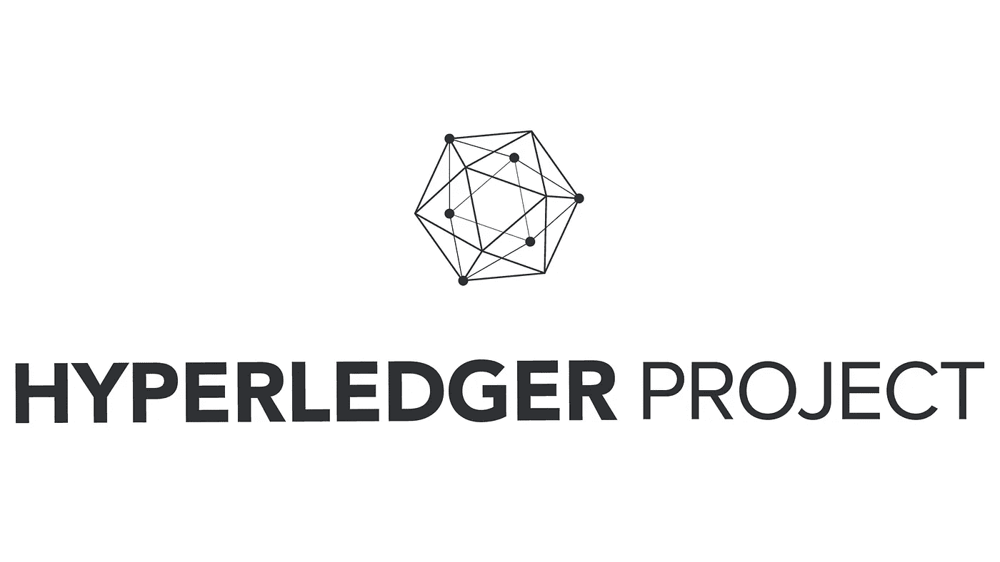
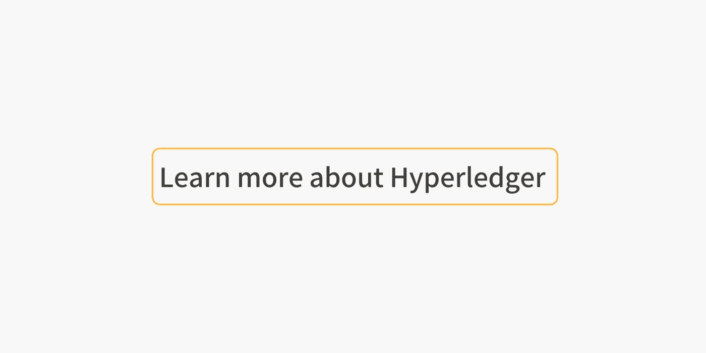

# 热门 Hyperledger 教程和文章

> 原文：<https://medium.com/coinmonks/top-hyperledger-tutorials-and-articles-b77cf3e4d1eb?source=collection_archive---------1----------------------->

## 关于 Hyperledger Fabric、Hyperledger Composer、企业区块链入门

Hyperledger Project [source](https://www.cryptoninjas.net/2018/01/25/hyperledger-begins-2018-27-new-members/)

**Create Crypto Invoices**

[**【Cryptofi】—在 Cryptofi 中创建发票并获得付款**](https://cryptofi.co/)

[**使用 Coinmonks 作业门户**](https://coinmonks.com/) 查找加密作业

[***【捐投】投币僧侣***](/coinmonks/monks-need-your-help-7440418d67ec)

**Click to find blockchain Jobs**

## [查看最新的 Hyperledger 教程](https://medium.com/coinmonks/hyperledger/home)

H [yperledger](https://www.hyperledger.org) 是由 [Linux 基金会](http://www.linuxfoundation.org)于 2015 年 12 月启动的开源区块链及相关工具的伞式项目。

> 这是通过识别和解决分布式分类帐跨行业开放标准的重要功能来推进区块链技术的合作努力，该标准可以改变全球商业交易的方式。👏

[**商业区块链—超级账本技术简介**](/coinmonks/blockchain-for-business-an-introduction-to-hyperledger-technologies-1db7b0b88880)

由**[Muntasir Mamun](https://medium.com/u/160491778110?source=post_page-----b77cf3e4d1eb--------------------------------)**

** [## 商业区块链 Hyperledger 技术简介

### Hyperledger 是 Linux 于 2015 年 12 月开始的开源区块链及相关工具的伞形项目…

medium.com](/coinmonks/blockchain-for-business-an-introduction-to-hyperledger-technologies-1db7b0b88880) 

[**Hyperledger 作曲揭秘！**](/coinmonks/ibm-blockchain-demystified-3af55ab7c7bb)

由[赛义夫·拉赫曼](https://medium.com/u/7be3008b373a?source=post_page-----b77cf3e4d1eb--------------------------------)

 [## Hyperledger 作曲家揭秘！

### 什么是区块链，它对 IBM 意味着什么？

medium.com](/coinmonks/ibm-blockchain-demystified-3af55ab7c7bb) 

[**AWS Hyperledger Fabric 模板—非官方指南**](/coinmonks/get-started-with-blockchain-using-the-aws-hyperledger-fabric-template-an-unofficial-guide-551bc46af710)

由[达费罗](https://medium.com/u/87346ec38875?source=post_page-----b77cf3e4d1eb--------------------------------)

 [## AWS Hyperledger 结构模板-非官方指南

### 了解如何利用 AWS Hyperledger Fabric 模板，并逐步将分散式应用程序部署到您的新…

medium.com](/coinmonks/get-started-with-blockchain-using-the-aws-hyperledger-fabric-template-an-unofficial-guide-551bc46af710) 

[**【总账锯齿从无到有】第一部**](/coinmonks/hyperledger-sawtooth-from-scratch-part-1-52bd7b030838)

由[亚历克斯·德瓦西](https://medium.com/u/5ed5c820da12?source=post_page-----b77cf3e4d1eb--------------------------------)

 [## 超级分类帐锯齿从零开始-第 1 部分

### 在区块链玩井字游戏！！:)

medium.com](/coinmonks/hyperledger-sawtooth-from-scratch-part-1-52bd7b030838) 

[**第一个使用 Hyperledger Composer 的商业网络**](/coinmonks/first-business-network-using-hyperledger-composer-ba1691c5e466)

由[柯坦·帕尔马(KPBird)](https://medium.com/u/e2ce4190473?source=post_page-----b77cf3e4d1eb--------------------------------)

 [## 第一个使用 Hyperledger Composer 的商业网络

### Hyperledger Composer 是一个广泛的、开放的开发工具集和框架，使开发区块链应用程序…

medium.com](/coinmonks/first-business-network-using-hyperledger-composer-ba1691c5e466) 

[**Hyperledger Fabric 实现—第 1 部分**](/coinmonks/hyperledger-fabric-implementation-v1-1-part-1-chaincode-for-node-7b72aec2430d)

由**[pradeep padmarajiah](https://medium.com/u/2130e519c34?source=post_page-----b77cf3e4d1eb--------------------------------)**

** [## Hyperledger 结构实施—第 1 部分

### Hyperledger 结构实施 1.1 版:使用 Node.js 和 Golang 的链码

medium.com](/coinmonks/hyperledger-fabric-implementation-v1-1-part-1-chaincode-for-node-7b72aec2430d) 

[**安装 Hyperledger Composer 游乐场**](/coinmonks/installing-hyperledger-composer-playground-58ad359d4a2f)

由 [Nikhil Krishnan](https://medium.com/u/b4dc163bacbb?source=post_page-----b77cf3e4d1eb--------------------------------)

 [## 安装 Hyperledger Composer 游乐场

### 不断发展的区块链环境带来了许多区块链开发和测试工具。构建和运行…

medium.com](/coinmonks/installing-hyperledger-composer-playground-58ad359d4a2f) 

[**Hyperledger:它是什么，有什么用，太空球里没有吗？**](/coinmonks/hyperledger-what-is-it-whats-it-good-for-and-wasn-t-it-in-spaceballs-522d8b3857c8)

由[兰德尔·马尔德](https://medium.com/u/4d6518c9f2ab?source=post_page-----b77cf3e4d1eb--------------------------------)

 [## Hyperledger:它是什么，它有什么用，它不是在太空球里吗？

### 在《太空球》中，达斯·维达的仿制品《黑暗头盔》把卢克·天行者的仿制品《孤星》放在了他想要的地方，当…

medium.com](/coinmonks/hyperledger-what-is-it-whats-it-good-for-and-wasn-t-it-in-spaceballs-522d8b3857c8) 

[**一步一步走向超账织物—第一部**](/coinmonks/step-by-step-towards-hyperledger-fabric-part-1-c867fc5fe18)

由 [Ashish](https://medium.com/u/8e5a775b68fd?source=post_page-----b77cf3e4d1eb--------------------------------)

 [## 一步一步走向 Hyperledger 结构—第 1 部分

### 区块链是目前行业中的新流行语。但是找到好的资源来学习这个迷人的…

medium.com](/coinmonks/step-by-step-towards-hyperledger-fabric-part-1-c867fc5fe18) 

[**Windows 上的 Hyperledger Fabric 1 . 1 . 0**](/coinmonks/hyperledger-fabric-1-1-0-on-windows-fd142651a904)

尼克·梅瑞曼斯

 [## Windows 上的 Hyperledger Fabric 1.1.0

### 我猜你知道这个故事。你想开发一些东西，不管出于什么原因你在一台 Windows 电脑上，也许你…

medium.com](/coinmonks/hyperledger-fabric-1-1-0-on-windows-fd142651a904) 

[中的**验证**中的](/coinmonks/validation-in-hyperledger-sawtooth-f29b2d9a6b23)

由[区块链经销商](https://medium.com/u/4302c322eb19?source=post_page-----b77cf3e4d1eb--------------------------------)

 [## Hyperledger 锯齿中的验证

### 作为我对锯齿文档概述的一部分，在此向您展示本系列的第二部分。

medium.com](/coinmonks/validation-in-hyperledger-sawtooth-f29b2d9a6b23) 

> 如果你喜欢这些故事，你可以给👏给这些了不起的作家、学习者和制作者，与我们分享这些教育故事，别忘了关注我们的 Coinmonks 出版物。请告诉我们您想了解区块链领域的哪些内容。😃

**Click to learn more about hyperledger******