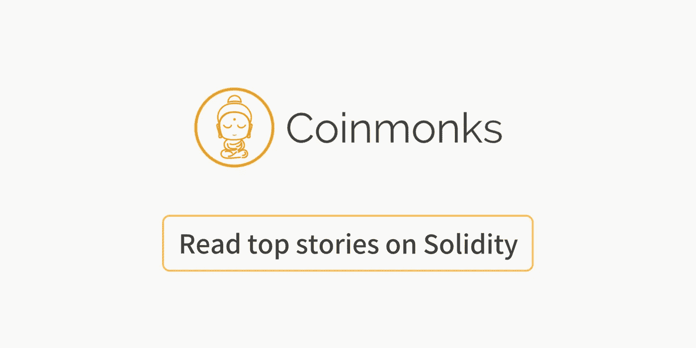

# 顶级坚固性教程

> 原文：<https://medium.com/coinmonks/top-solidity-tutorials-4e7adcacced8?source=collection_archive---------1----------------------->

## 来自 Coinmonks 上的作者的固体教程和故事，在以太坊上学习和建立 dapps

[source](http://www.solidityprivatewealth.com/)

## [查看最新的可靠性故事](https://medium.com/coinmonks/solidity/home)

[**实体开发:设置环境**](/coinmonks/solidity-development-setting-up-environment-611c4bc2530b)

 [## 稳健发展:建立环境

### 为智能合同开发设置工作环境

medium.com](/coinmonks/solidity-development-setting-up-environment-611c4bc2530b) 

[**可靠性开发:创建我们的第一个智能合同**](/coinmonks/solidity-development-creating-our-first-smart-contract-54943b47d7f3)

 [## 可靠性开发:创建我们的第一个智能合同

### 为加密游戏开发智能合约

medium.com](/coinmonks/solidity-development-creating-our-first-smart-contract-54943b47d7f3) 

[**#HowToBUIDL 系列(第 1 个，共 n 个)**](/coinmonks/howtobuidl-series-1-of-n-bf51e248243d)

 [## # HowToBUIDL 系列(第 1 页，共 n 页)

### #BUIDL :: Dev 环境设置。这个系列是为任何一个寻找摆脱束缚的人而写的。没有理由…

medium.com](/coinmonks/howtobuidl-series-1-of-n-bf51e248243d) 

[**以太坊上构建全栈 DApp 简介—第 1 部分**](/coinmonks/a-gentle-intro-to-building-a-full-stack-dapp-on-ethereum-part-1-c1aedb11fcd2)

 [## 以太坊上构建全栈 DApp 的温和介绍—第 1 部分

### 在本教程中，我们将构建一个简单的 dapp(分散式应用程序)。我们的目标是介绍……

medium.com](/coinmonks/a-gentle-intro-to-building-a-full-stack-dapp-on-ethereum-part-1-c1aedb11fcd2) 

[**如何:使用 Node.js**](/coinmonks/how-to-compile-a-solidity-smart-contract-using-node-js-51ea7c6bf440) 编译 Solidity Smart Contract】

 [## 如何:使用 Node.js 编译 Solidity 智能协定

### 在之前的博文中，我们使用 Solidity 编程语言编写了一个智能契约。

medium.com](/coinmonks/how-to-compile-a-solidity-smart-contract-using-node-js-51ea7c6bf440) 

[**如何:写一个简单的智能合同**](/coinmonks/how-to-write-a-simple-smart-contract-25f6d3c1d6db)

 [## 如何:编写简单的智能协定

### 我们将使用 Solidity 编程语言编写一个简单的智能合同，在下面的帖子中，我们将…

medium.com](/coinmonks/how-to-write-a-simple-smart-contract-25f6d3c1d6db) 

[**开始使用块菌进行实体开发**](/coinmonks/getting-started-with-solidity-development-using-truffle-2cc6c1df9133)

 [## 使用 Truffle 开始 Solidity 开发

### Yorke Rhodes 于 2017 年 1 月 31 日发布

medium.com](/coinmonks/getting-started-with-solidity-development-using-truffle-2cc6c1df9133) 

[**用松露和异步/等待**](/coinmonks/testing-solidity-with-truffle-and-async-await-396e81c54f93) 测试可靠性

 [## 用 Truffle 和 Async/Await 测试可靠性

### 如果你问一个程序员/开发者工作中最糟糕的部分是什么，我想大多数人会说写测试。你…

medium.com](/coinmonks/testing-solidity-with-truffle-and-async-await-396e81c54f93) 

[**学扎实。泳池里的鲨鱼——第一部**](/coinmonks/learn-solidity-shark-of-the-pool-part-1-ac0f733eecdd)

 [## 学扎实。泳池里的鲨鱼——第一部分

### 在本系列中，我们将使用 Solidity smart contracts 基于以太坊区块链创建一个简单的 Dapp。在后来…

medium.com](/coinmonks/learn-solidity-shark-of-the-pool-part-1-ac0f733eecdd) 

[中的**链表**中的](/coinmonks/linked-lists-in-solidity-cfd967af389b)

 [## Solidity 中的链表

### 我们需要一个高效的结构来存储智能契约中的大量条目，以便快速遍历。它…

medium.com](/coinmonks/linked-lists-in-solidity-cfd967af389b) 

[**存储 vs 存储**](/coinmonks/storage-vs-memory-in-solidity-8251847186fd)

 [## 存储与存储的稳固性

### 一个让你思考的简单例子

medium.com](/coinmonks/storage-vs-memory-in-solidity-8251847186fd) 

[**稳健合约的返回值**](/coinmonks/return-values-in-solidity-contracts-2a034b31d553)

 [## 可靠性合同中的返回值

### 如果唯一的其他选择是恢复，没有必要返回一个布尔值

medium.com](/coinmonks/return-values-in-solidity-contracts-2a034b31d553) 

[**用事件驯服 DApp**](/coinmonks/taming-the-dapp-with-events-b73b7237f0d9)

 [## 用事件驯服 DApp

### 管理状态是艰难的。管理 UI 的复杂性是困难的。在以太坊区块链和…上管理您的应用程序状态

medium.com](/coinmonks/taming-the-dapp-with-events-b73b7237f0d9) 

[**以太坊契约继承**](/coinmonks/ethereum-contract-inheritance-427ccb685079)

 [## 以太契约继承

### 这是《契约继承的竞合探索》的节选。

medium.com](/coinmonks/ethereum-contract-inheritance-427ccb685079) 

[**用松露测试智能合约**](/coinmonks/test-a-smart-contract-with-truffle-3eb8e1929370)

 [## 用松露测试智能合同

### 在上一篇文章中，我向您展示了如何在 Remix 编辑器中编写智能契约。但是不方便…

medium.com](/coinmonks/test-a-smart-contract-with-truffle-3eb8e1929370) 

[**可靠性:交易排序攻击**](/coinmonks/solidity-transaction-ordering-attacks-1193a014884e)

 [## 可靠性:事务排序攻击

### 本文将解释以太坊智能合约中的一个攻击媒介，称为交易排序/前台运行…

medium.com](/coinmonks/solidity-transaction-ordering-attacks-1193a014884e) 

[**颠覆循环引用错误**](/coinmonks/subverting-the-circular-reference-error-in-solidity-f7167bf9fdb)

 [## 在坚固性上颠覆循环参考误差

### 最近在我的 Solidity adventures 中，我一直在做一个简单的留言板合同(仍在开发中),与…

medium.com](/coinmonks/subverting-the-circular-reference-error-in-solidity-f7167bf9fdb) 

> 如果你觉得这些故事有用，那就关注我们的 Coinmonks 出版物，了解更多关于区块链和建筑的知识。

**Click to learn more about Solidity**