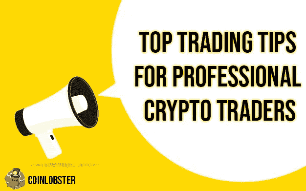
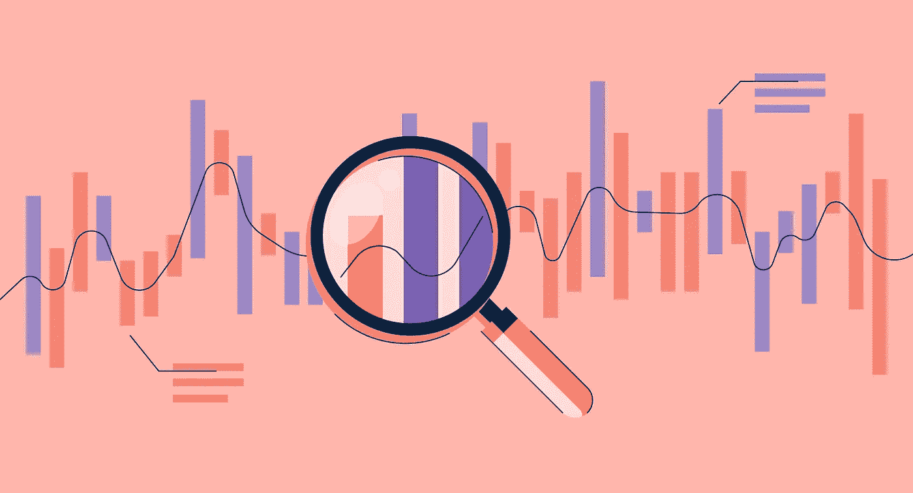
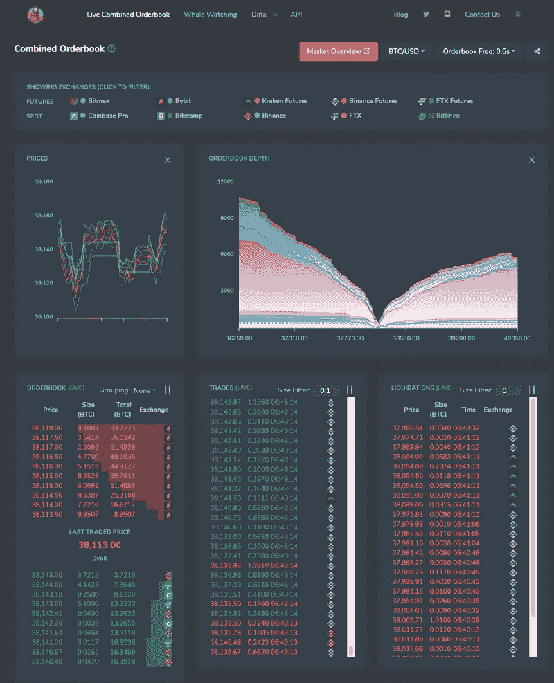
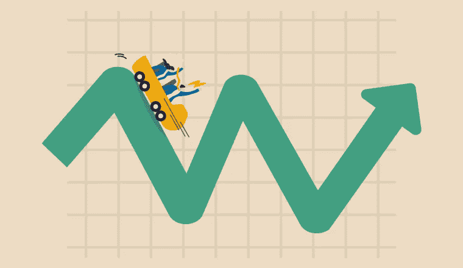
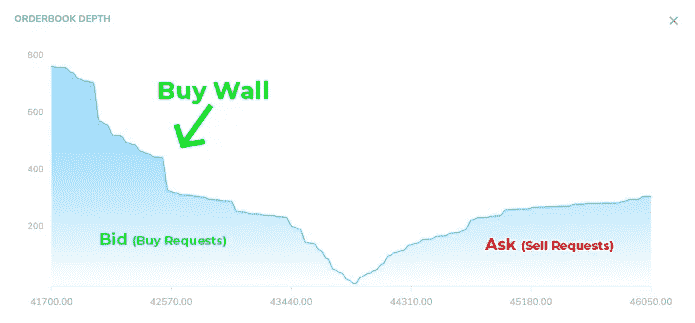

# 专业密码交易员的顶级交易技巧和工具

> 原文：<https://medium.com/coinmonks/top-trading-tips-and-tools-for-professional-crypto-traders-f8b611cf3440?source=collection_archive---------6----------------------->

专业交易者总是试图找到优势。形成优势的方法有很多:你可以使用技术工具、市场情绪或经济信息。如果你的前提是，所有可用的信息目前都被定价到了一个令牌的价值中，那么你需要一个优势来帮助你确定一个令牌的未来方向。这里有一些专业交易者使用的最好的交易工具和技巧，以及你如何将它们应用到你今天的交易技巧中。

# 1.**制定一个让你放心交易的策略**

专业交易者可能会使用多种策略来应对加密货币市场。一些人使用经过回溯测试的纯技术分析策略，而另一些人使用本质上既是技术又是基本面的自由选择策略。你需要定义一个让你感觉舒服的交易策略，在你拿你的真实资本冒险之前，用一个模拟账户测试它。**你可以在这些所有提供模拟账户的交易所做到这一点:** [**【北海巨妖期货】**](https://demo-futures.kraken.com/futures/PI_XBTUSD)**[**OKEx**](https://www.okex.com/demo-trading-explorer/v5/en)**[**币安期货**](https://testnet.binancefuture.com/en/futures/BTCUSDT)**[**by bit**](https://testnet.bybit.com/trade/inverse/BTCUSD)**[**bit MEX**](https://testnet.bitmex.com/)**。**********

****大多数专业交易者使用积极的交易策略，如日内交易、波动交易、趋势交易和刷单，你可以在币安学院的这篇文章中了解更多。****

****专业交易者使用几种策略，他们不断尝试改进。你的策略可以是使用技术指标或基本面分析。大多数交易策略有多个部分，包括帮助你决定何时进入交易的进场标准和你的风险管理，包括你的止盈水平和止损价格。不管你是使用跟踪止损还是固定百分比，你都要在交易前确定所有这些因素。****

********

# ******2。寻找技术分析工具来帮助你******

****有几种免费和付费的加密货币分析图表工具。虽然这些主要的加密交易所都有内置的图表，但通过更好地了解加密市场的动向，使用其他图表软件和交易工具来最大化您的利润仍然是有益的。****

******1。**[**coin lobster**](http://www.coinlobster.com/)**—**一个免费的实时综合订单簿，涵盖 10 个现货和永久期货交易所的交易和清算数据。****

******2。**[**glass node**](https://glassnode.com/)**——**比特币和以太坊的创新链上市场指标。****

******3。**[**Messari**](https://messari.io/)**—一款加密数据聚合器，面向希望通过数据分析更深入了解市场的高级交易者。******

******4。** [**交易视图**](https://www.tradingview.com/) **—** 一款基于云的图表软件，适用于各种金融市场，提供大量比特币技术指标，帮助交易者分析股票和加密市场走势****

******5。**[**Coingy**](https://www.coinigy.com/)**—一个针对不同交易所的加密货币投资组合管理套件******

******上面的工具不仅显示了过多的技术指标，还提供了可以设计的定制技术工具。决定使用什么技术工具的最好方法是根据历史交易环境和你的交易个性来选择。******

******有几种类型的交易环境。大多数市场都会在某个时候经历所有这些。有趋势市场、横向市场、波动市场和自满市场。很难找到一个在所有环境下都适用的指标。记住这一点，你的目标应该是在你感觉最舒服的市场交易。******

******例如，如果你喜欢做长线，交易很少，那么趋势跟踪策略可能会让你感觉最舒服。如果你喜欢在市场横盘整理时大量交易，那么你应该寻找一对货币区间波动的时期。******

******尽量避免你不喜欢的交易风格，因为这是失败的秘诀。寻找更高价格的趋势跟踪者通常不愿意在价格下跌时抓住跳水刀。******

************

# ******3.**使用市场数据源********

******交易需要源源不断的市场数据，这些数据是由你所交易的代币和交易所的价格变动产生的。您交易的交易所将提供市场数据，但如果您想查看您交易的多个交易所的数据， [CoinLobster](http://www.coinlobster.com/) 提供了超过 10 个交易所的组合订单簿。******

******在许多经纪人那里，你需要为加密货币交易数据付费，所以只订阅你需要的数据。一些网站，如 CoinLobster，免费提供所有市场数据，但通常情况下，Messari、TradingView 或 Glassnode 上的高级图表功能是基于订阅的。******

************

# ********4。去除你的情绪********

******专业交易者掌握的一个问题是在交易决策中去除自己的情绪。新手交易者通常会被市场假货欺骗。短期市场周期往往会把交易者推出他们的头寸，最终只会朝着趋势的方向前进。避免情绪失控的一个方法是制定一套你要遵守的规则。这将减轻交易时的一些情绪，确保你避免过早获利或在市场对你不利时止损。******

************

# ********5。使用波动性作为衡量标准********

******动荡的局势很难驾驭。当价格大幅波动时，很难做出好的交易决策。确定波动性是否可能上升的一个方法是识别买卖墙和鲸鱼操纵。******

******买墙和卖墙可以极大地影响加密货币市场的价格波动。在交易比特币和以太币等加密货币时，理解它们可能是有利的，因为它让你能够更好地预测价格变化，据此设定限价单，甚至识别出完全退出市场的时机。******

********你可以在这里阅读更多关于买卖墙** [**。**](/coinmonks/cryptocurrency-trading-tips-buy-sell-walls-and-whale-market-manipulation-9b617e4fd4e7)******

********

****Image from CoinLobster.com****

# ******总结******

****如果你想成为一个专业的交易者，你需要找到一个优势。你需要制定一个你相信的合理策略，并使用其他变量来确定市场环境，所以确保你使用技术、基本面和情绪分析的组合，并练习上面的技巧，以便做出你的交易决定。****

> ****加入 Coinmonks [电报频道](https://t.me/coincodecap)和 [Youtube 频道](https://www.youtube.com/c/coinmonks/videos)了解加密交易和投资****

## ****另外，阅读****

*   ****[OKEx vs KuCoin](https://blog.coincodecap.com/okex-kucoin) | [摄氏替代品](https://blog.coincodecap.com/celsius-alternatives) | [如何购买 VeChain](https://blog.coincodecap.com/buy-vechain)****
*   ****[币安期货交易](https://blog.coincodecap.com/binance-futures-trading)|[3 comas vs Mudrex vs eToro](https://blog.coincodecap.com/mudrex-3commas-etoro)****
*   ****[如何购买 Monero](https://blog.coincodecap.com/buy-monero) | [IDEX 评论](https://blog.coincodecap.com/idex-review) | [BitKan 交易机器人](https://blog.coincodecap.com/bitkan-trading-bot)****
*   ****[CoinDCX 评论](/coinmonks/coindcx-review-8444db3621a2) | [加密保证金交易交易所](https://blog.coincodecap.com/crypto-margin-trading-exchanges)****
*   ****[Bookmap 评论](https://blog.coincodecap.com/bookmap-review-2021-best-trading-software) | [美国 5 大最佳加密交易所](https://blog.coincodecap.com/crypto-exchange-usa)****
*   ****[40 个最佳电报频道](https://blog.coincodecap.com/best-telegram-channels) | [喜美元评论](https://blog.coincodecap.com/hi-dollar-review)****
*   ****[折叠 App 审核](https://blog.coincodecap.com/fold-app-review) | [StealthEX 审核](/coinmonks/stealthex-review-396c67309988) | [Stormgain 审核](https://blog.coincodecap.com/stormgain-review)****
*   ****[购买 PancakeSwap(蛋糕)](https://blog.coincodecap.com/buy-pancakeswap) | [俱吠罗评论](/coinmonks/coinswitch-kuber-review-1a8dc5c7a739)****