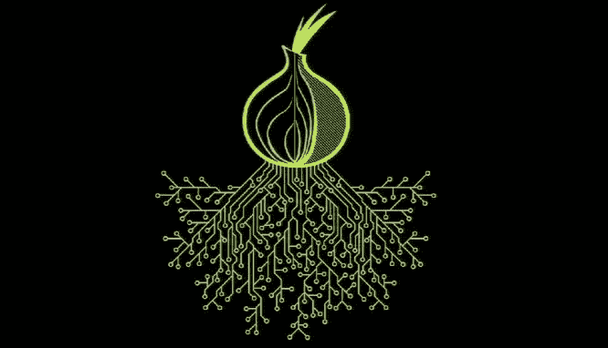
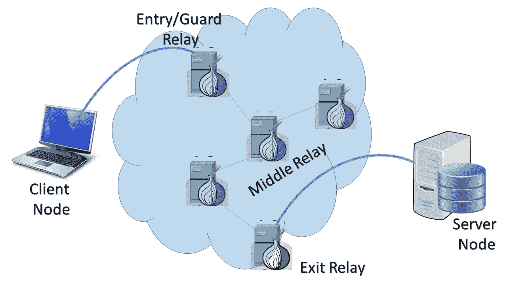

# TOR 节点解释！

> 原文：<https://medium.com/coinmonks/tor-nodes-explained-580808c29e2d?source=collection_archive---------0----------------------->

> 阻止它，跟踪它或使用它。但首先，要知道！

互联网是我们生活中一个巨大的、呈指数增长的、永不停止的发明。世界上将近一半的人口总是连接到互联网上。在地板上收集和传播每个设备可能会覆盖一个城市，谁知道呢，甚至可能是一个小州。但是对于几乎所有人来说，弄清楚谁在用什么，谁在用什么，T2 在哪里，只是几秒钟的事情。这怎么可能呢？这是因为互联网的结构方式。每个查询或搜索都以非常有序的方式进行。给定大脑和对高级基础设施的访问，人们可以很容易地弄清楚需要什么。

 [## 加密新闻| CoinCodeCap

### 我们正努力把 CoinCodeCap 变成一个完美的目的地，让您在一天中经历所有的事情…

coincodecap.com](https://coincodecap.com/) 

抓坏人的时候这样不好吗？是的，但只是到一定程度。数字世界充满了秃鹫，如垃圾邮件发送者、攻击者、巨魔军队、数字营销公司等，他们的唯一目标是使用/侵犯我们的私人数据以获取利益。众所周知，即使是政府也为了满足政治需要而监视人民。由于这种脆弱的结构，许多记者、活动家和研究人员的工作受到了剥削。然而，即使在当今世界，匿名也可以通过很少的专用网络实现。一种这样的专用网络实现是 TOR 网络。

***TOR Network*** ，官网定义是一组志愿者运营的服务器，提高个人数据的隐私性和安全性。在 TOR 网络的所有节点(*也称为中继*)之间创建一系列虚拟隧道，并且对于每个数据传输，选择隧道的随机路径(*称为中继路径*)。以 [***洋葱路由***](https://en.wikipedia.org/wiki/Onion_routing) 的方式使用加密和解密机制来限制每个节点关于通过它的数据的知识。每个节点将只知道它所涉及的中继路径，而不知道从源到目的地的整个路径。

## 什么是 TOR 电路？

TOR 匿名的工作原理是通过 TOR 电路传输数据，TOR 电路是附加到洋葱路由机制的 TOR 的关键组件。TOR 电路是入口/保护继电器、中间继电器和出口继电器的组合。一些传输还涉及桥节点(仅当已知的*入口和出口节点被某一方如*政府*或*公司* *组织*封锁*时，才观察到这种情况)

A basic TOR Circuit

## 什么是进入/保护继电器？

它是 TOR 网络的入口点。每个想要连接到 TOR 网络的客户端将首先连接到保护节点，这意味着它们可以看到试图连接的客户端的真实 IP 地址。保护节点的列表可在 TOR 节点的公共列表中获得，并且几乎每分钟更新一次。很少有网站能查到目前可用的守卫节点及其详情，分别是[*【dan.me.uk/】*](https://www.dan.me.uk/tornodes)*[*torstatus.blutmagie.de/*](https://torstatus.blutmagie.de/)*[*check.torproject.org/*](https://check.torproject.org/cgi-bin/TorBulkExitList.py)*。*在某些情况下，攻击者控制或观察某些中继，他们可以用来查看受害者的浏览。此外，当您尝试在当前会话中更改电路时，它只会更改中继，而不会更改保护节点(以防止已知的匿名破坏攻击)。保护节点通常每 2-3 个月更换一次。(你可以在[这里](https://support.torproject.org/tbb/tbb-2/)进一步阅读)。**

## **什么是中间接力？**

**在任何给定的传输中，中间继电器覆盖 Tor 电路的大部分。它们由中继组成，数据通过中继以加密格式传递，没有节点比它的前任和后代知道得更多。所有可用的中间中继节点向保护节点和出口节点显示它们自己，使得任何节点都可以连接到它们进行传输。即使已知任何中间中继传输恶意流量(如攻击者的利用或攻击本身)，他们也不承担责任，因为他们既不是流量的来源也不是目的地。中间中继永远不会被允许充当出口节点。它最适合希望在家里或工作场所使用 TOR 的用户(如果允许的话)。**

## **什么是出口继电器？**

**出口继电器是 TOR 电路中的最后一个继电器。它们是将数据发送到目的地的节点，通常被认为是罪魁祸首，因为出口节点被视为流量的来源。因此，出口节点的 IP 对于目的地将是直接可见的，并且经常接收多个投诉、法律通知、关闭通知等。为了托管一个端节点，必须准备好处理问题，例如，像关闭或 DMCA 通知这样的法律问题，拥有一个专用 IP 并确保他们的反向 DNS 容易被发现，建立一个出口节点托管通知(最重要的步骤)等。**

## **什么是桥节点？**

**网桥节点是未在 TOR 节点的公共目录中列出的节点。大多数入口和出口节点都可以在互联网上公开获取，因此，如果希望限制 TOR 的使用，它们可能会被阻止。许多互联网服务提供商、公司组织甚至政府都设置了过滤器来禁止使用 TOR。例如，中国政府已经封锁了国家级防火墙上所有公开的节点。为了避免这种情况，有网桥节点。您将需要遵循不同的配置设置，以便通过网桥节点连接到 TOR 网络(这将在后面的文章中讨论)。**

** [## 加密交易机器人——20 个最佳免费加密交易机器人

### 2022 年，币安、比特币基地、库坎和其他密码交易所的最佳密码交易机器人。Pionex，Bitsgap…

medium.com](/coinmonks/crypto-trading-bot-c2ffce8acb2a) 

# 检测您环境中 TOR 的使用情况

了解 TOR 网络是如何工作的使得检测变得简单得多，但是，要知道它的用户正在使用什么服务还不太可能。无论是国家政府还是公司组织，他们都可以选择监控或阻止 t or 的使用。然而，在完全阻塞 TOR 时存在局限性，这是由于前面章节中讨论的桥节点的存在。甚至网桥节点的引入也没有阻止某些组织和政府试图检测和阻止 TOR 的使用。以下是阻止使用 TOR 的几种方法:

*   封锁*公共可用的*TOR 节点列表。目前可供查看的节点及其详细信息的网站很少，有*[*【https://www.dan.me.uk/tornodes,】*](https://www.dan.me.uk/tornodes,)*[*https://torstatus.blutmagie.de/*](https://torstatus.blutmagie.de/.)*[*https://check.torproject.org/cgi-bin/TorBulkExitList.py*](https://check.torproject.org/cgi-bin/TorBulkExitList.py)*。****
*   **在防火墙中创建*应用过滤策略*，在防火墙中，只有某些经过批准的网络(局域网)才能使用代理服务。同样的规则也可以在 SIEM 解决方案和入侵检测系统中实现。**
*   **在您的防火墙、IDS/IPS 上创建 *SSL 解密策略*，该策略可用于解密 SSL 证书并检测与 TOR 上托管的网站相关的流量。**
*   **TOR 浏览包括使用两种类型的端口，即 ORPort 和 DirPort。or 端口通常用于建立连接和传输，其中 as DirPorts 用于从目录服务器获取更新。ORPorts 通常包括端口 80 和 443，但也可以使用高级代理设置进行更改，而 DirPorts 包括端口 9001 和端口 9003。防火墙和 IDS 过滤器可以配置为监控去往或来自端口 9001 和 9003 的任何流量。**

**实施上述任何一个或所有步骤都可能会阻止 TOR 的使用，但仅在一定程度上是如此。除了网桥节点的存在，它还取决于组织的策略和应用程序是如何配置的。**

**现在我们已经走到了尽头，我希望上面的文章已经给每个人的口袋增加了一分钱。请随意张贴您感兴趣的任何问题、建议或话题。我很乐意带着读者的兴趣去写和学不同的东西！**

> **加入 Coinmonks [电报频道](https://t.me/coincodecap)和 [Youtube 频道](https://www.youtube.com/c/coinmonks/videos)获取每日[加密新闻](http://coincodecap.com/)**

## **此外，请阅读**

*   **[密码电报信号](http://Top 4 Telegram Channels for Crypto Traders) | [密码交易机器人](/coinmonks/crypto-trading-bot-c2ffce8acb2a)**
*   **[拷贝交易](/coinmonks/top-10-crypto-copy-trading-platforms-for-beginners-d0c37c7d698c) | [密码税务软件](/coinmonks/crypto-tax-software-ed4b4810e338)**
*   **[网格交易](https://coincodecap.com/grid-trading) | [加密硬件钱包](/coinmonks/the-best-cryptocurrency-hardware-wallets-of-2020-e28b1c124069)**
*   **[最佳密码交易所](/coinmonks/crypto-exchange-dd2f9d6f3769) | [印度最佳密码交易所](/coinmonks/bitcoin-exchange-in-india-7f1fe79715c9)**
*   **[开发人员的最佳加密 API](/coinmonks/best-crypto-apis-for-developers-5efe3a597a9f)**
*   **最佳[密码借出平台](/coinmonks/top-5-crypto-lending-platforms-in-2020-that-you-need-to-know-a1b675cec3fa)**
*   **[杠杆代币](/coinmonks/leveraged-token-3f5257808b22)终极指南**
*   **[Bookmap 点评](https://coincodecap.com/bookmap-review-2021-best-trading-software) | [美国 5 大最佳加密交易所](https://coincodecap.com/crypto-exchange-usa)**
*   **[如何在 FTX 交易所交易期货](https://coincodecap.com/ftx-futures-trading) | [OKEx vs 币安](https://coincodecap.com/okex-vs-binance)**
*   **[CoinLoan 评论](https://coincodecap.com/coinloan-review) | [YouHodler 评论](/coinmonks/youhodler-4-easy-ways-to-make-money-98969b9689f2) | [BlockFi 评论](https://coincodecap.com/blockfi-review)**
*   **[XT.COM 评论](https://coincodecap.com/profittradingapp-for-binance)币安评论 |****