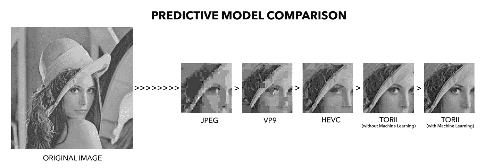

# 鸟居:一个渐进的，机器学习的压缩方法，10 张简单的幻灯片

> 原文：<https://medium.com/coinmonks/torii-a-progressive-approach-to-compression-in-10-easy-slides-5ab51948f231?source=collection_archive---------3----------------------->

在 LENS——尤其是在我们的创业阶段——我们接触过不少加速器和导师。我们读了所有的博客，看了所有的 TED 演讲(但是没有看到激励性的海报)。一路走来，我们听到了许多企业家的原则:“从为什么开始”、“不要混蛋”、“努力学习自己”等等。

身处科技领域，尤其是新的前沿科技，让我们想起了另一个例子——爱因斯坦的名言:“如果你不能向一个六岁的孩子解释，那你自己也不知道。”或者盖伊·川崎更现代的说法，“如果你必须用十张以上的幻灯片来解释你的生意，你可能没有生意。'

因此，亲爱的读者，对此我要说，“接受挑战”。下面是一个外行对图像压缩的介绍，问题和我们的解决方案。如果这个美术专业的能看懂，你也能看懂。和我一起走。

> 如果你必须用十张以上的幻灯片来解释你的生意，你可能没有生意。

1 一般来说，编解码器和压缩无处不在，但我们大多数人都没有想过。还记得尝试发送那张 5MB 的照片吗？你好 JPEG。还记得一张混音 CD 只能放十首歌吗？你好 MP3。这些文件的压缩(*编码*和*解码*)是我们消费技术如此之少却拥有如此之多的原因，现在是时候解决我们都在大量使用的日益增长的海量视频文件了。当然，目前图像压缩是存在的——但以其目前的形式，它不是未来的证据，没有创新，世界的管道将被堵塞(剧透警告:管道被堵塞)。

2 任何一种压缩的核心都是一种算法，这些算法被称为“预测”，这意味着在有限的信息下，它试图预测实际的原始图像或视频。例如，给定同一图像的四分之一大小的版本，预测算法试图预测全分辨率图像是什么。

Everyone is going retro: I-frame & P-frame

对于任何编解码器，有两种主要的预测算法，称为 I 帧和 P 帧。I 帧意味着整个图像由自身编码(*帧内*)，而 P 帧意味着图像使用来自其他帧的信息(*帧间*或*预测*)来预测图像的外观。为了简洁起见(我们知道您很忙)，我们将集中讨论 I 帧。

3 目前主要参与者(VP9、AV1、HEVC 和 H.264)使用的传统技术被称为*基于块的帧内预测*，这意味着在编码过程中，图像被分成一组块——一系列像素——它根据周围的解码像素对一个块进行编码，本质上是“涂抹它们”，直到整个图像被预测出来。

*Block based intra predictive method — not ideal*

这对于某些应用来说可能是好的，但是对于高(和更高)分辨率流内容的当前需求来说，基于块的方法有两个主要缺点:它不能利用整个图像(仅仅是边界块中的信息),并且它纯粹基于颜色值(强度),并且不能检测任何图案，即像普通纹理一样的自然图案——想想你在显微镜下看到的物体。那么这意味着什么呢？如果这些特征没有被利用或检测，那么它会导致较低的压缩效率。不理想。

4 所以某种程度上需要有一种*学习的*方法，能够*教会*压缩过程识别这些模式——就这样，机器学习——我们一直在等你。机器学习(不是同一个，而是人工智能的一个子集)非常擅长理解整个图像的相关性，它也可以被教会识别自然主义模式。今天，机器学习作为一种所谓的卷积神经网络(CNN)的形式被使用，它只是一种使用所谓的*卷积*扫描图像的方法；识别图案、微特征*和*颜色，以更有效的方式预测原始图像，确保质量无损。

这就是诀窍——这就是神经网络背后的科学:卷积有多大，有多深，以及如何在图像中应用这些数学公式。对于卷积，有两个阶段:训练和执行。在训练阶段，这些卷积在数百万张图像上运行了数百万次。一些世界上最大的公司正在运行世界上最大的服务器，全天候进行这种训练，不断添加新图像，不断教机器学习来完善这种预测。一旦一个神经网络被训练好了，那么你只需要把它应用到一张图片上一次，它就能判断出，比如说，一张人脸，一张猫脸，一张岩层。

好了，还有五张幻灯片。

然而，在我们变得过于舒适之前，必须指出，即使是纯粹的机器学习也有失败之处。它解决了上面解释的基于块的编码的两个最大问题，但是如果神经网络以前从未见过某种图像类型呢？如果它也被弄糊涂了呢？这个问题的严重性可以用自动驾驶汽车无法预测图像并撞倒一个骑自行车的人来描述——所以它可能很严重。另一个问题是计算机仍然不够快，所以神经网络必须降低分辨率——或者降低图像质量——才能足够快地解码。这意味着，为了让这个神经网络足够好地运行，它使用了“全有或全无”的方法——你被计算机的猜测所困，无论是对还是错。它试图解码的图像要么是计算机能识别的，要么是不能识别的。

7 当然，全有或全无的方法不是人类大脑的工作方式，也不是信息被自然处理的方式。我们的大脑实际上是如何处理信息的*渐进*。

All signs point to compression

我们的大脑看着一幅图像，说，“好的，这是一幅图像”，然后根据我们看到的特征，我们开始提炼，我们开始专注于不同的部分，以得到一个结果。这就是我们 LENS 称之为*渐进式机器学习*背后的思想。这是我们为鸟居开发的专有压缩编解码器。这并不是说鸟居变得不那么困惑，而是鸟居从不困惑。

8 我们讨论了如何对一幅图像应用所有这些卷积上的深度堆栈，它给你一个它是什么的预测。鸟居是一个数学模型，它以渐进的方式预测全分辨率图像，这意味着如果有任何混淆的地方，可以使用所谓的*非线性线性近似*来逐步完善预测，这只是另一种说法，即基于有限的信息，LENS 有一个机器学习优化的数学模型，它会带你找到原始图像的基本真相——就像人脑一样。

当我们吹牛的时候，我们做了另外两件别人没有做的事情，那就是鸟居停留在线性空间(真实图像)，我们从不进入潜在空间(全部或没有)。如上所述，鸟居基于线性*试探法—* 逐步细化，线性试探法是任何解决问题的方法，不保证完美，但足以达到即时目标——在这种情况下是更好的压缩。

TORII vs the competition — the difference is clear

鸟居还解决了我们工作生活中的一个令人讨厌的问题:它只是节省了时间。它不需要几百万张图像进行训练，因为我们停留在线性空间。它还节省了容易预测区域的处理时间。我们没有固步自封——鸟居的未来是，在未来的几年里，它将更加进步，更加高效，因为它将继续它的训练和学习，并将更接近 100%的预测率，最终达到并大大超过人脑的性能。

那是十张幻灯片，川崎先生——那是鸟居。一个复杂的问题，一个复杂的解决方案，但这将使未来的流媒体视频变得简单。

我们特别喜欢的另一句创业界的名言是，“永远不要停止学习”。有趣的是，我们创造了一些永远不会停止学习的东西。像一瓶好酒一样，鸟居被设计成能很好地陈年，在许多方面，我们希望成为一种事后的想法——像 MP3 和 JPEG 一样无处不在，甚至更有用。

**在 LENS，我们认为流媒体视频应该更清晰、更快、更经济。**

**再也不下载了。**

**lens-immersive.com**