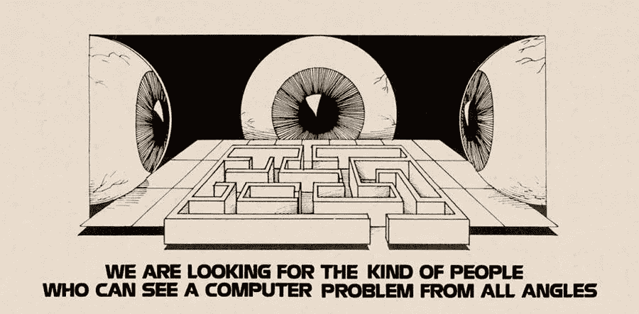

# 走向民主技术

> 原文：<https://medium.com/coinmonks/towards-democratic-technology-ad8f3d90a989?source=collection_archive---------3----------------------->

前言:这篇文章代表了我在大学结束时对 p2p 和区块链技术在社会中的潜力的思考。从那以后，我发现了我的论点的缺陷和新的方向，但我把它贴在这里作为一个时间胶囊。请随意联系:丹马尔泽茨“在”icloud.com

在 20 世纪 60 年代预测互联网时，加拿大哲学家麦克卢汉元帅说:“在机械时代，我们已经在太空中延伸了我们的身体。今天，经过一个多世纪的电子技术，我们已经在全球范围内扩展了我们的中枢神经系统，就我们的星球而言，废除了空间和时间。”[1]

60 年后，我们发现这句话比以往任何时候都更真实——我们的电子中枢神经系统已经渗透到我们生活的方方面面，将其神经延伸到我们的钱包、关系等等。在这种趋势会传播多远的问题上，盛行的技术之风没有留下多少想象的空间。当我们继续追求数字化我们个人和公共的血流时，我们被潜在媒介的限制限制了每一个数字化的功能。例如，超过 30 亿人使用 WhatsApp 和微信，对他们来说，宝贵的关系完全由这些应用程序的功能来定义。

技术展现了人类思想和经验深刻扩散的潜力，但画面的另一面描绘了前所未有的财富转移和不平等的场景。为什么 30 亿人被迫通过私人服务器的围墙花园传递他们的个人关系，而我们集体拥有创造替代方案的技术知识？

在当代社会，我们是无助的旁观者，眼睁睁地看着我们的全球合作机构受到侵蚀，成为巨大的全球相互联系的倒退。关于这个悖论，我们得到了一个独特的机会来思考互联网将如何在未来塑造我们。这个问题一般可以看作是互联网某一层的局限。在 2015 年发表的唯一一篇论文中，一位名为中本聪的匿名计算机科学家描述了问题空间的一个子集:

“互联网上的商业几乎完全依赖于金融机构作为可信的第三方来处理电子支付。虽然该系统对于大多数交易来说足够好，但是它仍然受到基于信任的模型的固有弱点的影响。完全不可逆的交易实际上是不可能的，因为金融机构无法避免调解纠纷。调解成本增加了交易成本，限制了最小实际交易规模，切断了小额临时交易的可能性，而且丧失为不可逆服务进行不可逆支付的能力会带来更大的成本。有了逆转的可能性，对信任的需求就会蔓延。”[2]

我们使用互联网的基础所固有的不稳定性不仅仅止于信息和商务，还将延伸到我们尚未设想的未来互联网合作应用中。更直截了当地说，如果这种信任模式现在不能有效地扩展，那么可以肯定地说，对于未来 2 年上网的 20 亿人来说，它肯定不会。但是，构建没有“可信第三方”的应用程序到底意味着什么，更重要的是，我们如何做到这一点？这篇文章并不寻求这些问题的确定答案，而是探索作为更加开放的互联网的先驱的想法，并讨论它们对未来的潜在影响。

商业驱动的软件开发并没有什么本质上的邪恶，但是这种模式经常会限制我们的视野，让利润成为隧道尽头唯一的指路明灯。虽然不可否认，构建许多现代应用程序是高效的，但由单一组织控制的某些软件或软件层无法实现其用户的真实表示，就像君主政体无法满足其人民的需求一样。这并不是说我们寻求废除公司控制的软件开发；相反，我们必须重新构思这个场景，让企业成为众多投入之一。一种选择是创造一个未来，在这个未来，对社会至关重要的应用程序建立在一个更公平控制的层之上或旁边，在这个层中，人类以一种比从他们身上榨取的金钱更进一步的方式被表现出来。随着软件继续蚕食世界，我们需要向更民主的软件表达方式迈进。[3]

在我们目前的状态下，我们的大部分软件都是由公司开发的，人们经常忽略了还有其他的开发方法。事实上，许多 70 年代互联网的发明者，也被称为原始黑客，并没有预见到私人组织对软件的控制程度。相反，他们提倡“开放开发”，即源代码公开开发，自由发布，没有修改限制。然而，到了 90 年代，他们意识到除了学术研究之外，这个世界基本上被抛到了一边。[4]

虽然有一些小项目采用了这种开放的开发风格，但直到 90 年代，一位名叫 Linus Torvalds 的程序员开始开发开源操作系统时，其潜力才得到认可。Torvald 的开源方法集中在三个支柱上:尽早发布并经常发布，尽你所能授权，以及“开放到滥交的程度”。这意味着所有的代码都向公众发布，任何人都可以贡献自己的一份力量，并且关于未来改进的公开辩论在邮件服务器上进行(直到今天仍然如此！).不可避免地，这种“开放源代码”开发风格遭到了激烈的批评，但最终将成为一个更加现代的软件开发时代的模板。

几乎一夜之间，Linux 获得了巨大的成功，获得了 NASA、IBM 和惠普等机构的支持。1996 年，开放源码倡议的未来创始人 Eric Seymoure 对这一前所未有的成果评论道:“Linux 是颠覆性的。即使在五年前，谁会想到一个世界级的操作系统会像魔术一样，由分散在工厂各处的几千名开发人员通过业余时间的黑客攻击结合在一起，只通过脆弱的互联网连接起来？”。更进一步，他把传统的商业化软件比作“虔诚的教堂建筑”，把 Linux 的开源社区比作“一个不同议程和方法的大集市，一个连贯和稳定的系统似乎只有通过一连串的奇迹才能出现”。Linux 的成功帮助解决了许多关于开源代码的关键问题。[5]

对这些问题的过分简化可以归结为两个主要问题。第一个问题本质上是作为搭便车问题的变体存在的:在大型组织获取代码并开发他们自己的更高级的私有版本的情况下，开源项目注定会失败吗？虽然这种情况经常发生，但一般来说，大多数公司都会受到激励，为代码做出贡献。部分是因为社会责任，但主要是因为离源代码太远的修改会导致私有版本无法集成社区开发的未来升级。这些“免费”升级最终通过降低基础设施成本为 Linux 的采用火上浇油。

辩论的第二个问题是开放源代码是否本质上不如封闭源代码安全。这一论点的一般前提是，由于代码是公开的，安全黑客可以分析这些代码，更容易发现漏洞，使系统更容易受到攻击。任何系统的安全性都很难证明，因为它依赖于众所周知的攻击媒介，但普遍认为流行的开源项目更安全。作为这背后的直觉，像 Linux 这样的代码被部署在更多样化的场景中，更快地暴露问题。此外，它不存在的进入壁垒允许统计上更多的开发人员和研究人员对其进行分析，其中许多人正在为自己的成名做出贡献。这后来被通俗地称为莱纳斯定律:“只要有足够的眼球，所有的错误都是肤浅的”。

随着 Linux 照亮了这些问题，开源开发迎来了一个新的黎明——一个拒绝了我们对软件作为集体利益的功能的先入为主的限制的黎明。Linux 的贡献者和观察者很快开始在其他地方传播这种哲学，部分地平息了许多人实践的先前零和软件传统的潮流。

毫不奇怪，那些已经花费数十亿美元构建竞争对手解决方案的组织不会很快采用，比尔盖茨和微软是最臭名昭著的。分歧产生了软件开发者的二分法，开源的支持者主张它是一种更贴近人们的解决方案。正是在挤满这些支持者的在线论坛上，我们找到了故事的第二个主角，前面提到的中本聪。受到开源潜力的启发和 2008 年金融危机的影响，Satoshi 发布了[比特币](https://blog.coincodecap.com/a-candid-explanation-of-bitcoin/)白皮书，详细介绍了信任模型问题(正式名称为双重花费问题)的解决方案。[2]

比特币经常被归类为货币的替代品，但我想提出一种不同的解释。北美的早期部落在出生时会在他们的手臂上纹上更有价值的贝壳的长度，作为一种手段来迫使每个参与交易的人同意所讨论的贝壳的价值。通过使用一种度量来比较商品，土著美国人创造了一种方法来解决合作中的一个非常具体的问题，即如何交易两种不同的商品。最终，这种解决方案被证明是最低限度的健壮，主要是因为皮肤拉伸的程度不同，以及它不能伸缩(你不能同时在多个地方)。随着社会的进步，我们为这些问题创造解决方案，发现缺陷或意想不到的后果，并最终在无尽的循环中创造新的解决方案。几个例子是硬通货，硬通货债权，法定货币，最终在互联网上代表这些形式的货币。[6]

继续这个循环，Nakamoto 所做的是为我们创造了一种数字化的本土方式来处理互联网上的价值。这是对信任模型问题的一个解决方案，它支持无信任交易。正因为如此，比特币能够抽象出目前通过互联网进行价值转移所需的任何底层金融机构，允许用户或者解析回他们自己的本地金融系统，或者甚至只是留在比特币中。这种不可信的特性来自加密技术和对等共识机制的结合，技术细节超出了本文的范围。

从多个方面来看，比特币过去是，现在仍然是一项经济实验。开始时，我们对它的成功没有任何保证，我们甚至不知道在这种情况下成功意味着什么，或者如何使用它。多年的实验数据验证了比特币的能力，让我们能够“利用互联网建立一个分散的价值转移系统，可以在全世界共享，几乎可以免费使用。”[7]这是底层技术、激进的共识机制和[区块链](https://blog.coincodecap.com/what-is-blockchain-a-simple-guide-for-dummies/)概念的成功，也是开放源码开发迎合社会需求的应用。更进一步来说，它成功地实现了人与人之间在互联网上的合作，提供了另一种途径，并废除了第三方对金融交易的控制。

尽管取得了前所未有的成功，但与所有技术一样，时间最终暴露了比特币的局限性。虽然许多人认为这些限制是可以克服的，但也有许多人不相信。后一类人开始怀疑是否有可能进一步发展比特币的信任模式？以同样的方式，比特币抽象出了金融交易中信任的需要，我们能扩展这个想法来交易更多的东西吗？这种扩展抽象的最早例子之一是一个名为 MasterCoin 的项目。具体来说，在区块链的基础上创建了程序化的双方合同。甲、乙双方都可以存钱，钱会根据合同中规定的公式返还:如果 X 碰巧给甲方汇钱，否则就给乙方汇钱，本质上是一种分散的赌注。正如程序员倾向于做的那样，这从 2 方推广到 3 方，从 3 方推广到 n 方，最终从金融交易推广到数据。很自然，人们开始讨论是否有可能在这一层之上构建完整的应用程序。[8]

2013 年，一位名为 Vitalik Buterin 的程序员在互联网上尝试实现这一可能性。这个答案以名为以太坊的协议规范的形式出现，这是一个证明“分散应用”可行性的新实验。以太坊建立在类似的区块链和共识技术的基础上，为比特币的加密交易提供了升级，为其配备了一种[图灵完整](https://en.wikipedia.org/wiki/Turing_completeness#:~:text=In%20computability%20theory%2C%20a%20system,to%20simulate%20any%20Turing%20machine.)编程语言，这一功能在构建去中心化应用程序中变得至关重要。在以太坊区块链上编写的程序被称为“智能合同”，它们代表你可以通过区块链执行的协议。这拓展了区块链用例的可能性领域，直到 7 年后我们仍能发现它的能力。最后，开始在社区中酝酿的“去中心化梦想”被赋予了一个追求这一理想的工具，允许开发人员执行基本逻辑并在区块链之上创建令牌生态系统。

自动售货机是智能合同如何运作的一个有用的代表。使用自动售货机时，您同意一份“合法的智能合同”。给定一种投入(零食选择和金钱)，你就保证有一定的产出(你的零食——给定充足的供应)。你的保证来自地方和联邦法律的形式，以及自动售货机的普遍社会信任。有了智能合同，你的保证来自于[密码术](https://en.wikipedia.org/wiki/Public-key_cryptography)和[共识机制](https://en.wikipedia.org/wiki/Byzantine_fault)，以及区块链不断增长的[社会信任](https://en.wikipedia.org/wiki/Social_constructionism)。

很快，人们开始以独特而有趣的方式将智能合约联系在一起，创造出诸如[去中心化加密货币交易所](https://en.wikipedia.org/wiki/Decentralized_exchange)、[算法稳定货币](https://en.wikipedia.org/wiki/Stablecoin)和[去中心化自治组织](https://en.wikipedia.org/wiki/Decentralized_autonomous_organization)等应用。这些都满足我们前面提到的自动售货机的属性。例如，在分散交易的情况下，你输入的某种货币保证会输出所要求的货币。建立在以太坊之上的分散式应用程序的另一个固有特性是，任何有互联网连接的人都可以完全访问它们，并且在以太坊关闭之前，它们会一直留在网络上。这两个特性，有人称之为“开放执行”，通过创建一个全新的透明层来升级开源项目的行为。构建在这一层之上的项目获得了代码和执行的透明性，而使用 Linux，您可以保证代码的透明性，但是没有一个容易的和公认的机制来验证某人正在运行未经修改的 Linux 版本。(值得注意的是，比较代码散列适用于这个领域，但是在跨执行环境进行比较时会引入信任约束，尤其是在大规模比较时。)

在以太坊层之上构建的另一个有趣的新兴行为是它作为创新共享的功能。尽管许多人在 Linux 上构建开放的应用程序，但并不要求它们是开放的。开放执行确保所有应用程序都是开放的，因此许多人公开复制彼此，并使用相同的智能合约作为构建模块。因为这些构件是共享的，所以我们看到了项目之间思想的横向基因转移。某个构建基块在特定场景中的使用所带来的改进会转移到使用该构建基块的所有其他项目中。这导致了前所未有的创新，更有力地保证了这项技术造福公众的能力。

我相信这一层的应用程序最终会被视为数字集体产品。从经济学的角度来看，集体商品是由个人消费和总感知效用之间的关系来定义的，这种关系要求个人消费不会改变总感知效用。在这一层增加应用程序的使用并不会降低它的效用，甚至经常会增加它的感知效用，这是一个几乎相反的公地悲剧。因此，我相信我们最终应资助这些工程，资助额应与我们目前的公共工程计划相若，但这当然是一个众所周知的难题。关于外层空间的公共工程项目，有人说:

“虽然科普作家通常会详细描述他们最喜欢的超大空间开发项目的好处，但他们对这类项目的关键初始资本的处理通常很少或令人难以置信。资本化对于这些项目来说是一个至关重要的问题，因为所需的总资本投资非常大，而且投资需要很长时间才能产生经济回报。”[9]

将这一点扩展到我们新的数字集体产品类别并不需要任何想象力。幸运的是，以太坊通过产生代币生态系统的能力，为价值自举这一问题提供了一种非常独特的处理方式。将一个令牌附加到一个项目上，为开源过程提供了一个积极的开发者反馈循环。类似于股权如何被用来激励初创公司的增长，代币股权允许开发者在不控制应用程序的情况下获得工作回报。如何奖励和分配代币的规则可以完全编码在项目的智能合同中，不仅可以提升价值，还可以进行社区治理。最早测试的奖励开发者的机制之一是让社区同意的交易费自动进入一个基金，为社区同意的任务奖励这些费用。

软件定义的社区治理的这一方面已经产生了数以千计的实验，这些实验很可能在未来几年得到检验。很多项目除了测试大量博弈论的理论研究，也在互相学习。以太坊为投票系统、数字组织以及我非常感兴趣的领域——机制设计——的理论思想提供了一个试验台。一种经过广泛测试的有趣的投票技术是“二次投票”。这是一种投票技术，旨在通过增加每平方增加一票的成本来减少垄断资源的个人的影响。例如，第一票= $1，第二票= $2，…，第 30 次投票= 1，073，741，824 美元及以上，极大地增加了超过大多数人的成本，大多数人只能投票一次或两次。[10]

以太坊目前的形式给实验者提供了大量的机会，让他们尝试通过软件促进合作的新方法。从这个角度来看，以太坊是技术实验的温床，也是组织结构实验的温床。在开源项目之外，对我来说还不清楚这将破坏哪类组织，但这似乎有可能蔓延到现代企业。也许未来的业务子集可能主要由一系列与各种政府和业务网络互操作的智能合同来表示。创业可能就像拉下一些聪明的合同，签署它们，然后把它们送到专注于联系州法律的区块链一样简单。考虑到开放的哲学，这些合同中的每一个都将带有经过尝试和测试的治理基线协议。最终，这可能会迫使我们扩展我们对组织的概念。

我相信，通过这项技术，我们将看到分散经济的兴起，本文中提到的技术的各个方面将作为治理层嵌入，以促进合作。建立在开源软件之上的市场机制将使我们能够确保将众多的软件整合成一个更加一致、更少压制的整体，本质上是为所有人设计最佳结果。这些机制中的许多甚至可能最终通过经济激励协调取代临时官僚机构。

此时，读者可能会问，数字社会组织领域的创新对更好的 p2p 消息传递应用程序有什么影响。为了实现以太坊协议，开发了一套底层 p2p 协议，并将其开源为 libp2p。仅这一套模块化协议就催生了数百种新的 p2p 应用。以太坊和类似的网络将成为一个通用的合作层，供这些未来的去中心化应用程序插入。虽然消息传递只是社会计算的一个方面，但在这个例子中，以太坊可以用作 p2p 消息传递应用程序之间可信信息的协调机制。没有必要将每一片都绑在这一层。一个潜在的解决方案可能看起来像一个由多个社区流资助的开源消息传递应用程序生态系统，连接到一个分散的文件存储网络，所有这些都由一个更高级别的信任网络(如以太坊)协调。

这里所说的技术绝不是它们的最终形态，可能只是“真正解决方案”的前兆。我目前看到的两个最大的问题是，大多数去中心化的应用程序实际上只是在 AWS 上托管的应用程序，它们通过也在 AWS 上托管的 API 与公共区块链进行交互。这主要是由于与网络交互的计算需求，但是随着 p2p 区块链客户端的发展，我相信这个问题会得到解决。

第二个更理论化:即使技术非常先进，也不一定能解决集体偏好限制下的问题。一个例子是肯尼斯·阿罗的不可能定理所陈述的发现，即:“当选民有三个或更多不同的选择(选项)时，没有[排名投票](https://en.wikipedia.org/wiki/Ranked_voting%22%20%5Co%20%22Ranked%20voting) [选举制度](https://en.wikipedia.org/wiki/Electoral_system%22%20%5Co%20%22Electoral%20system)可以将个人的**排名偏好**转化为社区范围的(完全的和可传递的)排名，同时还满足一组指定的标准: [*无限制域*](https://en.wikipedia.org/wiki/Unrestricted_domain%22%20%5Co%20%22Unrestricted%20domain) 、 [*非独裁*](https://en.wikipedia.org/wiki/Non-dictatorship%22%20%5Co%20%22Non-dictatorship) 、 [*帕累托效率*](https://en.wikipedia.org/wiki/Pareto_efficiency%22%20%5Co%20%22Pareto%20efficiency) 、关于这个定理的实际后果，Kenneth 说过“大多数系统不会一直坏下去。我所证明的是，所有人有时都可能表现不佳”。[11]

我们在互联网上合作的能力不在于我们想象力的极限，而在于它下面的协议的极限。我希望有了这些技术，我们可以结束算法民粹主义，用迈克尔·麦克卢汉的话说，“接近人类延伸的最后阶段——意识的技术模拟，当知识的创造性过程将集体和合作地扩展到整个人类社会。”

[1][https://web.mit.edu/allanmc/www/mcluhan.mediummessage.pdf](https://web.mit.edu/allanmc/www/mcluhan.mediummessage.pdf)

[https://bitcoin.org/bitcoin.pdf](https://bitcoin.org/bitcoin.pdf)

[3][https://a16z . com/2011/08/20/why-software-is-eating-the-world/](https://a16z.com/2011/08/20/why-software-is-eating-the-world/)

[4][https://en.wikipedia.org/wiki/Open-source_software](https://en.wikipedia.org/wiki/Open-source_software)

【https://en.wikipedia.org/wiki/The_Cathedral_and_the_Bazaar 

https://www.jstor.org/stable/pdf/20736619.pdf?seq=1[(付费墙抱歉)](https://www.jstor.org/stable/pdf/20736619.pdf?seq=1)

[7][https://gavwood.com/dappsweb3.html](https://gavwood.com/dappsweb3.html)

[8][https://hacker noon . com/a-史前以太坊协议-827ii3pab](https://hackernoon.com/a-prehistory-of-the-ethereum-protocol-827ii3pab)

[9][https://jetpress.org/volume4/space.htm](https://jetpress.org/volume4/space.htm)

[10][https://economics . rice . edu/sites/g/files/bxs 876/f/Weyl % 20(paper)% 20-% 20 feb % 202017 . pdf](https://economics.rice.edu/sites/g/files/bxs876/f/Weyl%20(paper)%20-%20Feb%202017.pdf)

[https://plato.stanford.edu/entries/arrows-theorem/](https://plato.stanford.edu/entries/arrows-theorem/)

> [*在您的收件箱中直接获得最佳软件交易*](https://coincodecap.com/?utm_source=coinmonks)

