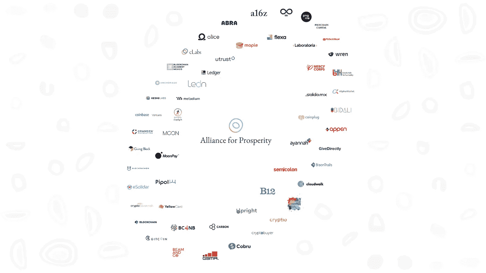

# 丰田揭示区块链实验室/ Celo 推出 50 成员联盟/ dFuse 开源，基线协议向公众开放，Steemit 转向 Hive

> 原文：<https://medium.com/coinmonks/toyota-reveals-blockchain-lab-celo-launches-50-member-alliance-dfuse-goes-open-source-6a49d31f9532?source=collection_archive---------2----------------------->

*2020 年 3 月 19 日*

*本周在景观中，* ***丰田*** *透露了其区块链实验室，该实验室自 2019 年 4 月以来一直在探索汽车行业区块链应用。过去的一周，全球金融市场经历了一段艰难的历程，数字货币与数字货币一道乘风破浪，我们可以看到数字货币是如何度过市场动荡的。* **dfuse** 开源了它的区块链开发栈。 ***基线协议*** *由* ***微软*******EY****和****ConsenSys****联合发起，现已向公众开放。Celo 基金会已经为其“繁荣联盟”注册了 50 名成员****Zynga****联合创始人正在打造名为“Gala network”的专注于去中心化游戏的公司。* ***图德科技*** *已将 1.5 亿美元的房屋净值信用额度(HELOCs)证券化，作为第一笔此类交易于* ***出处*** *【图德区块链】。****Steemit****社区分叉并移动到* ***蜂巢*** *区块链*。 ***南非*** *期待区块链降低失业率。****Bakkt****融资 3 亿美元 B 轮大规模融资*。*我们已经了解了如何建立一个拥有 100 万日活跃用户的 DApp，在****EOS****网络上运行一个 DApp 的实际成本，关于****Infura****的教程，以及来自****Opyn****的更新* ***尾波*******协议*******嘉手纳*******波尔卡多*** *等等。 祝你一周愉快！尽情享受吧！*****

*****奖金*** *:我最近发布了最新的 Q1 2020 版 my* [*区块链版图*](https://www.linkedin.com/posts/kyleellicott_q12020-blockchain-landscapekyleellicotttopionetworks-activity-6638879840634310656-UNtB) *(包含在下面供下载)，它提供了一个行业概述，突出了 900 多家全球公司、风险基金和工作组。如果这是你看到的第一个版本，就把它当作你在这个行业中进一步导航的路线图。在这里获得高分辨率的免费！***

## **📖[丰田揭示区块链实验室探索汽车行业应用](https://www.coindesk.com/toyota-reveals-blockchain-lab-exploring-auto-industry-applications)**

**丰田汽车公司(Toyota)和丰田金融服务公司(Toyota Financial Services Corporation)于 3 月 16 日透露了一个此前推出的“跨集团虚拟组织”，名为[丰田区块链实验室](https://global.toyota/en/newsroom/corporate/31827481.html)，宣布该集团自 2019 年 4 月以来一直与丰田集团的其他四家子公司一起运营。该小组希望更好地了解区块链在汽车工业中的应用。“区块链有望……[阅读更多](https://www.coindesk.com/toyota-reveals-blockchain-lab-exploring-auto-industry-applications)**

## **📈[EOS 和 ETH DeFi 如何度过市场动荡](https://cointelegraph.com/news/how-eos-and-eth-defi-made-it-through-market-turmoil)**

**(3 月 11 日)持续的市场下跌对[分散金融](https://cointelegraph.com/tags/defi)部门产生了明显的影响，该部门通常依赖过度抵押的数字资产来支持新货币的价值。随之而来的大量被清算的抵押不足的资产接受了 DeFi 协议，甚至触及了规避风险的投资者。这些情况成为最大行业项目的适当压力测试，揭示了他们的弱点和优势。… [阅读更多内容](https://cointelegraph.com/news/how-eos-and-eth-defi-made-it-through-market-turmoil)**

## **📈天秤座的竞争对手 Celo 发起 50 人繁荣联盟**

****

**[Source: Celo](/celoorg/50-mission-aligned-organizations-join-the-celo-alliance-for-prosperity-a3b32d15bc4c?source=rss----291cc98479ad---4)**

**Celo 基金会已经为其“繁荣联盟”注册了 50 名成员，该联盟致力于利用区块链的技术和数字资产“为每个人带来繁荣”此举是为了与脸书的 Libra 竞争，因为该基金会将为开发者提供一种在 Celo 的区块链平台和 USD stablecoin 上构建去中心化移动应用(DApps)的方式。到目前为止，已经有 130 个团队表示有兴趣在 Celo 平台上进行开发，其中一些成员也是 Libra 协会的成员，包括[安德森·霍洛维茨](https://medium.com/u/df45fd4a749d?source=post_page-----6a49d31f9532--------------------------------)(为 Celo 提供资金)、比特币基地([风投](https://ventures.coinbase.com/))、[野牛之路](https://medium.com/u/e9a232ffaa7b?source=post_page-----6a49d31f9532--------------------------------)、[安克雷奇](https://medium.com/u/6d1871dd1b61?source=post_page-----6a49d31f9532--------------------------------)和美慈……[阅读更多](https://techcrunch.com/2020/03/11/celo-alliance-for-prosperity/)**

## **🎮 [Zynga 联合创始人为分散式游戏建立 Gala 网络](https://venturebeat.com/2020/03/10/zynga-cofounder-creates-blockchain-game-partners-for-decentralized-gaming/)**

**区块链游戏合作伙伴(Blockchain Game Partners)证实，其团队正在开发一个位于区块链的基础设施，名为“Gala ”,以使玩家拥有自己的内容，而平台不会因他们创建的游戏而榨取开发者的利益。Schiermeyer 与 Mike McCarthy 合作开发了一个游戏模型，该模型将实现游戏中资产的数字所有权，因此玩家可以拥有他们购买或创建的东西，即使游戏最终关闭。玩家可以将他们的物品从一个游戏转移到另一个游戏，然后他们可以在这个游戏中出售它们，然后在另一个游戏中买东西……[阅读更多](https://venturebeat.com/2020/03/10/zynga-cofounder-creates-blockchain-game-partners-for-decentralized-gaming/)**

## **📈 [Figure Technologies 在区块链上证券化 1.5 亿美元的房屋净值贷款](https://www.coindesk.com/figure-technologies-securitizes-150m-of-home-equity-loans-on-blockchain)**

**Figure Technologies 已将 1.5 亿美元的房屋净值信用额度(HELOCs)打包证券化，这被称为第一笔此类交易，交易过程的所有方面都根据出处进行管理，即 Figure 的区块链。内部开发的出处使用超分类帐的一致机制；如果这种模式流行起来，它可能会改善导致 2008 年全球市场崩溃的一些问题……[阅读更多](https://www.coindesk.com/figure-technologies-securitizes-150m-of-home-equity-loans-on-blockchain)**

## **🍔[晨星公司对价值 4000 万美元的 Fatburger 交易进行评级](https://www.forbes.com/sites/michaeldelcastillo/2020/03/08/morningstar-rates-first-ethereum-debt-security-in-40-million-fatburger-deal/)**

**由于向 Fatburger 注资 4000 万美元，金融服务巨头 DBRS 晨星首次对以太坊区块链发行的证券进行评级。晨星评级背后的主要因素是更短的预测业绩期和对品牌生存能力的更高可见性。该评级本身是基于上周五收盘的传统纸债证券。晨星在其评级文件中提到，由于使用以太坊增加了透明度，证券数据的访问速度更快，为区块链本地更纯的加密资产类别铺平了道路……[阅读更多信息](https://www.forbes.com/sites/michaeldelcastillo/2020/03/08/morningstar-rates-first-ethereum-debt-security-in-40-million-fatburger-deal/)**

## **📖弗朗西斯·科波拉:将资产标记为密码是一种错觉**

**代币和区块链的新世界，私人资产支持的资金将无处不在，每个人都将成为自己的银行。在少数情况下，由于代币的交易表示而不是对象，这可能导致欺诈的机会。此外，将代币与实物资产可靠关联的成本不可避免地推动市场走向整合、寡头垄断和垄断。尽管投资数字资产，让每个人都可以发行自己的数字资产，离仅仅将车库里的东西货币化还有很长的路要走……[阅读更多](https://www.coindesk.com/the-tokenization-delusion)**

## **🇧🇷 [阿里巴巴在巴西申请区块链交易系统](https://cointelegraph.com/news/alibaba-files-for-a-blockchain-transaction-system-in-brazil)**

**阿里巴巴在巴西注册了一项基于区块链的系统专利，分类为“保险”、“金融业务”和“货币业务”正如工业产权杂志(NPI)报道的那样，该机制的名称是“蚂蚁独角兽”。它还将进入信用卡发行和公用事业账单支付解决方案领域。该专利提到区块链技术是该系统的基础。… [阅读更多信息](https://cointelegraph.com/news/alibaba-files-for-a-blockchain-transaction-system-in-brazil)**

# **本周的更多内容:**

**📈[现在是时候行动了](https://www.chrismccann.com/blog/now-is-the-time-to-act)由[克里斯·麦肯](https://medium.com/u/29c0a008692a?source=post_page-----6a49d31f9532--------------------------------)**

**📈 [Wave Financial](https://medium.com/u/97862523aa62?source=post_page-----6a49d31f9532--------------------------------) [将价值 2000 万美元的波旁威士忌用于新威士忌基金](https://www.coindesk.com/wave-financial-to-tokenize-20m-worth-of-bourbon-for-new-whiskey-fund)**

**📈 [Steemit](https://medium.com/u/a3df9c24e249?source=post_page-----6a49d31f9532--------------------------------) [由于 Sun 收购失败，社区将迁移到 Hive 公司](https://thedailychain.com/steemit-community-set-to-move-to-hive-blockchain-as-suns-acquisition-flops/)**

**📈[基线协议公开](/baselineprotocol/baseline-protocol-opens-to-public-77601d1cf39d) ( [约翰·沃伯特](https://medium.com/u/26a7c53cdfeb?source=post_page-----6a49d31f9532--------------------------------) ) & [dfuse](https://medium.com/u/5e4e6d0d13c5?source=post_page-----6a49d31f9532--------------------------------) [即将开源](https://www.dfuse.io/en/blog/dfuse-open-sources-its-blockchain-development-stack)！**

**📈 [RIP Moon Times](/@twobitidiot/rip-moon-times-cae74db73203) 由 [Messari](https://medium.com/u/7cf93d3c3400?source=post_page-----6a49d31f9532--------------------------------) 的[twobit 白痴](https://medium.com/u/dd6a8357807c?source=post_page-----6a49d31f9532--------------------------------)**

**📖[我们的网络:第十三期](https://ournetwork.substack.com/p/our-network-issue-13)由[斯潘塞中午](https://medium.com/u/55f8de7afe95?source=post_page-----6a49d31f9532--------------------------------)与他人分手 [*opyn*](https://medium.com/u/29ed85ed5e1f?source=post_page-----6a49d31f9532--------------------------------) *，* [*握手*](https://twitter.com/hns) *，* [*尾波协议*](https://medium.com/u/8b6082c02e6?source=post_page-----6a49d31f9532--------------------------------) *，* [*嘉手纳*](https://twitter.com/kadena_io) *，以及* [*波尔卡多*](https://medium.com/u/3e5a7d431699?source=post_page-----6a49d31f9532--------------------------------)**

**📖[南非期待区块链降低失业率](https://cointelegraph.com/news/south-africa-looks-to-blockchain-to-reduce-unemployment)**

**🇨🇳 [中国向央行的区块链贸易融资平台注入 470 万美元](https://www.coindesk.com/china-injects-4-7m-into-central-banks-blockchain-trade-finance-platform)**

**📖[区块链正在帮助这家阿根廷天然气公司削减成本](https://decrypt.co/22846/gasnet-gasnor-natural-gas-blockchain)**

**📖[夏威夷正在为数字货币发行商建立一个监管沙箱](https://www.theblockcrypto.com/linked/59151/hawaii-is-establishing-a-regulatory-sandbox-for-digital-currency-issuers)**

**👾[如何在加密游戏中赚钱](https://bankless.substack.com/p/how-to-make-money-in-crypto-gaming)**

**📖[比特币基地推出 BTC 交易批处理，为用户节省 50%费用](https://cointelegraph.com/news/coinbase-launches-btc-transaction-batching-saving-users-50-on-fees)**

**📖 [Bakkt 融资 3 亿美元 B 轮融资](https://www.theblockcrypto.com/post/58838/bakkt-raises-300-million-series-b-funding-round)**

**📖[伯克利区块链加速器](https://medium.com/u/1f4e06880a73?source=post_page-----6a49d31f9532--------------------------------) [揭晓 2020 年春季 17 个项目](https://www.cryptoninjas.net/2020/03/10/the-berkeley-blockchain-xcelerator-reveals-17-projects-for-spring-2020-cohort/)**

**📖[比特币基地](https://medium.com/u/913e7ed84452?source=post_page-----6a49d31f9532--------------------------------) [卡用户现在可以用 Google Pay 进行加密支付](https://www.coindesk.com/coinbase-card-users-can-now-make-crypto-backed-payments-with-google-pay)**

# **分散式应用程序手表**

## **📖[ETH 美元价值 44%的单日跌幅如何震惊了以太坊 dapp 生态系统](https://dappradar.com/blog/how-eths-44-day-fall-in-usd-value-shocked-the-ethereum-dapp-ecosystem)**

**新冠肺炎推动的金融和投资资产类别的抛售导致以太坊价格从 195 美元跌至 110 美元，跌幅达 44%。本周，DeFi 和 exchange DApps 用户试图降低他们的财务风险。一天之内 ETH 价格下跌 44%,迫使许多 MakerDao 用户调整资本结构或偿还贷款。3 月 12 日，MakerDAO 活动创下 1458 次的历史新高，与过去 30 天的平均水平相比增长了 243%。在六个金融 DApps 中，与前 30 天的平均值相比，累计的每日活跃唯一钱包总数增长了 84%。在 TRON 和 EOS 区块链上运行的 DApps 在日常活动中经历了轻微的变化(4%上升/下降… [阅读更多](https://dappradar.com/blog/how-eths-44-day-fall-in-usd-value-shocked-the-ethereum-dapp-ecosystem)**

## **📖[如何打造日活跃用户 100 万的 DApp](https://cointelegraph.com/news/how-to-build-the-dapp-that-gets-one-million-daily-active-users)**

**无论是通过有机的还是付费的方式，DApps 都需要使用一整套工具和技术来将他们的 DApps 送到消费者手中。这意味着从关键词广告购买到内容营销，再到影响者推广和传统的公共关系。尝试新的博客布局策略，或者在实际 DApp 用户投票选出最佳 DApp 的基础上开发新的 DApp 市场。一切都是公平的游戏，当然有许多规则可以而且应该被改写… [阅读更多](https://cointelegraph.com/news/how-to-build-the-dapp-that-gets-one-million-daily-active-users)**

## **📖在 EOS 网络上运行 DApp 的实际成本是多少？**

**区块链公共网络的存储和执行成本高于任何云提供商，如亚马逊网络服务(AWS)、谷歌云或微软 Azure。在将你的 [eosio](https://medium.com/u/628454c4bc31?source=post_page-----6a49d31f9532--------------------------------) 分散式应用(DApp)部署到区块链网络之前，开发者应该详细研究在一个公共共享网络上运行他们的基础设施的成本，该网络的资源消耗是有限的。EOS 公共网络不像以太坊(燃气费)或比特币(交易费)等其他区块链那样采用按使用付费的定价模式……[阅读更多](https://hackernoon.com/whats-the-real-cost-of-running-a-dapp-on-an-eos-network-a-deep-dive-rbht32y0)**

**📖 [INFURA](https://medium.com/u/fe1564152eed?source=post_page-----6a49d31f9532--------------------------------) 教程:[以太坊 RPC、方法、调用](https://media.consensys.net/infura-tutorial-ethereum-rpcs-methods-and-calls-9b9b9b0c4b58)**

**📖[Brave 的区块链网页浏览器日活用户超过 400 万](https://cointelegraph.com/news/daily-users-of-braves-blockchain-web-browser-pass-four-million)**

**📖[感谢区块链科技，克里斯·赛博格成为第一个拥有密码收藏的综合格斗选手](https://www.criscyborg.com/cris-cyborg-becomes-first-mma-fighter-crypto-collectible-block-chain-technology/)**

# **🎙️区块链工业状况 2020 年第一季度:**

***现已发售，下载你的高清副本****【Q1】2020****版* [*区块链景观图*](https://www.linkedin.com/posts/kyleellicott_q12020-blockchain-landscapekyleellicotttopionetworks-activity-6638879840634310656-UNtB) *。这是我现在发布的第五版景观，包括****747****家公司(* ***900 多家独特公司*** *包括更广泛的关键生态系统参与者)和超过***2010 年至 2020 年在整个景观中筹集的超过 220 亿美元资金**——自 2010 年以来投资超过 180 亿美元—出现明显的循环，并有完整的分解。****

***一个完整的 60 分钟的景观概述视频现在可以在* [*这里*](https://www.topionetworks.com/markets/blockchain-landscape-5bf43854b9abe4633c1f87da) *免费获得。在视频中，我对 2020 年的前景进行了细分，提供了 2019 年的总结、2020 年的新兴趋势、DeFi、Libra、CDBCs、Stablecoins、DApps 等等！***

****

**Source: [Topio Networks](https://www.topionetworks.com/markets/blockchain-landscape-5bf43854b9abe4633c1f87da)**

> ***👉下载新的* [*区块链基础设施景观 Q1 2020*](https://s3.amazonaws.com/spoke-profiles-prod-assets/uploads/d21d960161f92e629f68bf78b3d148743e4b3f49/original/Blockchain_Landscape_Q1_Feb2020_KyleEllicott.pdf?utm_source=pdf&utm_medium=email&utm_campaign=kyle) *版，了解关于 DeFi、DApps、基础设施、数字货币等的见解！***
> 
> **[直接在您的收件箱中获得最佳软件交易](https://coincodecap.com/?utm_source=coinmonks)**

****

**不想等到下周，[现在就订阅](http://click1.m.readwritelabs.com/xsdqkbbrgsdtqkmntpjlstcnkytvpvphsnhsqlvbrhhd_yfqbfcmslnskglmckvqv.html?source=post_page---------------------------)📥有关区块链、DApps 等的实时行业见解！**