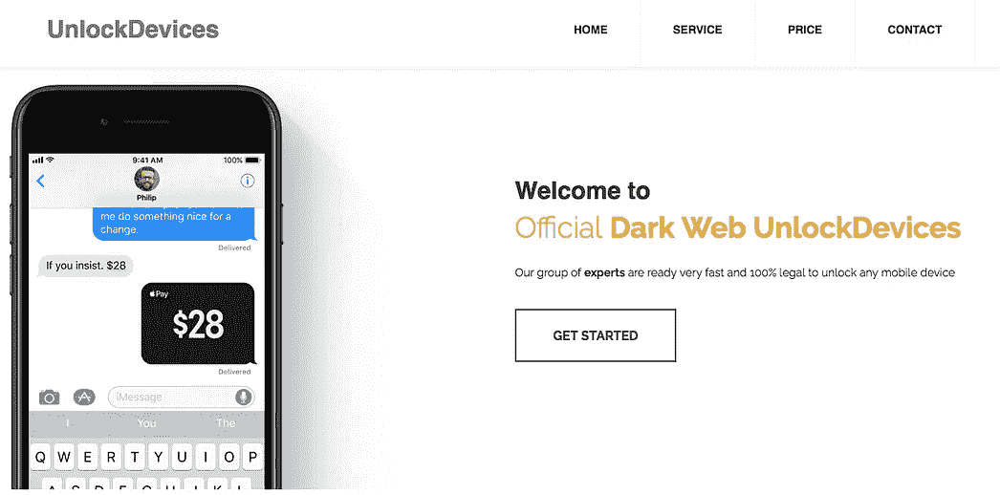
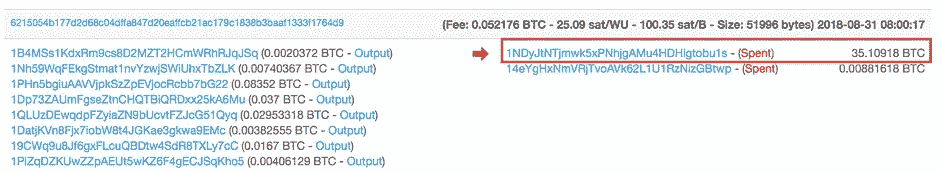

# 使用区块链追踪离岸银行和秘密网络服务——一项最新调查

> 原文：<https://medium.com/coinmonks/tracing-an-offshore-bank-and-a-dark-web-service-using-the-blockchain-an-osint-investigation-a1000251c3ec?source=collection_archive---------1----------------------->

加密货币犯罪和诈骗是不可避免的，没有比增加了匿名性的黑暗网络更好的地方了。

**然而**，不仅很容易识别某些网站之间的关系，而且洋葱网站还可以留下许多“数字指纹”。

在本案例研究中，我们来看看:

*   如何识别洋葱网站之间的**链接**(暗网)
*   如何识别两个比特币地址的**关系**
*   如何**追踪注册交换机的地址**

为了直观的解释，这是我们要看的内容:

# 黑暗网络服务——众多服务中的两个

这个案例研究的两个主题是 [**BancoPanama**](http://bancopanuemswrrz.onion/index.html) ，一个出售比特币匿名“离岸银行账户”的银行网站，和 [**暗网解锁设备**](http://unlockdehrka3cbn.onion/#home) ，一个允许你通过比特币支付匿名解锁手机的服务。

本案例研究不是为了确定这些网站是否是诈骗网站。相反，这是为了确定他们之间的关系，表明他们属于同一个人，并追踪他们的区块链指纹到一个注册的加密货币交易所。

# 暗网洋葱网站的分析工具

在本案例研究中，我们将使用四种工具，它们是:

1.  **新鲜洋葱**([http://zlal32teyptf4tvi.onion/](http://zlal32teyptf4tvi.onion/)
2.  **钱包探险家**([https://www.walletexplorer.com/](https://www.walletexplorer.com/))
3.  **区块链探索者**([https://www.blockchain.com/explorer](https://www.blockchain.com/explorer))
4.  **Tor 浏览器**([https://www.torproject.org/](https://www.torproject.org/))

这两个工具中最重要的是**新鲜洋葱**和**钱包浏览器**。

**新鲜洋葱**是网站的爬虫。它基本上告诉你任何隐藏的信息，你可能在洋葱网站上看不到，对于识别我们正在寻找的这些“数字指纹”来说是非常棒的。

**钱包浏览器**很有用，因为它可以识别一个钱包拥有的所有比特币地址。在处理加密货币时，一个钱包可能拥有多个地址。

**区块链浏览器**和 **Tor** 浏览器是你已经熟悉的平台。你需要 Tor 来打开我在这里提供的任何洋葱链接。

# 识别黑暗网络服务的“指纹”

这两个暗网洋葱站点之间的关系可以使用新鲜洋葱爬虫来识别。

我们正在寻找的相关细节是一个' **SSH 指纹**。从本质上来说，它是一个网站的独特标志。对于新鲜的洋葱，我们可以看到所有其他拥有相同指纹的地点。

这表明我们之前识别的两个洋葱站点之间存在 SSH 关系。

现在让我们来看看区块链的证据。

# 如何对交易使用区块链取证

对黑网站进行任何分析的第一步都是定位其加密货币地址。

这可能是各种货币，但在大多数情况下，比特币是加密世界的统治者，谢天谢地，它有一个非常公开的区块链。

仅仅从**一个比特币地址**我们就可以告诉**很多事情**，比如:

*   发生了多少笔**交易**
*   钱从哪里来，有多少
*   钱送到了哪里？多少钱
*   交易的**历史时间线**
*   以及钱包里其他相关的比特币地址

其中最后一个是站点 [**钱包浏览器**](https://www.walletexplorer.com/) 生效的地方。

有了这个工具，我们能够识别同一个钱包拥有的任何其他比特币地址。

那么我提到的两个站点之间的**关系**是什么呢？

当我们通过网站的“购买”部分访问他们的比特币地址时，我们可以识别出两个主要地址:

以 **XZ4jo** 结尾的“ **BancoPanama** ”站点的 [**地址**](https://www.blockchain.com/btc/address/37s7r9QiE6pJM5aipFHgpHigCswamXZ4jo)

以及“**暗网解锁装置**”站点的 [**地址**](https://www.blockchain.com/btc/address/3LnzwDcMdRFbVLG6B71e68ydQ4JYWaKUrE) 以 **KUrE** 结尾

这两个网站之间的关系是，它们来自同一个钱包，意味着它们属于同一个实体或个人。

我使用钱包浏览器发现了这一点，我们可以通过简单地在搜索功能中输入一个地址来识别地址的双重所有权，然后显示整个钱包。使用一个简单的“CNTRL F”表明两者都存在。

现在我们来看看这些比特币地址各自的具体交易情况。

# 追踪支付到交易所

从区块链上看，支付到这些账户中的交易应该是正常交易的样子。

例如，在下面的[交易中，我们看到钱从一个比特币地址转移到以 KUrE 结尾的暗网解锁设备地址:](https://www.blockchain.com/btc/tx/ee323b528c63bdd9c92ec1ddb4f7ef55bb2545da65e573e19e136046f754148d)

但是在[之后传出的交易](https://www.blockchain.com/btc/tx/3ca9cc1700f95ffab2751b268cffc4c36194d3678b12fc7f836120b9d0556e35)使用更多的地址:

正如您在上面的截图中看到的，在同一个交换中包含了许多地址。

对于该交易，以 [**结尾的**密钥接收地址 Ndpe****](https://www.blockchain.com/btc/address/16csF6xeY2bj1EZWk3B8nGj9mdvTWaNdpe) 可以是以下两种情况之一:

1.  一个**比特币** [**混合服务**](https://en.wikipedia.org/wiki/Cryptocurrency_tumbler) ，或者
2.  一个**交易所**

对于黑暗网络上的许多供应商来说，混合服务或加密货币 tumbler 保证了匿名性，因为它本质上扰乱了地址和支付——对非法供应商和骗子来说是完美的，但对执法部门来说不是。

**Ndpe** 是一个唯一的地址，因为其大部分支付都是通过**比特币地址**[**1 ndyjtntjmwk 5 pnhjgamu 4 hdhigtobu 1s**](https://www.blockchain.com/btc/address/1NDyJtNTjmwk5xPNhjgAMu4HDHigtobu1s)**进行的。**

你可以在下面的截图中看到这一点:

这个以 bu1s 结尾的比特币地址属于[**币安**](https://www.binance.com/)**a**注册的加密货币交易所**。**

**我们可以通过简单的谷歌搜索看到这一点，这也揭示了币安自己的以下推文。**

# **Ndpe 地址的区块链分析**

****Ndpe** 的地址属于**钱包**[**000030 bc2e**](https://www.walletexplorer.com/wallet/000030bc2e205f64/addresses)**。****

**正如你在下面的截图中看到的，这个钱包包含超过 120，000 个比特币地址，其中许多地址每天都有大量的交易。**

**[Ndpe](https://www.blockchain.com/btc/address/16csF6xeY2bj1EZWk3B8nGj9mdvTWaNdpe) 很可能是一个交易所的比特币地址，或者它可能是一个非常常用的比特币翻滚服务，这可以解释它在钱包中持有大量比特币地址的原因，这使它能够基本上扰乱交易。**

****

**这个钱包里的每个地址都把币安作为他们所有交易的最终来源。**

**在上面的截图中，前五个地址都显示了他们对币安的最大支出。我们可以在区块链上看到这一点。**

**以下是最近从 [**Fnhy**](https://www.blockchain.com/btc/address/1AfBhd8sURS3DgkBWdWWTjhbpQGg7AFnhy) 发往**币安的交易:****

****

**下面是最近从 [**到币安**的传出交易****](https://www.blockchain.com/btc/address/169neT3M9aYphKbsaRkg4Awocey6knsjjd)**

****

**下面是最近一笔从[**d6e 1**](https://www.blockchain.com/btc/address/13eJ4bz7Div4U3wPKGbAcaB6M2GXFHd6E1)**:**发往币安的外发交易**

****

**下面是最近一笔从[**3r**](https://www.blockchain.com/btc/address/1s2bTMFkXkr8Y9bwWSak5XevRwt4b3R3r)**:**发往币安的外发交易**

****

**下面是最近一笔从[**hee 9**](https://www.blockchain.com/btc/address/18zYmy5CsfjBfQph7i8Wm1UHQWMaMRhEe9)**:**从**到币安的传出交易****

****

**如你所见，这两个黑暗洋葱网站的资金与区块链的 Ndpe 地址有关联。**

**因为我们已经确定这两个暗网洋葱网站是由同一个所有者运营的，所以很可能这个人使用的是一个平底玻璃杯或交易所。**

**在 Ndpe 地址和同一钱包中的其他地址以及以 bu1 结尾的币安地址之间也存在持续的金融关系。**

# **开源方法停止的地方**

**在黑暗网络和区块链上使用开源信息只能让你到此为止。**

**一旦我们达到这一点，现在就要靠**相关方**，以及加密货币交易所自己的内务管理来查找与黑暗网络上的非法活动相关的任何账户的注册细节。**

> **[在您的收件箱中直接获得最佳软件交易](https://coincodecap.com/?utm_source=coinmonks)**

****