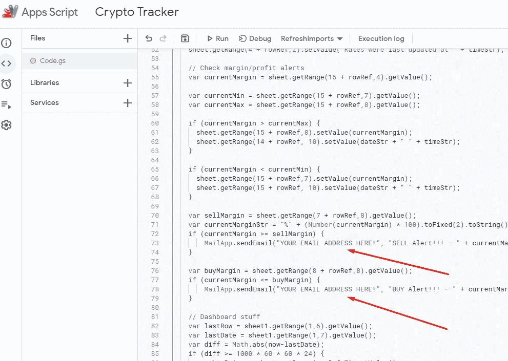
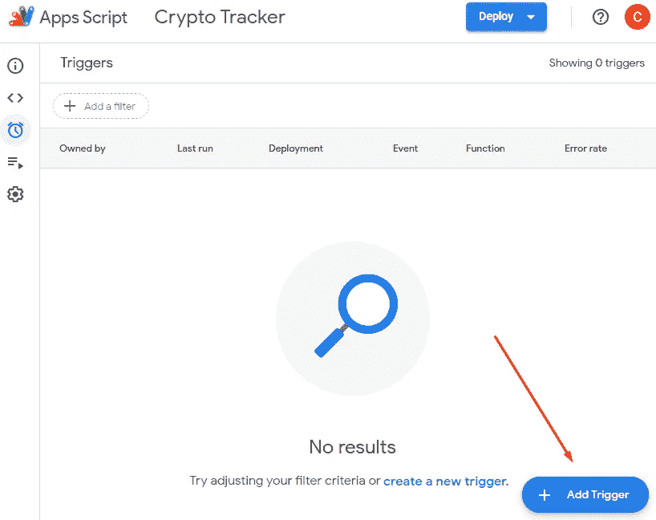

# 使用 Google Sheets 近乎实时地跟踪您的加密货币资产！

> 原文：<https://medium.com/coinmonks/track-your-cryptocurrency-assets-near-real-time-using-google-sheets-d76f80f20b16?source=collection_archive---------0----------------------->

如今，每个人都对加密货币着迷，而且它每天都变得越来越热。

是的，我个人也相信区块链技术是一场革命，将在不到十年左右的时间里塑造我们的未来。

大多数人都试图通过买卖有可能在短时间内呈指数增长的**权利币**来快速致富，为了实现这一点，人们应该有一个良好/可靠的投资加密货币的策略。因为这也是非常非常冒险的，你可能在一天之内变得富有，但是你也可能在几个小时，甚至几分钟之内失去你大部分的钱！所以你必须非常非常小心你的投资，你应该有一个好的策略。

话虽如此，为了保持良好的战略，你**必须**非常密切地跟踪你的投资，以便你能尽快采取必要的行动，最大化你的利润或最小化你的损失。

在这个故事中，我将分享一个非常简单的解决方案，用于近乎实时地跟踪您的加密货币资产！你不必为此订阅付费服务，你只需要 **Google Sheets** ！以及 **Excel** 的基础知识！就是这样…

在完成我将详细描述的所有步骤后，您将看到如下内容，它将定期获取资产价格，并根据价格自动更新文档。

更新:请加入我们的电报组，获取更多信息和帮助。我经常通过 telegram group 分享重要的更新/信息！！！

[**https://t.me/cryptoassettracker**](https://t.me/cryptoassettracker)

Crypto Tracker on Google Sheets!

为了获得更好的质量，请点击此链接[https://i.imgur.com/rDJb1N3.png](https://i.imgur.com/rDJb1N3.png)

## 列的定义

**符号:**加密货币的符号 **名称:**货币名称
**持有量:**您持有的加密货币
**总价:**显示您持有多少硬币
**URL:** 加密货币的 URL(将用于获取当前价格)。应该是[investing.com](https://www.investing.com/)或[coinmarketcap.com](https://coinmarketcap.com/)
**现价:**硬币现价
**份额(%):** 硬币的初始投资额占百分比
**总价:**硬币的初始投资额(你在该硬币上投资了多少)
**总金额:**你的初始投资额(不是总投资额， 投入硬币的初始资金)
**买入价格:**你以什么价格得到硬币
**变化:**硬币的盈利/亏损百分比
**平台:**你在哪个交易平台(币安、gate.io、kucoin 等)拥有这枚硬币

好了，我们开始吧…

***第一步。*** *点击下面的链接，复制我共享的文档。*

[https://docs . Google . com/spreadsheets/d/1 T3 tx 22 qeiko hmgxgwii0k xclkbwfssfusggvxulwo 1 I](https://docs.google.com/spreadsheets/d/1t3tX22qEIK0HmgXgwiI0kxCLkBWFSSfusGGvxULWO1I/edit?usp=sharing)

***第二步。通过打开“文件”菜单复制一份文件，并将文件存储在自己的 Google Drive 上。***

Making a copy of the original document!

***第三步。*** *随意重命名文档，双击即可打开。*

After making a copy you will have access to edit it.

***第四步。*** *从 URL 中获取文档 ID，如下所示。这一点非常重要，你应该得到 URL 中显示的确切 ID(我们稍后会用到)*

Getting the Google Sheet document ID from the URL.

***第五步。*** *使用* ***工具*** *菜单打开脚本编辑器。*

Opening script editor.

***第六步。*** *您将在****code . GS****文件中看到一个脚本，它将定期刷新加密资产价格。我们需要替换此文档中的一些信息。*

首先**更换您在**步骤 4** 中获得的文件 ID** ，如下所示。

Replace this one with the document ID you got in **STEP 4.**

向下滚动一点点，你会发现你应该**替换你的电子邮件地址**的一部分，以获得关于你在文档中的买入/卖出保证金的买入/卖出提醒！用您的电子邮件地址替换这一部分。

Place your email address here to get buy/sell alerts!

**第六步*。*** *完成第 5 步的所有修改后，保存脚本然后运行。*

Save the script after applying changes on **STEP 5**.

点击“**运行**后，您将得到“需要**授权**”警告。别担心，这只是为了允许修改文档和发送电子邮件！只需检查权限并接受它们。

You should give access the script to make changes on the documents and to send emails!

你也可能会收到谷歌的警告，不要担心，只需点击“**显示高级**”并点击“转到加密跟踪器(不安全)”链接(请参阅下面关于此屏幕的重要说明)

Please see my important notes about this screen.

## **重要！**

如果您在页面上启用了“**广告拦截器**”，您可能很难看到下面的提示，如果是这样，请禁用它！([https://medium . engineering/the-unluck iest-paragraphs-751 DD 36 D2 d 30](https://medium.engineering/the-unluckiest-paragraphs-751dd36d2d30))

> 我看到你们中的一些人对这个屏幕有所顾虑，我只是想让每个人都明白。一旦你在步骤 2 **中创建了原始文档的副本，你就成为了文档和脚本**的所有者。**即使该脚本为你所有，谷歌也会显示此通知**，因为该脚本未经谷歌验证(你是否拥有无关紧要，请参见[https://stack overflow . com/questions/48482260/getting-this-app-not-verified-for-Google-sheets-script-that-only-touches-my](https://stackoverflow.com/questions/48482260/getting-this-app-isnt-verified-for-google-sheets-script-that-only-touches-my)并观看此[https://www.youtube.com/watch?v=Sxu-4VULQ10](https://www.youtube.com/watch?v=Sxu-4VULQ10))。所以这没什么好担心的，因为**你是文档/脚本的所有者**，你实际上是在给**你的脚本**做修改/给**你的文档**发邮件！(在制作原始文档的副本后，您可以根据需要更改脚本并查看脚本内容)。

你应该看到类似的东西，只需点击“**允许**按钮。

Allow the script to make changes on your document and send emails.

如果你已经完成了上述所有步骤(从 1 到 6)，那么只需点击脚本编辑器上的“**运行**”图标进行测试。您应该看到脚本正在执行，您的文档正在自动更新。

After running the script, sheet should be automatically updated

恭喜你完成了加密资产追踪器的初始设置。让我们进入一些细节…

为了定期获取资产价格**我们需要做最后一步！**

****第七步*。*** *为您的文档添加一个触发器，它将自动更新价格，从而使文档刷新自己并变魔术！(重新计算一切)***

****

**Select triggers from the left menu.**

**点击“**添加触发器**”按钮(位于右下角)。这将弹出一个创建新触发器的对话框。**

****

**Add new trigger**

**只需选择“ **RefreshImports** ”作为函数(您可以随意重命名，因为**您是脚本和文档的所有者**)，选择“**时间驱动**”作为事件源，选择“**分钟计时器**”作为触发类型，最后选择“每 5 分钟”作为间隔，然后单击保存。请记住，点击“保存”后，可能**会要求一些权限**,就像步骤 6 中一样，不要担心，做同样的事情，并给予必要的权限。**

****

**Trigger configuration popup dialog**

**当然，你可以随意改变“间隔时间”,但是根据我的经验，5 分钟是最合适的。**

**你完了！完成上述所有步骤后，你应该有一个可以自我更新的表单(更新价格，根据价格重新计算等等)。)每 5 分钟一次。但是将您自己的资产添加到文档中怎么样呢？让我们深入细节…**

# **如何删除现有的加密资产？**

**很简单，只需删除该行:)您不必担心任何事情，引用将自动更新，脚本将处理其余的…**

# **如何添加新的加密资产？**

**只需选择列表中的最后一枚硬币(不是 BTC)，然后右键单击并选择“**在**上方插入 1”选项。**

****

**Adding room for the new crypto asset.**

**我们以 **NANO** 为例。这里最重要的部分是 **URL** 列。您应该使用 investing.com 或 coinmarketcap.com 的硬币网址。在本例中，NANO 在两个站点上都有列出；我们将使用 investing.com**

**[https://www.investing.com/crypto/**纳米**](https://www.investing.com/crypto/nano)**

**如果我们要使用 coinmarketcap.com，那么网址将是**

**[https://coinmarketcap.com/currencies/**纳米**](https://coinmarketcap.com/currencies/nano/)**

**我们使用 IMPORTREGEX 函数(我们已经在前面的步骤中作为脚本添加了该函数)来获取价格。小心，**函数参数的模式对于 investing.com 和 coinmarketcap.com 是不同的**(也许你也可以添加其他站点，谁知道:D 呢)**

****

**Function call for investing.com**

**investing.com([https://regex101.com/r/qSfrEZ/1](https://regex101.com/r/qSfrEZ/1))的功能**

> ****=IMPORTREGEX(CELL_REFERENCE)，< span(？=[^>]*id=""last_last"")[^>*>(。+?)<\/span>)****

**功能为 coinmarketcap.com([https://regex101.com/r/BWCTYD/5](https://regex101.com/r/BWCTYD/5))**

> ****=IMPORTREGEX(CELL_REFERENCE，"< div(？=[^ > ]*class= "价格价值。*")[^>*>【^>]*<span(？=[^>]*)[^>*>(。+?)<\/span>)****

**您可以从现有单元格中复制函数，并将其粘贴到新单元格中。**不要忘记更新单元格引用**！**

**你也可以使用**coingecko.com**获取价格，这是它的函数([https://regex101.com/r/C6IEv0/1](https://regex101.com/r/C6IEv0/1)**

> ****= import regex(CELL _ REFERENCE，"< span(？=[^ > ]*class= " "。*tw-text-3xl。*"")[^>*>【^>*<span(？=[^>]*数据-目标= " "价格\。price"")[^>*>(。+?)<\/span>)****

****

**NANO is now added to the sheet.**

**对新行的其他单元格做同样的事情(注意你必须手动填写一些单元格**，一些单元格只包含**公式**，需要用**正确的单元格引用**来填写新记录)****

## ******现在也支持币安智能链令牌！******

****要添加要跟踪的 BSC 令牌，您需要做的只是写入令牌合同地址而不是 URL，然后在价格列中调用下面的函数，就这样！****

*******= import JSON(*CELL _ REFERENCE*)*******

********

****HARP Coin is added to the sheet.****

****添加或删除记录后，不要忘记更新您的初始投资总额，如上图所示！****

## ******奖金！******

****当您获得包含您的投资组合的每日基础图形数据的文档时，您将看到一个“**仪表板**”表。好好享受吧！****

********

****Graphical data of the portfolio which is created and updated automatically as well.****

******仅此而已**。我希望你会发现这份文件有用，最终你可以赚一些钱:D****

****如果你觉得这份文件对你有用/有帮助，也请考虑捐款。****

******BTC(BTC):**125 butzgtbkti 95 S1 bivk 6 tnprkuv 9 ef 6y****

******ETH(ERC 20):**0x 724 a4 e 570 a 1740 B2 a4 E0 d 8d 84402284 b 0771 f13f****

******USDT(TRC 20):**TM 23n 6 ede 2 tr 7 p 9 rpm 5 p 5j qbfqg3 boz 4i****

******如果您对加密**货币不熟悉，并且正在考虑购买/出售它们，请使用下面的链接通过我的介绍注册市场。谢谢！****

****币安[https://www.binance.com/en/register?ref=12811135](https://www.binance.com/en/register?ref=12811135)****

******大门。木卫一** [https://www.gate.io/signup/3325129](https://www.gate.io/signup/3325129)****

******火币全局** [https://www.huobi.com/en-us/topic/invited/?invite_code=qysn9](https://www.huobi.com/en-us/topic/invited/?invite_code=qysn9)****

******库柯恩**
[https://www.kucoin.com/ucenter/signup?rcode=rJ85HV3](https://www.kucoin.com/ucenter/signup?rcode=rJ85HV3)****

******https://coinlist.co/clt?referral_code=6DKN4T**[铸币清单](https://coinlist.co/clt?referral_code=6DKN4T)****

******https://www.mxcio.co/auth/signup?inviteCode=16nUt** [MXC](https://www.mxcio.co/auth/signup?inviteCode=16nUt)****

> ****加入 Coinmonks [电报频道](https://t.me/coincodecap)和 [Youtube 频道](https://www.youtube.com/c/coinmonks/videos)了解加密交易和投资****

## ****另外，阅读****

*   ****[有哪些交易信号？](https://coincodecap.com/trading-signal) | [Bitstamp vs 比特币基地](https://coincodecap.com/bitstamp-coinbase) | [买索拉纳](https://coincodecap.com/buy-solana)****
*   ****[ProfitFarmers 点评](https://coincodecap.com/profitfarmers-review) | [如何使用 Cornix 交易机器人](https://coincodecap.com/cornix-trading-bot)****
*   ****[十大最佳加密货币博客](https://coincodecap.com/best-cryptocurrency-blogs) | [YouHodler 评论](https://coincodecap.com/youhodler-review)****
*   ****[my constant Review](https://coincodecap.com/myconstant-review)|[8 款最佳摇摆交易机器人](https://coincodecap.com/best-swing-trading-bots)****
*   ****[MXC 交易所评论](/coinmonks/mxc-exchange-review-3af0ec1cba8c) | [Pionex vs 币安](https://coincodecap.com/pionex-vs-binance) | [Pionex 套利机器人](https://coincodecap.com/pionex-arbitrage-bot)****
*   ****[我的密码交易经验](/coinmonks/my-experience-with-crypto-copy-trading-d6feb2ce3ac5) | [比特币基地评论](/coinmonks/coinbase-review-6ef4e0f56064)****
*   ****[CoinFLEX 评论](https://coincodecap.com/coinflex-review) | [AEX 交易所评论](https://coincodecap.com/aex-exchange-review) | [UPbit 评论](https://coincodecap.com/upbit-review)****
*   ****[AscendEx 保证金交易](https://coincodecap.com/ascendex-margin-trading) | [Bitfinex 赌注](https://coincodecap.com/bitfinex-staking) | [bitFlyer 点评](https://coincodecap.com/bitflyer-review)****
*   ****[麻雀交换评论](https://coincodecap.com/sparrow-exchange-review) | [纳什交换评论](https://coincodecap.com/nash-exchange-review)****
*   ****[支持卡审核](https://coincodecap.com/uphold-card-review) | [信任钱包 vs 元掩码](https://coincodecap.com/trust-wallet-vs-metamask)****
*   ****[TraderWagon 回顾](https://coincodecap.com/traderwagon-review) | [北海巨妖 vs 双子星 vs BitYard](https://coincodecap.com/kraken-vs-gemini-vs-bityard)****

****谢谢，祝你好运！****