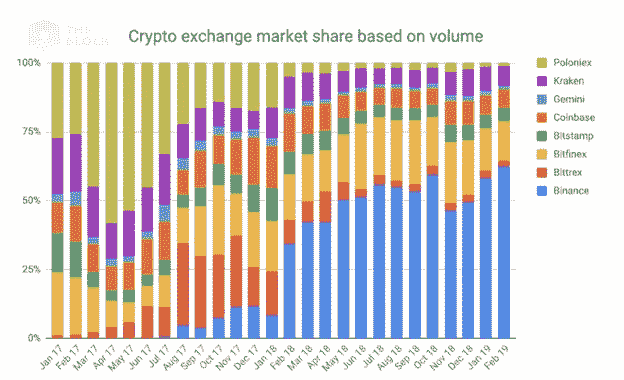
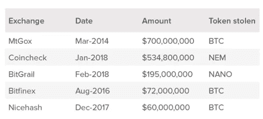
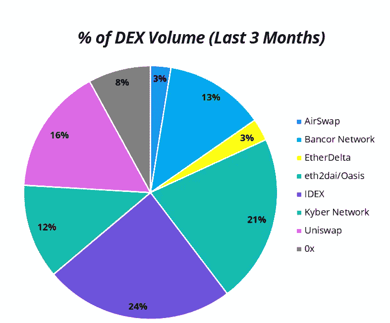
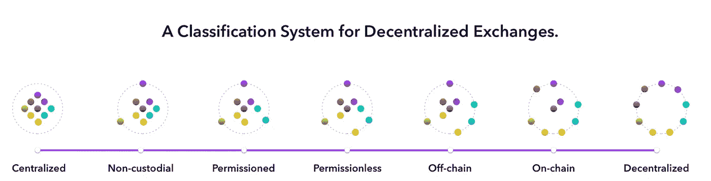

# 权衡:分散交换(第 2 部分)

> 原文：<https://medium.com/coinmonks/trade-offs-decentralized-exchange-part-2-f3ac0e8a08e1?source=collection_archive---------1----------------------->

Photo by [Aditya Vyas](https://unsplash.com/@aditya1702?utm_source=medium&utm_medium=referral) on [Unsplash](https://unsplash.com?utm_source=medium&utm_medium=referral)

为了更好地了解新兴的分散金融(DeFi)行业，我采访了顶级律师事务所、投资基金、交易所和各种分散金融(DeFi)项目的行业专业人士，并参加了加州大学伯克利分校的专题小组讨论和独立研究。权衡:分散交换是三部分系列文章中的第二部分，该系列文章利用了从该研究中得出的见解(在此处找到第一部分**)。)**

**接下来的文章将概述集中/分散范围内的区块链资产交换，强调由* [*0x*](https://0x.org/why) *、* [*注入协议*](https://www.injectiveprotocol.com/) *、* [*凯伯网络*](https://kyber.network/) *、*[*Bancor*](https://www.bancor.network/)*、*本系列的最后一篇文章将分析分散式贷款和衍生品。这些文章假定读者了解金融市场和区块链技术。***

*区块链技术最广泛的应用是创造数字货币，这需要发展金融市场来支持其交换。然而，这些金融市场在目前的状态下，阻止了开放访问。支持区块链资产交换的基础设施也容易受到交易对手风险、审查、缺乏透明度和操纵的影响，因为它仍然惊人地集中。最近币安[的黑客攻击](https://www.cnbc.com/2019/05/08/binance-bitcoin-hack-over-40-million-of-cryptocurrency-stolen.html)是这些弱点的及时例证，基础设施缺陷侵蚀信任并抑制采用。然而，分散的替代方案并不是万能的。**这篇文章将关注流动性，并概述几种去中心化交换方法仍然需要的权衡。***

# *基于区块链的资产交换仍然是集中的*

*在集中式加密交易所，资金和/或指令簿的托管由第三方维护。根据 [ConsenSys](http://media.consensys.net/state-of-decentralized-exchanges-2018-276dad340c79) 的数据，截至 2018 年 1 月下旬，估计 99%的加密交易量是通过集中交易所进行的。这些集中的加密交易所涵盖范围很广，从监管宽松的交易所到由运营传统交易所的成熟金融机构支持或发起的交易所。*

*这些交易所包括 [**Bitfinex**](https://www.bitfinex.com/) ，它于 2012 年推出，现在因[指控](https://www.bloomberg.com/news/articles/2018-11-20/bitcoin-rigging-criminal-probe-is-said-to-focus-on-tie-to-tether)Tether 被用于支撑交易所的比特币价格而臭名昭著，还有[其他](https://www.forbes.com/sites/stevenehrlich/2019/05/02/after-an-850-million-controversy-what-everyone-should-know-about-bitfinex-tether-and-stablecoins/)争议； [**币安**](https://www.binance.com/en) **，**成立于 2017 年并迅速成为成交量顶级的密码交易所**；** [**北海巨妖**](https://www.kraken.com/?gclid=EAIaIQobChMIu72Kp9bT4gIVzgOGCh2vCwZ4EAAYASAAEgJD9PD_BwE) **、**于 2011 年推出，对其认为的过度限制性监管采取了突出的[立场](https://www.cnbc.com/2018/04/19/kraken-cryptocurrency-exchange-says-it-will-not-comply-with-new-york-inquiry.html)；****，**成立于 2012 年，号称“最值得信赖”的交易所；以及 2014 年推出的 [**双子星**](https://gemini.com/) **，**公开拥抱和推动行业的监管。 [Poloniex](https://poloniex.com/) 、 [Bitstamp](https://www.bitstamp.net/) 和 [Bittrex](https://bittrex.com/) 是其他著名的集中式加密交易所。***

******

***Source: [BlockCrypto](https://www.theblockcrypto.com/2019/03/22/binance-margin-offering/)***

***[**【ErisX】**](https://www.erisx.com/)(TD Ameritrade 支持的加密现货和期货合约市场)[**【Bakkt**](https://www.bakkt.com/)(ICE 的比特币期货合约平台) [**Robinhood**](https://www.google.com/aclk?sa=l&ai=DChcSEwi6u96K19PiAhXDTA0KHTUuAkYYABAAGgJxYg&sig=AOD64_1xbo6r2dqlm5oU0BJxh-ltGxNcrg&q=&ved=2ahUKEwjq3tSK19PiAhVBhuAKHc92DYgQ0Qx6BAgZEAE&adurl=) 是由更传统的金融机构或来自更传统的金融背景的机构运营的加密交易市场的例子。注意:Robinhood 实际上不是一个交易所，而是一个将交易流传递到中央加密交易所的经纪人。***

# ***集中式交换与分散式交换***

***虽然集中交易的好处包括效率、价格发现、流动性和市场的深度/广度，但也有重要的缺点。集中式交易所更容易受到黑客攻击，透明度有限(允许操纵)，并阻止某些市场参与者访问它们。***

## ***安全漏洞:保管***

***集中式交易所最大的弱点是他们接管用户的资产。大约 73%的加密交易所是托管的，这意味着交易所管理他们客户的加密钱包和密钥。当密钥由交易所持有时，会产生一个单点故障，这对于黑客来说非常有吸引力。这让区块链网络深恶痛绝，该网络旨在消除此类故障点。这种漏洞的突出例子包括 Mt. Gox 黑客攻击，其中约 4 . 6 亿美元(基于黑客攻击时的估值)因热存储漏洞而损失，以及最近的 QuadrigaCX 交易所，其中价值 1 . 9 亿美元的用户资金在假定的首席执行官死亡后变得无法使用，而首席执行官是唯一访问交易所冷存储的人。据 Gnosis 报道，去年，“一连串的黑客攻击导致中央交易所损失 15 亿美元，摧毁了用户，侵蚀了公众对加密的信任。”***

> *****大多数 DeFi 项目的主要价值主张是，它们不要求用户放弃对其资产的监管。*****

******

***Top Five Exchange Hacks as of December 2018\. Source: Circle Research***

## ***缺乏透明度:操纵***

***许多集中式交易所运行的是链外系统，这意味着大多数交易实际上不会在区块链上记录，相反，交易所就像是客户的托管基金，限制了透明度。这可以允许“清洗”交易，即同时买入和卖出一只股票，目的是在市场上制造人为活动。在分析了 81 家交易所后，Bitwise [发现](http://www.technologyreview.com/the-download/613201/nearly-all-bitcoin-trades-are-fake-apparently)有 71 家展示了反映人为交易的模式，并估计约 95%的比特币交易是由交易所伪造的。wash 交易的动机各不相同，但通常是为了表明更高的流动性水平，因为交易所是根据这些指标进行评估的。***

***[Bitfinex / Tether 调查](https://www.bloomberg.com/news/articles/2018-11-20/bitcoin-rigging-criminal-probe-is-said-to-focus-on-tie-to-tether)凸显了在集中交易中直接操纵的机会。Mt. Gox 的数据分析表明，市场操纵在该交易所也很普遍。⁴集中交易所在决定哪些硬币上市或支持哪些连锁店时，也会行使集中权力。这些决定的影响是巨大的。***

## ***受限访问***

***最后，项目有时必须支付 1000 万至 1500 万美元的上市费，这显然为市场参与制造了障碍。此外，许多集中式交易所的严格 KYC(了解你的客户)要求使世界上许多没有银行账户的人无法进入这些交易所，因为这些人经常[缺乏合法的身份证明](/blockchain-at-berkeley/the-impact-of-digital-identity-9eed5b0c3016?source=your_stories_page---------------------------)。***

# ***替代方案:分散交易所(dex)***

***为了应对这些担忧，出现了一种创建交易所的运动，这种交易所像加密货币本身一样分散和不受限制:由开源代码组成，交易自动执行，无需中央实体的持续控制。更具体地说，分散交易所是一个不需要资金集中托管或第三方信任来促进或结算交易的平台。***

***根据[德尔福数码](https://www.delphidigital.io/uniswap)统计，截至 2019 年 6 月**，最大的 DEX(按交易量计算)是 [IDEX](https://idex.market/) ，其次是 [Eth2Dai](https://eth2dai.com/exchange/WETH/DAI) / Oasis DEX、 [Uniswap](https://uniswap.exchange/) 和 [Bancor](https://about.bancor.network/) 。*****

******

***Source: [Delphi Digital](https://www.delphidigital.io/uniswap)***

***在现实中，大多数“dex”实际上是非托管交换。在非托管交易所，用户仍然控制着他们自己的钥匙，因此保持对他们在区块链的资产的所有权。然而，非托管交易所仍然在中央服务器上托管离线订单簿，这与使用中央交易所相比需要不小的信任。***

> *****一般来说，速度和成本是链上交易执行的一个制约因素，但链下功能会带来更多的集中化。*****

***有点讽刺的是，监管可能会刺激这些交易所更快地创新，走向更大程度的去中心化。在 EtherDelta 裁决后，SEC 指控创始人扎克·科伯恩违反联邦证券法(经营未注册的证券交易所)并对他$388,000⁶罚款，dex 选择先发制人，尽可能避免第三方参与其战略。***

> *****dex 开始设计自己的网络，以确保监管机构认为它们足够分散，从而使自己相对于集中式交易所处于相对优势，因为集中式交易所必须遵守越来越严格的监管规定。正如 Vitalik Buterin 所言，“对用户数据和数字财产及活动的控制正迅速从资产变成负债。“⁴*****

***然而，交易所越分散，产生流动性就越复杂。流动性不仅仅是一个虚荣的指标，没有流动性，市场就无法正常运转，资产就会折价交易。相对于集中式替代方案，用户采用率较低，加上整个交易所生态系统的分散，分割了流动性，抑制了这些交易所之间的有效套利。为了了解加密交易所的分散程度，集中的和分散的， [CoinMarketCap](https://coinmarketcap.com/exchanges/volume/24-hour/all/) 列出了 253 个交易所。根据调整后的日交易量，顶部交易所仅拥有约 3.5%的市场份额(截至 2019 年 6 月 28 日。)***

> ***在分散市场中创造流动性是一个复杂的问题，通常在解决一个问题的过程中，另一个问题会出现。***

***这篇文章的剩余部分将详细介绍 DeFi 行业中的突出项目以及它们产生流动性的方法。***

# ***网络化流动性与领先运行:0x***

***[**0x**](https://0x.org/why) 于 2017 年 8 月推出，其本身并不是一个 DEX，而是一个允许“中继者”在智能合约的公共系统上创建 DEX 的协议。在某种程度上，Relayers(在运营专有用户界面的同时将 0x 用于其后端基础设施的盈利性公司)之于 0x，就像 D'Apps 之于以太坊一样。重要的是，中继站并不保管用户的资金或执行交易，它们只是传播允许点对点交易的指令簿。继电器可以做出不同的设计选择(订单策略、费用结构等。)在 0x 协议的基础上构建 DEX 时，而该协议创建了一个基础的网络流动性池，供所有继电器使用，并概述了应如何构建订单。它利用链外订单簿结合链上结算，类似于其他非托管交易所。截至 2018 年 12 月，基于该协议搭建的中继站 16 个，使用该协议的项目 19 个，包括[区 0x](https://district0x.io/) 、[马克尔道](https://makerdao.com/da/)、[达摩](https://www.dharma.io/)。⁷***

***在 0x 模型中，继电器可以选择实施两种常规订单簿策略中的任何一种:开放订单簿或订单匹配订单簿。开放式订单簿方法促进了跨 0x 的网络化流动性，但容易受到抢先交易和交易冲突的影响。在一个公开的订单簿中，“制造商”将订单发布到网络上，而不指明具体的“接受者”。中继站汇总这些订单，显示在他们的订单簿上，并允许任何参与者完成订单。这使得交易冲突成为可能，当两个市场“接受者”同时试图完成同一订单时，就会发生交易冲突。如果接受者执行订单，而制造商试图取消订单，也会发生冲突。该系统还允许预先运行，当一方获得在处理之前查看订单流的能力时，这种情况就会发生，这就是开放式订单簿系统中发生的情况。领先者通过以更高的交易费进行间歇性交易来获利，激励矿商在他们能够在订单簿中查看交易之前将其交易包括在大宗交易中。***

***第二种方法是订单匹配，它可以防止抢先交易和交易冲突，但这是以网络流动性为代价的。对于订单匹配,“制定者”表示特定的“接受者”地址。这可以是中继站，然后用重叠价格批量填充订单，也可以是预先指定的“接收”地址。在第一种情况下，用户必须相信零售商会诚实地按照他们的规格完成订单，而不会跑在前面。如果在匹配订单时没有严厉的措施来明确惩罚不可信的继电器，声誉风险是继电器诚实行为的唯一激励。在第二种情况下，接受者是预先指定的，所以网络流动性没有被利用。***

***[抢在前面是一个问题](https://arxiv.org/abs/1904.05234)在这篇文章中概述的几乎所有网络上，但它是一个正在进行研究和创新的领域。目前正在研究将流动性聚合分为两个合同(一个交易执行合同和一个交易执行协调人)、提交-揭示方案，以及使用零知识证明来聚合订单。0x 是[与 **StarkDEX** (一个](https://www.coindesk.com/0x-teams-with-starkware-to-bring-speed-to-decentralized-exchanges) [**Starkware**](https://starkware.co/) 项目)在后者上的搭档。StarkDEX 旨在利用零知识证明将数千个订单聚合成一个证明，然后发布到链上，使前台运行更加困难，并显著提高可扩展性。 [**Injective**](https://www.injectiveprotocol.com/) 采用另一种方法，通过链上结算逻辑方案建立一个公平的订单接收顺序。它通过可公开验证的经过时间证明来实现，利用验证延迟功能(VDF)来实现继电器之间的无缝流动性。⁸这个想法是，VDF 可以建立一种时间感，而不需要引入一个中央政党，允许订单被打上时间戳，并使抢先几乎不可能。Injective 将于 7 月在 Ethereum 上发布其 testnet，并将与 [0x](https://blog.0xproject.com/0x-roadmap-2019-part-3-networked-liquidity-0x-mesh-9a24026202b3) 集成(同时也将发布 [0x Mesh](https://github.com/0xProject/0x-mesh/milestone/1) 的测试版。)***

## ***网络流动性的商业模式***

***理论上，0x 系统应该导致继电器之间的竞争，以创造更好的不同 UX，而 0x 协议提供了更好的流动性。这种创建基础协议的模型，在此基础上其他项目可以创建面向用户的应用程序，已经成为 DeFi 中事实上的模型，像 [Dharma](https://www.dharma.io/) 、 [Set](https://www.setprotocol.com/) 和 [dYdX](https://dydx.exchange/) 这样的项目都实现了类似的模型。***

> ***尽管从逻辑上讲，网络化流动性的好处显而易见，但它在实践中的有效性尚未得到证明。***

***这一概念要求交易所共享流动性，这需要从传统观点(流动性最大的交易所是“最好的交易所”)转变思维模式。如果拥有最佳 UX 的 2-3 家中继站成为主导，它们可能没有多少分享流动性的动机。如果大部分交易都是在这些占主导地位的平台上进行的，那么“网络化流动性”无论如何都不会有什么价值。***

***然而，DEX 和 DeFi 行业仍处于发展初期。随着 DEX 行业的成熟，它应该会分裂。事实上，更有可能的是，不同的指数将会出现，以促进专门产品的贸易。***

> *****如果 dex 变得越来越专业化，网络化的流动性可能会提供更多价值。*****

# ***集合流动性与价格发现:凯伯、班科尔和尤尼斯瓦普***

***尽管网络化流动性通过建立在共同协议之上的不同 dex 来聚集流动性，但其他网络从不同的角度来处理流动性。集合流动性将来自做市商的流动性聚集到一个共同的“池”中，该池可以通过储备管理人来促进或在协议层面进行激励。下面更详细地强调了这些方法。***

***2017 年推出的 [**凯博网络**](https://kyber.network/) **，**，是一个连接不同交易所(包括集中式)的分散式接口，允许在链上交换，而无需促进订单簿。相反，凯伯将不同的 ERC-20 代币的流动性汇集在一起，由所谓的“储备经理”管理这些经理在 Kyber 上提供差价储备。Kyber 不是一个交易所，而是一种储备银行，持有不同加密货币的储备，允许 ERC-20 令牌之间的即时交易。***

***其他集合流动性网络在协议层面解决问题(通过智能合同。)这些网络也摒弃了订单簿的概念，但它们依赖于自动做市商(AMM)模型，而不是储备经理。AMMs 将流动性集中在一起，并允许确定性算法通过基于预定义的公式向交易者报价来做市，从而在令牌之间设置定义的关系。大宗交易的价格滑动是 AMM 网络中的一个问题，[前端运行也是如此](https://hackernoon.com/front-running-bancor-in-150-lines-of-python-with-ethereum-api-d5e2bfd0d798)。***

> ***在使用 AMMs 的网络交易中，买卖的数量是由公式决定的，这些公式通过算法决定价格，将流动性与交易量分开，但也将价格与市场力量分开。***

***这不一定是问题；还是那句话，这是一个取舍的问题。当使用 AMM 时，用户牺牲了有效的价格发现，以换取有保证的流动性。***

> *****在某些情况下，能够交易，即使价格更低，也比完全不能交易要好。*****

***AMM 的支持者认为，AMMs 消除了做市商从市场中抽取的保证金，防止了市场参与者的非理性行为。实际上，这并没有提高市场效率。这是因为这些市场依赖套利者介入，并在公开市场(通过知情但往往不理性的买家和卖家决定其定价)和自动化市场之间保持大致平衡。因此，这些市场将总是滞后于公开市场，但仍然反映了其参与者的非理性。***

***这种动态在 2016 年**推出的[**Bancor Network**](https://www.bancor.network/)**上加剧。**Bancor 协议基于固定准备金率比率(称为 Bancor 公式)设定价格。此公式设置了“智能令牌”与 BNT (Bancor 网络令牌)的比率，后者通过“传递连通性”将所有令牌连接在一起如果这听起来像中央集权，那是因为它是。*****

> *******由于其原生令牌结构，Bancor 相对昂贵。此外，Bancor 公式将价格发现归结为一系列线性的、增量的买入和卖出出价，这些出价忽略了大多数市场反应的阶跃函数路径，这使得它在设计上是低效的。*******

*******Uniswap** 于 2018 年末推出，采取对比的方式。Uniswap 由一组部署在以太坊上的智能合约组成，旨在通过一个名为[恒定产品做市商](/scalar-capital/uniswap-a-unique-exchange-f4ef44f807bf)的 AMM 版本，促进 ERC-20 代币的交易。简而言之，Uniswap 为每个代币创建一个智能合约，在 ETH 流动性池和“关联”代币流动性池之间创建一个常数(x*y=k)比率。与 Bancor **，**不同的是，这一公式允许联邦交易所与 ERC 20 交易所的汇率波动，做市商以促进交易的方式受到激励。具体来说，所有交易量的 0.3%按比例分配给所有流动性提供者。这些费用被添加回流动性池，直到做市商选择套现，这增加了下一笔交易的盈利能力。整个过程发生在链上，以太坊作为交换的公共媒介，消除了对本地令牌的需要，并大大降低了相对于 Bancor 的汽油费(在网络上执行交易所支付的费用)。*****

*****DeFi protocol [Compound](https://compound.finance/) 的 Robert Leshner[贴切地描述了](https://www.coindesk.com/bancor-uniswap-dex-competition)Uniswap 相对于 Bancor 的优势，“uni swap 撕掉了令牌，简化了算法。交易只需花费一小部分天然气，并激励社区随着时间的推移增加流动性。⁹“uni swap 还允许任何人提供流动性，放弃上市费和/或申请。*****

> *******uni swap 模式也面临挑战。然而，它正使行业朝着正确的方向发展:走向无许可访问、链上透明、更简单的用户界面/UX 和更清晰的激励结构。*******

## *****汇集流动性的商业模式*****

*****虽然 Bancor 和 Uniswap 直接竞争，但迄今为止，Kyber 和 Uniswap 之间的关系是互利的。虽然 Uniswap 为某些令牌提供了充足的流动性，但它面向用户的集成相对较少。另一方面，Kyber 在产生足够的流动性方面有困难，但拥有大量的应用程序、钱包和供应商集成(约 60。)⁵认识到每个平台的互补优势，2019 年 2 月，Kyber 将 Uniswap 添加为其流动性储备之一，从 2 月到 5 月占 Uniswap 总贸易量的 34%。⁵*****

> *******这些集合流动性网络的货币化模式彼此形成鲜明对比。虽然 Kyber 和 Bancor networks 的商业模式旨在寻求租金，但唯一能在 Uniswap 上赚钱的是流动性提供商。⁵*******

# *****支持还是反对集中交易:阿尔温*****

*****虽然分散式交易所主要解决托管问题，但它们远非完美的解决方案。Arjun Balaji [解释道](http://Again Arun Balaji explains, "While non- custodial trading feels like a boon, the trade-offs presented (e.g. in matching/execution speed, the potential for front-running, decreased privacy, the difficulty of accounting, etc.) make it an unappealing product for institutional investors, not even considering the UX curve." 21 In addition to the challenges cited above,)“虽然非托管交易感觉像是一种福利，但也存在权衡(例如匹配/执行速度、抢先交易的可能性、隐私减少、会计难度等。)让它成为对机构投资者没有吸引力的产品，甚至不考虑 UX 曲线。”*****

> *******考虑到这些方面，阿尔温对非托管交易的问题采取了不同的方法，质疑了 dex 是出路的整个前提。*******

*******阿尔温**的目标是创造一个解决方案，让人们不用把他们的信任(资金托管)放在集中交易所。当用户在中央交易所交易时，他们首先通过区块链上的代币转移将他们的硬币从用户的钱包转移到交易所的钱包中。交易发生在中央交易所的数据库中，不在区块链上记录。只有当用户从交易所提取他们的代币时，他们才重新获得对他们的代币的保管，这是在链上记录的交易。相反，阿尔温的第 2 层协议要求交易的每一方开立一个链上“托管”账户，然后促进链外原子互换的执行。这使得阿尔温可以完全避免操作订单簿。相反，它插入集中交易所的指令簿，因此用户可以从交易所的现有流动性中受益，而无需在交易的任何环节放弃对其资产的托管。这很重要，因为保管是人们交易 dex 的主要原因。该协议还被设计成不要求非保管用户管理他们自己的私钥，这是用户摩擦的一个主要点。⁰*****

*****为了补偿交易所将其硬币锁定在第三方托管中(交易双方必须打开第三方托管)，每当交易所为其打开第三方托管时，交易者支付第三方托管费。交易所可以用自己的代币或通过使用保管用户提供的存款来为这些托管提供资金，然后按比例分享托管费用。即使交易所被黑客攻击或离线，用户仍然能够关闭他们的 escrow 并要求所有的硬币，因为这些链上 escrow 是有到期时间的，在该时间点之后，开启者可以单方面关闭它。⁰亚玟不同于其他第 2 层协议，如[闪电网络](https://lightning.network/)，因为它是专门为加密货币交易(相对于支付)而设计的，因此不依赖于中间节点的路径，也不需要 SegWit 支持(鉴于跨链交易的重要性。)*****

*****虽然阿尔温可以避免传统 dex 的许多挑战，包括缺乏流动性和速度有限，但这仍为时尚早。阿尔温目前处于私人测试阶段，仅支持 BTC、BCH 和 LTC，交易规模限制为 100 美元。⁰*****

# *****梦想与现实*****

**********

*****Source: [Totle](/totle/how-decentralized-are-dexs-a-classification-system-for-decentralized-exchanges-5f06fb7564e6)*****

*****以区块链为基地的资产交换仍然主要是集中的。即使在 DeFi 行业内，集中的菲亚特入口仍然是进入大多数市场的第一步(尽管这里正在发生创新)，大多数非托管交易所在许多方面仍然是集中的。尽管监管可能会推动设计走向真正的去中心化，但鉴于其复杂性，许多交易所要变得更加去中心化，可能仍需要多步骤、多年的过渡。*****

*****与此同时，我们很可能会看到混合市场架构盛行。在未来的某个时候，可能会出现一个转折点，传统交易者需要通过基于以太坊的合约频繁地访问资产，从而导致两个世界的结合。在那之前，DeFi 行业将不得不继续努力创造真正的流动性，防止抢先交易和其他操纵行为，并促进有效的跨链交易和跨市场套利，以便用户不必进行太多的交易。*****

*********感谢克里斯汀·帕洛* [*凯特·林森*](https://medium.com/u/1672751e2964?source=post_page-----f3ac0e8a08e1--------------------------------) *的反馈。*********

*****敬请关注本系列**的最后部分，风险是关还是开？:分散贷款和衍生品。*******

## *****参考*****

********所有亲自进行的采访都没有署名* * ******

1.  *****www . media . consensys . net/state-of-decentralized-exchange-2018–276 dad 340 c 79*****
2.  *****[www.wired.com/2014/03/bitcoin-exchange/](http://www.wired.com/2014/03/bitcoin-exchange/.)*****
3.  *****[www . the guardian . com/technology/2019/feb/04/quadrigacx-Canada-cryptocurrency-exchange-locked-Gerald-cotten](http://www.theguardian.com/technology/2019/feb/04/quadrigacx-canada-cryptocurrency-exchange-locked-gerald-cotten)*****
4.  *****[www . technology review . com/s/612967/mt-gox-was-myked-with-price-manipulation-data-mining-reveal](http://www.technologyreview.com/s/612967/mt-gox-was-riddled-with-price-manipulation-data-mining-reveal)*****
5.  *****[www . TechCrunch . com/2018/07/06/vitalik-buter in-I-definitely-hope-centralized-exchange-go-burn-in-hell-in-could-ably](http://www.techcrunch.com/2018/07/06/vitalik-buterin-i-definitely-hope-centralized-exchanges-go-burn-in-hell-as-much-as-possible)*****
6.  *****[https://news . Bloomberg law . com/securities-law/sec-settles-first-unregistered-crypto-securities-exchange-case-1](https://news.bloomberglaw.com/securities-law/sec-settles-first-unregistered-crypto-securities-exchange-case-1)*****
7.  *****[https://www . circle . com/marketing/pdf/research/circle-research-decentralized-exchange . pdf](https://hackmd.io/@477aQ9OrQTCbVR3fq1Qzxg/HJ9jLsfTz?type=view)*****
8.  *****https://www.injectiveprotocol.com/(白皮书)*****
9.  *****[https://unchained podcast . com/how-uni WAP-quick-been-one-the-most-popular-dex](https://unchainedpodcast.com/how-uniswap-quickly-became-one-of-the-most-popular-dexes/)*****
10.  *****[https://unchainedpodcast . com/how-to-trade-on-crypto-exchange-without-fear-of-hacks/](https://unchainedpodcast.com/how-to-trade-on-crypto-exchanges-without-fear-of-hacks/)*****
11.  *****[http://hackingdistributed.com/2017/06/19/bancor-is-flawed/](http://hackingdistributed.com/2017/06/19/bancor-is-flawed/)*****
12.  *****[https://hackmd.io/@477aQ9OrQTCbVR3fq1Qzxg/HJ9jLsfTz?查看](https://hackmd.io/@477aQ9OrQTCbVR3fq1Qzxg/HJ9jLsfTz?type=view)(白皮书)*****
13.  *****[https://arwen.io/whitepaper.pdf](https://arwen.io/whitepaper.pdf)*****
14.  *****[https://vitalik . ca/general/2019/05/09/control _ as _ liability . html](https://vitalik.ca/general/2019/05/09/control_as_liability.html)*****
15.  *****[https://www.delphidigital.io/uniswap](https://www.delphidigital.io/uniswap)*****

> *****[在您的收件箱中直接获得最佳软件交易](https://coincodecap.com/?utm_source=coinmonks)*****

**********